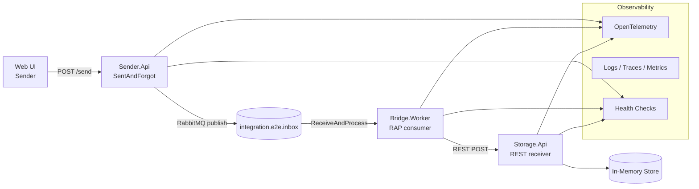
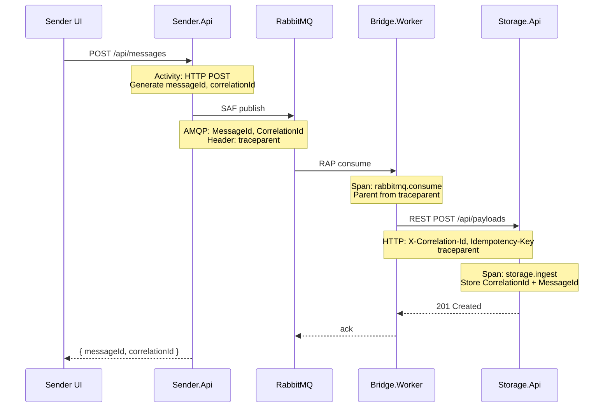

# План реализации E2E-решения `RmqSAF-RmqRAP-Rest`

**Статус:** черновик  
**Создан:** 2026-07-14 (UTC+3)  
**Обновлён:** 2026-07-14 (UTC+3)  
**Расположение solution:** `Samples/E2E/RmqSAF-RmqRAP-Rest/`

План согласован с терминологией **IntegrationFlow** (SAF = SentAndForgot, RAP = ReceiveAndProcess) и существующими sample-провайдерами в репозитории.

---

## 1. Цель и поток данных



**Сценарий:** пользователь отправляет JSON через веб-интерфейс → сообщение публикуется в RabbitMQ (fire-and-forget) → второй сервис получает и ack'ает после обработки → пересылает payload по REST → третий сервис сохраняет в памяти.

---

## 2. Расположение и состав solution

**Путь:** `Samples/E2E/RmqSAF-RmqRAP-Rest/`

| Проект | Тип | Назначение |
|--------|-----|------------|
| `RmqSAF-RmqRAP-Rest.AppHost` | Aspire AppHost | Оркестрация контейнеров и сервисов |
| `RmqSAF-RmqRAP-Rest.ServiceDefaults` | Aspire shared | OpenTelemetry, health checks, resilience |
| `Sender.Api` | ASP.NET Core Web | SAF + веб-UI для отправки payload |
| `Bridge.Worker` | Worker Service | RAP (RabbitMQ consumer) → REST forward |
| `Storage.Api` | ASP.NET Core Web API | REST-приёмник + in-memory хранилище |

**Зависимости от библиотеки** (project reference, не NuGet):

- `IntegrationFlow.Core`
- `IntegrationFlow.Metrics.OpenTelemetry`

Для E2E-sample **outbox/EF не обязателен** — достаточно прямой публикации SAF. Outbox можно добавить как опциональный этап «production-like».

---

## 3. Aspire AppHost — инфраструктура

```csharp
// Упрощённая схема AppHost
var rabbitMq = builder.AddRabbitMQ("rabbitmq")
    .WithManagementPlugin();

var storage = builder.AddProject<Projects.Storage_Api>("storage")
    .WithHttpHealthCheck("/health/ready");

var bridge = builder.AddProject<Projects.Bridge_Worker>("bridge")
    .WithReference(rabbitMq)
    .WithReference(storage)
    .WaitFor(storage);

var sender = builder.AddProject<Projects.Sender_Api>("sender")
    .WithReference(rabbitMq)
    .WithExternalHttpEndpoints();
```

**Контейнеры и сервисы:**

| Компонент | Назначение |
|-----------|------------|
| RabbitMQ | Транспорт SAF → RAP |
| Storage.Api | REST endpoint для Bridge |
| Bridge.Worker | Consumer + REST client |
| Sender.Api | Web UI + publisher |

**Observability (рекомендация вместо Graylog):**

Aspire 9+ из коробки даёт OpenTelemetry → **Seq** (логи) + **Grafana** (метрики/трейсы). Это проще Graylog для .NET и лучше интегрируется с Aspire Dashboard.

| Инструмент | Роль |
|------------|------|
| **Seq** или **Grafana Loki** | Централизованные логи (аналог Graylog) |
| **Prometheus + Grafana** | Метрики (`integrationflow.message.*`) |
| **Aspire Dashboard** | Dev-time: traces, logs, health |
| **OpenTelemetry Collector** | Единая точка экспорта |

Graylog — допустим, если нужен именно он (GELF exporter из OTEL), но для sample рекомендую OTEL-стек.

---

## 4. Проект 1: `Sender.Api` (SAF + Web + DDD)

### 4.1. DDD-слои

```
Sender.Api/
├── Domain/
│   ├── PayloadMessage.cs          // aggregate/value object
│   ├── IPayloadRepository.cs      // (опционально, для demo — не нужен)
│   └── IIntegrationPublisher.cs   // порт: «отправить сообщение наружу»
├── Application/
│   ├── SendPayload/
│   │   ├── SendPayloadCommand.cs
│   │   ├── SendPayloadCommandHandler.cs
│   │   └── SendPayloadResult.cs
│   └── DependencyInjection.cs
├── Infrastructure/
│   ├── IntegrationFlow/
│   │   ├── RabbitMqSentAndForgotGateway.cs  // адаптер IIntegrationPublisher
│   │   └── SenderRabbitMqOppositeSideProvider.cs
│   └── DependencyInjection.cs
└── Web/
    ├── Pages/ или wwwroot/index.html
    ├── Endpoints/SendPayloadEndpoint.cs
    └── Program.cs
```

**Принцип DDD:** домен не знает про RabbitMQ; инфраструктура оборачивает `SentAndForgotIntegration` из IntegrationFlow.

### 4.2. Интеграция с IntegrationFlow

```csharp
services.AddIntegrationFlow();
services.AddIntegrationFlowOpenTelemetryMetrics();
services.AddIntegrationFlowRabbitMq(builder.Configuration);
// Регистрация провайдера opposite side (по аналогии с SampleRabbitMqSentAndForgotProvider)
```

**Конфиг** `rabbitmq.json` (профиль `E2EOut`):

```json
"RabbitMqPublish": {
  "E2EOut": {
    "QueueName": "integration.e2e.inbox",
    "PublishTarget": "Queue",
    "Persistent": true
  }
}
```

Aspire подставит connection string через `WithReference(rabbitMq)`.

### 4.3. Web-интерфейс

Минимальный вариант для sample:

- **Razor Page** или **static HTML + fetch** на `/`
- Форма: textarea (JSON payload) + кнопка «Отправить»
- `POST /api/messages` → `SendPayloadCommandHandler` → SAF publish
- Ответ: `{ messageId, correlationId, status: "accepted" }`

Корреляция: генерировать `MessageId` / `CorrelationId` в Application-слое и передавать в `TransmitData`:

```csharp
var messageId = payload.Id.ToString("N");
var correlationId = payload.CorrelationId.ToString("N");

var transmitData = new TransmitData(payload, messageId)
    .WithCorrelationId(correlationId);
```

Логирование в handler — через `BeginScope` (см. [§8.3](#83-логи)).

Ответ UI/API:

```json
{
  "messageId": "abc...",
  "correlationId": "def...",
  "status": "accepted",
  "traceUrlHint": "Aspire Dashboard → Traces → filter by correlationId"
}
```

Пользователь может сразу искать payload по `correlationId` в Storage и логах.

---

## 5. Проект 2: `Bridge.Worker` (RAP → REST)

### 5.1. Ответственность

1. Слушать очередь `integration.e2e.inbox` (ReceiveAndProcess)
2. Десериализовать payload
3. Переслать в `Storage.Api` через REST SentAndForgot
4. Ack только после успешного HTTP-ответа (at-least-once семантика)

### 5.2. Структура

```
Bridge.Worker/
├── Application/
│   └── ForwardPayloadHandler.cs   // бизнес-логика пересылки
├── Infrastructure/
│   ├── RabbitMq/
│   │   └── E2EInboxListenerConfiguration.cs
│   └── Rest/
│       └── StorageRestOppositeSideProvider.cs
└── Program.cs
```

### 5.3. DI и hosted listener

```csharp
services.AddIntegrationFlow();
services.AddIntegrationFlowOpenTelemetryMetrics();
services.AddIntegrationFlowRest(builder.Configuration);

services.AddIntegrationFlowRabbitMqListener("E2EInbox", async (message, ct) =>
{
    await forwardHandler.HandleAsync(message, ct);
});
services.AddIntegrationFlowRabbitMqHealthChecks();
services.AddIntegrationFlowRestHealthChecks();
```

**REST-конфиг** `rest.json` (профиль `StorageIngest`):

```json
"RestPublish": {
  "StorageIngest": {
    "Connection": "StorageApi",
    "RequestPath": "/api/payloads",
    "Method": "POST",
    "ExpectedStatusCodes": [201, 202]
  }
}
```

`BaseAddress` для `StorageApi` — service discovery URL из Aspire (`WithReference(storage)`).

### 5.4. Проброс корреляции и trace context

`ForwardPayloadHandler` **обязан** передать идентификаторы из входящего сообщения в REST:

```csharp
public async Task HandleAsync(RabbitMqReceivedMessage message, CancellationToken ct)
{
    using (_logger.BeginScope(new Dictionary<string, object>
    {
        [IntegrationStructuredLogFields.MessageId] = message.MessageId,
        [IntegrationStructuredLogFields.CorrelationId] = message.CorrelationId,
    }))
    {
        var transmitData = new TransmitData(message.Body, message.MessageId)
            .WithCorrelationId(message.CorrelationId);

        await _restIntegration.IntegrateWithResultAsync("StorageIngest", transmitData, ct);
    }
}
```

IntegrationFlow на этом hop автоматически:
- создаёт consumer span (`rabbitmq.consume`) с parent из AMQP header `traceparent`;
- при REST publish инжектит `traceparent` и `X-Correlation-Id` (`RestPublishTransmitter`).

### 5.5. Идемпотентность

Для demo достаточно `InMemoryMessageDeduplicationStore` из samples. В production — EF dedup store.

---

## 6. Проект 3: `Storage.Api` (REST receiver + memory)

### 6.1. API

| Endpoint | Метод | Назначение |
|----------|-------|------------|
| `POST /api/payloads` | POST | Принять payload, сохранить в памяти |
| `GET /api/payloads` | GET | Список сохранённых (для проверки E2E) |
| `GET /api/payloads/{id}` | GET | Один payload по id |
| `GET /health/live` | GET | Liveness |
| `GET /health/ready` | GET | Readiness |

### 6.2. In-memory store

```csharp
public interface IPayloadStore
{
    Task StoreAsync(StoredPayload payload, CancellationToken ct);
    IReadOnlyList<StoredPayload> GetAll();
}

public sealed class InMemoryPayloadStore : IPayloadStore
{
    private readonly ConcurrentDictionary<string, StoredPayload> _store = new();
    // ...
}
```

**StoredPayload:** `Id`, `ReceivedAt`, `CorrelationId`, `MessageId`, `Body` (raw JSON), `SourceHeaders`, `TraceId` (опционально).

### 6.3. Приём REST и сохранение trace context

Рекомендуется **явный Minimal API endpoint** с извлечением propagation headers — чтобы trace не обрывался на последнем hop:

```csharp
app.MapPost("/api/payloads", async (
    HttpRequest request,
    IPayloadStore store,
    ILogger<Program> logger,
    CancellationToken ct) =>
{
    var correlationId = request.Headers["X-Correlation-Id"].FirstOrDefault()
        ?? Guid.NewGuid().ToString("N");
    var messageId = request.Headers["Idempotency-Key"].FirstOrDefault()
        ?? correlationId;
    var traceParent = request.Headers["traceparent"].FirstOrDefault();

    using var activity = StartStorageConsumerActivity(traceParent, messageId, correlationId);

    using (logger.BeginScope(new Dictionary<string, object>
    {
        [IntegrationStructuredLogFields.MessageId] = messageId,
        [IntegrationStructuredLogFields.CorrelationId] = correlationId,
    }))
    {
        var body = await new StreamReader(request.Body).ReadToEndAsync(ct);
        await store.StoreAsync(new StoredPayload(messageId, correlationId, body, ...), ct);
        return Results.Created($"/api/payloads/{messageId}", new { messageId, correlationId });
    }
});
```

`StartStorageConsumerActivity` — helper, аналогичный `RestDistributedTracing.StartConsumerActivity`: парсит `traceparent` через `ActivityContext.TryParse` и создаёт span `storage.ingest`.

**Альтернатива:** `AddIntegrationFlowRest` + profile `RestWebhooks` — trace и correlation из коробки, но endpoint менее прозрачен для demo.

### 6.4. Поиск по correlationId

Добавить query-параметр для E2E-проверки:

```
GET /api/payloads?correlationId={id}
GET /api/payloads/{id}          // по messageId
```

---

## 7. Мониторинг и heartbeat

### 7.1. Health checks (heartbeat)

Во всех трёх проектах через `ServiceDefaults`:

| Check | Проект | Тег |
|-------|--------|-----|
| `self` | все | `live` |
| `integrationflow.rabbitmq.listener` | Bridge | `ready` |
| RabbitMQ connectivity | Sender, Bridge | `ready` |
| REST upstream (Storage) | Bridge | `ready` |
| Memory store | Storage | `ready` |

Aspire Dashboard показывает health каждого ресурса. Для внешнего мониторинга — endpoint `/health/ready` + Prometheus exporter (опционально).

### 7.2. Метрики IntegrationFlow

```csharp
services.AddIntegrationFlowOpenTelemetryMetrics();
```

Ключевые метрики:

- `integrationflow.message.published`
- `integrationflow.message.consumed`
- `integrationflow.message.processed` (success/failure)
- `integrationflow.rest.request.duration`

### 7.3. Логирование и трейсинг

Базовая настройка — в `ServiceDefaults`. Детали сквозного отслеживания — [§8 Traceability](#8-traceability-сквозное-отслеживание-payload).

- Structured logging (`ILogger`) с `integrationflow.correlation_id`, `integrationflow.message_id`
- OpenTelemetry tracing: `traceparent` через RabbitMQ headers и HTTP
- Aspire ServiceDefaults: `AddOpenTelemetry()` с экспортом в Seq/Grafana

### 7.4. Алерты (минимум для sample)

| Сигнал | Порог | Действие |
|--------|-------|----------|
| `health/ready` != 200 | > 30s | Alert в Grafana |
| Consumer failures | > 5/min | Log + metric spike |
| REST forward 5xx | > 3 подряд | Bridge nack → requeue |

---

## 8. Traceability (сквозное отслеживание payload)

Цель: по одному `correlationId` (или `messageId`) проследить путь payload **Sender → RabbitMQ → Bridge → Storage** через API, логи и distributed trace.

### 8.1. Три уровня observability

| Уровень | Механизм | Инструмент | Готовность |
|---------|----------|------------|------------|
| **Business** | `MessageId` + `CorrelationId` в AMQP props, HTTP headers, StoredPayload | REST API Storage, ответ Sender UI | ✅ при явном пробросе в Bridge |
| **Logs** | Structured logging + `BeginScope` | Seq / Grafana Loki | ✅ при единых field names |
| **Distributed trace** | W3C `traceparent` | Aspire Dashboard / Grafana Tempo | ⚠️ нужна регистрация ActivitySource + span в Storage |

### 8.2. Схема propagation



### 8.3. Логи

Единые имена полей — константы `IntegrationStructuredLogFields`:

| Поле | Значение |
|------|----------|
| `integrationflow.message_id` | AMQP MessageId / Idempotency-Key |
| `integrationflow.correlation_id` | сквозной ID цепочки |

Обязательные точки логирования:

| Сервис | Событие | Поля |
|--------|---------|------|
| Sender | `PayloadAccepted` | messageId, correlationId |
| Sender | `PayloadPublished` | messageId, correlationId, queue |
| Bridge | `PayloadReceived` | messageId, correlationId, deliveryTag |
| Bridge | `PayloadForwarded` | messageId, correlationId, httpStatus |
| Bridge | `PayloadForwardFailed` | messageId, correlationId, error |
| Storage | `PayloadStored` | messageId, correlationId |

Пример scope (во всех сервисах):

```csharp
using (_logger.BeginScope(new Dictionary<string, object>
{
    [IntegrationStructuredLogFields.MessageId] = messageId,
    [IntegrationStructuredLogFields.CorrelationId] = correlationId,
}))
{
    // business logic
}
```

**Поиск в Seq:**

```
integrationflow.correlation_id = 'abc123'
```

### 8.4. Distributed tracing (OpenTelemetry)

#### ServiceDefaults — регистрация ActivitySource

В `RmqSAF-RmqRAP-Rest.ServiceDefaults/Extensions.cs`:

```csharp
builder.Services.AddOpenTelemetry()
    .WithTracing(tracing => tracing
        .AddAspNetCoreInstrumentation()
        .AddHttpClientInstrumentation()
        .AddSource("IntegrationFlow.RabbitMq")   // IntegrationFlowRabbitMqActivitySource.Name
        .AddSource("IntegrationFlow.Rest")         // IntegrationFlowRestActivitySource.Name
        .AddSource("RmqSAF-RmqRAP-Rest.Storage"));   // custom span storage.ingest
```

#### Что IntegrationFlow делает автоматически

| Hop | Компонент | Span | Propagation |
|-----|-----------|------|-------------|
| Sender → RMQ | `RabbitMqPublishTransmitter` | `rabbitmq.publish` | inject `traceparent` в AMQP headers |
| RMQ → Bridge | `RabbitMqReceivedMessageHandler` | `rabbitmq.consume` | extract `traceparent` из headers |
| Bridge → Storage | `RestPublishTransmitter` | (child of consume) | inject `traceparent`, `X-Correlation-Id` |

#### Что нужно реализовать вручную

| Место | Задача |
|-------|--------|
| **Storage.Api** | Consumer span `storage.ingest` с parent из HTTP `traceparent` (см. [§6.3](#63-приём-rest-и-сохранение-trace-context)) |
| **Bridge** | Проброс `message.CorrelationId` → `TransmitData.WithCorrelationId` (см. [§5.4](#54-проброс-корреляции-и-trace-context)) |
| **Sender** | Генерация и возврат `correlationId` клиенту (см. [§4.3](#43-web-интерфейс)) |

#### Ожидаемый trace в Aspire Dashboard

```
[Sender] POST /api/messages                    ~2ms
  └─ [IntegrationFlow.RabbitMq] rabbitmq.publish    ~5ms
       └─ [IntegrationFlow.RabbitMq] rabbitmq.consume   ~1ms
            └─ [IntegrationFlow.Rest] HTTP POST storage/api/payloads   ~3ms
                 └─ [RmqSAF-RmqRAP-Rest.Storage] storage.ingest   ~1ms
```

Теги span (из IntegrationFlow): `messaging.message_id`, `messaging.correlation_id`, `integrationflow.profile`.

### 8.5. Контракт headers (сквозной)

| Header / AMQP property | Sender → RMQ | RMQ → Bridge | Bridge → Storage | Storage store |
|------------------------|:------------:|:------------:|:----------------:|:-------------:|
| `MessageId` (AMQP) | ✅ publish | ✅ consume | — | ✅ `StoredPayload.MessageId` |
| `CorrelationId` (AMQP) | ✅ publish | ✅ consume | — | ✅ `StoredPayload.CorrelationId` |
| `traceparent` (AMQP header) | ✅ inject | ✅ extract | — | — |
| `X-Correlation-Id` (HTTP) | — | — | ✅ inject | ✅ read |
| `Idempotency-Key` (HTTP) | — | — | ✅ inject (= MessageId) | ✅ read |
| `traceparent` (HTTP) | — | — | ✅ inject | ✅ extract parent |

### 8.6. Проверка traceability (DoD)

| # | Проверка | Ожидание |
|---|----------|----------|
| T-1 | Отправить payload через UI | Ответ содержит `messageId` и `correlationId` |
| T-2 | `GET /api/payloads?correlationId=...` | Payload найден в Storage |
| T-3 | Seq: фильтр по `integrationflow.correlation_id` | ≥4 log events (Sender, Bridge ×2, Storage) |
| T-4 | Aspire Dashboard → Traces | Один trace, 4+ spans, без broken parent |
| T-5 | Остановить Storage, отправить payload | Bridge log: forward failed; message requeue |
| T-6 | Поднять Storage | Payload доставлен; dedup не создаёт дубликат |

### 8.7. Ограничения sample

- In-memory store — данные теряются при рестарте Storage (correlationId в логах/trace сохраняется).
- SAF без outbox — at-most-once на publish при crash Sender до confirm (для demo допустимо).
- Aspire Dashboard — dev-time; для prod нужен экспорт OTEL в Tempo/Jaeger + Loki/Seq.

---

## 9. RabbitMQ-топология

```
Exchange: (default direct, queue-only для простоты)

Queue: integration.e2e.inbox
  ├── DLX: integration.e2e.inbox.dlx  (опционально)
  └── Binding: publish from Sender (RabbitMqPublish.E2EOut)
```

Для dev: `DeclareTopologyOnStartup: true` в конфиге listener.

---

## 10. Контракт payload (общий для всех трёх сервисов)

```json
{
  "id": "uuid",
  "correlationId": "uuid",
  "occurredAt": "2026-07-13T18:52:00Z",
  "type": "SampleEvent",
  "data": { "key": "value" }
}
```

- **MessageId** (AMQP) = `id`
- **CorrelationId** (header) = `correlationId`
- Один shared record/class в отдельном проекте `RmqSAF-RmqRAP-Rest.Contracts` (опционально, 4-й проект) — удобно для сериализации.

---

## 11. Этапы реализации

| # | Этап | Оценка | Результат |
|---|------|--------|-----------|
| **0** | Scaffold solution + Aspire AppHost + ServiceDefaults | 0.5 дн | `dotnet run` поднимает RabbitMQ + 3 сервиса |
| **1** | Storage.Api: POST/GET + in-memory + health | 0.5 дн | REST endpoint работает изолированно |
| **2** | Bridge.Worker: RAP listener → REST forward | 1 дн | Сообщение из RabbitMQ доходит до Storage |
| **3** | Sender.Api: DDD + SAF publish | 1 дн | Publish в очередь через IntegrationFlow |
| **4** | Web UI в Sender | 0.5 дн | Отправка через браузер |
| **5** | Observability: OTEL + Seq/Grafana + metrics | 0.5 дн | Traces/logs/metrics в dashboard |
| **5a** | **Traceability:** correlation propagation + ActivitySource + Storage span | 0.5 дн | Сквозной trace и поиск по correlationId (§8) |
| **6** | Health checks + Aspire references | 0.5 дн | Heartbeat во всех сервисах |
| **7** | E2E smoke test + traceability checks T-1…T-6 | 0.5 дн | Полный сценарий UI → memory → trace |
| **8** | README + topology diagram | 0.25 дн | Документация sample |

**Итого:** ~5.5 рабочих дней.

---

## 12. Проверка E2E (test plan)

### 12.1. Функциональный сценарий

1. Запустить AppHost: `dotnet run --project RmqSAF-RmqRAP-Rest.AppHost`
2. Открыть Aspire Dashboard → все ресурсы `Healthy`
3. Открыть Sender UI → отправить JSON
4. Проверить логи Bridge: `consumed` → `rest forward success`
5. `GET http://storage/api/payloads` → payload в списке
6. Остановить Storage → Bridge health `Unhealthy`, сообщения requeue
7. Поднять Storage → сообщения обработаны повторно (dedup при повторе)

### 12.2. Traceability (§8.6)

8. Скопировать `correlationId` из ответа Sender → `GET /api/payloads?correlationId={id}` → payload найден
9. Seq / Aspire Logs → фильтр `integrationflow.correlation_id` → события Sender, Bridge, Storage
10. Aspire Dashboard → Traces → найти trace по `correlationId` или `messageId` → 4+ spans без разрыва
11. (Опционально) Grafana Tempo: `{ span.integrationflow.profile != "" }` — spans IntegrationFlow видны

---

## 13. Ключевые решения

| Вопрос | Рекомендация |
|--------|--------------|
| Graylog vs OTEL | **OTEL + Seq/Grafana** — нативно для Aspire и IntegrationFlow.Metrics |
| Outbox в Sender | Не нужен для E2E-demo; добавить отдельным этапом |
| UI framework | Static HTML или Razor Pages — минимум зависимостей |
| Contracts | Отдельный shared project — опционально, но полезно |
| Traceability | **CorrelationId** — primary key для demo; OTEL trace — для timing/debug |
| Storage endpoint | Minimal API + manual `traceparent` extract (прозрачнее webhook profile) |
| ActivitySource | Регистрировать `IntegrationFlow.RabbitMq`, `IntegrationFlow.Rest` + custom Storage |
| Добавление в `IntegrationFlow.sln` | Solution folder `Samples/E2E` ✅ |

---

## 14. Зависимости NuGet (AppHost / ServiceDefaults)

```
Aspire.Hosting.AppHost
Aspire.Hosting.RabbitMQ
Aspire.Hosting.Seq          // или Grafana
Microsoft.Extensions.ServiceDiscovery
OpenTelemetry.Exporter.OpenTelemetryProtocol
AspNetCore.HealthChecks.UI  // опционально
```

---

## 15. Открытые вопросы

1. **Graylog** обязателен, или достаточно OTEL + Seq/Grafana?
2. Нужен ли **outbox** в Sender для демонстрации transactional publish?
3. Web UI — **Razor Pages** или **SPA (minimal static HTML)**?
4. Нужен ли отдельный **Contracts** project для shared DTO и header constants?
