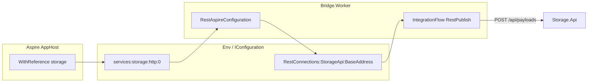

# RestAspireConfiguration — подстановка URL storage в Aspire

**Создан:** 2026-07-14 (UTC+3)  
**Контекст:** E2E sample `RmqSAF-RmqRAP-Rest`  
**Файл:** `RmqSAF-RmqRAP-Rest.ServiceDefaults/RestAspireConfiguration.cs`

---

## Проблема

В Aspire сообщения из Sender доходили до RabbitMQ, но **не появлялись в Storage**.

Цепочка обрывалась на hop **Bridge → Storage**:

```
Sender → RabbitMQ → Bridge.Worker → REST POST /api/payloads → Storage.Api
                              ↑
                         сбой здесь
```

Bridge потреблял сообщение (`PayloadReceived`), но REST-пересылка падала: IntegrationFlow строит **абсолютный URI** из `RestConnections:StorageApi:BaseAddress` (см. `RestPublishConfiguration.BuildRequestUri()`), а в `Bridge.Worker/rest.json` был захардкожен Docker-адрес:

```json
"RestConnections": {
  "StorageApi": {
    "BaseAddress": "http://storage"
  }
}
```

Для Aspire это неверно:

- `storage` — DNS-имя Docker-сети, на Windows-хосте не резолвится;
- порт не указан (по умолчанию 80), тогда как `Storage.Api` слушает динамический localhost-порт;
- AppHost через `WithReference(storage)` **не** прописывает `RestConnections__StorageApi__BaseAddress` автоматически.

Для RabbitMQ аналогичная задача уже решена через `RabbitMqAspireConfiguration`; для REST — нет.

---

## Решение

Добавлен `RestAspireConfiguration` — симметричный helper для HTTP service reference из Aspire.

### Что делает

1. Ищет URL referenced-сервиса в конфигурации Aspire (в порядке приоритета):
   - `services:{name}:http:0`
   - `services:{name}:https:0`
   - `ConnectionStrings:{name}` (fallback, если значение — HTTP(S) URL)
2. Нормализует до `{scheme}://{host}:{port}` без trailing slash.
3. Записывает в in-memory overlay: `RestConnections:{profile}:BaseAddress`.
4. Если Aspire-переменных нет — **no-op** (Compose и локальные override не затрагиваются).

### Подключение в Bridge.Worker

В `Bridge.Worker/Program.cs`, **до** `AddServiceDefaults()` и `AddIntegrationFlowRest()`:

```csharp
RestAspireConfiguration.ApplyRestServiceReference(
    builder.Configuration,
    "storage",      // имя ресурса в AppHost (WithReference(storage))
    "StorageApi");  // ключ в RestConnections (rest.json)
```

Порядок важен: overlay должен попасть в `IConfiguration` до загрузки профилей IntegrationFlow (`RestConfigurationComposition.OverlayConfiguration`).

### AppHost

Изменений в `AppHost.cs` не требуется — достаточно существующего:

```csharp
var bridge = builder.AddProject<Projects.Bridge_Worker>("bridge")
    .WithReference(rabbitMq)
    .WithReference(storage)
    .WaitFor(storage);
```

Aspire инжектит `services__storage__http__0=http://127.0.0.1:{port}`, helper переводит это в `RestConnections:StorageApi:BaseAddress`.

---

## Поведение по средам

| Среда | Источник `BaseAddress` | Пример |
|-------|------------------------|--------|
| **Aspire** | `services:storage:http:0` → overlay | `http://127.0.0.1:5219` |
| **Docker Compose** | env в `docker-compose.yml` | `http://storage:8080` |
| **Локально** | `rest.json` или env override | `http://localhost:5219` |

В Docker Compose helper молча пропускается: Aspire-переменных нет, а `RestConnections__StorageApi__BaseAddress` задаётся явно в `docker-compose.yml`.

---

## Схема конфигурации



---

## Симметрия с RabbitMQ

| Аспект | RabbitMQ | REST |
|--------|----------|------|
| Helper | `RabbitMqAspireConfiguration` | `RestAspireConfiguration` |
| Aspire reference | `WithReference(rabbitMq)` | `WithReference(storage)` |
| Источник URL | `ConnectionStrings:rabbitmq` | `services:storage:http:0` |
| Целевая секция | `RabbitMq:E2EInbox:*` | `RestConnections:StorageApi:BaseAddress` |
| No-op без Aspire | да | да |

---

## Проверка

### Aspire

1. `dotnet run --project RmqSAF-RmqRAP-Rest.AppHost`
2. Дождаться **Healthy** у `rabbitmq`, `storage`, `bridge`, `sender`
3. Отправить payload через Sender UI
4. В логах bridge: `PayloadReceived` → `PayloadForwarded`
5. `GET /api/payloads?correlationId={id}` в Storage — payload найден

### Docker Compose

Поведение без изменений:

```powershell
docker compose up --build
# POST http://localhost:8080/api/messages
# docker exec ... curl http://127.0.0.1:8080/api/payloads?correlationId=...
```

---

## Ограничения

- Helper рассчитан на **HTTP project reference** (`AddProject` + `WithReference`). Для внешних URL или gRPC нужна отдельная логика.
- Поддерживается один endpoint на reference (`:0`). Именованные endpoint'ы (`GetEndpoint("admin")`) не разбираются.
- IntegrationFlow по-прежнему использует абсолютный `BaseAddress`, а не схему `https+http://storage` service discovery. Helper явно подставляет резолвленный URL — это надёжнее для текущей реализации `RestPublishTransmitter`.

---

## Связанные файлы

| Файл | Роль |
|------|------|
| `RmqSAF-RmqRAP-Rest.ServiceDefaults/RestAspireConfiguration.cs` | Helper |
| `RmqSAF-RmqRAP-Rest.ServiceDefaults/RabbitMqAspireConfiguration.cs` | Аналог для RabbitMQ |
| `Bridge.Worker/Program.cs` | Вызов helper |
| `Bridge.Worker/rest.json` | Профили `StorageApi` / `StorageIngest` |
| `RmqSAF-RmqRAP-Rest.AppHost/AppHost.cs` | `WithReference(storage)` |
| `docker-compose.yml` | `RestConnections__StorageApi__BaseAddress` для Compose |
