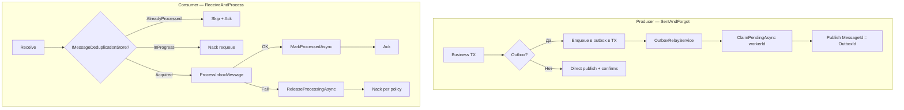

# Полный анализ решения IntegrationFlow и оценка рисков

**Статус:** актуально  
**Создан:** 2026-07-03 15:11 (UTC+3)  
**Обновлён:** 2026-07-03 15:53 (UTC+3)  
**Связанные документы:** [`plans/2026-07-03_1213-delivery-guarantee.md`](plans/2026-07-03_1213-delivery-guarantee.md), [`plans/2026-07-03_1321-delivery-guarantee-risk-analysis.md`](plans/2026-07-03_1321-delivery-guarantee-risk-analysis.md), [`plans/2026-07-03_1523-delivery-guarantee-hardening.md`](plans/2026-07-03_1523-delivery-guarantee-hardening.md)

Документ фиксирует оценку **текущего состояния кода** (включая коммит `7e17f12`) — at-least-once гарантии для RabbitMQ-интеграций: что закрыто, какие риски остаются, готовность к production.

> **Примечание:** [`plans/2026-07-03_1321-delivery-guarantee-risk-analysis.md`](plans/2026-07-03_1321-delivery-guarantee-risk-analysis.md) частично устарел — три P0-риска из него закрыты в коммите `7e17f12` (dedup release, outbox claim, тесты policy).

---

## 1. Что представляет собой решение

**IntegrationFlow** — библиотека (.NET 8 + netstandard2.0) для трёх паттернов интеграции:

| Паттерн | Статус | Транспорт |
|---------|--------|-----------|
| **ReceiveAndProcess** | Реализован | RabbitMQ consumer |
| **SentAndForgot** | Реализован | RabbitMQ publisher + outbox |
| **SentAndWait** | Частично | REST (брокер не подключён) |

Последние коммиты добавили:

- RabbitMQ publish/consume с именованными профилями в `rabbitmq.json`
- **At-least-once** семантику: ack после обработки, nack/requeue, publisher confirms
- **Transactional Outbox** (`IOutboxStore` + relay worker)
- **Идемпотентность consumer** (`IMessageDeduplicationStore`)
- Локализацию через `SR.T`

**48 unit-тестов проходят.**

---

## 2. Архитектура гарантий доставки

**Целевая семантика — at-least-once**, не exactly-once. Это корректно задокументировано.

---

## 3. Что закрыто хорошо

### Consumer: критический баг устранён

Раньше при `Asynchronously=true` ack шёл **до** завершения обработки (at-most-once). Сейчас `ListenerBase.ProcessMessageAsync` await-ит обработку, и только затем `RabbitMqListener` делает ack/nack:

- [`ListenerBase.ProcessMessageAsync`](../src/IntegrationFlow.Core/Contexts/Integrations/03Domain/ReceiveAndProcess/ListenerBase.cs)
- [`RabbitMqListener.HandleReceivedAsync`](../src/IntegrationFlow.Core/Contexts/Integrations/00InnerUsage/RabbitMq/ReceiveAndProcess/Listeners/RabbitMqListener.cs)

### Dedup при сбое — исправлен (P0 закрыт)

Контракт расширен: `DeduplicationBeginResult` (Acquired / AlreadyProcessed / InProgress) + `ReleaseProcessingAsync` в `finally` блоке `ProcessorBase`. При параллельной доставке — `MessageProcessingInProgressException` → nack с `requeue: true`.

- [`ProcessorBase`](../src/IntegrationFlow.Core/Contexts/Integrations/03Domain/ReceiveAndProcess/ProcessorBase.cs)
- [`InMemoryMessageDeduplicationStore`](../src/IntegrationFlow.Core/Contexts/Integrations/00Samples/ReceiveAndProcess/Deduplication/InMemoryMessageDeduplicationStore.cs)

### Outbox relay — claim/lock/backoff (P0 закрыт)

`ClaimPendingAsync(batchSize, workerId, lockDuration)`, проверка `workerId` при mark, `MaxAttempts`, linear backoff, `MarkAbandonedAsync`, `ReleaseExpiredClaimsAsync`.

- [`OutboxRelayService`](../src/IntegrationFlow.Core/Contexts/Integrations/03Domain/Outbox/OutboxRelayService.cs)
- [`IOutboxStore`](../src/IntegrationFlow.Core/Contexts/Integrations/03Domain/Outbox/IOutboxStore.cs)

### Producer: publisher confirms + явный результат

- `ConfirmSelect()` + `WaitForConfirms(timeout)` в [`RabbitMqPublishTransmitter`](../src/IntegrationFlow.Core/Contexts/Integrations/00InnerUsage/RabbitMq/SentAndForgot/Transmitters/RabbitMqPublishTransmitter.cs)
- `IntegrateWithResult()` с `Success` / `FailureReason` / `MessageId`
- Опционально `ThrowOnFailure = true` для legacy `Integrate()`

### Архитектурные решения

- Outbox **не привязан к EF** — контракты в каркасе, реализация в приложении
- Именованные профили RabbitMQ с обратной совместимостью legacy flat JSON
- `PublisherBase` кеширует по `side.GetPublisherCacheKey()` — несколько очередей поддерживаются корректно

---

## 4. Матрица рисков (актуальная)

### Высокий приоритет — blockers для production

| # | Риск | Описание | Последствие |
|---|------|----------|-------------|
| 1 | **Нет prod-реализаций store** | Только `InMemoryOutboxStore` и `InMemoryMessageDeduplicationStore` | Outbox/dedup не переживут рестарт; in-memory dedup не работает в multi-instance |
| 2 | **Publish OK → MarkPublished fail** | Relay не атомарен: confirm брокера и запись в БД — отдельные операции | Дубликат publish при retry relay. Mitigation: `MessageId = OutboxMessage.Id`, но consumer **обязан** быть идемпотентным |
| 3 | **MarkProcessed fail после успешной бизнес-обработки** | `ProcessInboxMessage` выполнен, `MarkProcessedAsync` упал → `ReleaseProcessing` в finally → redelivery | **Повторное выполнение бизнес-логики** — dedup не защищает от этого сценария |
| 4 | **Direct publish без outbox** | `Integrate()` по умолчанию не бросает (`ThrowOnFailure=false`) | Gap «DB commit → publish» — потеря сообщения при сбое между ними |
| 5 | **Нет тестов RabbitMqListener** | Покрыты policy, in-memory store, dedup; **нет** mock channel тестов ack/nack порядка | Регрессии в критическом пути не поймает CI |
| 6 | **ProcessorBase cache только по типу** | Ключ — `typeof(TProcessor)`, без profile/side (в отличие от `PublisherBase`) | При одном processor на несколько очередей — **чужая Configuration** |

### Средний приоритет

| # | Риск | Описание |
|---|------|----------|
| 7 | **Prefetch > 1 + AsyncEventingBasicConsumer** | Сообщения обрабатываются конкурентно; `ProcessorBase` и handler могут быть не thread-safe |
| 8 | **Новое соединение на каждое outbox-сообщение** | `OutboxRelayService` создаёт `RabbitMqPublishConnection` per message — latency и нагрузка при больших batch |
| 9 | **Dedup без MessageId** | Если producer не задал `MessageId`, dedup пропускается полностью |
| 10 | **Mandatory + BasicReturn race** | `EnsureNotUnroutable()` вызывается **до** `WaitForConfirms()`; BasicReturn может прийти позже |
| 11 | **Outbox relay только net8.0** | `#if NET8_0_OR_GREATER` — hosted worker недоступен для netstandard2.0 consumers |
| 12 | **InMemory claim не эквивалентен DB lock** | `ConcurrentDictionary.TryUpdate` — для prod нужен `SELECT FOR UPDATE` / optimistic concurrency в EF |
| 13 | **Linear backoff, не exponential** | `RetryBackoffBase * (attemptCount + 1)` — при постоянной ошибке всё равно hammering, хотя и с задержкой |
| 14 | **InMemory dedup без TTL** | `processed` растёт бесконечно — утечка памяти в long-running процессах |

### Низкий приоритет / технический долг

| # | Риск |
|---|------|
| 15 | `Thread.Abort()` в `ListenerBase.Stop()` — deprecated, опасен на .NET Core+ |
| 16 | `Integrate()` по умолчанию глотает ошибки (нужен явный `ThrowOnFailure` или `IntegrateWithResult()`) |
| 17 | Sync-over-async (`.GetAwaiter().GetResult()`) в `ProcessorBase` — риск deadlock в sync context |
| 18 | DLQ не создаётся runtime — только документация (осознанно) |
| 19 | Нет integration-тестов с Testcontainers (publish → consume → dedup roundtrip) |
| 20 | Документ [`plans/2026-07-03_1321-delivery-guarantee-risk-analysis.md`](plans/2026-07-03_1321-delivery-guarantee-risk-analysis.md) не обновлён после коммита `7e17f12` |

---

## 5. Семантика по сценариям

| Сценарий | Гарантия | Условие |
|----------|----------|---------|
| Consumer без dedup | **At-least-once** | Ack после process; nack/requeue/DLQ настраиваются |
| Consumer + dedup (текущий код) | **At-least-once + skip duplicates** | Нужен `MessageId`; идемпотентный handler обязателен |
| Direct publish + confirms | **At-least-once до брокера** | Не атомарно с БД |
| Outbox + relay | **At-least-once end-to-end** | Prod `IOutboxStore` + идемпотентный consumer |
| DB + сообщение атомарно | **Только outbox в той же TX** | Direct mode не подходит |

**Exactly-once недостижим** — и это правильно зафиксировано в документации.

---

## 6. Оценка готовности

| Критерий | Оценка | Комментарий |
|----------|--------|-------------|
| Архитектура | **Хорошая** | Правильные абстракции, разделение direct/outbox, не over-engineered |
| Закрытие исходных дыр | **~90%** | Consumer bug, dedup-on-failure, outbox claim — закрыты |
| Готовность к production | **Условная** | Нужны prod store + listener tests + EF outbox |
| Тестовое покрытие | **Среднее** | 48 тестов, но критический RabbitMQ path без mock/integration |
| Документация | **Хорошая** | README + plans; risk-analysis doc устарел |

---

## 7. Рекомендации по приоритету

| Приоритет | Задача | Статус |
|-----------|--------|--------|
| ~~P0~~ | Dedup: `ReleaseProcessingAsync` при fail | ✅ Сделано |
| ~~P0~~ | Outbox: claim pattern + workerId | ✅ Сделано |
| ~~P0~~ | Тесты `RabbitMqDeliveryPolicy` | ✅ Сделано |
| **P0** | Тесты `RabbitMqListener`: mock channel, verify ack после process, nack при exception | ❌ |
| **P0** | Prod `IOutboxStore` (EF Core, row lock, same TX as business) | ❌ |
| **P0** | Prod `IMessageDeduplicationStore` (SQL/Redis с TTL) | ❌ |
| **P1** | ProcessorBase cache key: включить side/profile | ❌ |
| **P1** | Outbox relay: переисходование connection per profile | ❌ |
| **P1** | Обновить [`plans/2026-07-03_1321-delivery-guarantee-risk-analysis.md`](plans/2026-07-03_1321-delivery-guarantee-risk-analysis.md) | ❌ |
| **P2** | Integration tests: Testcontainers roundtrip | ❌ |
| **P2** | Убрать `Thread.Abort()`, exponential backoff | ❌ |

> **План реализации:** см. [`plans/2026-07-03_1523-delivery-guarantee-hardening.md`](plans/2026-07-03_1523-delivery-guarantee-hardening.md).

---

## 8. Итоговый вывод

Решение **архитектурно верное** и существенно снижает риски по сравнению с исходным кодом:

- Устранена **потеря сообщений** на consumer (async ack)
- Producer получил **подтверждение брокера** и outbox-паттерн
- Dedup и outbox relay доведены до **работоспособного контракта** (коммит `7e17f12`)

Для **production-критичных интеграций** остаются три главных blocker-а:

1. **Prod-реализации** `IOutboxStore` и `IMessageDeduplicationStore` (in-memory — только для тестов)
2. **Тесты listener/processor path** — сейчас CI не защищает ack/nack порядок
3. **Осознанная at-least-once семантика** — приложение обязано делать идемпотентные handlers; direct publish без outbox остаётся «best effort до брокера»

Direct mode без outbox и gap «DB commit → publish» — это не баг каркаса, а **осознанный trade-off**, который нужно закрывать на стороне приложения через outbox + `IntegrateWithResult()`.
