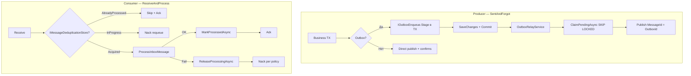

# Полный анализ решения IntegrationFlow и оценка рисков

**Статус:** superseded → см. [`2026-07-03_2010-delivery-guarantee-full-analysis.md`](2026-07-03_2010-delivery-guarantee-full-analysis.md)  
**Создан:** 2026-07-03 17:06 (UTC+3)  
**Обновлён:** 2026-07-03 20:10 (UTC+3)  
**Связанные документы:** [`plans/2026-07-03_1213-delivery-guarantee.md`](plans/2026-07-03_1213-delivery-guarantee.md), [`plans/2026-07-03_1321-delivery-guarantee-risk-analysis.md`](plans/2026-07-03_1321-delivery-guarantee-risk-analysis.md), [`2026-07-03_1511-delivery-guarantee-solution-analysis.md`](2026-07-03_1511-delivery-guarantee-solution-analysis.md), [`plans/2026-07-03_1523-delivery-guarantee-hardening.md`](plans/2026-07-03_1523-delivery-guarantee-hardening.md), [`plans/2026-07-03_1639-production-readiness.md`](plans/2026-07-03_1639-production-readiness.md)

> **Примечание:** этот документ **устарел** — см. актуальную версию [`2026-07-03_2010-delivery-guarantee-full-analysis.md`](2026-07-03_2010-delivery-guarantee-full-analysis.md).

Документ фиксирует оценку **текущего состояния кода** после hardening и production-readiness (коммиты `990d890`, `820689f`): at-least-once гарантии для RabbitMQ-интеграций — что закрыто, какие риски остаются, готовность к production.

> **Примечание:** [`2026-07-03_1511-delivery-guarantee-solution-analysis.md`](2026-07-03_1511-delivery-guarantee-solution-analysis.md) и [`plans/2026-07-03_1321-delivery-guarantee-risk-analysis.md`](plans/2026-07-03_1321-delivery-guarantee-risk-analysis.md) **устарели** — большинство P0-рисков из них закрыты в hardening и production-readiness.

---

## 1. Что представляет собой решение

**IntegrationFlow** — библиотека (.NET 8 + netstandard2.0) для трёх паттернов интеграции:

| Паттерн | Статус | Транспорт |
|---------|--------|-----------|
| **ReceiveAndProcess** | Реализован | RabbitMQ consumer |
| **SentAndForgot** | Реализован | RabbitMQ publisher + outbox |
| **SentAndWait** | Частично | REST (брокер не подключён) |

Последние коммиты добавили:

- RabbitMQ publish/consume с именованными профилями в `rabbitmq.json`
- **At-least-once** семантику: ack после обработки, nack/requeue, publisher confirms
- **Transactional Outbox** (`IOutboxStore` + relay worker, `IOutboxEnqueue` для TX приложения)
- **Идемпотентность consumer** (`IMessageDeduplicationStore`)
- **EF Core stores** для production (outbox + dedup)
- Локализацию через `SR.T`

**74 теста проходят** (60 unit + 10 EF + 4 integration).

---

## 2. Архитектура гарантий доставки

**Целевая семантика — at-least-once**, не exactly-once. Это корректно задокументировано.

---

## 3. Что закрыто хорошо

### Consumer: критический баг устранён

Раньше при `Asynchronously=true` ack шёл **до** завершения обработки (фактически at-most-once). Сейчас `ProcessMessageAsync` await-ит обработку, и только затем `RabbitMqReceivedMessageHandler` делает ack/nack:

- [`ListenerBase.ProcessMessageAsync`](../src/IntegrationFlow.Core/Contexts/Integrations/03Domain/ReceiveAndProcess/ListenerBase.cs)
- [`RabbitMqReceivedMessageHandler.HandleAsync`](../src/IntegrationFlow.Core/Contexts/Integrations/00InnerUsage/RabbitMq/ReceiveAndProcess/Listeners/RabbitMqReceivedMessageHandler.cs)

### Dedup при сбое — исправлен

- `DeduplicationBeginResult` (Acquired / AlreadyProcessed / InProgress)
- `ReleaseProcessingAsync` в `finally` при неуспешной обработке
- `MessageProcessingInProgressException` → nack с `requeue: true`
- `ProcessingLockDuration` (default 15 min) — recovery после crash

Файлы:

- [`ProcessorBase`](../src/IntegrationFlow.Core/Contexts/Integrations/03Domain/ReceiveAndProcess/ProcessorBase.cs)
- [`EfMessageDeduplicationStore`](../src/IntegrationFlow.EntityFrameworkCore/Deduplication/EfMessageDeduplicationStore.cs)
- [`InMemoryMessageDeduplicationStore`](../src/IntegrationFlow.Core/Contexts/Integrations/00Samples/ReceiveAndProcess/Deduplication/InMemoryMessageDeduplicationStore.cs)

### Outbox relay — production-ready контракт

- `ClaimPendingAsync` с `workerId` и lock duration
- **SKIP LOCKED** для PostgreSQL, **UPDLOCK/READPAST** для SQL Server
- Exponential backoff, `MaxAttempts`, `MarkAbandonedAsync`
- Переиспользование connection **per profile** в batch
- `MessageId = OutboxMessage.Id` для идемпотентного publish

Файлы:

- [`OutboxRelayService`](../src/IntegrationFlow.Core/Contexts/Integrations/03Domain/Outbox/OutboxRelayService.cs)
- [`EfOutboxStore`](../src/IntegrationFlow.EntityFrameworkCore/Outbox/EfOutboxStore.cs)
- [`PostgreSqlOutboxClaimStrategy`](../src/IntegrationFlow.EntityFrameworkCore/Outbox/Claim/PostgreSqlOutboxClaimStrategy.cs)

### Outbox в транзакции приложения

- `IOutboxEnqueue.Stage()` + `DbContext.EnqueueOutboxMessage()` — атомарность «БД + сообщение»
- Relay worker использует отдельный factory-based `DbContext`
- Пример: [`examples/2026-07-03_1639-ef-outbox-transaction.md`](examples/2026-07-03_1639-ef-outbox-transaction.md)

### EF Core production stores

- `IntegrationFlow.EntityFrameworkCore` — `EfOutboxStore`, `EfMessageDeduplicationStore`
- Тесты: TX rollback/commit, concurrent claim, dedup lock expiry

### Тесты критического пути

- `RabbitMqReceivedMessageHandlerTests` — ack/nack порядок
- `ProcessorBaseDeduplicationTests` — release/mark/skip/in-progress
- Integration tests с Testcontainers (skip без Docker)

### Producer: publisher confirms + явный результат

- `ConfirmSelect()` + `WaitForConfirms(timeout)` в [`RabbitMqPublishTransmitter`](../src/IntegrationFlow.Core/Contexts/Integrations/00InnerUsage/RabbitMq/SentAndForgot/Transmitters/RabbitMqPublishTransmitter.cs)
- `IntegrateWithResult()` с `Success` / `FailureReason` / `MessageId`
- Опционально `ThrowOnFailure = true` для legacy `Integrate()`

### Архитектурные решения

- Outbox **не привязан к EF** — контракты в каркасе, EF-реализация в отдельном пакете
- Именованные профили RabbitMQ с обратной совместимостью legacy flat JSON
- `PublisherBase` и `ProcessorBase` кешируют с учётом profile/side
- `Thread.Abort()` убран из `ListenerBase.Stop()`

---

## 4. Матрица рисков (актуальная)

### Высокий приоритет — требуют внимания при adoption

| # | Риск | Описание | Последствие | Mitigation |
|---|------|----------|-------------|------------|
| 1 | **Publish OK → MarkPublished fail** | Confirm брокера и запись в БД — разные операции | Дубликат publish при retry relay | `MessageId = OutboxId`; **идемпотентный consumer обязателен** |
| 2 | **MarkProcessed fail после успешной обработки** | Handler выполнен, `MarkProcessedAsync` упал → `ReleaseProcessing` → redelivery | **Повторное выполнение бизнес-логики** | Идемпотентные handlers; outbox/inbox pattern на стороне приложения |
| 3 | **Direct publish без outbox** | `Integrate()` по умолчанию не бросает (`ThrowOnFailure=false`) | Gap «DB commit → publish» — **потеря сообщения** | Outbox + `IOutboxEnqueue` в той же TX |
| 4 | **Claim strategies не покрыты integration-тестами** | Concurrent claim тестируется только на SQLite | Регрессии в PostgreSQL/SQL Server SQL не поймает CI | Добавить Testcontainers PostgreSQL/SQL Server claim tests |
| 5 | **Integration tests не проходят через каркас** | Roundtrip использует raw RabbitMQ.Client, не `RabbitMqListener` / `OutboxRelayService` | E2E регрессии framework path не ловятся | E2E: outbox relay → consume → dedup через IntegrationFlow |

### Средний приоритет

| # | Риск | Описание |
|---|------|----------|
| 6 | **Prefetch > 1 + AsyncEventingBasicConsumer** | Конкурентная обработка; handler/processor могут быть не thread-safe |
| 7 | **Dedup без MessageId** | Если producer не задал `MessageId`, dedup полностью пропускается |
| 8 | **Mandatory + BasicReturn race** | `EnsureNotUnroutable()` до `WaitForConfirms()`; BasicReturn может прийти позже |
| 9 | **Outbox relay worker только net8.0** | `#if NET8_0_OR_GREATER` — hosted worker недоступен для netstandard2.0 |
| 10 | **EF dedup — отдельный DbContext на операцию** | По design для consumer; multi-instance работает, но не в одной TX с бизнес-данными |
| 11 | **InMemory stores в samples** | `InMemoryOutboxStore` / `InMemoryMessageDeduplicationStore` — только для dev/test |
| 12 | **Документация частично устарела** | `1511`, `1321` не отражают production-readiness; README упоминает ограничение processor cache |

### Низкий приоритет / технический долг

| # | Риск |
|---|------|
| 13 | Sync-over-async (`.GetAwaiter().GetResult()`) в legacy paths |
| 14 | DLQ не создаётся runtime — только документация (осознанно) |
| 15 | Нет CI pipeline для integration tests |
| 16 | `SentAndWait` — неполная реализация |
| 17 | Custom `IntegrationProcessorSideBase` без `cacheKeySuffix` — риск stale Configuration при multi-queue |

---

## 5. Семантика по сценариям

| Сценарий | Гарантия | Условие |
|----------|----------|---------|
| Consumer без dedup | **At-least-once** | Ack после process; nack/requeue/DLQ настраиваются |
| Consumer + dedup (текущий код) | **At-least-once + skip duplicates** | Нужен `MessageId`; handler идемпотентен |
| Direct publish + confirms | **At-least-once до брокера** | Не атомарно с БД |
| Outbox + relay + EF | **At-least-once end-to-end** | `IOutboxEnqueue` в TX + идемпотентный consumer |
| DB + сообщение атомарно | **Только outbox в той же TX** | Direct mode не подходит |

**Exactly-once недостижим** — это фундаментальное ограничение distributed systems, и каркас это правильно не обещает.

---

## 6. Оценка готовности

| Критерий | Оценка | Комментарий |
|----------|--------|-------------|
| Архитектура | **Хорошая** | Правильные абстракции, разделение direct/outbox, не over-engineered |
| Закрытие исходных дыр | **~95%** | Consumer bug, dedup-on-failure, outbox claim, EF stores, TX enqueue — закрыты |
| Готовность к production | **Условная → близка к да** | При использовании EF stores + outbox TX + идемпотентных handlers |
| Тестовое покрытие | **Хорошее для unit, слабое для E2E** | 74 теста; framework roundtrip через Testcontainers — gap |
| Документация | **Хорошая, но рассинхрон** | README актуален; risk-analysis docs отстают от кода |

---

## 7. Рекомендации по приоритету

| Приоритет | Задача | Статус |
|-----------|--------|--------|
| ~~P0~~ | Dedup: `ReleaseProcessingAsync` при fail | ✅ Сделано |
| ~~P0~~ | Outbox: claim pattern + workerId | ✅ Сделано |
| ~~P0~~ | Outbox enqueue в TX приложения (`IOutboxEnqueue`) | ✅ Сделано |
| ~~P0~~ | Prod `IOutboxStore` / `IMessageDeduplicationStore` (EF Core) | ✅ Сделано |
| ~~P0~~ | SKIP LOCKED claim (PostgreSQL/SQL Server) | ✅ Сделано |
| ~~P0~~ | Dedup processing lock expiry | ✅ Сделано |
| ~~P0~~ | Тесты `RabbitMqReceivedMessageHandler` / dedup flow | ✅ Сделано |
| ~~P1~~ | ProcessorBase cache key: включить side/profile | ✅ Сделано |
| ~~P1~~ | Outbox relay: переиспользование connection per profile | ✅ Сделано |
| ~~P1~~ | Exponential backoff | ✅ Сделано |
| **P1** | E2E integration tests через полный стек каркаса | ❌ → см. [`plans/2026-07-03_1707-e2e-tests-and-remaining-gaps.md`](plans/2026-07-03_1707-e2e-tests-and-remaining-gaps.md) |
| **P1** | Concurrent claim integration tests (PostgreSQL/SQL Server) | ❌ → см. план `1707` |
| **P2** | Синхронизировать `1321` и `1511` или пометить superseded | ❌ → этап 7 плана `1707` |
| **P2** | CI pipeline для integration tests | ❌ → этап 6 плана `1707` |

---

## 8. Итоговый вывод

Решение **архитектурно верное** и существенно снижает риски по сравнению с исходным кодом:

- Устранена **потеря сообщений** на consumer (async ack до fix)
- Producer получил **подтверждение брокера** и transactional outbox
- Dedup и outbox relay доведены до **работоспособного production-контракта**
- EF Core stores закрывают персистентность и multi-instance

### Для production-критичных интеграций обязательно:

1. **Outbox через `IOutboxEnqueue`** в той же TX, что и бизнес-данные — не direct publish
2. **EF stores** (`AddIntegrationFlowEfOutbox`, `AddIntegrationFlowEfDeduplication`) — не InMemory
3. **Идемпотентные handlers** — at-least-once неизбежно даёт duplicates при сбоях между publish/mark или process/mark
4. **`MessageId` на всех сообщениях** — иначе dedup бесполезен
5. **DLQ на брокере** — для poison messages после `MaxRetryCount`

### Оставшиеся blockers минимальны:

- Нет E2E-тестов через полный стек каркаса (outbox relay → listener → dedup)
- Claim strategies PostgreSQL/SQL Server не проверены под нагрузкой в CI
- Документы `1321` и `1511` нужно синхронизировать с текущим кодом или пометить superseded этим документом

Direct mode без outbox — **осознанный trade-off**, не баг каркаса. Там, где нужна атомарность с БД, используйте outbox + `IntegrateWithResult()`.
