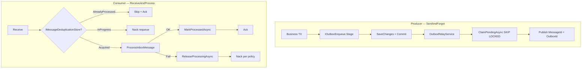

# Полный анализ IntegrationFlow и оценка рисков

**Статус:** актуально  
**Создан:** 2026-07-03 20:10 (UTC+3)  
**Обновлён:** 2026-07-03 20:15 (UTC+3)  
**Связанные документы:** [`plans/2026-07-03_1213-delivery-guarantee.md`](plans/2026-07-03_1213-delivery-guarantee.md), [`2026-07-03_1706-delivery-guarantee-full-analysis.md`](2026-07-03_1706-delivery-guarantee-full-analysis.md) (superseded), [`plans/2026-07-03_1707-e2e-tests-and-remaining-gaps.md`](plans/2026-07-03_1707-e2e-tests-and-remaining-gaps.md)

Актуальная оценка **текущего кода** после hardening, production-readiness и E2E/CI (84 теста зелёные: 63 unit + 10 EF unit + 9 integration + 2 EF integration).

---

## 1. Что это за решение

**IntegrationFlow** — .NET-библиотека (net8.0 + netstandard2.0) для трёх сценариев интеграции:

| Паттерн | Статус | Транспорт |
|---------|--------|-----------|
| **ReceiveAndProcess** | Готов | RabbitMQ consumer |
| **SentAndForgot** | Готов | RabbitMQ publisher + transactional outbox |
| **SentAndWait** | Частично | REST, без полноценного брокера |

За последние коммиты добавлено:

- Именованные профили RabbitMQ в `rabbitmq.json` (consume + publish)
- **At-least-once**: ack после обработки, nack/requeue, publisher confirms
- **Transactional Outbox** с relay worker
- **Идемпотентность consumer** через `IMessageDeduplicationStore`
- **EF Core stores** для production (outbox + dedup)
- E2E-тесты (Testcontainers), CI (GitHub Actions)

---

## 2. Архитектура гарантий доставки

**Целевая семантика — at-least-once, не exactly-once.** Это корректно задокументировано и соответствует ограничениям распределённых систем.

---

## 3. Что сделано хорошо

### Consumer: устранён критический баг

Раньше при `Asynchronously=true` ack шёл **до** завершения обработки (фактически at-most-once). Сейчас `ProcessMessageAsync` await-ит обработку, и только затем `RabbitMqReceivedMessageHandler` делает ack/nack:

- [`ListenerBase.ProcessMessageAsync`](../src/IntegrationFlow.Core/Contexts/Integrations/03Domain/ReceiveAndProcess/ListenerBase.cs)
- [`RabbitMqReceivedMessageHandler.HandleAsync`](../src/IntegrationFlow.Core/Contexts/Integrations/00InnerUsage/RabbitMq/ReceiveAndProcess/Listeners/RabbitMqReceivedMessageHandler.cs)

### Dedup при сбое — исправлен

- `DeduplicationBeginResult` (Acquired / AlreadyProcessed / InProgress)
- `ReleaseProcessingAsync` в `finally` при неуспешной обработке
- `MessageProcessingInProgressException` → nack с `requeue: true`
- `ProcessingLockDuration` (default 15 min) — recovery после crash

Файлы:

- [`ProcessorBase`](../src/IntegrationFlow.Core/Contexts/Integrations/03Domain/ReceiveAndProcess/ProcessorBase.cs)
- [`EfMessageDeduplicationStore`](../src/IntegrationFlow.EntityFrameworkCore/Deduplication/EfMessageDeduplicationStore.cs)
- [`InMemoryMessageDeduplicationStore`](../src/IntegrationFlow.Core/Contexts/Integrations/00Samples/ReceiveAndProcess/Deduplication/InMemoryMessageDeduplicationStore.cs)

### Outbox relay — production-ready контракт

- `ClaimPendingAsync` с `workerId` и lock duration
- **SKIP LOCKED** (PostgreSQL), **UPDLOCK/READPAST** (SQL Server)
- Exponential backoff, `MaxAttempts`, `MarkAbandonedAsync`
- Переиспользование connection **per profile** в batch
- `MessageId = OutboxMessage.Id` для идемпотентного publish

Файлы:

- [`OutboxRelayService`](../src/IntegrationFlow.Core/Contexts/Integrations/03Domain/Outbox/OutboxRelayService.cs)
- [`EfOutboxStore`](../src/IntegrationFlow.EntityFrameworkCore/Outbox/EfOutboxStore.cs)
- [`PostgreSqlOutboxClaimStrategy`](../src/IntegrationFlow.EntityFrameworkCore/Outbox/Claim/PostgreSqlOutboxClaimStrategy.cs)

### Outbox в транзакции приложения

- `IOutboxEnqueue.Stage()` + `DbContext.EnqueueOutboxMessage()` — атомарность «БД + сообщение»
- Relay worker использует отдельный factory-based `DbContext`
- Пример: [`examples/2026-07-03_1639-ef-outbox-transaction.md`](examples/2026-07-03_1639-ef-outbox-transaction.md)

### Тесты и CI

- Unit-тесты handler/dedup/relay policy
- E2E: `OutboxRelayService` → RabbitMQ, `RabbitMqReceivedMessageHandler` + `ProcessorBase`
- Concurrent claim на PostgreSQL и SQL Server (Testcontainers)
- GitHub Actions: unit + integration jobs (`.github/workflows/ci.yml`)

### Producer

- Publisher confirms + `IntegrateWithResult()`
- Mandatory + BasicReturn: `ManualResetEventSlim` с timeout 100ms после confirms

---

## 4. Матрица рисков (актуальная)

### Высокий приоритет — фундаментальные, не баги каркаса

| # | Риск | Описание | Последствие | Mitigation |
|---|------|----------|-------------|------------|
| 1 | **Publish OK → MarkPublished fail** | Confirm брокера и запись в БД — разные операции | Дубликат publish при retry relay | `MessageId = OutboxId`; **идемпотентный consumer обязателен** |
| 2 | **MarkProcessed fail после успешной обработки** | Handler выполнен, `MarkProcessedAsync` упал → `ReleaseProcessing` → redelivery | **Повторное выполнение бизнес-логики** | Идемпотентные handlers |
| 3 | **Direct publish без outbox** | `Integrate()` по умолчанию не бросает (`ThrowOnFailure=false`) | Gap «DB commit → publish» — **потеря сообщения** | Outbox + `IOutboxEnqueue` в той же TX |
| 4 | **Dedup без MessageId** | Если producer не задал `MessageId`, dedup полностью пропускается | Дубликаты не фильтруются | Всегда задавать `MessageId`; outbox relay делает это автоматически |

Эти риски **не устраняются кодом каркаса** — они inherent для at-least-once. Каркас даёт инструменты (outbox, dedup, confirms), но приложение обязано их правильно использовать.

### Средний приоритет

| # | Риск | Кратко |
|---|------|--------|
| 5 | **Prefetch > 1 + AsyncEventingBasicConsumer** | Конкурентная обработка; handler может быть не thread-safe |
| 6 | **Outbox relay worker только net8.0** | Hosted worker недоступен для netstandard2.0 |
| 7 | **EF dedup — отдельный DbContext на операцию** | Dedup не в одной TX с бизнес-данными |
| 8 | **InMemory stores в samples** | Нет персистентности — только dev/test |
| 9 | **Mandatory timeout 100ms** | BasicReturn может прийти позже timeout |
| 10 | **Abandoned outbox messages** | После MaxAttempts сообщение «застревает» в Abandoned |
| 11 | **E2E не покрывает полный listener lifecycle** | Handler тестируется без `RabbitMqListener` |
| 12 | **SQLite vs PG/SQL Server claim** | Разные lock-стратегии; unit-тесты только на SQLite |

#### 5. Prefetch > 1 + AsyncEventingBasicConsumer

**Суть.** В `RabbitMqListener` используется `AsyncEventingBasicConsumer`: callback `Received` вызывается асинхронно для каждого сообщения. При `PrefetchCount > 1` (параметр `BasicQos`) брокер может доставить несколько unacked-сообщений **до завершения обработки первого**. Callbacks выполняются **параллельно** — это не последовательная очередь.

**Когда проявляется.**

- `PrefetchCount = 5`, handler обрабатывает 2 секунды → до 5 сообщений «в полёте» одновременно.
- Бизнес-handler с mutable state (счётчики, кеш в полях класса, не thread-safe DbContext).
- Dedup store in-memory без внешней синхронизации (EF store безопаснее — отдельные TX).

**Последствия.**

- Race condition в бизнес-логике: двойная запись, некорректный порядок side-effects.
- Ложный `InProgress` при dedup: два consumer-потока одного инстанса получают одно `MessageId` почти одновременно — второй получит nack requeue (ожидаемо), но первый может ещё не завершиться.
- Сложнее отладка: логи перемешаны, порядок обработки не гарантирован.

**Mitigation.**

- Для критичных очередей: **`PrefetchCount = 1`** (default в README).
- Handlers должны быть **stateless** или thread-safe; scoped-сервисы через DI — отдельный scope на сообщение.
- Если нужна параллельность — масштабировать **несколькими consumer-процессами** с `PrefetchCount = 1`, а не одним listener с большим prefetch.

**Код:** [`RabbitMqListener.cs`](../src/IntegrationFlow.Core/Contexts/Integrations/00InnerUsage/RabbitMq/ReceiveAndProcess/Listeners/RabbitMqListener.cs) — строки 100–107, 103–107.

---

#### 6. Outbox relay worker только net8.0

**Суть.** `OutboxRelayBackgroundService` и регистрация `AddHostedService` обёрнуты в `#if NET8_0_OR_GREATER`. Пакет `IntegrationFlow.Core` таргетит и net8.0, и netstandard2.0, но **фоновый worker** доступен только при сборке под net8.0+.

**Когда проявляется.**

- Приложение на .NET Framework / старом .NET Standard, ссылающееся на netstandard2.0-сборку Core.
- Вызов `AddIntegrationFlowOutboxRelay()` регистрирует `OutboxRelayService`, но **не** запускает polling — outbox накапливается, сообщения не уходят в RabbitMQ.

**Последствия.**

- «Тихая» потеря доставки: enqueue работает, relay — нет.
- Разработчик может не заметить без интеграционных тестов или мониторинга pending outbox.

**Mitigation.**

- На netstandard2.0: вызывать `OutboxRelayService.RelayBatchAsync()` вручную — Hangfire, Quartz, Windows Service, cron.
- Для новых проектов: таргет **net8.0+** и `AddIntegrationFlowOutboxRelay()`.
- Мониторинг: алерт на рост таблицы outbox со статусом `Pending`.

**Код:** [`OutboxRelayBackgroundService.cs`](../src/IntegrationFlow.Core/Contexts/Integrations/03Domain/Outbox/OutboxRelayBackgroundService.cs), [`ServiceCollectionOutboxExtensions.cs`](../src/IntegrationFlow.Core/DependencyInjection/ServiceCollectionOutboxExtensions.cs).

---

#### 7. EF dedup — отдельный DbContext на операцию

**Суть.** `EfMessageDeduplicationStore` для каждого вызова (`TryBeginProcessingAsync`, `MarkProcessedAsync`, `ReleaseProcessingAsync`) создаёт **новый** `DbContext` через `IDbContextFactory` и делает `SaveChanges` в **отдельной транзакции**. Это отличается от outbox enqueue, который stage-ит запись в **scoped** DbContext приложения.

**Когда проявляется.**

- Handler в одной TX обновляет заказ **и** полагается на dedup в той же TX — **невозможно**: dedup commit-ится раньше, чем бизнес-TX.
- Crash после `ProcessInboxMessage`, но до `MarkProcessedAsync`: dedup lock снимается (`ReleaseProcessing`), сообщение redelivery — OK.
- Crash после `MarkProcessedAsync`, но до ack: dedup уже `Processed`, redelivery будет skip — OK.
- Crash **между** успешной бизнес-TX и `MarkProcessedAsync`: бизнес-данные сохранены, dedup ещё `Processing` → после expiry lock снимается, redelivery → **повторная обработка** (как риск #2 высокого приоритета).

**Последствия.**

- Dedup **не даёт** атомарности «обработка + бизнес-данные + dedup mark» в одной TX.
- Для большинства inbox-сценариев это нормально: dedup — guard от duplicates, бизнес-идемпотентность — на handler.

**Mitigation.**

- Handlers **идемпотентны** по `MessageId`.
- Не полагаться на dedup как на substitute для transactional inbox pattern.
- При необходимости «inbox table в той же TX» — расширять приложение (отдельная таблица processed в том же DbContext), не ожидать этого от текущего EF dedup store.

**Код:** [`EfMessageDeduplicationStore.cs`](../src/IntegrationFlow.EntityFrameworkCore/Deduplication/EfMessageDeduplicationStore.cs).

---

#### 8. InMemory stores в samples

**Суть.** `InMemoryOutboxStore` и `InMemoryMessageDeduplicationStore` — sample-реализации на `ConcurrentDictionary`. Нет персистентности, TTL для processed (in-memory processed живёт вечно до restart), нет multi-instance координации.

**Когда проявляется.**

- Copy-paste из samples в production без замены на EF stores.
- Локальная разработка с несколькими инстансами приложения — dedup/outbox не shared.
- Restart процесса: outbox pending **теряется**, dedup processed **сбрасывается** → duplicates после restart.

**Последствия.**

- Потеря сообщений (outbox) или повторная обработка (dedup reset).
- Ложное чувство безопасности: «dedup включён», но только в памяти одного процесса.

**Mitigation.**

- Production: **`AddIntegrationFlowEfOutbox`**, **`AddIntegrationFlowEfDeduplication`**.
- Samples явно помечены в README; code review checklist.
- Integration tests могут использовать InMemory — это OK для CI.

**Код:** [`InMemoryOutboxStore.cs`](../src/IntegrationFlow.Core/Contexts/Integrations/00Samples/Outbox/InMemoryOutboxStore.cs), [`InMemoryMessageDeduplicationStore.cs`](../src/IntegrationFlow.Core/Contexts/Integrations/00Samples/ReceiveAndProcess/Deduplication/InMemoryMessageDeduplicationStore.cs).

---

#### 9. Mandatory timeout 100ms

**Суть.** При `Mandatory = true` брокер асинхронно шлёт `BasicReturn`, если сообщение не маршрутизируется. В `RabbitMqPublishTransmitter` после `WaitForConfirms` вызывается `WaitForUnroutableProcessing(TimeSpan.FromMilliseconds(100))`, затем `EnsureNotUnroutable()`. Сигнал — `ManualResetEventSlim`, выставляется в `OnBasicReturn`.

**Когда проявляется.**

- Медленная сеть / нагрузка на брокер: BasicReturn приходит **позже 100ms** после confirms.
- Publish считается успешным, unroutable не обнаружен → сообщение «пропало» (не в очереди, не в DLQ, если exchange без alternate).

**Последствия.**

- **Silent message loss** при misconfigured topology (wrong routing key, missing queue binding) — редкий, но критичный сценарий для mandatory publish.
- False negative: success там, где сообщение не доставлено.

**Mitigation.**

- Mandatory включать **осознанно**, когда topology стабильна и проверена (`ValidateTopology = true`).
- Для outbox relay topology обычно фиксирована — риск ниже.
- При сомнениях: мониторинг unroutable на брокере, alternate exchange.
- Увеличение timeout или callback-based wait без hard limit — возможное улучшение каркаса (сейчас trade-off latency vs надёжность).

**Код:** [`RabbitMqPublishTransmitter.cs`](../src/IntegrationFlow.Core/Contexts/Integrations/00InnerUsage/RabbitMq/SentAndForgot/Transmitters/RabbitMqPublishTransmitter.cs), [`RabbitMqPublishConnection.cs`](../src/IntegrationFlow.Core/Contexts/Integrations/00InnerUsage/RabbitMq/SentAndForgot/Connections/RabbitMqPublishConnection.cs).

---

#### 10. Abandoned outbox messages

**Суть.** `OutboxRelayService` при `message.AttemptCount >= options.MaxAttempts` (default 10) вызывает `MarkAbandonedAsync` и **прекращает** retry. Сообщение остаётся в БД со статусом Abandoned — **не публикуется автоматически**.

**Когда проявляется.**

- Длительная недоступность RabbitMQ / неверный publish profile.
- Постоянная ошибка сериализации / oversized payload.
- Misconfiguration `ProfileName` в outbox записи.

**Последствия.**

- **Потеря доставки** с точки зрения downstream — событие не дошло до consumer.
- Бизнес-TX уже закоммичена (outbox в той же TX) — данные в БД есть, **интеграционное событие потеряно**.

**Mitigation.**

- Мониторинг и алерты: `SELECT COUNT(*) WHERE Status = Abandoned`.
- Runbook: ручной replay (reset status → Pending) после fix root cause.
- Dashboard по `AttemptCount`, last error message в outbox entity.
- Настроить `MaxAttempts`, backoff под SLA; не ставить слишком маленький лимит без мониторинга.

**Код:** [`OutboxRelayService.cs`](../src/IntegrationFlow.Core/Contexts/Integrations/03Domain/Outbox/OutboxRelayService.cs) — строки 74–81, [`OutboxRelayOptions.cs`](../src/IntegrationFlow.Core/Contexts/Integrations/03Domain/Outbox/OutboxRelayOptions.cs).

---

#### 11. E2E не покрывает полный listener lifecycle

**Суть.** Integration-тесты (`ConsumerHandlerEndToEndTests`) вызывают `RabbitMqReceivedMessageHandler.HandleAsync` напрямую после `BasicPublish` / `BasicGet`. **Не** поднимается `RabbitMqListener` в фоновом потоке: нет `BasicConsume`, reconnect loop, `AutomaticRecoveryEnabled`, graceful shutdown.

**Что покрыто E2E.**

- Ack/nack после process через handler.
- Dedup duplicate skip с реальным RabbitMQ.
- Outbox relay → очередь (`OutboxRelayEndToEndTests`).

**Что не покрыто.**

- `ListenAsync` + бесконечный цикл `Task.Delay(500)`.
- Connection drop / `AutomaticRecoveryEnabled` — восстановление consumer.
- `ListenerBase.Start()` / `Stop()` lifecycle, dispose channel под lock.
- Race между shutdown и in-flight message.
- Prefetch > 1 + concurrent callbacks в реальном listener.

**Последствия.**

- Регрессии в **инфраструктурном** слое listener могут пройти CI.
- Критический path **обработки** сообщения покрыт; path **получения** — частично.

**Mitigation.**

- Smoke-тест listener в staging с Testcontainers (опционально).
- Мониторинг consumer lag, unacked count на брокере.
- При изменениях `RabbitMqListener` — ручной или nightly E2E full listener test.

**Код:** [`ConsumerHandlerEndToEndTests.cs`](../tests/IntegrationFlow.Core.IntegrationTests/ConsumerHandlerEndToEndTests.cs) vs [`RabbitMqListener.cs`](../src/IntegrationFlow.Core/Contexts/Integrations/00InnerUsage/RabbitMq/ReceiveAndProcess/Listeners/RabbitMqListener.cs).

---

#### 12. SQLite vs PostgreSQL / SQL Server claim

**Суть.** Outbox claim использует provider-specific стратегии:

| Provider | Механизм |
|----------|----------|
| **PostgreSQL** | `SELECT … FOR UPDATE SKIP LOCKED` |
| **SQL Server** | `UPDLOCK`, `READPAST` |
| **SQLite** (default в unit-тестах) | Load pending candidates + mark in memory, без SKIP LOCKED |

**Когда проявляется.**

- Unit-тесты `EfOutboxConcurrentClaimTests` на SQLite **не** валидируют raw SQL PG/SQL Server.
- PG/SQL Server покрыты **integration tests** (Testcontainers), но не в каждом локальном прогоне без Docker.
- SQLite при двух параллельных worker в одном файле БД ведёт себя иначе, чем PG SKIP LOCKED под нагрузкой.

**Последствия.**

- Теоретическая регрессия в SQL-стратегии, не пойманная unit-тестами.
- Различия в isolation level, deadlocks, порядке claim между провайдерами.
- На SQLite в dev multi-worker relay может «работать» иначе, чем в prod PostgreSQL.

**Mitigation.**

- CI integration job с PostgreSQL claim test (уже есть в `.github/workflows/ci.yml`).
- Prod-like БД в staging перед релизом.
- Не полагаться на SQLite concurrent claim как доказательство prod-поведения.

**Код:** [`PostgreSqlOutboxClaimStrategy.cs`](../src/IntegrationFlow.EntityFrameworkCore/Outbox/Claim/PostgreSqlOutboxClaimStrategy.cs), [`SqliteOutboxClaimStrategy.cs`](../src/IntegrationFlow.EntityFrameworkCore/Outbox/Claim/SqliteOutboxClaimStrategy.cs), [`EfOutboxPostgreSqlClaimTests.cs`](../tests/IntegrationFlow.EntityFrameworkCore.IntegrationTests/EfOutboxPostgreSqlClaimTests.cs).

### Низкий приоритет / технический долг

| # | Риск |
|---|------|
| 13 | Sync-over-async (`.GetAwaiter().GetResult()`) в `ProcessorBase.Process()` и legacy paths |
| 14 | DLQ не создаётся runtime — только документация (осознанно) |
| 15 | `SentAndWait` — неполная реализация |
| 16 | Custom `IntegrationProcessorSideBase` без `cacheKeySuffix` — риск stale Configuration при multi-queue |
| 17 | Listener на dedicated thread (`Task.Run` + `Thread`) — legacy-подход, не `IHostedService` |

---

## 5. Семантика по сценариям

| Сценарий | Гарантия | Условие |
|----------|----------|---------|
| Consumer без dedup | **At-least-once** | Ack после process; nack/requeue/DLQ настраиваются |
| Consumer + dedup (текущий код) | **At-least-once + skip duplicates** | Нужен `MessageId`; handler идемпотентен |
| Direct publish + confirms | **At-least-once до брокера** | Не атомарно с БД |
| Outbox + relay + EF | **At-least-once end-to-end** | `IOutboxEnqueue` в TX + идемпотентный consumer |
| DB + сообщение атомарно | **Только outbox в той же TX** | Direct mode не подходит |

**Exactly-once недостижим** — и каркас это правильно не обещает.

---

## 6. Оценка готовности

| Критерий | Оценка | Комментарий |
|----------|--------|-------------|
| Архитектура | **Хорошая** | Правильные абстракции, разделение direct/outbox, не over-engineered |
| Закрытие исходных дыр | **~98%** | Consumer bug, dedup-on-failure, outbox claim, EF stores, TX enqueue, E2E, CI — закрыты |
| Готовность к production | **Да, при правильном adoption** | EF stores + outbox TX + идемпотентные handlers + DLQ на брокере |
| Тестовое покрытие | **Хорошее** | 84 теста; E2E через каркас (handler + relay); PG/SQL claim в CI |
| Документация | **Хорошая** | README актуален; предыдущие risk-analysis docs помечены superseded |

---

## 7. Обязательные условия для production

1. **Outbox через `IOutboxEnqueue`** в той же TX, что и бизнес-данные — не direct publish после commit
2. **EF stores** (`AddIntegrationFlowEfOutbox`, `AddIntegrationFlowEfDeduplication`) — не InMemory
3. **Идемпотентные handlers** — at-least-once неизбежно даёт duplicates при сбоях между publish/mark или process/mark
4. **`MessageId` на всех сообщениях** — иначе dedup бесполезен (outbox relay ставит `MessageId = OutboxId` автоматически)
5. **DLQ на брокере** — для poison messages после `MaxRetryCount`
6. **Мониторинг abandoned outbox** — алерты на `MarkAbandonedAsync`

---

## 8. Итоговый вывод

Решение **архитектурно верное** и существенно снижает риски по сравнению с исходным кодом:

- Устранена **потеря сообщений** на consumer (async ack до fix)
- Producer получил **подтверждение брокера** и transactional outbox
- Dedup и outbox relay доведены до **работоспособного production-контракта**
- EF Core stores закрывают персистентность и multi-instance
- E2E + CI дают уверенность в критическом пути

**Blockers для production сняты.** Оставшиеся риски — либо фундаментальные ограничения at-least-once (требуют идемпотентности на стороне приложения), либо operational (мониторинг abandoned, DLQ), либо minor gaps (полный listener E2E).

Direct mode без outbox — **осознанный trade-off**, не баг каркаса. Там, где нужна атомарность с БД, используйте outbox + `IntegrateWithResult()`.
