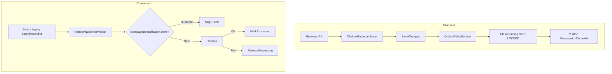

# Полный анализ IntegrationFlow и оценка рисков

**Статус:** актуально  
**Создан:** 2026-07-03 21:00 (UTC+3)  
**Обновлён:** 2026-07-03 21:00 (UTC+3)  
**Связанные документы:** [`2026-07-03_2010-delivery-guarantee-full-analysis.md`](2026-07-03_2010-delivery-guarantee-full-analysis.md) (superseded), [`plans/2026-07-03_2046-listener-hosted-service.md`](plans/2026-07-03_2046-listener-hosted-service.md)

Актуальное состояние после миграции listener на `IHostedService` (коммит `7a0bf77`). **87 тестов зелёные**, CI на GitHub Actions.

---

## 1. Что это за проект

**IntegrationFlow** — .NET-библиотека для построения интеграций между системами. Два пакета:

| Пакет | Назначение |
|-------|------------|
| `IntegrationFlow.Core` | Каркас + RabbitMQ (net8.0 + netstandard2.0) |
| `IntegrationFlow.EntityFrameworkCore` | Production stores: outbox + dedup (net8.0) |

### Сценарии интеграции

| Паттерн | Зрелость | Транспорт | Production-ready |
|---------|----------|-----------|------------------|
| **ReceiveAndProcess** | Высокая | RabbitMQ consumer | Да (с условиями adoption) |
| **SentAndForgot** | Высокая | RabbitMQ + transactional outbox | Да (с outbox + EF) |
| **SentAndWait** | Низкая | REST sample | Нет |

### Структура

```
IntegrationFlow/
├── src/IntegrationFlow.Core/                 # Домен, RabbitMQ, outbox, dedup
├── src/IntegrationFlow.EntityFrameworkCore/  # EF stores, SKIP LOCKED claim
└── tests/                                    # 87 тестов (unit + integration)
    ├── IntegrationFlow.Core.Tests                 (63)
    ├── IntegrationFlow.Core.IntegrationTests        (12)
    ├── IntegrationFlow.EntityFrameworkCore.Tests    (10)
    └── IntegrationFlow.EntityFrameworkCore.IntegrationTests (2)
```

---

## 2. Архитектура гарантий доставки



**Семантика — at-least-once**, не exactly-once. Это корректно задокументировано.

Ключевые компоненты:

- [`OutboxRelayService`](../src/IntegrationFlow.Core/Contexts/Integrations/03Domain/Outbox/OutboxRelayService.cs)
- [`RabbitMqListenerWorker`](../src/IntegrationFlow.Core/Contexts/Integrations/00InnerUsage/RabbitMq/ReceiveAndProcess/Workers/RabbitMqListenerWorker.cs)
- [`ReceiveAndProcessHostedService`](../src/IntegrationFlow.Core/Contexts/Integrations/03Domain/ReceiveAndProcess/ReceiveAndProcessHostedService.cs)
- [`EfOutboxStore`](../src/IntegrationFlow.EntityFrameworkCore/Outbox/EfOutboxStore.cs)
- [`EfMessageDeduplicationStore`](../src/IntegrationFlow.EntityFrameworkCore/Deduplication/EfMessageDeduplicationStore.cs)

---

## 3. Что сделано хорошо

### Consumer (ReceiveAndProcess)

- Ack **после** обработки (исправлен критический async-ack баг)
- Dedup с `ReleaseProcessingAsync`, lock expiry, `InProgress` → nack requeue
- **`RabbitMqListenerWorker`** — единый async loop для legacy и hosted path
- **`ReceiveAndProcessHostedService`** + `AddIntegrationFlowRabbitMqListener()` — graceful shutdown через `IHost`
- Убран `Thread` / `Thread.Abort` (техдолг #17 закрыт)

### Producer (SentAndForgot)

- Publisher confirms, `IntegrateWithResult()`, mandatory + BasicReturn fix
- Transactional outbox: `IOutboxEnqueue` в TX приложения, relay с claim/backoff

### EF Core (production)

- `EfOutboxStore` с SKIP LOCKED (PostgreSQL) / UPDLOCK (SQL Server)
- `EfMessageDeduplicationStore` с processing lock expiry
- Concurrent claim integration tests на PostgreSQL и SQL Server

### Тесты и CI

- E2E: outbox relay, consumer handler, hosted listener (3 теста)
- GitHub Actions: unit + integration (Testcontainers) — [`.github/workflows/ci.yml`](../.github/workflows/ci.yml)

### Документация

- README, plans, risk analysis с детализацией medium-рисков
- Осознанные trade-offs задокументированы

---

## 4. Матрица рисков

### Высокий приоритет — фундаментальные (inherent at-least-once)

| # | Риск | Последствие | Mitigation |
|---|------|-------------|------------|
| 1 | **Publish OK → MarkPublished fail** | Дубликат publish | `MessageId = OutboxId`; идемпотентный consumer |
| 2 | **MarkProcessed fail после успешной обработки** | Повтор business logic | Идемпотентные handlers |
| 3 | **Direct publish без outbox** | Потеря после DB commit | `IOutboxEnqueue` в той же TX |
| 4 | **Dedup без MessageId** | Dedup пропускается | Всегда задавать `MessageId` |

Эти риски **не устраняются каркасом** — требуют правильного adoption на стороне приложения.

### Высокий приоритет — adoption / API

| # | Риск | Описание | Последствие |
|---|------|----------|-------------|
| **A** | **`AddIntegrationFlowRabbitMqListener(profile)` → NoOp handler** | Использует `DefaultRabbitMqIntegrationProcessorSide` с [`NoOpInboxMessageProcessing`](../src/IntegrationFlow.Core/Contexts/Integrations/00InnerUsage/RabbitMq/ReceiveAndProcess/InboxMessageProcessing/NoOpInboxMessageProcessing.cs) | Сообщения **ack-ятся, но не обрабатываются** — silent data loss с точки зрения бизнеса |
| **B** | **Ограниченный public API** | `PublisherBase`, `IntegrationPublisherSideBase`, `RabbitMqIntegrationPublisherSideBase` — internal | Внешние приложения не могут легко подключить custom handler через типичный NuGet-паттерн; нужен manual hosted service registration (как в [`RabbitMqListenerHostedEndToEndTests`](../tests/IntegrationFlow.Core.IntegrationTests/RabbitMqListenerHostedEndToEndTests.cs)) |

### Средний приоритет

| # | Риск | Кратко |
|---|------|--------|
| 5 | Prefetch > 1 + concurrent consumer | Race в non-thread-safe handlers |
| 6 | Outbox/listener hosted worker только net8.0 | netstandard2.0 — manual `RunAsync` / `RelayBatchAsync` |
| 7 | EF dedup — отдельный DbContext на операцию | Не атомарен с business TX |
| 8 | InMemory stores в samples | Copy-paste в prod → потеря данных |
| 9 | Mandatory timeout 100ms | Теоретический silent loss при misconfigured topology |
| 10 | Abandoned outbox | Нужен мониторинг + runbook replay |
| 11 | Legacy `BeginReceiving()` без dedicated E2E | Hosted path покрыт; legacy launcher — нет |
| 12 | SQLite vs PG/SQL claim | Unit-тесты на SQLite; prod SQL — только integration |
| 13 | **`BeginReceiving()` obsolete, но путь с custom side** | Hosted API не принимает custom processor side из коробки |
| 14 | **EF dedup DI (Scoped) vs background listener** | Dedup нужно wire через `GetMessageDeduplicationStore` в custom side |

Подробная детализация рисков 5–12 — в [`2026-07-03_2010-delivery-guarantee-full-analysis.md`](2026-07-03_2010-delivery-guarantee-full-analysis.md), раздел 4.

### Низкий приоритет / техдолг

| # | Риск | Статус |
|---|------|--------|
| 15 | Sync-over-async в legacy paths | Остаётся (`ProcessorBase.Process`, `OutboxTransmitter`) |
| 16 | DLQ не создаётся runtime | Осознанно — ops responsibility |
| 17 | ~~Listener на Thread~~ | **Закрыто** (`7a0bf77`) |
| 18 | `SentAndWait` неполный | REST sample, без delivery guarantees |
| 19 | `IntegrationScheduler` закомментирован | Dead code |
| 20 | Нет metrics/tracing | Только logging через `IIntegrationLogger` |
| 21 | Локальная ветка ahead of origin | CI на remote может отставать |

---

## 5. Оценка по критериям

| Критерий | Оценка | Комментарий |
|----------|--------|-------------|
| **Архитектура** | **Хорошая** | Правильные паттерны (outbox, dedup, confirms), разделение Core/EF |
| **Delivery guarantees** | **~98%** | Критические баги закрыты; inherent at-least-once остаётся |
| **Production readiness (RabbitMQ path)** | **Да, при правильном adoption** | Outbox TX + EF stores + идемпотентные handlers + DLQ |
| **Public API / ergonomics** | **Слабая** | Hosted listener без custom handler; много internal types |
| **Тестовое покрытие** | **Хорошее** | 87 тестов, E2E critical path, CI |
| **Документация** | **Хорошая** | Актуализируется по мере изменений |
| **Observability** | **Минимальная** | Нет метрик outbox pending/abandoned, consumer lag |
| **SentAndWait** | **Не готов** | Out of scope текущей работы |

---

## 6. Обязательные условия для production

1. **Outbox через `IOutboxEnqueue`** в той же TX, что business-данные
2. **EF stores** — не InMemory
3. **Идемпотентные handlers** + **`MessageId`** на всех сообщениях
4. **DLQ на брокере** для poison messages
5. **Custom processor side** — не полагаться на голый `AddIntegrationFlowRabbitMqListener("Profile")` без wiring business handler
6. **Мониторинг**: outbox pending/abandoned, consumer unacked count, relay failures

---

## 7. Рекомендуемые следующие шаги

| P | Задача | Зачем |
|---|--------|-------|
| **P0** | Public API: `AddIntegrationFlowRabbitMqListener` с custom handler / processor side | Закрыть риск A |
| **P1** | Public base class для publisher/processor side | Закрыть риск B — adoption вне Core assembly |
| **P1** | E2E legacy `BeginReceiving()` path | Закрыть gap #11 |
| **P2** | Metrics hooks (outbox pending, relay errors, process duration) | Operational readiness |
| **P3** | Push коммитов + verify CI green on remote | Синхронизация с origin |

---

## 8. Итоговый вывод

Проект **архитектурно зрелый** для RabbitMQ at-least-once интеграций. За последние итерации закрыты все критические баги (async ack, dedup-on-failure, outbox claim, listener Thread) и добавлено solid test/CI покрытие.

**Blockers для production сняты** на уровне delivery semantics. Главные **оставшиеся риски — adoption, не корректность каркаса**:

- Hosted listener из коробки **не вызывает business logic** (NoOp processor)
- Public API ограничен — external apps сложно подключить без copy-paste из samples
- Operational monitoring — на стороне приложения

Direct publish без outbox и отсутствие `MessageId` — **осознанные anti-patterns**, не дефекты библиотеки.

Для production-критичных интеграций: **outbox + EF + идемпотентные handlers + custom processor wiring + DLQ + мониторинг abandoned outbox**.
