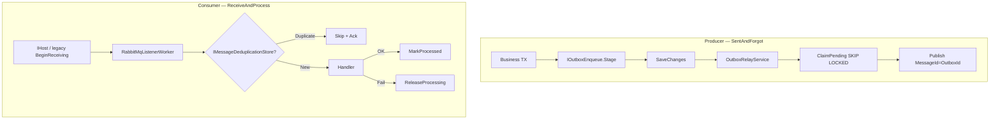

# Полный анализ IntegrationFlow и оценка рисков

**Статус:** актуально  
**Создан:** 2026-07-03 21:19 (UTC+3)  
**Обновлён:** 2026-07-03 21:19 (UTC+3)  
**Связанные документы:** [`2026-07-03_2100-integrationflow-full-analysis.md`](2026-07-03_2100-integrationflow-full-analysis.md) (superseded)

Актуальное состояние после коммитов `4ac9d0b` (обязательный business handler в `AddIntegrationFlowRabbitMqListener`) и `1a0c582` (unit-тесты регистрации). **89 тестов зелёные**, CI на GitHub Actions, ветка `master` синхронизирована с `origin/master`.

---

## 1. Что это за проект

**IntegrationFlow** — .NET-библиотека для построения интеграций между системами. Два пакета:

| Пакет | TFM | Назначение |
|-------|-----|------------|
| `IntegrationFlow.Core` | net8.0 + netstandard2.0 | Каркас, RabbitMQ, outbox, dedup |
| `IntegrationFlow.EntityFrameworkCore` | net8.0 | Production stores (outbox claim + dedup) |

### Сценарии интеграции

| Паттерн | Зрелость | Транспорт | Production-ready |
|---------|----------|-----------|------------------|
| **ReceiveAndProcess** | Высокая | RabbitMQ consumer | Да, при правильном adoption |
| **SentAndForgot** | Высокая | RabbitMQ + transactional outbox | Да, с outbox + EF |
| **SentAndWait** | Низкая | REST sample | Нет |

### Структура

```
IntegrationFlow/
├── src/IntegrationFlow.Core/                 # Домен, RabbitMQ, outbox, dedup
├── src/IntegrationFlow.EntityFrameworkCore/  # EF stores, SKIP LOCKED claim
└── tests/                                    # 89 тестов (unit + integration)
    ├── IntegrationFlow.Core.Tests                 (65)
    ├── IntegrationFlow.Core.IntegrationTests        (12)
    ├── IntegrationFlow.EntityFrameworkCore.Tests    (10)
    └── IntegrationFlow.EntityFrameworkCore.IntegrationTests (2)
```

---

## 2. Архитектура гарантий доставки



**Семантика — at-least-once**, не exactly-once. Это корректно и задокументировано.

Ключевые компоненты:

- [`OutboxRelayService`](../src/IntegrationFlow.Core/Contexts/Integrations/03Domain/Outbox/OutboxRelayService.cs)
- [`RabbitMqListenerWorker`](../src/IntegrationFlow.Core/Contexts/Integrations/00InnerUsage/RabbitMq/ReceiveAndProcess/Workers/RabbitMqListenerWorker.cs)
- [`ReceiveAndProcessHostedService`](../src/IntegrationFlow.Core/Contexts/Integrations/03Domain/ReceiveAndProcess/ReceiveAndProcessHostedService.cs)
- [`EfOutboxStore`](../src/IntegrationFlow.EntityFrameworkCore/Outbox/EfOutboxStore.cs)
- [`EfMessageDeduplicationStore`](../src/IntegrationFlow.EntityFrameworkCore/Deduplication/EfMessageDeduplicationStore.cs)

---

## 3. Что сделано хорошо

### Consumer (ReceiveAndProcess)

- Ack **после** обработки (async-баг закрыт)
- Dedup с `ReleaseProcessingAsync`, lock expiry, `InProgress` → nack requeue
- **`RabbitMqListenerWorker`** — единый async loop для legacy и hosted path
- **`ReceiveAndProcessHostedService`** + `AddIntegrationFlowRabbitMqListener()` — graceful shutdown через `IHost`
- Убран `Thread` / `Thread.Abort` (техдолг #17 закрыт)
- Manual ack, prefetch, requeue policy, MaxRetryCount → DLQ

### Producer (SentAndForgot)

- Publisher confirms, `IntegrateWithResult()`, mandatory + BasicReturn fix
- Transactional outbox: `IOutboxEnqueue` в TX приложения, relay с claim/backoff

### EF Core (production)

- Разделение `IOutboxEnqueue` (scoped DbContext) и `IOutboxStore` (factory для relay)
- `EfOutboxStore` с SKIP LOCKED (PostgreSQL) / UPDLOCK (SQL Server)
- `EfMessageDeduplicationStore` с processing lock expiry
- Concurrent claim integration tests на PostgreSQL и SQL Server

### Тесты и CI

- E2E: outbox relay, consumer handler, hosted listener
- GitHub Actions: unit + integration (Testcontainers) — [`.github/workflows/ci.yml`](../.github/workflows/ci.yml)

### Документация

- README, plans, risk analysis — хронологический указатель в [`docs/README.md`](README.md)

---

## 4. Матрица рисков

### Высокий приоритет — фундаментальные (inherent at-least-once)

| # | Риск | Последствие | Mitigation |
|---|------|-------------|------------|
| 1 | **Publish OK → MarkPublished fail** | Дубликат publish | `MessageId = OutboxId`; идемпотентный consumer |
| 2 | **MarkProcessed fail после успешной обработки** | Повтор business logic | Идемпотентные handlers |
| 3 | **Direct publish без outbox** | Потеря после DB commit | `IOutboxEnqueue` в той же TX |
| 4 | **Dedup без MessageId** | Dedup пропускается (warn в лог) | Всегда задавать `MessageId` |

Эти риски **не устраняются каркасом** — требуют правильного adoption на стороне приложения.

### Высокий приоритет — adoption / API

| # | Риск | Статус | Комментарий |
|---|------|--------|-------------|
| **A** | **NoOp handler — сообщения ack без обработки** | **Частично закрыт** | Основной API теперь **требует handler** (`4ac9d0b`). Overload без handler помечен `[Obsolete]`, но всё ещё существует |
| **B** | **Ограниченный public API** | **Открыт** | `PublisherBase`, `RabbitMqIntegrationPublisherSideBase`, `IntegrationProcessorSideBase` — internal. Внешним приложениям сложно расширять без copy-paste из samples |

### Средний приоритет

| # | Риск | Кратко |
|---|------|--------|
| 5 | Prefetch > 1 + concurrent consumer | Race в non-thread-safe handlers |
| 6 | Outbox/listener hosted worker только net8.0 | netstandard2.0 — manual `RunAsync` / `RelayBatchAsync` |
| 7 | EF dedup — отдельный DbContext на операцию | Не атомарен с business TX (by design) |
| 8 | InMemory stores в samples | Copy-paste в prod → потеря данных |
| 9 | Mandatory timeout 100ms | Теоретический silent loss при misconfigured topology |
| 10 | Abandoned outbox | Нужен мониторинг + runbook replay |
| 11 | Legacy `BeginReceiving()` без dedicated E2E | Hosted path покрыт; legacy launcher — нет |
| 12 | SQLite vs PG/SQL claim | Unit-тесты на SQLite; prod SQL — только integration |
| 13 | Custom processor side через hosted API | Только через factory `createProcessing` / `createDeduplicationStore` |
| 14 | EF dedup DI (Scoped) vs background listener | Dedup wire через `createDeduplicationStore` в DI |

Подробная детализация рисков 5–12 — в [`2026-07-03_2010-delivery-guarantee-full-analysis.md`](2026-07-03_2010-delivery-guarantee-full-analysis.md), раздел 4.

### Низкий приоритет / техдолг

| # | Риск | Статус |
|---|------|--------|
| 15 | Sync-over-async в legacy paths | Остаётся (`ProcessorBase.Process`, `OutboxTransmitter`, `InMemoryOutboxStore`) |
| 16 | DLQ не создаётся runtime | Осознанно — ops responsibility |
| 17 | ~~Listener на Thread~~ | **Закрыто** (`7a0bf77`) |
| 18 | `SentAndWait` неполный | REST sample, без delivery guarantees |
| 19 | `IntegrationScheduler` | Dead code |
| 20 | Нет metrics/tracing | Только logging через `IIntegrationLogger` |
| 21 | Нет NuGet packaging | Нет `.nuspec`, `PackageId`, versioning — библиотека не готова к публикации как пакет |

### Безопасность

| # | Риск | Описание |
|---|------|----------|
| S1 | Credentials в `rabbitmq.json` | Пароли в plain JSON рядом с приложением — нужен secrets manager / env vars |
| S2 | Нет TLS-конфигурации в samples | AMQPS не продемонстрирован |
| S3 | Guest credentials по умолчанию | Ок для dev, опасно для prod |

---

## 5. Оценка по критериям

| Критерий | Оценка | Комментарий |
|----------|--------|-------------|
| **Архитектура** | **8/10** | Правильные паттерны (outbox, dedup, confirms), разделение Core/EF |
| **Delivery guarantees** | **~98%** | Критические баги закрыты; inherent at-least-once остаётся |
| **Production readiness (RabbitMQ path)** | **Да, при правильном adoption** | Outbox TX + EF stores + идемпотентные handlers + DLQ |
| **Public API / ergonomics** | **5/10** | Handler API улучшен, но много internal types |
| **Тестовое покрытие** | **8/10** | 89 тестов, E2E critical path, CI |
| **Документация** | **8/10** | Актуализируется по мере изменений |
| **Observability** | **3/10** | Нет метрик outbox pending/abandoned, consumer lag |
| **Распространение** | **4/10** | Нет NuGet packaging, versioning |
| **SentAndWait** | **2/10** | Out of scope |

---

## 6. Обязательные условия для production

1. **Outbox через `IOutboxEnqueue`** в той же TX, что business-данные
2. **EF stores** — не InMemory
3. **Идемпотентные handlers** + **`MessageId`** на всех сообщениях
4. **DLQ на брокере** для poison messages
5. **Явный business handler** — не использовать obsolete overload без handler
6. **Мониторинг**: outbox pending/abandoned, consumer unacked count, relay failures
7. **Secrets management** — не хранить пароли RabbitMQ в plain JSON

---

## 7. Рекомендуемые следующие шаги

| P | Задача | Закрывает |
|---|--------|-----------|
| **P0** | Удалить obsolete NoOp overload (или сделать throw) | Риск A полностью |
| **P1** | Public base class для publisher/processor side | Риск B |
| **P1** | NuGet packaging + semver | Distribution |
| **P2** | Metrics hooks (outbox pending, relay errors, process duration) | Observability |
| **P2** | E2E legacy `BeginReceiving()` path | Gap #11 |
| **P3** | `SentAndWait` или явно пометить out-of-scope | Clarity |

---

## 8. Итоговый вывод

Проект **архитектурно зрелый** для RabbitMQ at-least-once интеграций. За последние итерации закрыты все критические баги (async ack, dedup-on-failure, outbox claim, listener Thread) и добавлено solid test/CI покрытие.

**Blockers для production сняты** на уровне delivery semantics. Главные **оставшиеся риски — adoption и operations**, не корректность каркаса:

| Категория | Главный риск |
|-----------|--------------|
| Adoption | Ограниченный public API — сложно расширять без copy-paste |
| Operations | Нет metrics/tracing, abandoned outbox без runbook |
| Distribution | Нет NuGet packaging |
| Security | Credentials в JSON, нет TLS samples |

Direct publish без outbox и отсутствие `MessageId` — **осознанные anti-patterns**, не дефекты библиотеки.

Для production-критичных интеграций: **outbox + EF + идемпотентные handlers + custom processor wiring + DLQ + мониторинг abandoned outbox**.
