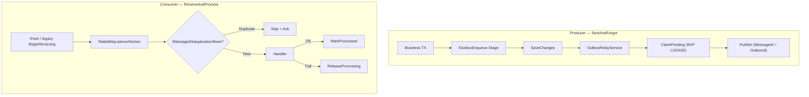

# Полный анализ IntegrationFlow и оценка рисков

**Статус:** superseded → см. [`2026-07-04_0929-integrationflow-full-analysis.md`](2026-07-04_0929-integrationflow-full-analysis.md)  
**Создан:** 2026-07-04 09:01 (UTC+3)  
**Обновлён:** 2026-07-04 09:29 (UTC+3)  
**Связанные документы:** [`2026-07-03_2201-integrationflow-full-analysis.md`](2026-07-03_2201-integrationflow-full-analysis.md) (superseded), [`plans/2026-07-04_0836-p1-p2-metrics-and-nuget.md`](plans/2026-07-04_0836-p1-p2-metrics-and-nuget.md)

Актуальное состояние после коммита `5780b82` (P1–P2: metrics-пакет, CI pack/release). Локально **95 unit + 16 integration = 111 тестов** — все зелёные.

---

## 1. Что это за решение

**IntegrationFlow** — .NET-библиотека для интеграций между системами. Три NuGet-пакета:

| Пакет | TFM | Назначение |
|-------|-----|------------|
| `IntegrationFlow.Core` | net8.0 + netstandard2.0 | Каркас, RabbitMQ, outbox, dedup |
| `IntegrationFlow.EntityFrameworkCore` | net8.0 | Production stores (outbox claim + dedup) |
| `IntegrationFlow.Metrics.OpenTelemetry` | net8.0 | Метрики через `System.Diagnostics.Metrics` |

### Зрелость по сценариям

| Паттерн | Статус | Production-ready |
|---------|--------|------------------|
| **ReceiveAndProcess** (consumer) | Высокая | Да, при правильном adoption |
| **SentAndForgot** (producer + outbox) | Высокая | Да, с outbox + EF |
| **SentAndWait** (request/response) | Низкая | Нет — REST sample без гарантий |

### Структура

```
IntegrationFlow/
├── src/IntegrationFlow.Core/                 # Домен, RabbitMQ, outbox, dedup
├── src/IntegrationFlow.EntityFrameworkCore/  # EF stores, SKIP LOCKED claim
├── src/IntegrationFlow.Metrics.OpenTelemetry/ # Reference metrics (net8.0)
├── Directory.Build.props                     # NuGet metadata, Version 1.0.0
└── tests/                                    # 111 тестов (unit + integration)
    ├── IntegrationFlow.Core.Tests                 (74)
    ├── IntegrationFlow.Metrics.OpenTelemetry.Tests (8)
    ├── IntegrationFlow.EntityFrameworkCore.Tests  (13)
    ├── IntegrationFlow.Core.IntegrationTests        (14)
    └── IntegrationFlow.EntityFrameworkCore.IntegrationTests (2)
```

---

## 2. Архитектура гарантий доставки



**Семантика — at-least-once, не exactly-once.** Это корректно и задокументировано.

Ключевые компоненты:

- [`OutboxRelayService`](../src/IntegrationFlow.Core/Contexts/Integrations/03Domain/Outbox/OutboxRelayService.cs)
- [`RabbitMqListenerWorker`](../src/IntegrationFlow.Core/Contexts/Integrations/00InnerUsage/RabbitMq/ReceiveAndProcess/Workers/RabbitMqListenerWorker.cs)
- [`RabbitMqReceivedMessageHandler`](../src/IntegrationFlow.Core/Contexts/Integrations/00InnerUsage/RabbitMq/ReceiveAndProcess/Listeners/RabbitMqReceivedMessageHandler.cs)
- [`ProcessorBase`](../src/IntegrationFlow.Core/Contexts/Integrations/03Domain/ReceiveAndProcess/ProcessorBase.cs)
- [`EfOutboxStore`](../src/IntegrationFlow.EntityFrameworkCore/Outbox/EfOutboxStore.cs)
- [`EfMessageDeduplicationStore`](../src/IntegrationFlow.EntityFrameworkCore/Deduplication/EfMessageDeduplicationStore.cs)
- [`OpenTelemetryIntegrationFlowMetrics`](../src/IntegrationFlow.Metrics.OpenTelemetry/OpenTelemetryIntegrationFlowMetrics.cs)

---

## 3. Что сделано хорошо

### Consumer (ReceiveAndProcess)

- Ack **после** завершения обработки (async-баг закрыт)
- Dedup: `AlreadyProcessed` → skip + ack; `InProgress` → nack requeue; fail → `ReleaseProcessingAsync`
- **`RabbitMqListenerWorker`** — единый async loop для legacy и hosted path
- **`ReceiveAndProcessHostedService`** + `AddIntegrationFlowRabbitMqListener()` — graceful shutdown через `IHost`
- Убран `Thread` / `Thread.Abort` (техдолг #17 закрыт)
- Overload без handler **удалён** — hosted API требует явный handler (`88766ec`)
- Legacy default processor возвращает `null` → `NotImplementedException` → nack, не silent ack

### Producer (SentAndForgot)

- Publisher confirms, `IntegrateWithResult()`, `MessageId = OutboxId`
- Transactional outbox: enqueue в TX приложения, relay с claim/lock/backoff
- `ReplayAbandonedAsync` + runbook [`runbooks/2026-07-03_2216-abandoned-outbox-replay.md`](runbooks/2026-07-03_2216-abandoned-outbox-replay.md)

### EF Core (production)

- Разделение `IOutboxEnqueue` (scoped DbContext) и `IOutboxStore` (factory для relay)
- `EfOutboxStore` с SKIP LOCKED (PostgreSQL) / UPDLOCK (SQL Server)
- Concurrent claim integration tests на PostgreSQL и SQL Server

### Observability и distribution (P1–P2, `5780b82`)

- Пакет `IntegrationFlow.Metrics.OpenTelemetry` — 6 метрик, runbook [`runbooks/2026-07-04_0845-metrics-and-alerting.md`](runbooks/2026-07-04_0845-metrics-and-alerting.md)
- CI: unit → integration → pack (artifact на каждый push) — [`.github/workflows/ci.yml`](../.github/workflows/ci.yml)
- `release.yml` — publish на tag `v*.*.*` (нужен `NUGET_API_KEY`)

### Тесты и CI

- E2E: outbox relay, consumer handler, hosted listener, legacy `BeginReceiving()`
- 111 тестов, CI на GitHub Actions

---

## 4. Матрица рисков

### Высокий приоритет — фундаментальные (inherent at-least-once)

| # | Риск | Последствие | Mitigation |
|---|------|-------------|------------|
| 1 | **Publish OK → MarkPublished fail** | Дубликат publish | `MessageId = OutboxId`; идемпотентный consumer |
| 2 | **MarkProcessed fail после успешной обработки** | Повтор business logic | Идемпотентные handlers |
| 3 | **Direct publish без outbox** | Потеря после DB commit | `IOutboxEnqueue` в той же TX |
| 4 | **Dedup без MessageId** | Dedup пропускается (warn в лог) | Всегда задавать `MessageId` |

Эти риски **не устраняются каркасом** — требуют правильного adoption на стороне приложения.

### Высокий приоритет — adoption / API

| # | Риск | Статус | Комментарий |
|---|------|--------|-------------|
| **A** | **NoOp handler — сообщения ack без обработки** | **Закрыт (hosted)** | Overload без handler **удалён** (`88766ec`) |
| **A′** | **Legacy default NoOp processor** | **Закрыт** | `GetInboxMessageProcessing` → `null` → nack |
| **B** | **Ограниченный public API** | **Закрыт** | Базовые классы public; internal — worker, hosted side |

### Средний приоритет

| # | Риск | Статус | Кратко |
|---|------|--------|--------|
| 5 | Prefetch > 1 + concurrent handler | Открыт | Race в non-thread-safe handlers |
| 6 | Hosted worker только net8.0 | Открыт | netstandard2.0 — manual `RunAsync` / `RelayBatchAsync` |
| 7 | EF dedup — отдельный DbContext | By design | Не атомарен с business TX |
| 8 | InMemory stores в samples | Открыт | Copy-paste в prod → потеря данных |
| 9 | Mandatory timeout 100ms | Открыт | Теоретический silent loss при misconfigured topology |
| 10 | Abandoned outbox | **Закрыт (ops)** | `ReplayAbandonedAsync` + runbook |
| 11 | Legacy без E2E | **Закрыт** | `RabbitMqListenerLegacyEndToEndTests` |
| 12 | SQLite vs PG/SQL claim | Открыт | Unit на SQLite; prod SQL — только integration |
| 13 | Custom processor через hosted API | Открыт | Только через `createProcessing` / `createDeduplicationStore` |
| 14 | EF dedup DI vs background listener | Открыт | Dedup wire через factory в DI |
| 15 | Release без integration tests | Открыт | `release.yml` гоняет только unit-тесты перед publish |

Подробная детализация рисков 5–14 — в [`2026-07-03_2010-delivery-guarantee-full-analysis.md`](2026-07-03_2010-delivery-guarantee-full-analysis.md), раздел 4.

### Низкий приоритет / техдолг

| # | Риск | Статус |
|---|------|--------|
| 16 | Sync-over-async в legacy paths | Остаётся (`ProcessorBase.Process`, `OutboxTransmitter`) |
| 17 | DLQ не создаётся runtime | Осознанно — ops responsibility |
| 18 | `SentAndWait` неполный | Out of scope |
| 19 | `IntegrationScheduler` | Dead code |
| 20 | Нет distributed tracing | Только metrics hooks, без OTel traces |
| 21 | NuGet не опубликован | Workflow готов; нужен `NUGET_API_KEY` + tag `v1.0.0` |

### Безопасность

| # | Риск | Описание |
|---|------|----------|
| S1 | Credentials в `rabbitmq.json` | Plain JSON — нужен secrets manager / env vars |
| S2 | Нет TLS samples | AMQPS не продемонстрирован |
| S3 | Guest credentials по умолчанию | Ок для dev, опасно для prod |

---

## 5. Оценка по критериям

| Критерий | Оценка | Комментарий |
|----------|--------|-------------|
| **Архитектура** | **8/10** | Outbox, dedup, confirms; разделение Core/EF/Metrics |
| **Delivery guarantees** | **~98%** | Критические баги закрыты; inherent at-least-once остаётся |
| **Production readiness (RabbitMQ path)** | **Да, при правильном adoption** | Outbox TX + EF + идемпотентные handlers + DLQ |
| **Public API / ergonomics** | **7/10** | Базовые классы открыты; legacy path требует знания архитектуры |
| **Тестовое покрытие** | **8/10** | 111 тестов, E2E critical path + legacy, CI |
| **Документация** | **8/10** | README, plans, runbooks актуальны |
| **Observability** | **8/10** | ↑ с 5/10 — reference metrics + runbook алертов |
| **Распространение** | **8/10** | ↑ с 6/10 — CI pack + release workflow; publish не выполнен |
| **SentAndWait** | **2/10** | Out of scope |

---

## 6. Обязательные условия для production

1. **Outbox через `IOutboxEnqueue`** в той же TX, что business-данные
2. **EF stores** — не InMemory
3. **Идемпотентные handlers** + **`MessageId`** на всех сообщениях
4. **DLQ на брокере** для poison messages
5. **Явный business handler** — hosted: `AddIntegrationFlowRabbitMqListener`; legacy: свой `IntegrationProcessorSideBase`
6. **Мониторинг**: `AddIntegrationFlowOpenTelemetryMetrics()` + алерты на pending/abandoned/failures
7. **Secrets management** — не хранить пароли RabbitMQ в plain JSON
8. **Replay abandoned** — runbook + `ReplayAbandonedAsync` при срабатывании алерта

---

## 7. Рекомендуемые следующие шаги

| P | Задача | Статус |
|---|--------|--------|
| **P1** | Reference implementation `IIntegrationFlowMetrics` | ✅ [`plans/2026-07-04_0836-p1-p2-metrics-and-nuget.md`](plans/2026-07-04_0836-p1-p2-metrics-and-nuget.md) |
| **P2** | CI job `dotnet pack` + publish to NuGet.org | ✅ workflow готов; нужен `NUGET_API_KEY` + tag `v1.0.0` |
| **P2** | Runbook для abandoned outbox replay | ✅ [`runbooks/2026-07-03_2216-abandoned-outbox-replay.md`](runbooks/2026-07-03_2216-abandoned-outbox-replay.md) |
| **P3** | `SentAndWait` или явно пометить out-of-scope | Открыт — [`plans/2026-07-04_0904-rabbitmq-sentandwait.md`](plans/2026-07-04_0904-rabbitmq-sentandwait.md) |
| **P3** | Distributed tracing (OTel traces) | Открыт |
| **P3** | Integration tests в `release.yml` перед publish | Открыт |

---

## 8. Итоговый вывод

Проект **архитектурно зрелый** для RabbitMQ at-least-once интеграций. За последние итерации закрыты:

- Критические баги (async ack, dedup-on-failure, outbox claim, Thread listener)
- P0–P2 gaps (NoOp, public API, metrics hooks, NuGet packaging, legacy E2E)
- P1–P2 (reference metrics, CI pack/release)

**Blockers для production сняты** на уровне delivery semantics. Главные **оставшиеся риски — adoption и operations**, не корректность каркаса:

| Категория | Главный риск |
|-----------|--------------|
| Adoption | Legacy path требует явного `IntegrationProcessorSideBase`; идемпотентность и MessageId — на стороне приложения |
| Operations | Abandoned outbox требует runbook; metrics нужно подключить exporter в host app |
| Distribution | NuGet собирается, но не опубликован (`NUGET_API_KEY` + tag) |
| Security | Credentials в JSON, нет TLS samples |

Direct publish без outbox и отсутствие `MessageId` — **осознанные anti-patterns**, не дефекты библиотеки.

Для production-критичных интеграций: **outbox + EF + идемпотентные handlers + custom processor wiring + DLQ + metrics + мониторинг abandoned outbox**.
