# Полный анализ IntegrationFlow и оценка рисков

**Статус:** актуально  
**Создан:** 2026-07-04 21:02 (UTC+3)  
**Обновлён:** 2026-07-04 21:02 (UTC+3)  
**Связанные документы:** [`2026-07-04_0929-integrationflow-full-analysis.md`](2026-07-04_0929-integrationflow-full-analysis.md) (superseded), [`plans/2026-07-04_0904-rabbitmq-sentandwait.md`](plans/2026-07-04_0904-rabbitmq-sentandwait.md) (MVP выполнен), [`plans/2026-07-04_0930-post-analysis-roadmap.md`](plans/2026-07-04_0930-post-analysis-roadmap.md) (следующие шаги)

Актуальное состояние после коммита `85b0a45` (fix flaky metrics test + SentAndWait MVP). Локально **121 тест** (82 + 8 + 13 + 16 + 2) — все зелёные в Release, CI на GitHub Actions (unit → integration → pack).

---

## 1. Что это за решение

**IntegrationFlow** — .NET-библиотека для построения интеграций между системами. Три NuGet-пакета:

| Пакет | TFM | Назначение |
|-------|-----|------------|
| `IntegrationFlow.Core` | net8.0 + netstandard2.0 | Каркас, RabbitMQ (3 сценария), outbox, dedup |
| `IntegrationFlow.EntityFrameworkCore` | net8.0 | Production stores (outbox claim + dedup) |
| `IntegrationFlow.Metrics.OpenTelemetry` | net8.0 | Метрики через `System.Diagnostics.Metrics` |

### Зрелость по сценариям

| Паттерн | Статус | Production-ready |
|---------|--------|------------------|
| **ReceiveAndProcess** (consumer) | Высокая | Да, при правильном adoption |
| **SentAndForgot** (producer + outbox) | Высокая | Да, с outbox + EF |
| **SentAndWait** (RabbitMQ RPC) | Средняя (MVP) | Условно — sync RPC, без outbox |
| **SentAndWait** (REST sample) | Низкая | Нет — без гарантий |

### Структура

```
IntegrationFlow/
├── src/IntegrationFlow.Core/
│   └── 00InnerUsage/RabbitMq/
│       ├── ReceiveAndProcess/     # consumer
│       ├── SentAndForgot/         # publisher + outbox relay
│       └── SentAndWait/           # request-reply RPC
├── src/IntegrationFlow.EntityFrameworkCore/
├── src/IntegrationFlow.Metrics.OpenTelemetry/
└── tests/                         # 121 тест (unit + integration)
    ├── IntegrationFlow.Core.Tests                 (82)
    ├── IntegrationFlow.Metrics.OpenTelemetry.Tests (8)
    ├── IntegrationFlow.EntityFrameworkCore.Tests  (13)
    ├── IntegrationFlow.Core.IntegrationTests        (16)
    └── IntegrationFlow.EntityFrameworkCore.IntegrationTests (2)
```

---

## 2. Архитектура

```mermaid
flowchart TB
    subgraph producer [Producer — SentAndForgot]
        TX[Business TX] --> Stage[IOutboxEnqueue.Stage]
        Stage --> Save[SaveChanges]
        Save --> Relay[OutboxRelayService]
        Relay --> Claim[ClaimPending SKIP LOCKED]
        Claim --> Pub["Publish MessageId = OutboxId"]
    end

    subgraph rpc [SentAndWait — RabbitMQ RPC]
        Client[RabbitMqRequestReplyTransmitter] -->|ReplyTo + CorrelationId| ReqQ[Request queue]
        ReqQ --> Server[ReceiveAndProcess handler]
        Server --> Reply[RabbitMqReplyPublisher]
        Reply -->|CorrelationId| Client
    end

    subgraph consumer [Consumer — ReceiveAndProcess]
        Host[IHost / legacy BeginReceiving] --> Worker[RabbitMqListenerWorker]
        Worker --> Dedup{IMessageDeduplicationStore?}
        Dedup -->|Duplicate| Skip[Skip + Ack]
        Dedup -->|New| Process[Handler]
        Process -->|OK| Mark[MarkProcessed]
        Process -->|Fail| Release[ReleaseProcessing]
    end
```



### Семантика доставки

| Сценарий | Гарантия | Комментарий |
|----------|----------|-------------|
| ReceiveAndProcess | **At-least-once** | Ack после обработки, dedup |
| SentAndForgot + outbox | **At-least-once** | Outbox TX + relay + confirms |
| SentAndWait RPC | **At-most-once** | Sync wait; timeout = unknown state |

Ключевые компоненты:

- [`OutboxRelayService`](../src/IntegrationFlow.Core/Contexts/Integrations/03Domain/Outbox/OutboxRelayService.cs)
- [`RabbitMqListenerWorker`](../src/IntegrationFlow.Core/Contexts/Integrations/00InnerUsage/RabbitMq/ReceiveAndProcess/Workers/RabbitMqListenerWorker.cs)
- [`RabbitMqRequestReplyTransmitter`](../src/IntegrationFlow.Core/Contexts/Integrations/00InnerUsage/RabbitMq/SentAndWait/Transmitters/RabbitMqRequestReplyTransmitter.cs)
- [`RabbitMqReplyPublisher`](../src/IntegrationFlow.Core/Contexts/Integrations/00InnerUsage/RabbitMq/SentAndWait/Reply/RabbitMqReplyPublisher.cs)
- [`RabbitMqReceivedMessage`](../src/IntegrationFlow.Core/Contexts/Integrations/00InnerUsage/RabbitMq/ReceiveAndProcess/Messages/RabbitMqReceivedMessage.cs) — `ReplyTo`, `IsRequestReply`
- [`EfOutboxStore`](../src/IntegrationFlow.EntityFrameworkCore/Outbox/EfOutboxStore.cs)
- [`OpenTelemetryIntegrationFlowMetrics`](../src/IntegrationFlow.Metrics.OpenTelemetry/OpenTelemetryIntegrationFlowMetrics.cs)

---

## 3. Что сделано хорошо

### Consumer (ReceiveAndProcess)

- Ack **после** завершения обработки
- Dedup с `ReleaseProcessingAsync`, lock expiry, `InProgress` → nack requeue
- `ReceiveAndProcessHostedService` + graceful shutdown
- Overload без handler удалён; legacy NoOp → nack

### Producer (SentAndForgot)

- Publisher confirms, `IntegrateWithResult()`, `MessageId = OutboxId`
- Transactional outbox + EF SKIP LOCKED claim
- `ReplayAbandonedAsync` + runbook

### SentAndWait RabbitMQ

- `RabbitMqRequestReplyTransmitter` — publish + wait с timeout
- `DirectReplyTo` (default) + `ExclusiveQueue` fallback
- `RabbitMqReplyPublisher` — server-side reply на `ReplyTo`
- `RabbitMqRequestReplyConfigurationLoader` — секция `RabbitMqRequestReply`
- `SentAndWaitIntegrationOptions.ThrowOnFailure`
- Unit + E2E тесты (roundtrip + timeout)

### Observability и distribution

- `IntegrationFlow.Metrics.OpenTelemetry` — reference metrics + runbook алертов
- CI: unit → integration → pack; `release.yml` на tag (нужен `NUGET_API_KEY`)

### Тесты и CI

- **121 тест**, E2E critical path + legacy + RPC roundtrip

---

## 4. Матрица рисков

### Высокий приоритет — фундаментальные (inherent)

| # | Риск | Сценарий | Mitigation |
|---|------|----------|------------|
| 1 | Publish OK → MarkPublished fail | SentAndForgot | `MessageId = OutboxId`; идемпотентный consumer |
| 2 | MarkProcessed fail после успешной обработки | ReceiveAndProcess | Идемпотентные handlers |
| 3 | Direct publish без outbox | SentAndForgot | `IOutboxEnqueue` в той же TX |
| 4 | Dedup без MessageId | ReceiveAndProcess | Всегда задавать `MessageId` |
| **R1** | **Timeout после publish, server обработал** | **SentAndWait** | Идемпотентный server; retry с новым CorrelationId |
| **R2** | **Reply publish fail после обработки** | **SentAndWait** | Client timeout + retry; server dedup по MessageId |

Эти риски **не устраняются каркасом полностью** — требуют правильного adoption.

### Высокий приоритет — adoption / API

| # | Риск | Статус | Комментарий |
|---|------|--------|-------------|
| **A** | NoOp handler — ack без обработки | **Закрыт (hosted)** | Overload без handler удалён |
| **A′** | Legacy default NoOp processor | **Закрыт** | `GetInboxMessageProcessing` → null → nack |
| **B** | Ограниченный public API | **Закрыт** | RPC: public `RabbitMqReplyPublisher` |
| **R3** | Exception глотается без `ThrowOnFailure` | **Открыт** | По умолчанию `false` |
| **R4** | Server ack до reply | **Открыт** | Handler должен reply **до** return из Process |

### Средний приоритет

| # | Риск | Статус | Кратко |
|---|------|--------|--------|
| 5 | Prefetch > 1 + concurrent handler | Открыт | Race в non-thread-safe handlers |
| 6 | Hosted worker только net8.0 | Открыт | netstandard2.0 — manual paths |
| 7 | EF dedup — отдельный DbContext | By design | Не атомарен с business TX |
| 8 | InMemory stores в samples | Открыт | Copy-paste в prod → потеря данных |
| 9 | Mandatory timeout 100ms | Открыт | SentAndForgot topology misconfig |
| 10 | Abandoned outbox | **Закрыт (ops)** | `ReplayAbandonedAsync` + runbook |
| **R5** | Один in-flight RPC на transmitter | Открыт | `lock(transmitSync)` в transmitter |
| **R6** | ReplyPublisher — новое соединение на reply | Открыт | Overhead при высокой нагрузке |
| **R7** | Нет metrics для RPC | Открыт | `IIntegrationFlowMetrics` не покрывает SentAndWait |
| **R8** | Нет `IntegrateWithResult()` для SentAndWait | Открыт | Только sync `Integrate()` |
| **R9** | DirectReplyTo требует RabbitMQ ≥ 3.4 | By design | Fallback: `ExclusiveQueue` |
| 15 | Release без integration tests | Открыт | `release.yml` — только unit |
| 21 | NuGet не опубликован | Открыт | Workflow готов; нужен tag + API key |

### Низкий приоритет / техдолг

| # | Риск | Статус |
|---|------|--------|
| 16 | Sync-over-async в legacy paths | Остаётся |
| 17 | DLQ не создаётся runtime | Осознанно — ops responsibility |
| 18 | REST SentAndWait sample | Legacy, без гарантий |
| 19 | `IntegrationScheduler` | Dead code |
| 20 | Нет distributed tracing | Только metrics hooks |
| **R10** | ExclusiveQueue leak при crash | Mitigated — `DirectReplyTo` default |

### Безопасность

| # | Риск | Описание |
|---|------|----------|
| S1 | Credentials в `rabbitmq.json` | Plain JSON — нужен secrets manager |
| S2 | Нет TLS samples | AMQPS не продемонстрирован |
| S3 | Guest credentials по умолчанию | Ок для dev, опасно для prod |

---

## 5. Оценка по критериям

| Критерий | Оценка | Комментарий |
|----------|--------|-------------|
| **Архитектура** | **8/10** | Outbox, dedup, RPC; sync RPC без outbox — by design |
| **Delivery guarantees (async paths)** | **~98%** | ReceiveAndProcess + SentAndForgot зрелые |
| **Production readiness (ReceiveAndProcess)** | **Да, при adoption** | Outbox TX + EF + dedup + DLQ |
| **Production readiness (SentAndForgot)** | **Да, при adoption** | Outbox + EF + confirms |
| **Production readiness (SentAndWait RPC)** | **Условно** | MVP sync RPC; не для critical TX |
| **Public API / ergonomics** | **7/10** | RPC transmitter internal; public reply publisher |
| **Тестовое покрытие** | **8/10** | 121 тест, E2E + RPC roundtrip |
| **Документация** | **8/10** | README, plans, runbooks, analysis v9 |
| **Observability** | **7/10** | Metrics для consumer/outbox; RPC не покрыт |
| **Распространение** | **7/10** | CI pack работает; NuGet publish не выполнен |

---

## 6. Обязательные условия для production

### ReceiveAndProcess + SentAndForgot

1. **Outbox через `IOutboxEnqueue`** в той же TX, что business-данные
2. **EF stores** — не InMemory
3. **Идемпотентные handlers** + **`MessageId`** на всех сообщениях
4. **DLQ на брокере** для poison messages
5. **Явный business handler** — hosted или custom processor side
6. **Мониторинг**: `AddIntegrationFlowOpenTelemetryMetrics()` + алерты
7. **Secrets management** — не хранить пароли в plain JSON

### SentAndWait RPC (дополнительно)

1. **`SentAndWaitIntegrationOptions.ThrowOnFailure = true`**
2. **Идемпотентный server handler** — retry клиента после timeout
3. **Reply до return из Process** — иначе ack без ответа
4. **`ResponseTimeoutSeconds`** с запасом под p99 latency
5. **Не использовать RPC для critical transactional flows** — outbox не поддерживается

---

## 7. Рекомендуемые следующие шаги

| P | Задача | Статус |
|---|--------|--------|
| **P3** | RPC metrics (`RecordRequestReply`) | Открыт — [`plans/2026-07-04_0930-post-analysis-roadmap.md`](plans/2026-07-04_0930-post-analysis-roadmap.md) волна 2 |
| **P3** | `IntegrateWithResult()` для SentAndWait | Открыт — [`plans/2026-07-04_2104-sentandwait-async-execution.md`](plans/2026-07-04_2104-sentandwait-async-execution.md) фаза 1 |
| **P3** | Async `IntegrateAsync()` + concurrent RPC | Открыт — [`plans/2026-07-04_2104-sentandwait-async-execution.md`](plans/2026-07-04_2104-sentandwait-async-execution.md) |
| **P3** | Integration tests в `release.yml` | Открыт — roadmap волна 1 |
| **P3** | NuGet publish (`NUGET_API_KEY` + tag) | Открыт — roadmap волна 1 |
| **P3** | Distributed tracing | Открыт — roadmap волна 4 (optional) |

---

## 8. Итоговый вывод

Проект **архитектурно зрелый** для RabbitMQ интеграций. После `85b0a45` закрыт главный gap — **SentAndWait через RabbitMQ** (sync request-reply MVP) и стабилизированы metrics-тесты.

**Blockers сняты** для всех трёх RabbitMQ-сценариев на уровне базовой функциональности. Главные **оставшиеся риски**:

| Категория | Главный риск | Severity |
|-----------|--------------|----------|
| **SentAndWait RPC** | At-most-once при timeout; нет outbox; один in-flight на connection | Высокий для critical flows |
| **Adoption** | `ThrowOnFailure=false` по умолчанию; server должен reply до ack | Высокий |
| **Operations** | NuGet не опубликован; release без integration tests; нет RPC metrics | Средний |
| **Performance (RPC)** | Serial lock + новое connection на reply | Средний при нагрузке |
| **Security** | Plain credentials, нет TLS samples | Средний |

**Рекомендация:**

- **Critical async flows** → SentAndForgot + outbox + EF
- **Sync query/command** → SentAndWait RPC + идемпотентный server + `ThrowOnFailure`
- **Не смешивать** RPC и transactional outbox для одной business operation

Direct publish без outbox, отсутствие `MessageId` и RPC без идемпотентного server — **осознанные anti-patterns**, не дефекты каркаса.
