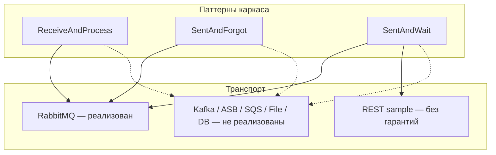
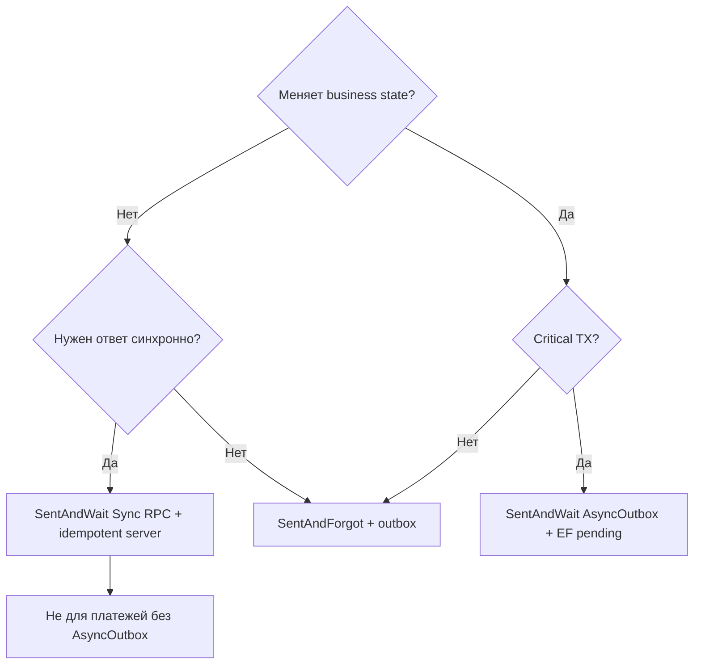

# Полный анализ IntegrationFlow по видам интеграций

**Статус:** актуально  
**Создан:** 2026-07-04 23:38 (UTC+3)  
**Обновлён:** 2026-07-04 23:38 (UTC+3)  
**Связанные документы:** [`2026-07-04_2234-integrationflow-full-analysis.md`](2026-07-04_2234-integrationflow-full-analysis.md), [`2026-07-04_2301-sentandwait-rpc-implementation-status.md`](2026-07-04_2301-sentandwait-rpc-implementation-status.md), [`runbooks/2026-07-04_2130-production-adoption.md`](runbooks/2026-07-04_2130-production-adoption.md), [`runbooks/2026-07-04_2130-sentandwait-rpc-adoption.md`](runbooks/2026-07-04_2130-sentandwait-rpc-adoption.md)

Отчёт актуален на состояние репозитория после реализации фаз 1–3 SentAndWait RPC (AsyncOutbox, compensation, maintenance). **128 unit-тестов** зелёные в Release; integration-тесты требуют Docker (Testcontainers).

---

## 1. Обзор решения

**IntegrationFlow** — .NET-библиотека (3 NuGet-пакета) с единым каркасом для трёх **паттернов интеграции**, а не для «всех видов транспортов»:

| Паттерн | Семантика | Транспорт в каркасе |
|---------|-----------|---------------------|
| **ReceiveAndProcess** | Consumer: получить → обработать → ack | RabbitMQ (полная реализация) |
| **SentAndForgot** | Producer fire-and-forget | RabbitMQ + Transactional Outbox |
| **SentAndWait** | Request/response | RabbitMQ sync RPC + AsyncOutbox; REST — legacy sample |

Каркас задаёт абстракции (`ListenerBase`, `ITransmitter`, `IOutboxStore`, `IMessageDeduplicationStore`), а конкретный транспорт подключается через `00InnerUsage/{Broker}/`. Сейчас реализован **только RabbitMQ**.



### Пакеты

| Пакет | TFM | Назначение |
|-------|-----|------------|
| `IntegrationFlow.Core` | net8.0 + netstandard2.0 | Каркас, RabbitMQ (3 сценария), outbox, dedup, RPC |
| `IntegrationFlow.EntityFrameworkCore` | net8.0 | Production stores (outbox, dedup, RPC pending, response cache) |
| `IntegrationFlow.Metrics.OpenTelemetry` | net8.0 | Метрики через `System.Diagnostics.Metrics` |

---

## 2. Зрелость по каждому виду интеграции

### 2.1 ReceiveAndProcess (входящие сообщения)

**Статус: production-ready при правильном adoption.**

| Компонент | Реализовано в каркасе | Не реализовано |
|-----------|----------------------|----------------|
| Long-poll consumer | ✅ `RabbitMqListenerWorker` | HTTP webhook, file watcher, DB polling |
| Manual ack после обработки | ✅ | — |
| Async handler + graceful shutdown | ✅ `ReceiveAndProcessHostedService` (.NET 8+) | Hosted worker на netstandard2.0 |
| Dedup / идемпотентность | ✅ `IMessageDeduplicationStore` + EF | Атомарность dedup с business TX |
| Retry / DLQ | ✅ `RequeueOnFailure`, `MaxRetryCount` | Создание DLQ на брокере (ops) |
| Prefetch / backpressure | ✅ `PrefetchCount` | Автонастройка под handler |
| Метрики | ✅ `integrationflow.message.*` | Distributed tracing |

**Гарантия доставки:** at-least-once. Ack выполняется **после** завершения обработки (включая async path).

**Пример — hosted consumer (.NET 8+):**

```csharp
services.AddIntegrationFlow();
services.AddIntegrationFlowOpenTelemetryMetrics();
services.AddIntegrationFlowEfDeduplication<MyDbContext>();
services.AddIntegrationFlowRabbitMqListener("Inbox", async message =>
{
    var payload = Deserialize(message);
    await orderService.ProcessInboxAsync(payload, ct);
});
```

**Что должно быть сделано в приложении / инфраструктуре (не в каркасе):**

| Задача | Где | Почему не в каркасе |
|--------|-----|---------------------|
| Создание очереди + DLQ на RabbitMQ | Infra (Terraform/Helm) | Каркас подключается через `QueueDeclarePassive` |
| Идемпотентная бизнес-логика handler | App code | Доменная ответственность |
| EF dedup store | App DI | Нужен ваш `DbContext` |
| Алерты по метрикам | Prometheus/Grafana | Host app |
| Poison message runbook | Ops | Политика requeue/DLQ — настройка брокера |

---

### 2.2 SentAndForgot (исходящие, fire-and-forget)

**Статус: production-ready с Transactional Outbox + EF.**

| Режим | Гарантия | Рекомендация |
|-------|----------|--------------|
| Direct publish | Best-effort + publisher confirms | Только без TX или осознанный trade-off |
| **Outbox + relay** | At-least-once (БД + брокер) | **Production default** |

**Пример — атомарность «заказ + событие»:**

```csharp
await using var tx = await db.Database.BeginTransactionAsync(ct);

await db.Orders.AddAsync(order, ct);
db.EnqueueOutboxMessage("OrdersOut", JsonSerializer.Serialize(orderCreatedEvent));
await db.SaveChangesAsync(ct);
await tx.CommitAsync(ct);
// Relay worker опубликует асинхронно с MessageId = OutboxId
```

**DI для production:**

```csharp
services.AddDbContext<MyDbContext>(...);
services.AddDbContextFactory<MyDbContext>(...);
services.AddIntegrationFlowEfOutbox<MyDbContext>();
services.AddIntegrationFlowOutboxRelay(o =>
{
    o.BatchSize = 20;
    o.MaxAttempts = 10;
    o.LockDuration = TimeSpan.FromSeconds(60);
});
SentAndForgotIntegrationOptions.ThrowOnFailure = true;
```

Relay использует `MessageId = OutboxId` — при сбое `MarkPublished` consumer получит дубликат, dedup/handler должны быть идемпотентны:

```csharp
var transmitData = new TransmitData(message.Payload, message.Id.ToString("N"))
    .WithCorrelationId(message.Id.ToString("N"));

transmitter!.TransmitWithResult(transmitData);
await outboxStore.MarkPublishedAsync(message.Id, workerId, cancellationToken);
```

Файл: [`OutboxRelayService.cs`](../src/IntegrationFlow.Core/Contexts/Integrations/03Domain/Outbox/OutboxRelayService.cs).

**Что не в каркасе:**

| Задача | Где |
|--------|-----|
| Replay abandoned outbox | Ops runbook + `ReplayAbandonedAsync` |
| Мониторинг backlog (`integrationflow.outbox.pending`) | Host app |
| Schema evolution / versioning payload | App + контракты |
| Outbox для non-RabbitMQ брокера | Новый `ITransmitter` + relay adapter |

---

### 2.3 SentAndWait — три подхода

#### A. Sync RabbitMQ RPC (DirectReplyTo)

**Статус: для read-only / non-critical sync queries.**

```csharp
SentAndWaitIntegrationOptions.ThrowOnFailure = true;

var integration = orgIntegration.CreateSentAndWaitIntegration<MyProvider>(
    "OrdersRpc", queryPayload);

var result = await integration.IntegrateWithResultAsync(ct);
if (result.TimedOut) { /* retry — см. R1 */ }
```

**Семантика: at-most-once.** Timeout = неизвестное состояние (запрос мог быть обработан на server).

#### B. Idempotent Sync RPC (фаза 1)

Mitigation R1/R2 для retry-safe sync:

```csharp
// Client
var integration = orgIntegration.CreateSentAndWaitIntegration<MyProvider>("OrdersRpc", data)
    .WithMessageId(businessKey); // стабильный ключ

SentAndWaitIntegrationOptions.RetryOnTimeout = true;

// Server — RabbitMqRpcServerPipeline + IRequestReplyResponseStore
services.AddIntegrationFlowEfRequestReplyResponseCache<MyDbContext>();
services.AddIntegrationFlowRabbitMqListener("OrdersRpc",
    SampleRabbitMqSentAndWaitRpcServer.CreateHandler("OrdersRpc"));
```

Server кеширует ответ по `MessageId`; при retry клиента возвращается тот же ответ без повторной обработки.

#### C. AsyncOutbox RPC (фаза 2–3) — для critical flows

**Статус: MVP + compensation + cleanup — реализовано.**

Конфиг (`rabbitmq.json`):

```json
{
  "RabbitMqRequestReply": {
    "PaymentRpc": {
      "RequestMode": "AsyncOutbox",
      "QueueName": "payments.rpc.requests",
      "ResponseQueueName": "payments.rpc.responses",
      "PendingTimeoutSeconds": 300
    }
  }
}
```

Application code:

```csharp
// Stage в TX
var pending = db.EnqueueRpcRequest("PaymentRpc", payload);
await db.SaveChangesAsync(ct);

// Ожидание (или фоновый poll)
var result = await pendingStore.WaitForCompletionAsync(
    pending.Id, TimeSpan.FromSeconds(60), ct);

// Workers (DI)
services.AddIntegrationFlowEfRpcPending<MyDbContext>();
services.AddIntegrationFlowRpcPendingRelay(...);
services.AddIntegrationFlowRabbitMqRpcResponseCorrelation();
services.AddIntegrationFlowEfOutboxRpcCompensation<MyDbContext>(
    o => o.OutboxProfileName = "Compensation");
services.AddIntegrationFlowRpcPendingCompensation();
services.AddIntegrationFlowMaintenance(o =>
    o.RpcPendingTerminalRetention = TimeSpan.FromDays(30));
```

**Семантика:** request staged атомарно с БД → relay → response correlation. Подходит для critical transactional flows.

| Режим | Critical TX | Timeout |
|-------|-------------|---------|
| **Sync RPC** + MessageId + response cache | ❌ | Retry-safe при idempotent server |
| **AsyncOutbox** + EF pending | ✅ | `WaitForCompletionAsync` → `TimedOut` + compensation |

---

### 2.4 REST SentAndWait (legacy sample)

**Статус: не для production.**

`RESTSimpleTransmitter` — синхронный `HttpWebRequest`, ошибки глотаются, возвращается пустой JSON. Файл: [`RESTSimpleTransmitter.cs`](../src/IntegrationFlow.Core/Contexts/Integrations/00Samples/Transmitters/RESTSimpleTransmitter.cs).

**Что нужно для production REST (не в каркасе):**

- `HttpClient` + Polly (retry, circuit breaker, timeout)
- OAuth2 / mTLS / API keys
- Idempotency-Key header
- Structured errors вместо silent empty JSON
- Async API (`IntegrateAsync`)
- Outbox для «БД + HTTP call» (каркас outbox заточен под RabbitMQ relay)

---

## 3. Матрица рисков

### 3.1 Inherent — не устраняются кодом каркаса полностью

| ID | Риск | Сценарий | Severity | Mitigation |
|----|------|----------|----------|------------|
| **#1** | Publish OK → `MarkPublished` fail | SentAndForgot outbox | Высокий | `MessageId = OutboxId`; идемпотентный consumer |
| **#2** | `MarkProcessed` fail после успешной обработки | ReceiveAndProcess | Высокий | Идемпотентный handler |
| **#3** | Direct publish после commit БД | SentAndForgot | Критический | Outbox в той же TX |
| **#4** | Dedup без `MessageId` | ReceiveAndProcess | Высокий | Всегда задавать `MessageId` |
| **R1** | Timeout после publish, server обработал | Sync SentAndWait | Высокий | Idempotent server + retry; или **AsyncOutbox** |
| **R2** | Reply publish fail после обработки | Sync SentAndWait | Высокий | Response cache + client retry |

### 3.2 Adoption — зависит от команды

| ID | Риск | Severity | Mitigation |
|----|------|----------|------------|
| **R3** | `ThrowOnFailure = false` по умолчанию | Высокий | Prod: `ThrowOnFailure = true` или явная обработка `IntegrateWithResult` |
| **R4** | Server ack до reply | Высокий | Reply **до return** из handler |
| **A3** | Sync `Integrate()` в ASP.NET | Средний | `IntegrateAsync()` |
| **#5** | `PrefetchCount > 1` + non-thread-safe handler | Средний | `PrefetchCount = 1` или thread-safe handler |
| **#8** | InMemory stores из samples в prod | Высокий | EF stores |

### 3.3 Ops / инфраструктура

| ID | Риск | Severity | Mitigation |
|----|------|----------|------------|
| **#17** | DLQ не создаётся runtime | Средний | `x-dead-letter-exchange` на брокере |
| **#21** | NuGet не опубликован | Средний | Tag + `NUGET_API_KEY` |
| **#20** | Нет distributed tracing | Низкий | `ActivitySource` в host app |
| **S1–S3** | Credentials в JSON, guest defaults | Средний | Env vars / secrets manager; AMQPS |

### 3.4 Закрытые риски (реализовано)

| ID | Закрыто |
|----|---------|
| R5 | Concurrent RPC (`MaxConcurrentRequests`) |
| R6 | ReplyPublisher pool (`ReuseReplyConnection`) |
| R7 | RPC metrics |
| R8 | `IntegrateWithResult()` |
| R10 | DirectReplyTo default (vs ExclusiveQueue leak) |
| A, A′ | NoOp handler → nack |
| #10 | Abandoned outbox replay runbook |
| P4 фазы 1–3 | Idempotent sync RPC, AsyncOutbox, compensation, maintenance |

---

## 4. Подробный разбор устранения рисков с примерами

### Риск #1: Publish OK → MarkPublished fail

**Сценарий:** Relay опубликовал в RabbitMQ, но упал до `MarkPublishedAsync`. При retry outbox отправит дубликат.

**Mitigation в коде приложения:**

```csharp
public async Task HandleOrderCreated(OrderCreatedEvent evt, CancellationToken ct)
{
    // MessageId = OutboxId — проверяем dedup
    if (await dedupStore.IsProcessedAsync(evt.OutboxMessageId, ct))
        return;

    await ProcessOrderAsync(evt, ct);
    await dedupStore.MarkProcessedAsync(evt.OutboxMessageId, ct);
}
```

**Infra:** мониторинг `integrationflow.outbox.relay.failed` и pending gauge.

---

### Риск R1: Timeout sync RPC

**Сценарий:** Client timeout, server уже выполнил операцию.

**Подход 1 — Idempotent sync (фаза 1):**

```csharp
var result = await integration
    .WithMessageId($"order-{orderId}")
    .IntegrateWithResultAsync(ct);

if (result.TimedOut && SentAndWaitIntegrationOptions.RetryOnTimeout)
{
    // Retry с тем же MessageId, новым CorrelationId — server вернёт cached response
    result = await integration.IntegrateWithResultAsync(ct);
}
```

**Подход 2 — AsyncOutbox (critical flows):**

Request в TX → нет «unknown state» на стороне клиента до relay; timeout = `RpcPendingStatus.TimedOut` + compensation handler.

```csharp
services.AddIntegrationFlowEfOutboxRpcCompensation<MyDbContext>(
    o => o.OutboxProfileName = "Compensation");

// IRpcCompensationHandler через OutboxRpcCompensationHandler
// публикует compensating event при terminal timeout
```

Runbook: [`runbooks/2026-07-04_2315-rpc-pending-replay.md`](runbooks/2026-07-04_2315-rpc-pending-replay.md).

---

### Риск R4: Server ack до reply

**Anti-pattern:**

```csharp
// ОПАСНО: handler return → ack → reply ещё не отправлен
services.AddIntegrationFlowRabbitMqListener("OrdersRpc", async message =>
{
    _ = Task.Run(() => SendReplyAsync(message)); // fire-and-forget reply
});
```

**Правильно:**

```csharp
services.AddIntegrationFlowRabbitMqListener("OrdersRpc",
    SampleRabbitMqSentAndWaitRpcServer.CreateHandler("OrdersRpc"));
// или явно: publisher.PublishTextReply(rpc, response) ДО return
```

---

### Риск #3: Direct publish anti-pattern

**Anti-pattern:**

```csharp
await db.SaveChangesAsync();           // TX committed
await rabbit.PublishAsync(event);      // может упасть → потеря события
```

**Правильно:** outbox в той же TX (см. раздел 2.2). Пример: [`examples/2026-07-03_1639-ef-outbox-transaction.md`](examples/2026-07-03_1639-ef-outbox-transaction.md).

---

## 5. Сценарии использования: что делать в коде vs инфраструктуре

### Сценарий 1: Event-driven inbox (заказы из внешней системы)

| Слой | Действие |
|------|----------|
| **Infra** | Queue `orders.inbox`, DLQ, RabbitMQ cluster, AMQPS |
| **App DI** | `AddIntegrationFlowRabbitMqListener`, `AddIntegrationFlowEfDeduplication` |
| **App code** | Идемпотентный handler, `MessageId` из AMQP properties |
| **Observability** | `AddIntegrationFlowOpenTelemetryMetrics`, алерты на failure rate |
| **Не в каркасе** | Бизнес-валидация, mapping, saga |

---

### Сценарий 2: Публикация доменных событий после commit

| Слой | Действие |
|------|----------|
| **App** | `EnqueueOutboxMessage` в TX с domain entity |
| **Infra** | PostgreSQL/SQL Server, relay worker как `BackgroundService` |
| **Не в каркасе** | Event schema registry, partitioning по tenant |

---

### Сценарий 3: Sync query к legacy-сервису через RabbitMQ

| Слой | Действие |
|------|----------|
| **Client** | Sync RPC + `IntegrateAsync` + timeout ×2 p99 |
| **Server** | `RabbitMqRpcServerPipeline` + response cache |
| **Не в каркасе** | Rate limiting, auth на request queue |

---

### Сценарий 4: Critical payment RPC с гарантией TX

| Слой | Действие |
|------|----------|
| **Config** | `RequestMode: AsyncOutbox` |
| **App** | `EnqueueRpcRequest` в payment TX |
| **Workers** | RpcPending relay + response correlation |
| **Compensation** | `OutboxRpcCompensationHandler` при timeout |
| **Maintenance** | Purge terminal pending (30 days) |
| **Не в каркасе** | PCI compliance, audit log, manual replay approval |

---

### Сценарий 5: REST-интеграция с внешним API

| В каркасе | Нет |
|-----------|-----|
| Legacy `RESTSimpleTransmitter` sample | Production HttpClient adapter |
| — | Polly policies |
| — | OAuth2 token refresh |
| — | Outbox + HTTP relay (нужен custom transmitter) |

**Рекомендация:** написать свой `ITransmitter` / `ITransmitterAsync` по образцу RabbitMQ, либо использовать SentAndForgot outbox + отдельный HTTP relay worker.

---

### Сценарий 6: Kafka / Azure Service Bus

| В каркасе | Нужно реализовать |
|-----------|-------------------|
| Абстракции `ListenerBase`, `ProcessorBase` | Папка `00InnerUsage/Kafka/` или `ServiceBus/` |
| Dedup, outbox domain | Broker-specific ack/commit |
| — | Offset management (Kafka) vs peek-lock (ASB) |
| — | Integration tests с Testcontainers |

Структура по образцу RabbitMQ: [`2026-06-20_2150-brokers-for-integration-framework.md`](2026-06-20_2150-brokers-for-integration-framework.md).

---

## 6. Что каркас **не реализует** (явный gap-лист)

### Транспорты и протоколы

- Kafka, Azure Service Bus, SQS, NATS, Redis Streams, IBM MQ
- HTTP inbound (webhooks как ReceiveAndProcess)
- File/SFTP polling
- Database polling / CDC
- gRPC, SOAP

### Cross-cutting

- Distributed tracing (`ActivitySource`) — только metrics hooks
- Built-in circuit breaker / bulkhead (Polly не встроен)
- Schema registry / Avro/Protobuf
- Message encryption at application level
- Multi-tenancy routing
- Saga / process manager orchestration
- Automatic DLQ topology provisioning

### Platform

- Hosted services только .NET 8+ (netstandard2.0 — manual/legacy paths)
- NuGet packages не опубликованы (CI pack готов)
- `IntegrationScheduler` — dead code
- REST SentAndWait — без async, retry, typed errors

### Data layer

- Dedup store **не атомарен** с business TX (by design — отдельный DbContext)
- Outbox relay hardcoded на RabbitMQ transmitter
- RpcPending claim: PostgreSQL/SQL Server/SQLite; MySQL — нет

---

## 7. Оценка по критериям

| Критерий | Оценка | Комментарий |
|----------|--------|-------------|
| Архитектура | **8/10** | Outbox, dedup, AsyncOutbox RPC |
| ReceiveAndProcess | **Production-ready** | При EF dedup + DLQ + idempotent handlers |
| SentAndForgot | **Production-ready** | Outbox + EF + confirms |
| SentAndWait sync | **Условно** | Query/read-only; не critical TX |
| SentAndWait AsyncOutbox | **Production-ready** | Critical flows с compensation |
| REST | **Не готов** | Legacy sample |
| Другие брокеры | **0%** | Только документированный паттерн расширения |
| Observability | **9/10** | Metrics; tracing — backlog |
| Тесты | **8/10** | 128 unit + E2E с Docker |
| Документация | **8/10** | README, runbooks, plans |

---

## 8. Decision tree: выбор паттерна



| Задача | Паттерн |
|--------|---------|
| Inbox событий | ReceiveAndProcess + dedup |
| Domain events после commit | SentAndForgot + outbox |
| Sync read/query | SentAndWait sync + response cache |
| Payment / order command с TX | SentAndWait **AsyncOutbox** |
| Уведомление без ответа | SentAndForgot + outbox |
| External REST API | Custom `ITransmitter` (не sample) |

---

## 9. Обязательный production checklist

**ReceiveAndProcess + SentAndForgot:**

1. Outbox через `IOutboxEnqueue` в той же TX
2. EF stores, не InMemory
3. `MessageId` на всех сообщениях
4. Идемпотентные handlers
5. DLQ на брокере
6. `AddIntegrationFlowOpenTelemetryMetrics()` + алерты
7. Secrets через env vars
8. `ThrowOnFailure = true`

**SentAndWait (дополнительно):**

1. `IntegrateAsync()` в ASP.NET
2. Server reply до ack
3. Critical flows → AsyncOutbox, не sync RPC
4. Compensation + maintenance workers
5. Runbook abandoned replay

Runbooks:

- [`runbooks/2026-07-04_2130-production-adoption.md`](runbooks/2026-07-04_2130-production-adoption.md)
- [`runbooks/2026-07-04_2130-sentandwait-rpc-adoption.md`](runbooks/2026-07-04_2130-sentandwait-rpc-adoption.md)
- [`runbooks/2026-07-04_0845-metrics-and-alerting.md`](runbooks/2026-07-04_0845-metrics-and-alerting.md)

---

## 10. Итоговый вывод

IntegrationFlow — **архитектурно зрелый каркас для RabbitMQ-интеграций** с тремя паттернами. После фаз 1–3 SentAndWait RPC закрыт gap «critical flows без outbox» через **AsyncOutbox**.

**Главные оставшиеся риски:**

| Категория | Риск | Severity |
|-----------|------|----------|
| Adoption | Default `ThrowOnFailure=false`, copy-paste InMemory stores | Высокий |
| Inherent | At-least-once → нужны идемпотентные handlers | Высокий (by design) |
| Sync RPC | Timeout = unknown state без AsyncOutbox/cache | Высокий для critical |
| Coverage | Только RabbitMQ; REST — legacy | Средний |
| Ops | NuGet не опубликован, DLQ — ручная настройка | Средний |

**Blockers для v1.0 на уровне кода сняты.** Единственный ops-blocker — публикация на NuGet (`git tag v1.0.0` + `NUGET_API_KEY`).

### Рекомендации по выбору паттерна

| Задача | Паттерн |
|--------|---------|
| Critical async flows (заказы, платежи) | **SentAndForgot + outbox + EF** или **SentAndWait AsyncOutbox** |
| Sync query/command, read-only | **SentAndWait RPC** + идемпотентный server + `IntegrateAsync` |
| Fire-and-forget без TX | SentAndForgot direct publish (осознанный trade-off) |

Direct publish без outbox, отсутствие `MessageId` и RPC без идемпотентного server — **осознанные anti-patterns**, не дефекты каркаса.
