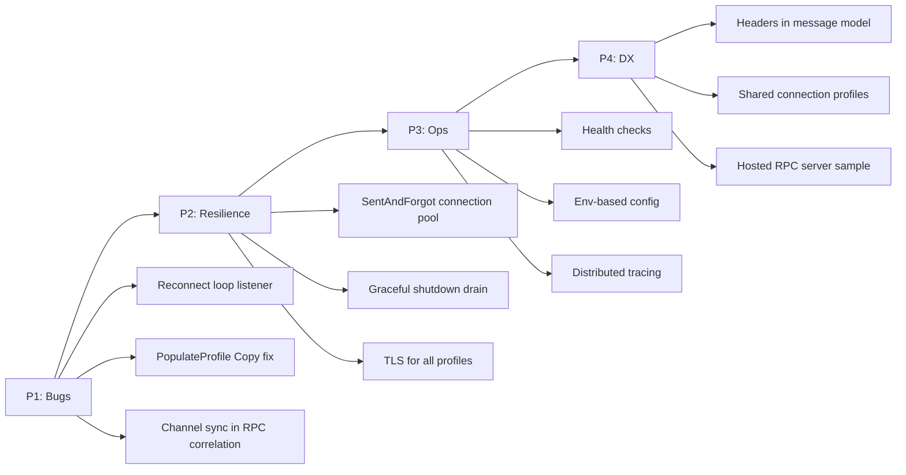

# Полный анализ RabbitMQ в IntegrationFlow

**Статус:** актуально  
**Создан:** 2026-07-04 23:52 (UTC+3)  
**Обновлён:** 2026-07-07 21:03 (UTC+3)  
**Связанные документы:** [`2026-07-04_2338-integration-types-full-report.md`](2026-07-04_2338-integration-types-full-report.md), [`2026-07-04_2234-integrationflow-full-analysis.md`](2026-07-04_2234-integrationflow-full-analysis.md), [`plans/2026-07-04_2130-remaining-risks-mitigation.md`](plans/2026-07-04_2130-remaining-risks-mitigation.md), [`plans/2026-07-06_1445-rabbitmq-g1-g5-mitigation.md`](plans/2026-07-06_1445-rabbitmq-g1-g5-mitigation.md), [`plans/2026-07-06_1519-rabbitmq-p2-resilience-hardening.md`](plans/2026-07-06_1519-rabbitmq-p2-resilience-hardening.md), [`2026-07-06_1456-rabbitmq-g1-g5-implementation-status.md`](2026-07-06_1456-rabbitmq-g1-g5-implementation-status.md), [`2026-07-06_1617-rabbitmq-p2-implementation-status.md`](2026-07-06_1617-rabbitmq-p2-implementation-status.md), [`plans/2026-07-06_1645-rabbitmq-implementation-backlog.md`](plans/2026-07-06_1645-rabbitmq-implementation-backlog.md), [`2026-07-07_2103-rabbitmq-p4-implementation-status.md`](2026-07-07_2103-rabbitmq-p4-implementation-status.md), [`runbooks/2026-07-04_2130-production-adoption.md`](runbooks/2026-07-04_2130-production-adoption.md), [`runbooks/2026-07-04_2130-sentandwait-rpc-adoption.md`](runbooks/2026-07-04_2130-sentandwait-rpc-adoption.md)

Отчёт описывает текущую реализацию RabbitMQ в каркасе IntegrationFlow, сильные стороны, выявленные gaps и приоритизированный roadmap улучшений. Актуален на состояние репозитория после реализации фаз 1–3 SentAndWait RPC.

---

## 1. Обзор

IntegrationFlow покрывает три сценария через `RabbitMQ.Client 6.8.1` и конфигурацию в `rabbitmq.json`:

| Сценарий | Секция конфига | Ключевые классы |
|----------|----------------|-----------------|
| **ReceiveAndProcess** | `RabbitMq` | [`RabbitMqListenerWorker`](../src/IntegrationFlow.Core/Contexts/Integrations/00InnerUsage/RabbitMq/ReceiveAndProcess/Workers/RabbitMqListenerWorker.cs), [`RabbitMqReceivedMessageHandler`](../src/IntegrationFlow.Core/Contexts/Integrations/00InnerUsage/RabbitMq/ReceiveAndProcess/Listeners/RabbitMqReceivedMessageHandler.cs) |
| **SentAndForgot** | `RabbitMqPublish` | [`RabbitMqPublishConnection`](../src/IntegrationFlow.Core/Contexts/Integrations/00InnerUsage/RabbitMq/SentAndForgot/Connections/RabbitMqPublishConnection.cs), [`RabbitMqPublishTransmitter`](../src/IntegrationFlow.Core/Contexts/Integrations/00InnerUsage/RabbitMq/SentAndForgot/Transmitters/RabbitMqPublishTransmitter.cs) |
| **SentAndWait** | `RabbitMqRequestReply` | [`RabbitMqRequestReplyConnection`](../src/IntegrationFlow.Core/Contexts/Integrations/00InnerUsage/RabbitMq/SentAndWait/Connections/RabbitMqRequestReplyConnection.cs), [`RabbitMqReplyPublisher`](../src/IntegrationFlow.Core/Contexts/Integrations/00InnerUsage/RabbitMq/SentAndWait/Reply/RabbitMqReplyPublisher.cs), AsyncOutbox workers |

Общая инфраструктура:

- [`RabbitMqConnectionFactory`](../src/IntegrationFlow.Core/Contexts/Integrations/00InnerUsage/RabbitMq/RabbitMqConnectionFactory.cs) — создание `ConnectionFactory`
- Именованные профили в трёх секциях JSON
- Passive topology validation (`QueueDeclarePassive` / `ExchangeDeclarePassive`)
- Метрики OpenTelemetry ([`IntegrationFlow.Metrics.OpenTelemetry`](../src/IntegrationFlow.Metrics.OpenTelemetry/))
- Integration-тесты на Testcontainers (`rabbitmq:3.13-management`)

```mermaid
flowchart TB
    subgraph consumer [ReceiveAndProcess]
        Q1[Queue] --> LW[RabbitMqListenerWorker]
        LW --> H[RabbitMqReceivedMessageHandler]
        H --> P[ProcessorBase + dedup]
        H -->|ack/nack| Q1
    end

    subgraph producer [SentAndForgot]
        APP[App / Outbox] --> PT[RabbitMqPublishTransmitter]
        PT -->|confirms| Q2[Queue / Exchange]
    end

    subgraph rpc [SentAndWait]
        C[RabbitMqRequestReplyTransmitter] -->|request| RQ[RPC Queue]
        RQ --> S[Server Handler]
        S --> RP[RabbitMqReplyPublisher]
        RP -->|reply| C
    end
```



---

## 2. Что уже сделано хорошо

### 2.1 ReceiveAndProcess (consumer)

| Возможность | Реализация |
|-------------|------------|
| Manual ack после обработки | `autoAck: false`, ack в handler после `ProcessAsync` |
| Async consumer | `AsyncEventingBasicConsumer`, `DispatchConsumersAsync = true` |
| Prefetch / backpressure | `PrefetchCount` + `BasicQos` |
| Retry / DLQ policy | `RequeueOnFailure`, `MaxRetryCount` через header `x-death` |
| Идемпотентность | `IMessageDeduplicationStore`, `MessageProcessingInProgressException` → nack requeue |
| Hosted service (.NET 8+) | `AddIntegrationFlowRabbitMqListener` |

**Гарантия:** at-least-once при корректном handler + dedup.

### 2.2 SentAndForgot (producer)

| Возможность | Реализация |
|-------------|------------|
| Publisher confirms | По умолчанию `PublisherConfirmsEnabled = true` |
| Unroutable detection | `Mandatory` + `BasicReturn` → `UnroutableMessageException` |
| Topology check | Passive declare очереди/exchange |
| Persistence | `DeliveryMode = 2` по умолчанию |
| Transactional Outbox | `OutboxRelayService`, `MessageId = OutboxId` |

**Production default:** outbox + relay, не direct publish после commit БД.

### 2.3 SentAndWait (RPC)

| Режим | Возможности |
|-------|-------------|
| Sync RPC | `DirectReplyTo`, correlation map, `MaxConcurrentRequests`, `ReuseConnection` |
| Server idempotency | `RabbitMqRpcServerPipeline` + `IRequestReplyResponseStore` по `MessageId` |
| AsyncOutbox | `RpcPendingRelayService` + `RabbitMqRpcResponseCorrelationHostedService` |
| Reply performance | `ReuseReplyConnection` (pool channel, default `true`) |

### 2.4 Observability

Метрики: `integrationflow.message.*`, `integrationflow.outbox.*`, `integrationflow.requestreply.*`, `integrationflow.rpc.pending.*`.  
Runbook: [`runbooks/2026-07-04_0845-metrics-and-alerting.md`](runbooks/2026-07-04_0845-metrics-and-alerting.md).

---

## 3. Выявленные gaps и предложения по улучшению

### 3.1 Критичные / корректность (P1)

#### A. Listener завершается при `ConnectionShutdown`, игнорируя `AutomaticRecoveryEnabled`

**Статус:** ✅ Закрыт — reconnect loop в `RabbitMqListenerWorker` (2026-07-06).

Файл: [`RabbitMqListenerWorker.cs`](../src/IntegrationFlow.Core/Contexts/Integrations/00InnerUsage/RabbitMq/ReceiveAndProcess/Workers/RabbitMqListenerWorker.cs)

~~`WaitForShutdownAsync` подписывается на `ConnectionShutdown` и завершает worker.~~ Worker переподключается при `ConnectionShutdown`; выход только по `CancellationToken`.

#### B. Graceful shutdown без ack/nack

**Статус:** ✅ Закрыт — in-flight drain + nack requeue (2026-07-06).

Файл: [`RabbitMqReceivedMessageHandler.cs`](../src/IntegrationFlow.Core/Contexts/Integrations/00InnerUsage/RabbitMq/ReceiveAndProcess/Listeners/RabbitMqReceivedMessageHandler.cs)

#### C. Баг в `PopulateProfile`: не копируются `RequeueOnFailure` и `MaxRetryCount`

**Статус:** ✅ Закрыт — `Copy()` дополнен (2026-07-06).

Файл: [`RabbitMqConfigurationLoader.cs`](../src/IntegrationFlow.Core/Contexts/Integrations/00InnerUsage/RabbitMq/ReceiveAndProcess/Configurations/RabbitMqConfigurationLoader.cs)

#### D. RPC reply consumer с `autoAck: true`

**Статус:** ✅ Закрыт — `ManualReplyAck` (default `false`, opt-in `true`) (2026-07-06).

Файл: [`RabbitMqRequestReplyConnection.cs`](../src/IntegrationFlow.Core/Contexts/Integrations/00InnerUsage/RabbitMq/SentAndWait/Connections/RabbitMqRequestReplyConnection.cs)

#### E. `RabbitMqRpcResponseCorrelationHostedService` — ack без синхронизации channel

**Статус:** ✅ Закрыт — `RabbitMqChannelAcknowledgement` (2026-07-06).

Файл: [`RabbitMqRpcResponseCorrelationHostedService.cs`](../src/IntegrationFlow.Core/Contexts/Integrations/00InnerUsage/RabbitMq/SentAndWait/Response/RabbitMqRpcResponseCorrelationHostedService.cs)

---

### 3.2 Надёжность и production-hardening (P2)

**Статус core:** ✅ Закрыт — [`2026-07-06_1617-rabbitmq-p2-implementation-status.md`](2026-07-06_1617-rabbitmq-p2-implementation-status.md)

| Область | Было | Сейчас |
|---------|------|--------|
| SentAndForgot direct publish | Новое TCP на каждый `Integrate()` | ✅ `ReuseConnection` + `RabbitMqPublishConnectionPool` |
| Publisher confirms на RPC | Только SentAndForgot | ✅ Confirms на request publish (`P2-RPC-C`) |
| Mandatory на RPC reply | Всегда `false` | ✅ Opt-in `ReplyMandatory` + `BasicReturn` |
| Static connection pools | Без shutdown/metrics | ✅ Shutdown hook + gauge `connection.pool.size`; idle eviction — optional |
| TLS | Только `RabbitMqRequestReply` | ✅ `SslEnabled` для listener и publish |
| Health checks | Нет `IHealthCheck` | ⏸ P3 |
| Circuit breaker | Нет | ⏸ P2-CB optional |
| Cluster / HA | Один `HostName` | ⏸ P2-HA optional |

---

### 3.3 Конфигурация и безопасность (P2–P3)

**Сейчас:** только `rabbitmq.json` рядом с приложением; пароли в plain text.

| Улучшение | Описание |
|-----------|----------|
| Environment overlay | `AddEnvironmentVariables()` в loader |
| ASP.NET Core `IConfiguration` | DI вместо file-only loaders |
| Shared connection profile | Убрать дублирование `HostName`/`UserName`/`Password` между тремя секциями |
| AMQPS samples | TLS для всех трёх секций | ✅ README (P2-F); shared profile — P4 |

Пример shared profile:

```json
{
  "RabbitMqConnections": {
    "Prod": { "HostName": "rabbit.prod", "SslEnabled": true }
  },
  "RabbitMq": {
    "Inbox": { "Connection": "Prod", "QueueName": "integration.inbox" }
  }
}
```

---

### 3.4 Observability (P3)

**Уже есть:** counters/histograms для processing, outbox, RPC.

| Добавить | Зачем |
|----------|-------|
| Distributed tracing | Propagate `traceparent` через AMQP headers (`Activity`) |
| Consumer-level метрики | `nack`, `requeue`, `dedup_skip`, `in_progress_requeue` |
| Broker connectivity gauge | Состояние listener/relay workers |
| Structured logging | `MessageId`, `CorrelationId`, `DeliveryTag`, `profile` как поля |

---

### 3.5 API и developer experience (P4)

| Gap | Статус | Комментарий |
|-----|--------|-------------|
| Headers не exposed в `RabbitMqReceivedMessage` | ✅ P4-2 | `Headers` + `RabbitMqMessageHeaders` |
| Priority / expiration AMQP | ✅ P4-5 | `Priority`, `ExpirationMilliseconds` в publish/RPC |
| Hosted listener на netstandard2.0 | ✅ P4-4 | `AddIntegrationFlowRabbitMqListener` на всех TFM |
| Sample hosted RPC server | ✅ P4-3 | `AddIntegrationFlowRabbitMqRpcServer` |
| Consumer tag / exclusive consumer | backlog P4-7 | Ops, single-active-consumer |
| Topology helpers | backlog P4-6 | Opt-in `QueueDeclare` для dev |

---

### 3.6 Семантика доставки (design trade-offs, не баги)

| Сценарий | Семантика | Рекомендация |
|----------|-----------|--------------|
| Sync RPC timeout | At-most-once | `RetryOnTimeout` + stable `MessageId` + server cache |
| Critical business TX | Нельзя полагаться на sync RPC | AsyncOutbox RPC или SentAndForgot + outbox |
| Server ack до reply | Потеря reply после ack | Reply **до** ack; `RabbitMqRpcServerPipeline` |
| `MaxRetryCount` + `x-death` | Работает с DLQ на брокере | Infra: `x-dead-letter-exchange` |
| Outbox relay | At-least-once | Idempotent consumer + dedup |

Подробнее: [`runbooks/2026-07-04_2130-sentandwait-rpc-adoption.md`](runbooks/2026-07-04_2130-sentandwait-rpc-adoption.md), [`plans/2026-07-04_2242-sentandwait-rpc-critical-flows.md`](plans/2026-07-04_2242-sentandwait-rpc-critical-flows.md).

---

### 3.7 Тестирование и CI

**Уже хорошо:** unit-тесты policy/handler, E2E на Testcontainers, mandatory publish tests.

| Усилить | Описание |
|---------|----------|
| Chaos tests | Restart broker mid-processing, connection drop during confirm |
| E2E с DLQ | Реальная топология + `MaxRetryCount` |
| Load test RPC | `MaxConcurrentRequests > 1` |
| Integration gate в release | Gap D2 из [`plans/2026-07-04_0930-post-analysis-roadmap.md`](plans/2026-07-04_0930-post-analysis-roadmap.md) |
| Тест `PopulateProfile` | `RequeueOnFailure` / `MaxRetryCount` не теряются |

---

### 3.8 Технический долг / будущее

- **RabbitMQ.Client v7** — новый async API; запланировать миграцию
- **Delayed retry** — plugin `rabbitmq_delayed_message_exchange` или retry queues
- **Quorum queues / streams** — явная документация совместимости
- **Другие брокеры** — по design out of scope; абстракции (`ITransmitter`, `ListenerBase`) готовы

---

## 4. Приоритизированный roadmap



| Приоритет | Задача | Effort | Impact |
|-----------|--------|--------|--------|
| **P1** | Reconnect loop для listener | 1–2 дн | ✅ Закрыт |
| **P1** | Fix `Copy()` для retry-полей | 0.5 ч | ✅ Закрыт |
| **P1** | Sync ack в correlation service | 0.5 дн | ✅ Закрыт |
| **P2** | Connection pool для SentAndForgot | 1 дн | ✅ Закрыт — [`2026-07-06_1617-rabbitmq-p2-implementation-status.md`](2026-07-06_1617-rabbitmq-p2-implementation-status.md) |
| **P2** | Graceful shutdown | 1 дн | ✅ Закрыт (G2) |
| **P2** | TLS на listener/publish | 0.5 дн | ✅ Закрыт (P2-F) |
| **P2** | RPC confirms + reply mandatory + pool lifecycle | 1–2 дн | ✅ Закрыт (core) |
| **P3** | Health checks + env config | 1 дн | Ops readiness |
| **P3** | OTel tracing через headers | 2 дн | Debuggability |
| **P4** | Headers API, shared profiles | 1–2 дн | DX |

Связь с существующими планами:

| ID в roadmap | Связанный план |
|--------------|----------------|
| PF1 (reply pool) | Закрыт: `ReuseReplyConnection` + `RabbitMqReplyPublisherPool` |
| PF2 (pool eviction) | [`plans/2026-07-04_2130-remaining-risks-mitigation.md`](plans/2026-07-04_2130-remaining-risks-mitigation.md) |
| O3 (tracing) | [`plans/2026-07-04_0930-post-analysis-roadmap.md`](plans/2026-07-04_0930-post-analysis-roadmap.md) |
| SEC1/SEC2 | [`plans/2026-07-04_2130-remaining-risks-mitigation.md`](plans/2026-07-04_2130-remaining-risks-mitigation.md), волна 4 |
| G1–G5 (P1 transport) | [`plans/2026-07-06_1445-rabbitmq-g1-g5-mitigation.md`](plans/2026-07-06_1445-rabbitmq-g1-g5-mitigation.md) — ✅ |
| P2 resilience | [`plans/2026-07-06_1519-rabbitmq-p2-resilience-hardening.md`](plans/2026-07-06_1519-rabbitmq-p2-resilience-hardening.md) — ✅ core |
| P2 status | [`2026-07-06_1617-rabbitmq-p2-implementation-status.md`](2026-07-06_1617-rabbitmq-p2-implementation-status.md) |
| P3+ backlog | [`plans/2026-07-06_1645-rabbitmq-implementation-backlog.md`](plans/2026-07-06_1645-rabbitmq-implementation-backlog.md) — открыт |
| P3 status P3-1…P3-3 | [`2026-07-06_1753-rabbitmq-p3-ops-implementation-status.md`](2026-07-06_1753-rabbitmq-p3-ops-implementation-status.md) — ✅ |

---

## 5. Итог

RabbitMQ-слой в IntegrationFlow **функционально зрелый** для трёх паттернов:

1. **Consumer** — ack после обработки, dedup, retry policy, hosted service
2. **Producer** — publisher confirms, outbox relay, mandatory publish
3. **RPC** — sync + AsyncOutbox, response cache, metrics

**Главные gaps — operational hardening, не отсутствие базовой функциональности:**

1. Listener переживает reconnect — ✅ reconnect loop в worker (G1)
2. TLS для всех профилей — ✅ P2-F; env overlay / shared profiles — P3/P4
3. Connection reuse для SentAndForgot direct publish — ✅ P2-D (`ReuseConnection`)
4. Метрики pool size — ✅ P2-PF; tracing и health checks — P3
5. ~~Мелкий баг: `PopulateProfile` теряет retry-настройки~~ — ✅ закрыт (G3)

Adoption-риски (DLQ topology, server ack order, sync RPC semantics) уже описаны в runbooks — правильный подход для framework-библиотеки.

**Детальный backlog задач:** [`plans/2026-07-06_1645-rabbitmq-implementation-backlog.md`](plans/2026-07-06_1645-rabbitmq-implementation-backlog.md).
