# Полный анализ IntegrationFlow и оценка рисков

**Статус:** актуально (v12)  
**Создан:** 2026-07-05 14:55 (UTC+3)  
**Обновлён:** 2026-07-05 14:55 (UTC+3)  
**Связанные документы:** [`2026-07-04_2234-integrationflow-full-analysis.md`](2026-07-04_2234-integrationflow-full-analysis.md) (superseded, v11), [`2026-07-04_2301-sentandwait-rpc-implementation-status.md`](2026-07-04_2301-sentandwait-rpc-implementation-status.md), [`2026-07-04_2338-integration-types-full-report.md`](2026-07-04_2338-integration-types-full-report.md), [`2026-07-04_2352-rabbitmq-full-analysis.md`](2026-07-04_2352-rabbitmq-full-analysis.md), [`plans/2026-07-04_2130-remaining-risks-mitigation.md`](plans/2026-07-04_2130-remaining-risks-mitigation.md) (код/docs выполнены; NuGet publish — ops)

Актуальное состояние после коммита `d4832ca` (фазы 1–3 SentAndWait RPC: idempotent sync, AsyncOutbox, compensation, maintenance). Локально **153 теста** (97 + 14 + 17 + 22 + 3) — все зелёные в Release, CI на GitHub Actions (unit → integration → pack).

---

## 1. Что это за решение

**IntegrationFlow** — .NET-библиотека для построения интеграций между системами. Три NuGet-пакета:

| Пакет | TFM | Назначение |
|-------|-----|------------|
| `IntegrationFlow.Core` | net8.0 + netstandard2.0 | Каркас, RabbitMQ (3 сценария), outbox, dedup, RPC |
| `IntegrationFlow.EntityFrameworkCore` | net8.0 | Production stores (outbox, dedup, RPC pending, response cache) |
| `IntegrationFlow.Metrics.OpenTelemetry` | net8.0 | Метрики через `System.Diagnostics.Metrics` |

### Зрелость по сценариям

| Паттерн | Статус | Production-ready |
|---------|--------|------------------|
| **ReceiveAndProcess** (consumer) | Высокая | Да, при правильном adoption |
| **SentAndForgot** (producer + outbox) | Высокая | Да, с outbox + EF |
| **SentAndWait Sync RPC** | Высокая | Да для read-only / non-critical; retry-safe с MessageId + response cache |
| **SentAndWait AsyncOutbox RPC** | Высокая | Да для critical TX — pending в той же TX + compensation |
| **SentAndWait** (REST sample) | Низкая | Нет — без гарантий |

### Структура

```
IntegrationFlow/
├── src/IntegrationFlow.Core/
│   └── 00InnerUsage/RabbitMq/
│       ├── ReceiveAndProcess/     # consumer
│       ├── SentAndForgot/         # publisher + outbox relay
│       └── SentAndWait/           # sync RPC + AsyncOutbox workers
├── src/IntegrationFlow.EntityFrameworkCore/
├── src/IntegrationFlow.Metrics.OpenTelemetry/
└── tests/                         # 153 теста (unit + integration)
    ├── IntegrationFlow.Core.Tests                 (97)
    ├── IntegrationFlow.Metrics.OpenTelemetry.Tests (14)
    ├── IntegrationFlow.EntityFrameworkCore.Tests  (17)
    ├── IntegrationFlow.Core.IntegrationTests        (22)
    └── IntegrationFlow.EntityFrameworkCore.IntegrationTests (3)
```

---

## 2. Архитектура

```mermaid
flowchart TB
    subgraph producer [Producer — SentAndForgot]
        TX[Business TX] --> Stage[IOutboxEnqueue.Stage]
        Stage --> Save[SaveChanges]
        Save --> Relay[OutboxRelayService]
        Relay --> Claim[ClaimPending SKIP LOCKED]
        Claim --> Pub["Publish MessageId = OutboxId"]
    end

    subgraph rpcSync [SentAndWait — Sync RPC]
        Client[RabbitMqRequestReplyTransmitter] -->|ReplyTo + CorrelationId| ReqQ[Request queue]
        ReqQ --> Server[ReceiveAndProcess handler]
        Server --> Cache[IRequestReplyResponseStore]
        Server --> Reply[RabbitMqReplyPublisher]
        Reply -->|CorrelationId| Client
    end

    subgraph rpcAsync [SentAndWait — AsyncOutbox RPC]
        AppTx[Business TX] --> Enqueue[EnqueueRpcRequest]
        Enqueue --> Save2[SaveChanges]
        Save2 --> PendingRelay[RpcPendingRelayService]
        PendingRelay --> ReqQ2[Request queue]
        ReqQ2 --> Server2[Server handler]
        Server2 --> RespQ[Response queue]
        RespQ --> Corr[RabbitMqRpcResponseCorrelationHostedService]
        Corr --> Complete[IRpcPendingStore.CompleteAsync]
    end

    subgraph consumer [Consumer — ReceiveAndProcess]
        Host[IHost / legacy BeginReceiving] --> Worker[RabbitMqListenerWorker]
        Worker --> Dedup{IMessageDeduplicationStore?}
        Dedup -->|Duplicate| Skip[Skip + Ack]
        Dedup -->|New| Process[Handler]
        Process -->|OK| Mark[MarkProcessed]
        Process -->|Fail| Release[ReleaseProcessing]
    end
```



### Семантика доставки

| Сценарий | Гарантия | Комментарий |
|----------|----------|-------------|
| ReceiveAndProcess | **At-least-once** | Ack после обработки, dedup |
| SentAndForgot + outbox | **At-least-once** | Outbox TX + relay + confirms |
| SentAndWait Sync RPC | **At-most-once** | Timeout = unknown state; mitigation: MessageId + response cache + retry |
| SentAndWait AsyncOutbox | **At-least-once** (request) | Pending staged в TX; response correlation + compensation |

Ключевые компоненты:

- [`OutboxRelayService`](../src/IntegrationFlow.Core/Contexts/Integrations/03Domain/Outbox/OutboxRelayService.cs)
- [`RabbitMqListenerWorker`](../src/IntegrationFlow.Core/Contexts/Integrations/00InnerUsage/RabbitMq/ReceiveAndProcess/Workers/RabbitMqListenerWorker.cs)
- [`RabbitMqRequestReplyTransmitter`](../src/IntegrationFlow.Core/Contexts/Integrations/00InnerUsage/RabbitMq/SentAndWait/Transmitters/RabbitMqRequestReplyTransmitter.cs)
- [`RabbitMqRequestReplyConnectionPool`](../src/IntegrationFlow.Core/Contexts/Integrations/00InnerUsage/RabbitMq/SentAndWait/Connections/RabbitMqRequestReplyConnectionPool.cs)
- [`RabbitMqReplyPublisherPool`](../src/IntegrationFlow.Core/Contexts/Integrations/00InnerUsage/RabbitMq/SentAndWait/Reply/RabbitMqReplyPublisherPool.cs)
- [`RabbitMqRpcServerPipeline`](../src/IntegrationFlow.Core/Contexts/Integrations/00InnerUsage/RabbitMq/SentAndWait/Reply/RabbitMqRpcServerPipeline.cs)
- [`SentAndWaitIntegration`](../src/IntegrationFlow.Core/Contexts/Integrations/03Domain/SentAndWait/SentAndWaitIntegration.cs)
- [`SentAndWaitAsyncOutboxIntegration`](../src/IntegrationFlow.Core/Contexts/Integrations/03Domain/SentAndWait/SentAndWaitAsyncOutboxIntegration.cs)
- [`RpcPendingRelayService`](../src/IntegrationFlow.Core/Contexts/Integrations/03Domain/RpcPending/RpcPendingRelayService.cs)
- [`RpcPendingCompensationService`](../src/IntegrationFlow.Core/Contexts/Integrations/03Domain/RpcPending/RpcPendingCompensationService.cs)
- [`IntegrationFlowMaintenanceService`](../src/IntegrationFlow.Core/Contexts/Integrations/03Domain/Maintenance/IntegrationFlowMaintenanceService.cs)
- [`EfOutboxStore`](../src/IntegrationFlow.EntityFrameworkCore/Outbox/EfOutboxStore.cs)
- [`EfRpcPendingStore`](../src/IntegrationFlow.EntityFrameworkCore/RpcPending/EfRpcPendingStore.cs)
- [`EfRequestReplyResponseStore`](../src/IntegrationFlow.EntityFrameworkCore/ResponseCache/EfRequestReplyResponseStore.cs)
- [`OpenTelemetryIntegrationFlowMetrics`](../src/IntegrationFlow.Metrics.OpenTelemetry/OpenTelemetryIntegrationFlowMetrics.cs)

Outbox relay использует `MessageId = OutboxId` для идемпотентности consumer при сбое `MarkPublished`:

```122:126:src/IntegrationFlow.Core/Contexts/Integrations/03Domain/Outbox/OutboxRelayService.cs
                        var transmitData = new TransmitData(message.Payload, message.Id.ToString("N"))
                            .WithCorrelationId(message.Id.ToString("N"));

                        transmitter!.TransmitWithResult(transmitData);
                        await outboxStore.MarkPublishedAsync(message.Id, workerId, cancellationToken).ConfigureAwait(false);
```

---

## 3. Что сделано хорошо

### Consumer (ReceiveAndProcess)

- Ack **после** завершения обработки (включая async path)
- Dedup с `ReleaseProcessingAsync`, lock expiry, `InProgress` → nack requeue
- `ReceiveAndProcessHostedService` + graceful shutdown
- Overload без handler удалён; legacy NoOp → nack

### Producer (SentAndForgot)

- Publisher confirms, `IntegrateWithResult()`, `MessageId = OutboxId`
- Transactional outbox + EF SKIP LOCKED claim
- `ReplayAbandonedAsync` + runbook

### SentAndWait RabbitMQ — Sync RPC (P3 + фаза 1)

- `IntegrateAsync()` / `IntegrateWithResultAsync()` с `CancellationToken`
- `IntegrateWithResult()` — typed result вместо только callback
- Concurrent RPC: `MaxConcurrentRequests` (default `1`, `0` = без лимита)
- Connection reuse: `ReuseConnection` + internal pool per profile с health check / eviction
- `ReuseReplyConnection` (default `true`) + `RabbitMqReplyPublisherPool` на server-side
- `DirectReplyTo` (default) + `ExclusiveQueue` fallback
- Idempotent sync: `WithMessageId()`, `RetryOnTimeout`, server `IRequestReplyResponseStore` + `RabbitMqRpcServerPipeline`
- RPC metrics: `RecordRequestReply`, `RecordRequestReplyRetryAfterTimeout`
- Unit + E2E тесты (roundtrip, timeout, parallel requests, retry + cache)

### SentAndWait RabbitMQ — AsyncOutbox (фазы 2–3)

- `RequestMode: AsyncOutbox` — pending staged в той же TX (`EnqueueRpcRequest`)
- `RpcPendingRelayService` + EF SKIP LOCKED claim (PostgreSQL / SQL Server / SQLite)
- `RabbitMqRpcResponseCorrelationHostedService` — response queue → `CompleteAsync`
- High-level API: `CreateSentAndWaitAsyncOutboxIntegration`, `WaitForCompletionAsync`
- Compensation: `IRpcCompensationHandler`, `OutboxRpcCompensationHandler`
- Maintenance: purge terminal pending + expired response cache
- Metrics: `integrationflow.rpc.pending.*`
- Runbooks: RPC pending replay, RPC adoption

### Observability и distribution

- `IntegrationFlow.Metrics.OpenTelemetry` — consumer/outbox/RPC/rpc.pending metrics + runbook алертов
- CI: unit → integration → pack
- `release.yml` с integration gate перед pack (нужен `NUGET_API_KEY` для publish)
- Runbooks: production adoption, RPC adoption, metrics, NuGet release, rpc pending replay

### Тесты и CI

- **153 теста**, E2E critical path + legacy + RPC roundtrip + parallel async + AsyncOutbox + compensation

---

## 4. Матрица рисков

### Высокий приоритет — фундаментальные (inherent)

| # | Риск | Сценарий | Mitigation |
|---|------|----------|------------|
| 1 | Publish OK → MarkPublished fail | SentAndForgot | `MessageId = OutboxId`; идемпотентный consumer |
| 2 | MarkProcessed fail после успешной обработки | ReceiveAndProcess | Идемпотентные handlers |
| 3 | Direct publish без outbox | SentAndForgot | `IOutboxEnqueue` в той же TX |
| 4 | Dedup без MessageId | ReceiveAndProcess | Всегда задавать `MessageId` |
| **R1** | **Timeout после publish, server обработал** | **Sync SentAndWait** | **Mitigated:** `WithMessageId` + response cache + `RetryOnTimeout`; или **AsyncOutbox** |
| **R2** | **Reply publish fail после обработки** | **Sync SentAndWait** | **Mitigated:** response cache + client retry; server dedup по MessageId |

Inherent-риски **#1–#4** по-прежнему требуют правильного adoption. **R1/R2** для sync RPC mitigated каркасом; для critical flows — использовать **AsyncOutbox**.

### Высокий приоритет — adoption / API

| # | Риск | Статус | Комментарий |
|---|------|--------|-------------|
| **A** | NoOp handler — ack без обработки | **Закрыт (hosted)** | Overload без handler удалён |
| **A′** | Legacy default NoOp processor | **Закрыт** | `GetInboxMessageProcessing` → null → nack |
| **B** | Ограниченный public API | **Закрыт** | RPC: public `RabbitMqReplyPublisher` |
| **R3** | Exception глотается без `ThrowOnFailure` | **Открыт (adoption)** | Есть `IntegrateWithResult()`, но default `ThrowOnFailure=false` |
| **R4** | Server ack до reply | **Открыт (adoption)** | Handler должен reply **до** return из Process |

### Средний приоритет

| # | Риск | Статус | Кратко |
|---|------|--------|--------|
| 5 | Prefetch > 1 + concurrent handler | Открыт | Race в non-thread-safe handlers |
| 6 | Hosted worker только net8.0 | Открыт | netstandard2.0 — manual paths |
| 7 | EF dedup — отдельный DbContext | By design | Не атомарен с business TX |
| 8 | InMemory stores в samples | Открыт | Copy-paste в prod → потеря данных |
| 9 | Mandatory timeout 100ms | Открыт | SentAndForgot topology misconfig |
| 10 | Abandoned outbox | **Закрыт (ops)** | `ReplayAbandonedAsync` + runbook |
| 10′ | Abandoned RPC pending | **Закрыт (ops)** | `ReplayAbandonedAsync` + runbook |
| **R5** | Один in-flight RPC на transmitter | **Закрыт** | `MaxConcurrentRequests` + correlation map |
| **R6** | ReplyPublisher — новое соединение на reply | **Закрыт** | `ReuseReplyConnection` + pool (default `true`) |
| **R7** | Нет metrics для RPC | **Закрыт** | `RecordRequestReply` + rpc.pending metrics |
| **R8** | Нет `IntegrateWithResult()` для SentAndWait | **Закрыт** | Реализовано в `eee98f8` |
| **R9** | DirectReplyTo требует RabbitMQ ≥ 3.4 | By design | Fallback: `ExclusiveQueue` |
| **A3** | Sync-over-async в `Integrate()` | Открыт | Runbook; использовать `IntegrateAsync` |
| **A5** | Connection pool без eviction | **Закрыт** | Health check + `ForceDispose` / `Invalidate` в pool |
| 15 | Release без integration tests | **Закрыт** | `release.yml` — integration gate |
| 21 | NuGet не опубликован | Открыт (ops) | Workflow готов; нужен tag + API key |

### Низкий приоритет / техдолг

| # | Риск | Статус |
|---|------|--------|
| 16 | Sync-over-async в legacy paths | Остаётся |
| 17 | DLQ не создаётся runtime | Осознанно — ops responsibility |
| 18 | REST SentAndWait sample | Legacy, без гарантий |
| 19 | `IntegrationScheduler` | Dead code |
| 20 | Нет distributed tracing | Только metrics hooks |
| **R10** | ExclusiveQueue leak при crash | Mitigated — `DirectReplyTo` default |

### RabbitMQ transport gaps (см. [`2352-rabbitmq-full-analysis.md`](2026-07-04_2352-rabbitmq-full-analysis.md))

| # | Gap | Приоритет | Статус |
|---|-----|-----------|--------|
| G1 | Listener завершается при `ConnectionShutdown` | P1 | Открыт |
| G2 | Graceful shutdown без ack/nack in-flight | P1 | Открыт |
| G3 | `PopulateProfile` не копирует retry-настройки | P1 | Открыт |
| G4 | RPC reply consumer `autoAck: true` | P1 | Открыт |
| G5 | AsyncOutbox correlation ack без lock channel | P1 | Открыт |

### Безопасность

| # | Риск | Описание | Статус |
|---|------|----------|--------|
| S1 | Credentials в `rabbitmq.json` | Plain JSON — нужен secrets manager | Частично — README + env vars |
| S2 | Нет TLS samples | AMQPS не продемонстрирован | Частично — AMQPS sample в README |
| S3 | Guest credentials по умолчанию | Ок для dev, опасно для prod | By design для dev |

---

## 5. Оценка по критериям

| Критерий | Оценка | Комментарий |
|----------|--------|-------------|
| **Архитектура** | **9/10** | Outbox, dedup, sync + AsyncOutbox RPC, compensation |
| **Delivery guarantees (async paths)** | **~98%** | ReceiveAndProcess + SentAndForgot + AsyncOutbox RPC зрелые |
| **Production readiness (ReceiveAndProcess)** | **Да, при adoption** | Outbox TX + EF + dedup + DLQ |
| **Production readiness (SentAndForgot)** | **Да, при adoption** | Outbox + EF + confirms |
| **Production readiness (SentAndWait Sync RPC)** | **Да, при adoption** | Idempotent retry + response cache; не для critical TX без AsyncOutbox |
| **Production readiness (SentAndWait AsyncOutbox)** | **Да, при adoption** | Pending TX + relay + compensation + maintenance |
| **Public API / ergonomics** | **8/10** | Async + `IntegrateWithResult` + AsyncOutbox API |
| **Тестовое покрытие** | **8/10** | 153 теста, E2E + parallel RPC + AsyncOutbox |
| **Документация** | **8/10** | README, plans, runbooks, analysis v12 |
| **Observability** | **9/10** | Metrics consumer/outbox/RPC/rpc.pending; runbook алертов |
| **Распространение** | **7/10** | CI pack работает; NuGet publish не выполнен |

---

## 6. Обязательные условия для production

### ReceiveAndProcess + SentAndForgot

1. **Outbox через `IOutboxEnqueue`** в той же TX, что business-данные
2. **EF stores** — не InMemory
3. **Идемпотентные handlers** + **`MessageId`** на всех сообщениях
4. **DLQ на брокере** для poison messages
5. **Явный business handler** — hosted или custom processor side
6. **Мониторинг**: `AddIntegrationFlowOpenTelemetryMetrics()` + алерты
7. **Secrets management** — не хранить пароли в plain JSON

Runbook: [`runbooks/2026-07-04_2130-production-adoption.md`](runbooks/2026-07-04_2130-production-adoption.md).

### SentAndWait Sync RPC (read-only / non-critical)

1. **`SentAndWaitIntegrationOptions.ThrowOnFailure = true`** или явная обработка `IntegrateWithResult().TimedOut`
2. **`WithMessageId(businessKey)`** + **`RetryOnTimeout = true`** + server response cache (`IRequestReplyResponseStore`)
3. **Reply до return из Process** — иначе ack без ответа
4. **`ResponseTimeoutSeconds`** с запасом под p99 latency
5. В ASP.NET Core — **`IntegrateAsync()`**, не sync `Integrate()`
6. Для нагрузки: `ReuseConnection=true`, `MaxConcurrentRequests` > 1

Runbook: [`runbooks/2026-07-04_2130-sentandwait-rpc-adoption.md`](runbooks/2026-07-04_2130-sentandwait-rpc-adoption.md).

### SentAndWait AsyncOutbox RPC (critical transactional flows)

1. **`RequestMode: AsyncOutbox`** + **`ResponseQueueName`** в конфиге
2. **`EnqueueRpcRequest`** в той же TX, что business-данные
3. **EF pending store** — `AddIntegrationFlowEfRpcPending<TContext>()`
4. Workers: `AddIntegrationFlowRpcPendingRelay`, `AddIntegrationFlowRabbitMqRpcResponseCorrelation`
5. **Compensation** для timeout/failure: `AddIntegrationFlowEfOutboxRpcCompensation` + `AddIntegrationFlowRpcPendingCompensation`
6. **Maintenance**: `AddIntegrationFlowMaintenance` (purge terminal pending + expired cache)
7. **Мониторинг**: `integrationflow.rpc.pending.*` + runbook abandoned replay

Runbooks: [`runbooks/2026-07-04_2130-sentandwait-rpc-adoption.md`](runbooks/2026-07-04_2130-sentandwait-rpc-adoption.md), [`runbooks/2026-07-04_2315-rpc-pending-replay.md`](runbooks/2026-07-04_2315-rpc-pending-replay.md).

---

## 7. Рекомендуемые следующие шаги

| P | Задача | Статус |
|---|--------|--------|
| **P3** | Закрытие главных оставшихся рисков (v1.0) | **Код/docs выполнены**; NuGet publish — ops |
| **P3** | RPC metrics, async, pools, runbooks, release gate | **Закрыт** |
| **P4** | SentAndWait RPC critical flows (R1/R2) | **Закрыт** — фазы 1–3 ✅ — [`2026-07-04_2301-sentandwait-rpc-implementation-status.md`](2026-07-04_2301-sentandwait-rpc-implementation-status.md) |
| **P3** | NuGet publish (`NUGET_API_KEY` + tag) | **Открыт — ops** |
| **P3** | Distributed tracing | **Открыт — optional** |
| **P1** | RabbitMQ transport gaps (G1–G5) | **Открыт** — [`2026-07-04_2352-rabbitmq-full-analysis.md`](2026-07-04_2352-rabbitmq-full-analysis.md) |

План: [`plans/2026-07-04_2130-remaining-risks-mitigation.md`](plans/2026-07-04_2130-remaining-risks-mitigation.md).

---

## 8. Итоговый вывод

Проект **архитектурно зрелый** для RabbitMQ-интеграций. После `d4832ca` закрыты P3 и P4: sync RPC hardening (idempotent retry), AsyncOutbox для critical flows, compensation, maintenance, rpc.pending metrics.

**Blockers сняты** на уровне функциональности для всех трёх RabbitMQ-сценариев и обоих режимов SentAndWait. Единственный ops-blocker до v1.0 — **публикация на NuGet** (`git tag v1.0.0 && git push origin v1.0.0` + `NUGET_API_KEY`).

### Главные оставшиеся риски

| Категория | Главный риск | Severity |
|-----------|--------------|----------|
| **Adoption** | `ThrowOnFailure=false` по умолчанию; server должен reply до ack | Высокий |
| **Sync RPC без adoption** | Timeout без MessageId/cache → unknown state | Высокий (mitigated при правильном adoption) |
| **RabbitMQ transport** | Reconnect, graceful shutdown, channel races (G1–G5) | Средний–высокий |
| **Operations** | NuGet не опубликован | Средний |
| **Async adoption** | Sync `Integrate()` в ASP.NET → thread pool starvation | Средний |
| **Security** | Plain credentials в dev defaults | Средний (при правильном adoption — низкий) |

### Рекомендации по выбору паттерна

| Задача | Паттерн |
|--------|---------|
| Critical async flows (заказы, платежи) | **SentAndForgot + outbox + EF** или **SentAndWait AsyncOutbox + EF pending** |
| Sync query/command, read-only | **SentAndWait Sync RPC** + MessageId + response cache + `IntegrateAsync` |
| Fire-and-forget без TX | SentAndForgot direct publish (осознанный trade-off) |

Direct publish без outbox, отсутствие `MessageId`, sync RPC без idempotent server/cache для critical flows и AsyncOutbox без compensation — **осознанные anti-patterns**, не дефекты каркаса.
