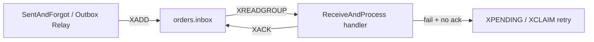

# Варианты интеграций с Redis в IntegrationFlow

**Статус:** актуально  
**Создан:** 2026-07-13 21:28 (UTC+3)  
**Обновлён:** 2026-07-13 21:28 (UTC+3)  
**Связанные документы:** [`2026-06-20_2150-brokers-for-integration-framework.md`](2026-06-20_2150-brokers-for-integration-framework.md), [`2026-07-04_2338-integration-types-full-report.md`](2026-07-04_2338-integration-types-full-report.md), [`2026-07-05_1455-integrationflow-full-analysis.md`](2026-07-05_1455-integrationflow-full-analysis.md), [`2026-07-06_1519-remaining-backlog-summary.md`](2026-07-06_1519-remaining-backlog-summary.md)

---

## Итог

**Сейчас:** готового Redis-транспорта в IntegrationFlow **нет**. Реализованы **RabbitMQ** и **REST**. Redis упоминается в документации как кандидат (Redis Streams); в коде — только как возможная реализация вспомогательных store (dedup, cache).

Redis можно использовать в двух ролях:

1. **Как транспорт** — новый адаптер `00InnerUsage/Redis/` по образцу RabbitMQ.
2. **Как инфраструктурный слой** — dedup, RPC cache, distributed locks через существующие интерфейсы каркаса.

---

## 1. Паттерны IntegrationFlow × возможности Redis

| Паттерн IntegrationFlow | Redis-механизм | Реализуемость | Гарантии |
|-------------------------|----------------|---------------|----------|
| **ReceiveAndProcess** | **Redis Streams** + consumer groups + `XACK` | Лучший fit | At-least-once |
| **SentAndForgot** (direct) | `XADD` в Stream или Pub/Sub | Streams — да; Pub/Sub — только notify | Streams: at-least-once; Pub/Sub: at-most-once |
| **SentAndForgot + outbox** | Outbox в БД → relay → `XADD` | Да (relay публикует в Redis) | At-least-once |
| **SentAndWait Sync** | Request stream + reply stream + `CorrelationId` | Возможно, сложнее RabbitMQ | At-most-once (timeout = unknown) |
| **SentAndWait AsyncOutbox** | Pending в БД → relay → Stream; callback/correlation | Частично через Streams | At-least-once для request |
| **Dedup / idempotency** | `SET key NX EX ttl` | Через `IMessageDeduplicationStore` | — |
| **RPC response cache** | `SET` + TTL | Через `IRequestReplyResponseStore` | — |
| **REST client cache** | `SET` + TTL | Через `IRestClientResponseCache` | — |

---

## 2. Варианты по примитивам Redis

### 2.1 Redis Streams — основной кандидат для транспорта

Наиболее естественное соответствие inbox-паттерну каркаса:



**ReceiveAndProcess:**

- `XREADGROUP BLOCK` — long-poll consumer
- `XACK` — manual ack после обработки
- `XPENDING` / `XCLAIM` — retry зависших сообщений (аналог requeue)
- Consumer groups — горизонтальное масштабирование
- `MessageId` → ID записи в stream или поле payload

**SentAndForgot:**

- `XADD stream * field payload` — fire-and-forget
- С outbox: `OutboxRelayService` → `RedisStreamsPublishTransmitter` (по аналогии с REST/RabbitMQ)

**SentAndWait Sync RPC:**

- Request stream + reply stream
- Client: `XADD` request + `XREAD` reply по `CorrelationId`
- Server: consumer group на request stream → `XADD` reply
- Сложнее, чем RabbitMQ `DirectReplyTo`; нет встроенного request-reply

**Ограничения:**

- DLQ — вручную (отдельный stream или политика `XDEL` + dead stream)
- Нет publisher confirms (в отличие от RabbitMQ)
- Размер сообщения ограничен (теоретически до ~512 MB, на практике меньше)
- Trimming (`MAXLEN`) — нужно продумать retention

### 2.2 Redis Pub/Sub — только уведомления

| Паттерн | Подходит? |
|---------|-----------|
| SentAndForgot (notify, без гарантий) | Да |
| ReceiveAndProcess | **Нет** — нет persistence, нет ack |
| Outbox relay | **Нет** — потеря при offline consumer |

Подходит для «сигналов» (invalidate cache, wake worker), не для бизнес-событий.

### 2.3 Redis Lists (RPUSH / BLPOP) — простая очередь

Классический work queue:

```
Producer: RPUSH queue payload
Consumer: BLPOP queue → process → (ack = удаление из списка)
```

| Плюсы | Минусы |
|-------|--------|
| Простота | Нет consumer groups |
| Минимальный overhead | Сложный retry (нужен отдельный processing list) |
| | Нет встроенного DLQ |
| | Слабее Streams для production |

Для IntegrationFlow предпочтительнее **Streams**, не Lists.

### 2.4 Redis как хранилище (не транспорт)

Можно подключить **сегодня**, без нового транспорта — реализовать интерфейсы каркаса:

| Интерфейс | Роль | Redis-паттерн |
|-----------|------|---------------|
| [`IMessageDeduplicationStore`](../src/IntegrationFlow.Core/Contexts/Integrations/03Domain/ReceiveAndProcess/Deduplication/IMessageDeduplicationStore.cs) | Dedup входящих (RMQ, REST webhooks) | `SET msg:{id} processing NX EX 300` → `SET processed` |
| [`IRequestReplyResponseStore`](../src/IntegrationFlow.Core/Contexts/Integrations/03Domain/SentAndWait/ResponseCache/IRequestReplyResponseStore.cs) | Idempotent RPC server | `SET rpc:{messageId} response EX ttl` |
| [`IRestClientResponseCache`](../src/IntegrationFlow.Core/Contexts/Integrations/00InnerUsage/Rest/SentAndWait/Cache/IRestClientResponseCache.cs) | Retry-safe REST SentAndWait | `SET rest:{id} body EX ttl` |

**Важно:** outbox (`IOutboxStore`) и RPC pending (`IRpcPendingStore`) **не заменяются Redis** — им нужна атомарность с business TX в той же БД. Redis здесь только как distributed cache/dedup **рядом** с EF.

---

## 3. Что можно организовать на практике

### 3.1 Сейчас (без разработки транспорта)

| Сценарий | Как |
|----------|-----|
| Dedup для RabbitMQ/REST consumer | Свой `RedisMessageDeduplicationStore : IMessageDeduplicationStore` |
| RPC response cache (multi-instance server) | `RedisRequestReplyResponseStore : IRequestReplyResponseStore` |
| REST retry cache | `RedisRestClientResponseCache : IRestClientResponseCache` |
| Distributed lock для relay workers | Redlock поверх существующих SKIP LOCKED workers (опционально) |

### 3.2 После реализации `00InnerUsage/Redis/`

| Сценарий | Паттерн | Конфиг (гипотетически) |
|----------|---------|------------------------|
| Inbox-события от другого сервиса | ReceiveAndProcess | `RedisStreams: OrdersInbox: StreamName=orders.inbox` |
| Fire-and-forget события | SentAndForgot | `RedisStreamsPublish: EventsOut` |
| События с гарантией «БД + событие» | SentAndForgot + outbox | EF outbox → relay → Redis Stream |
| Sync query между сервисами | SentAndWait Sync | Request/reply streams (non-critical) |
| Critical TX + async ответ | SentAndWait AsyncOutbox | EF pending + relay → Stream; correlation через reply stream |

Целевая структура адаптера — по образцу RabbitMQ из [`2026-06-20_2150-brokers-for-integration-framework.md`](2026-06-20_2150-brokers-for-integration-framework.md):

```
00InnerUsage/Redis/
├── ReceiveAndProcess/   # RedisStreamsListener, XREADGROUP + XACK
├── SentAndForgot/       # RedisStreamsPublishTransmitter (XADD)
├── SentAndWait/         # request/reply streams (опционально)
└── Configurations/      # redis.json
```

Интеграция с существующими relay:

- `OutboxTransportResolver` — добавить профиль `RedisStreamsPublish` (аналог `RestPublish` / `RabbitMqPublish`)
- `RpcPendingTransportResolver` — добавить Redis для AsyncOutbox (аналог REST/RabbitMQ)

---

## 4. Когда Redis имеет смысл

| Выбирайте Redis | Лучше RabbitMQ / другой брокер |
|-----------------|--------------------------------|
| Redis уже в инфраструктуре (cache, sessions) | Нужны DLQ, routing, exchanges из коробки |
| Небольшой/средний объём событий | Высокая надёжность enterprise messaging |
| Нужен минимальный ops overhead | Сложный request-reply sync RPC |
| Event log с replay (Streams) | Transactional outbox как единственное хранилище |
| Dedup/cache в multi-instance deployment | Только Pub/Sub без persistence |

---

## 5. Риски при использовании Redis

| Риск | Mitigation |
|------|------------|
| Потеря данных при crash без AOF/RDB | Включить persistence; для critical — outbox в БД |
| Pub/Sub без гарантий | Не использовать для business events |
| Нет атомарности outbox + Redis в одной TX | Outbox остаётся в EF/SQL; Redis — только target relay |
| `XACK` после обработки, но crash до ack | At-least-once + `IMessageDeduplicationStore` |
| Memory pressure | `MAXLEN ~`, TTL, мониторинг `used_memory` |
| Single-node Redis | Sentinel/Cluster для HA |

---

## 6. Рекомендуемая стратегия

### Быстрый старт (без нового транспорта)

1. RabbitMQ/REST — основной транспорт (уже есть).
2. Redis — `IMessageDeduplicationStore` и RPC/REST cache для multi-instance.

### Полноценный Redis-транспорт (backlog)

| Приоритет | Задача | Effort |
|-----------|--------|--------|
| **P0** | Redis Streams ReceiveAndProcess (listener + XACK) | Средний |
| **P1** | SentAndForgot `XADD` + outbox relay resolver | Средний |
| **P2** | Redis dedup/cache package (StackExchange.Redis) | Низкий |
| **P3** | SentAndWait Sync (request/reply streams) | Высокий |
| **P3** | AsyncOutbox correlation через Streams | Высокий |

1. Начать с **Redis Streams + ReceiveAndProcess** — лучший ROI.
2. Добавить **SentAndForgot** (`XADD`) + интеграция в `OutboxTransportResolver`.
3. **SentAndWait Sync** — только если нет RabbitMQ; для critical flows — AsyncOutbox через БД, не sync Redis RPC.

---

## 7. Связь с gap-листом проекта

Redis Streams входит в явный gap «другие брокеры» — см. [`2026-07-04_2338-integration-types-full-report.md`](2026-07-04_2338-integration-types-full-report.md) §6. Redis store (dedup/cache) — backlog v1.1, см. [`2026-07-06_1519-remaining-backlog-summary.md`](2026-07-06_1519-remaining-backlog-summary.md).
