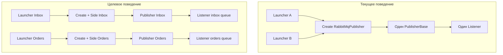

# План: несколько конфигураций RabbitMQ для ReceiveAndProcess

**Статус:** выполнено  
**Создан:** 2026-06-20 22:24 (UTC+3)  
**Обновлён:** 2026-06-20 23:10 (UTC+3)  
**Цель:** поддержать несколько именованных профилей подключения к RabbitMQ в `rabbitmq.json` и параллельный запуск нескольких listener-ов.

---

## Проблема

Сейчас [`RabbitMqConfigurationLoader`](../../src/IntegrationFlow.Core/Contexts/Integrations/00InnerUsage/RabbitMq/ReceiveAndProcess/Configurations/RabbitMqConfigurationLoader.cs) читает одну секцию `"RabbitMq"` как плоский объект, а [`SampleRabbitMqConfiguration`](../../src/IntegrationFlow.Core/Contexts/Integrations/00Samples/ReceiveAndProcess/SampleRabbitMqReceiveAndProcessLauncher.cs) загружает единственный профиль.

Дополнительное ограничение: [`TypeCollection<T>`](../../src/IntegrationFlow.Core/Contexts/Integrations/03Domain/ReceiveAndProcess/TypeCollection.cs) кеширует publisher **только по типу publisher-а**, поэтому два launcher-а с одним `RabbitMqPublisher`, но разными конфигурациями, получат **один и тот же экземпляр** — параллельное прослушивание нескольких очередей сейчас невозможно.



---

## Целевой формат конфигурации

Расширить [`rabbitmq.json`](../../src/IntegrationFlow.Core/Contexts/Integrations/00Samples/ReceiveAndProcess/rabbitmq.json) до именованного словаря, сохранив обратную совместимость с текущим плоским форматом:

```json
{
  "RabbitMq": {
    "Inbox": {
      "HostName": "localhost",
      "QueueName": "integration.inbox",
      "ClientProvidedName": "IntegrationFlow.InboxListener"
    },
    "Orders": {
      "HostName": "localhost",
      "QueueName": "orders.inbox",
      "ClientProvidedName": "IntegrationFlow.OrdersListener"
    }
  }
}
```

- **Новый формат**: ключи `Inbox`, `Orders` — имена профилей подключения.
- **Старый формат** (плоский объект с `HostName`, `QueueName` на уровне `RabbitMq`) продолжит работать; профиль получит имя `DefaultProfileName` (см. ниже).

### Детекция формата (whitelist)

Не полагаться на неформальную эвристику — использовать явный whitelist свойств подключения в [`RabbitMqConfigurationLoader`](../../src/IntegrationFlow.Core/Contexts/Integrations/00InnerUsage/RabbitMq/ReceiveAndProcess/Configurations/RabbitMqConfigurationLoader.cs):

```csharp
private static readonly HashSet<string> ConnectionPropertyNames = new(StringComparer.OrdinalIgnoreCase)
{
    nameof(RabbitMqConfiguration.HostName),
    nameof(RabbitMqConfiguration.Port),
    nameof(RabbitMqConfiguration.UserName),
    nameof(RabbitMqConfiguration.Password),
    nameof(RabbitMqConfiguration.VirtualHost),
    nameof(RabbitMqConfiguration.QueueName),
    nameof(RabbitMqConfiguration.PrefetchCount),
    nameof(RabbitMqConfiguration.Asynchronously),
    nameof(RabbitMqConfiguration.AutomaticRecoveryEnabled),
    nameof(RabbitMqConfiguration.ClientProvidedName),
};
```

**Правило:**

- если у секции `RabbitMq` есть **хотя бы один** дочерний ключ из whitelist — **legacy flat config** (один профиль `Default`);
- иначе дочерние секции (`Inbox`, `Orders`, …) — **именованные профили** (bind каждой секции в `RabbitMqConfiguration`, `Name` = имя ключа).

**Edge case:** не называть профили именами из whitelist (`HostName`, `Port`, …) — это ломает детекцию.

### Константа legacy-имени

```csharp
public const string DefaultProfileName = "Default";
```

Использовать в loader, тестах и документации вместо строкового литерала.

---

## API загрузчика (без конфликта имён)

> **Исправлено (критическая проблема 1):** ранее `Load(string)` означал путь к файлу. Для профилей по имени нужен отдельный метод — иначе `Load("Inbox")` неоднозначен.

| Метод | Назначение | Статус |
|-------|------------|--------|
| `Load()` | Один профиль из `rabbitmq.json` по умолчанию | **реализовано** |
| `LoadSingle(string filePath)` | Единственный профиль из указанного файла | **реализовано** |
| `LoadFromFile(string filePath)` | Legacy flat config из указанного файла | **реализовано** |
| `Load(string filePath)` | Obsolete → `LoadFromFile` | **deprecated** |
| `LoadProfile(string profileName)` | Профиль по имени из default-файла | **реализовано** |
| `LoadProfile(string profileName, string filePath)` | Профиль по имени из указанного файла | **реализовано** |
| `LoadAll(string? filePath = null)` | Все именованные профили | **реализовано** |
| `Populate(RabbitMqConfiguration target)` | Единственный профиль из default-файла | **реализовано** |
| `PopulateFromFile(RabbitMqConfiguration target, string filePath)` | Legacy flat из указанного файла | **реализовано** |
| `Populate(RabbitMqConfiguration target, string filePath)` | Obsolete → `PopulateFromFile` | **deprecated** |
| `PopulateProfile(RabbitMqConfiguration target, string profileName)` | По имени профиля из default-файла | **реализовано** |
| `PopulateProfile(RabbitMqConfiguration target, string profileName, string filePath)` | По имени профиля из указанного файла | **реализовано** |

### Поведение `LoadFromFile` после multi-config

> **Важно:** `LoadFromFile` **не** предназначен для named-формата.

| Формат файла | Поведение `LoadFromFile` |
|--------------|--------------------------|
| Legacy flat | Bind секции `RabbitMq`, `Name = DefaultProfileName` |
| Named (несколько профилей) | `InvalidOperationException` («файл содержит именованные профили — используйте `LoadProfile` или `LoadAll`») |

`LoadFromFile` остаётся для обратной совместимости и загрузки **одного плоского** профиля из произвольного пути.

### Поведение `Load()` после multi-config

- legacy flat или **один** именованный профиль → вернуть его (для single named — вернуть единственный профиль с его `Name`);
- **несколько** именованных профилей → `InvalidOperationException` («используйте `LoadProfile(name)`»);
- не выбирать первый профиль молча.

### Ошибки

- `LoadProfile("Unknown")` → `InvalidOperationException`;
- `LoadFromFile` на named-файле → `InvalidOperationException`;
- пустой файл / нет профилей → исключение при загрузке.

---

## Изменения в коде

### 1. Модель конфигурации

В [`RabbitMqConfiguration`](../../src/IntegrationFlow.Core/Contexts/Integrations/00InnerUsage/RabbitMq/ReceiveAndProcess/Configurations/RabbitMqConfiguration.cs) добавить:

```csharp
public string Name { get; set; } = string.Empty;
```

В loader добавить `DefaultProfileName` и обновить `Copy()` — копировать `Name`.

### 2. Загрузчик конфигураций

Расширить [`RabbitMqConfigurationLoader`](../../src/IntegrationFlow.Core/Contexts/Integrations/00InnerUsage/RabbitMq/ReceiveAndProcess/Configurations/RabbitMqConfigurationLoader.cs):

- `LoadProfile`, `LoadAll`, `PopulateProfile`, `PopulateFromFile`;
- private `ResolveProfiles(IConfigurationRoot)` — детекция формата по whitelist;
- obsolete `Populate(target, filePath)` → `PopulateFromFile`.

### 3. Исправление singleton publisher-а

> **Критическая проблема 2:** ключа `{PublisherType}|{SideType}` **недостаточно** для `NamedRabbitMqIntegrationPublisherSide`.

Ключ кеша в [`TypeCollection.cs`](../../src/IntegrationFlow.Core/Contexts/Integrations/03Domain/ReceiveAndProcess/TypeCollection.cs):

```
{PublisherType}|{SideType}|{ConfigurationName}
```

#### Контракт `ConfigurationName` для TypeCollection

Не использовать reflection. Источник имени профиля — **только** [`RabbitMqIntegrationPublisherSideBase`](../../src/IntegrationFlow.Core/Contexts/Integrations/00InnerUsage/RabbitMq/ReceiveAndProcess/RabbitMqIntegrationPublisherSideBase.cs):

```csharp
internal abstract class RabbitMqIntegrationPublisherSideBase : IntegrationPublisherSideBase
{
    /// <summary>
    /// Имя профиля в rabbitmq.json. Для legacy side без профиля — <see cref="RabbitMqConfigurationLoader.DefaultProfileName"/>.
    /// </summary>
    protected abstract string ConfigurationName { get; }
}
```

`PublisherBase.Create` при вычислении ключа:

- если `integrationPublisherSide` — `RabbitMqIntegrationPublisherSideBase rabbitSide` → `rabbitSide.ConfigurationName`;
- иначе для generic Create&lt;TPublisher, TSide&gt; — `Activator.CreateInstance<TSide>()` и cast к `RabbitMqIntegrationPublisherSideBase` (для RabbitMQ side это всегда наследник);
- fallback: `DefaultProfileName`.

Для legacy [`SampleRabbitMqIntegrationPublisherSide`](../../src/IntegrationFlow.Core/Contexts/Integrations/00Samples/ReceiveAndProcess/SampleRabbitMqReceiveAndProcessLauncher.cs) после миграции на named-формат — заменить на side с явным `ConfigurationName` (см. миграция sample).

В [`PublisherBase.Create`](../../src/IntegrationFlow.Core/Contexts/Integrations/03Domain/ReceiveAndProcess/PublisherBase.cs):

- передавать составной ключ в `GetOrAdd`;
- перегрузка с явным side-экземпляром:

```csharp
public static PublisherBase Create<TPublisherBase>(
    IIntegrationLogger logger,
    IntegrationPublisherSideBase integrationPublisherSide)
    where TPublisherBase : PublisherBase, new()
```

### 4. ProcessorBase singleton

> **Критическая проблема 3:** `ProcessorBase` тоже singleton по типу; `Configuration`/`Publisher` фиксируются при первом создании.

Для v1 допустимо (обработка — `NoOpInboxMessageProcessing`). При появлении реальной бизнес-логики per queue:

- ключ `{ProcessorType}|{PublisherIdentity}`, или
- обновление `Configuration`/`Publisher` при каждом `GetProcessor(...)`.

Зафиксировать ограничение в README.

### 5. Базовая сторона RabbitMQ

В [`RabbitMqIntegrationPublisherSideBase`](../../src/IntegrationFlow.Core/Contexts/Integrations/00InnerUsage/RabbitMq/ReceiveAndProcess/RabbitMqIntegrationPublisherSideBase.cs):

- `protected abstract string ConfigurationName { get; }`;
- `GetConfiguration(...)` → `RabbitMqConfigurationLoader.LoadProfile(ConfigurationName)`.

Добавить:

```csharp
internal sealed class NamedRabbitMqIntegrationPublisherSide : RabbitMqIntegrationPublisherSideBase
{
    public NamedRabbitMqIntegrationPublisherSide(string configurationName) { ... }
    protected override string ConfigurationName => configurationName;
}
```

### 6. Миграция sample

> **Важно:** при смене [`rabbitmq.json`](../../src/IntegrationFlow.Core/Contexts/Integrations/00Samples/ReceiveAndProcess/rabbitmq.json) на named-формат текущий [`SampleRabbitMqConfiguration`](../../src/IntegrationFlow.Core/Contexts/Integrations/00Samples/ReceiveAndProcess/SampleRabbitMqReceiveAndProcessLauncher.cs) с `Populate(this)` **перестанет работать** — `Populate` вызывает legacy flat load.

**Порядок миграции (в одном PR этапа 1):**

1. Реализовать `LoadProfile` / `LoadAll` в loader.
2. Обновить `rabbitmq.json` на named-формат (`Inbox`, `Orders`).
3. Заменить sample:
   - убрать или оставить `SampleRabbitMqConfiguration` только как пример с `PopulateProfile(this, "Inbox")`;
   - `SampleRabbitMqIntegrationPublisherSide` → наследник с `ConfigurationName => "Inbox"`, **или** отдельные `InboxRabbitMqPublisherSide` / `OrdersRabbitMqPublisherSide` + два launcher-а.
4. Не менять `rabbitmq.json` до готовности loader — иначе sample сломается на полпути.

### 7. Примеры использования

**Вариант A — один профиль** (отдельный side-класс на очередь):

```csharp
internal sealed class InboxRabbitMqPublisherSide : RabbitMqIntegrationPublisherSideBase
{
    protected override string ConfigurationName => "Inbox";
}
```

**Вариант B — все профили** (composite launcher, этап 2):

```csharp
foreach (var config in RabbitMqConfigurationLoader.LoadAll())
{
    var side = new NamedRabbitMqIntegrationPublisherSide(config.Name);
    var publisher = PublisherBase.Create<RabbitMqPublisher>(Logger.Create(), side);
    publisher.BeginReceiving();
}
```

### 8. Этапы реализации

**Этап 1 (минимальный):**

- [x] Разделить API: `LoadFromFile` vs `LoadProfile` (критическая проблема 1)
- [x] `DefaultProfileName`, whitelist детекции формата, `Name`, `LoadProfile`, `LoadAll`, `PopulateProfile`, `PopulateFromFile`
- [x] TypeCollection: ключ с `ConfigurationName` (контракт на `RabbitMqIntegrationPublisherSideBase`)
- [x] `rabbitmq.json` + sample migration (side-классы `Inbox` / `Orders`)

**Этап 2:**

- [x] `NamedRabbitMqIntegrationPublisherSide` + composite launcher
- [x] Тесты: multi-config loader + два `NamedRabbitMqIntegrationPublisherSide` → два publisher
- [x] README (в т.ч. ограничение ProcessorBase v1, поведение `LoadFromFile` vs named)

### 9. Тесты

[`RabbitMqConfigurationLoaderTests`](../../tests/IntegrationFlow.Core.Tests/RabbitMq/RabbitMqConfigurationLoaderTests.cs):

- [x] `LoadFromFile` (legacy flat)
- [x] `LoadAll()` — несколько профилей
- [x] `LoadProfile("Orders")`
- [x] legacy flat → `Name == DefaultProfileName`
- [x] `LoadProfile("Unknown")` → исключение
- [x] `LoadSingle()` при нескольких профилях → исключение
- [x] `LoadFromFile` на named-файле → исключение
- [x] `PopulateFromFile` / `PopulateProfile`
- [x] детекция: ключ `HostName` на уровне `RabbitMq` → flat, иначе → named

Отдельно: publisher singleton — два side типа и два `NamedRabbitMqIntegrationPublisherSide` с разными именами.

---

## Что сознательно не меняем

- Доменный контракт `IConfiguration` / `IntegrationPublisherSideBase` (без `ConfigurationName` — имя только на RabbitMQ side).
- `RabbitMqListener`.
- Отдельные JSON-файлы на профиль (v1 — один `rabbitmq.json`).

---

## Риски и mitigations

| Риск | Mitigation |
|------|------------|
| Конфликт `Load(string)` file vs profile | **Исправлено:** `LoadFromFile` + `LoadProfile` |
| Конфликт `Populate(target, string)` file vs profile | `PopulateFromFile` + `PopulateProfile`, obsolete `Populate` |
| `LoadFromFile` на named-файле | Явное исключение |
| Named side одного типа → один publisher | Ключ TypeCollection включает `ConfigurationName` из `RabbitMqIntegrationPublisherSideBase` |
| `Load()` при multi-config | Явное исключение, не silent first |
| Профиль с именем из whitelist | Запретить в документации; детекция по whitelist |
| Sample ломается при смене JSON | Мигрировать sample и JSON в одном PR после loader |
| ProcessorBase singleton | Документировать ограничение v1; fix при реальной обработке |
| Параллельный запуск → больше потоков | Документировать (`ListenerBase.Start`) |

---

## Чеклист реализации

- [x] Разделить API loader: `LoadFromFile`, obsolete `Load(string filePath)`
- [x] `DefaultProfileName`, whitelist, `Name`, `LoadProfile`, `LoadAll`, `PopulateProfile`, `PopulateFromFile`
- [x] Obsolete `Populate(target, filePath)` → `PopulateFromFile`
- [x] TypeCollection: ключ `{PublisherType}|{SideType}|{ConfigurationName}`
- [x] `ConfigurationName` на `RabbitMqIntegrationPublisherSideBase`
- [x] `PublisherBase.Create(logger, sideInstance)`
- [x] `NamedRabbitMqIntegrationPublisherSide` (этап 2)
- [x] `rabbitmq.json` + миграция sample (этап 1)
- [x] README
- [x] Тесты multi-config, `LoadFromFile` на named, publisher singleton
