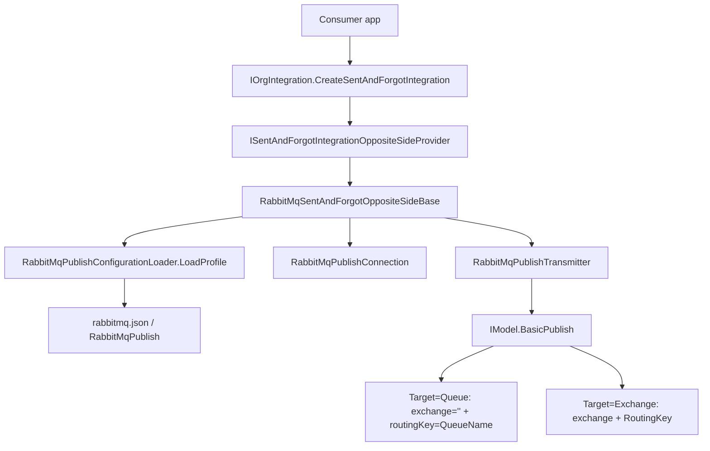
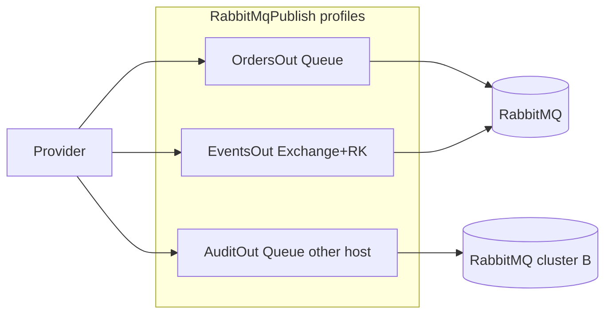

# План: RabbitMQ для SentAndForgot

**Статус:** выполнено  
**Создан:** 2026-06-21 09:52 (UTC+3)  
**Обновлён:** 2026-06-21 09:52 (UTC+3)  
**Цель:** реализовать исходящий RabbitMQ-транспорт для паттерна SentAndForgot — публикация в очередь или exchange с routing key, несколько именованных профилей подключения, загрузка из JSON по образцу ReceiveAndProcess.

---

## Контекст

Паттерн **SentAndForgot** уже реализован как оркестратор с точками расширения, но **без конкретного транспорта**:

[`SentAndForgotIntegration.Integrate()`](../../src/IntegrationFlow.Core/Contexts/Integrations/03Domain/SentAndForgot/SentAndForgotIntegration.cs) выполняет цепочку: formatter → logging → `GetTransmitterConfiguration` → `GetConnection` → `GetTransmitter().Transmit()`.

RabbitMQ в проекте есть только для **ReceiveAndProcess** (consumer): [`RabbitMqListener`](../../src/IntegrationFlow.Core/Contexts/Integrations/00InnerUsage/RabbitMq/ReceiveAndProcess/Listeners/RabbitMqListener.cs), [`RabbitMqConfigurationLoader`](../../src/IntegrationFlow.Core/Contexts/Integrations/00InnerUsage/RabbitMq/ReceiveAndProcess/Configurations/RabbitMqConfigurationLoader.cs). Публикация (`BasicPublish`), exchange и routing key **не реализованы**.

**Рекомендация по конфигурации:** расширить существующий [`rabbitmq.json`](../../src/IntegrationFlow.Core/Contexts/Integrations/00Samples/ReceiveAndProcess/rabbitmq.json) новой секцией `"RabbitMqPublish"`. Consumer-профили остаются в `"RabbitMq"`, publisher-профили — отдельно. Альтернатива: отдельный файл `rabbitmq-publish.json` (тот же API loader, другой `DefaultFileName`).

---

## Целевая архитектура



### Структура файлов (новые)

```
src/IntegrationFlow.Core/Contexts/Integrations/
├── 00InnerUsage/RabbitMq/SentAndForgot/
│   ├── Configurations/
│   │   ├── RabbitMqPublishConfiguration.cs
│   │   ├── RabbitMqPublishTarget.cs          // enum: Queue | Exchange
│   │   └── RabbitMqPublishConfigurationLoader.cs
│   ├── Connections/
│   │   └── RabbitMqPublishConnection.cs
│   ├── Transmitters/
│   │   └── RabbitMqPublishTransmitter.cs
│   ├── RabbitMqConnectionFactory.cs            // общий builder ConnectionFactory
│   └── RabbitMqSentAndForgotIntegrationOppositeSideBase.cs
├── 00Samples/SentAndForgot/
│   ├── SampleRabbitMqSentAndForgotProvider.cs
│   └── SampleRabbitMqSentAndForgotOppositeSide.cs
tests/IntegrationFlow.Core.Tests/RabbitMq/SentAndForgot/
    ├── RabbitMqPublishConfigurationLoaderTests.cs
    └── RabbitMqPublishTransmitterTests.cs      // с mock IModel или Testcontainers (по возможности)
```

Доменный контракт **не меняется**: [`IConfiguration`](../../src/IntegrationFlow.Core/Contexts/Integrations/03Domain/SentAndForgot/Cfg/IConfiguration.cs), [`IConnection`](../../src/IntegrationFlow.Core/Contexts/Integrations/03Domain/SentAndForgot/Connection/IConnection.cs), [`ITransmitter`](../../src/IntegrationFlow.Core/Contexts/Integrations/03Domain/SentAndForgot/Transmitter/ITransmitter.cs).

---

## 1. Модель конфигурации

### `RabbitMqPublishConfiguration`

Реализует `IntegrationFlow.Contexts.Integrations._03Domain.SentAndForgot.Cfg.IConfiguration`.

| Свойство | Тип | Назначение |
|----------|-----|------------|
| `Name` | `string` | Имя профиля (ключ в JSON) |
| `HostName`, `Port`, `UserName`, `Password`, `VirtualHost` | connection | Параметры брокера (как в consumer) |
| `AutomaticRecoveryEnabled` | `bool` | Восстановление соединения |
| `ClientProvidedName` | `string` | Идентификация клиента на брокере |
| `PublishTarget` | `RabbitMqPublishTarget` | `Queue` или `Exchange` |
| `QueueName` | `string` | Обязателен при `PublishTarget=Queue` |
| `Exchange` | `string` | Обязателен при `PublishTarget=Exchange` |
| `RoutingKey` | `string` | Ключ маршрутизации (direct/topic); для fanout может быть пустым |
| `ContentType` | `string` | По умолчанию `application/json` |
| `Persistent` | `bool` | `DeliveryMode=2` для durable-сообщений |
| `Mandatory` | `bool` | Флаг `BasicPublish` (по умолчанию `false`) |
| `ValidateTopology` | `bool` | Passive declare очереди/exchange перед publish (по умолчанию `true`) |

### Режимы публикации

**A. Прямо в очередь** (`PublishTarget: "Queue"`):

```csharp
channel.BasicPublish(
    exchange: "",
    routingKey: configuration.QueueName,
    mandatory: configuration.Mandatory,
    basicProperties: props,
    body: body);
```

Стандартный AMQP default exchange: routing key = имя очереди.

**B. Через exchange** (`PublishTarget: "Exchange"`):

```csharp
channel.BasicPublish(
    exchange: configuration.Exchange,
    routingKey: configuration.RoutingKey ?? "",
    mandatory: configuration.Mandatory,
    basicProperties: props,
    body: body);
```

Топология (exchange, bindings) **не создаётся** в runtime — по аналогии с consumer (`QueueDeclarePassive`). При `ValidateTopology=true` — `ExchangeDeclarePassive` / `QueueDeclarePassive` для ранней диагностики.

### Формат `rabbitmq.json`

```json
{
  "RabbitMq": {
    "Inbox": { "...": "consumer profiles без изменений" }
  },
  "RabbitMqPublish": {
    "OrdersOut": {
      "HostName": "localhost",
      "Port": 5672,
      "UserName": "guest",
      "Password": "guest",
      "VirtualHost": "/",
      "PublishTarget": "Queue",
      "QueueName": "orders.outbox",
      "ContentType": "application/json",
      "Persistent": true,
      "ClientProvidedName": "IntegrationFlow.OrdersPublisher"
    },
    "EventsOut": {
      "HostName": "localhost",
      "PublishTarget": "Exchange",
      "Exchange": "integration.events",
      "RoutingKey": "order.created",
      "ContentType": "application/json",
      "Persistent": true,
      "ClientProvidedName": "IntegrationFlow.EventsPublisher"
    }
  }
}
```

Поддержать **legacy flat** и **именованные профили** — тот же алгоритм whitelist, что в [`RabbitMqConfigurationLoader`](../../src/IntegrationFlow.Core/Contexts/Integrations/00InnerUsage/RabbitMq/ReceiveAndProcess/Configurations/RabbitMqConfigurationLoader.cs):

- whitelist свойств подключения для детекции flat vs named;
- `DefaultProfileName = "Default"`;
- API: `LoadProfile(name)`, `LoadAll()`, `LoadSingle()`, `PopulateProfile(...)`.

**Важно:** не называть профили `HostName`, `Port`, `QueueName` и т.д. — ломает детекцию формата.

### Валидация после bind

Метод `RabbitMqPublishConfiguration.Validate()`:

- connection-поля не пустые;
- `PublishTarget=Queue` → `QueueName` задан;
- `PublishTarget=Exchange` → `Exchange` задан;
- неизвестный `PublishTarget` → `InvalidOperationException`.

Вызывать в loader после `section.Bind()` и в `RabbitMqPublishTransmitter` перед publish.

---

## 2. Загрузчик конфигурации

### `RabbitMqPublishConfigurationLoader`

Повторяет паттерн [`RabbitMqConfigurationLoader`](../../src/IntegrationFlow.Core/Contexts/Integrations/00InnerUsage/RabbitMq/ReceiveAndProcess/Configurations/RabbitMqConfigurationLoader.cs):

| Константа | Значение |
|-----------|----------|
| `DefaultFileName` | `"rabbitmq.json"` (тот же файл) |
| `ConfigurationSectionName` | `"RabbitMqPublish"` |
| `DefaultProfileName` | `"Default"` |

Методы: `Load()`, `LoadSingle(path)`, `LoadFromFile(path)`, `LoadProfile(name)`, `LoadProfile(name, path)`, `LoadAll()`, `PopulateProfile(...)`, `ResolveConfigFilePath()`.

**Опционально (этап 2):** overload `LoadProfile(name, filePath)` для отдельного `rabbitmq-publish.json` — без изменения домена.

---

## 3. Подключение (`RabbitMqPublishConnection`)

Реализует доменный [`IConnection`](../../src/IntegrationFlow.Core/Contexts/Integrations/03Domain/SentAndForgot/Connection/IConnection.cs).

```csharp
internal sealed class RabbitMqPublishConnection : IConnection
{
    private IConnection connection;   // RabbitMQ.Client.IConnection
    private IModel channel;
    private readonly RabbitMqPublishConfiguration configuration;

    // ctor: CreateConnectionFactory → CreateConnection → CreateModel
    public bool NeedReconnect() => connection == null || !connection.IsOpen || channel == null || !channel.IsOpen;
    public bool Reconnect() { Dispose(); Open(); return !NeedReconnect(); }
    public IModel GetChannel() => channel;  // internal, для transmitter
}
```

### Общий `RabbitMqConnectionFactory`

Вынести из [`RabbitMqListener.CreateConnectionFactory`](../../src/IntegrationFlow.Core/Contexts/Integrations/00InnerUsage/RabbitMq/ReceiveAndProcess/Listeners/RabbitMqListener.cs) в shared helper:

```csharp
internal static class RabbitMqConnectionFactory
{
    public static ConnectionFactory Create(RabbitMqConnectionSettings settings) { ... }
}
```

Базовый record/class `RabbitMqConnectionSettings` с общими полями (HostName, Port, …). Consumer и publisher конфиги маппятся в него — без дублирования логики.

**Жизненный цикл:** соединение создаётся на один вызов `Integrate()` внутри `using` ([`SentAndForgotIntegration.cs`](../../src/IntegrationFlow.Core/Contexts/Integrations/03Domain/SentAndForgot/SentAndForgotIntegration.cs)). Долгоживущий пул соединений **не нужен** для v1.

> **Замечание:** в `Integrate()` сейчас connection создаётся дважды (строки 114 и 138) — первый экземпляр не используется. Исправить в том же PR: оставить одно создание в `using`.

---

## 4. Передатчик (`RabbitMqPublishTransmitter`)

Реализует [`ITransmitter`](../../src/IntegrationFlow.Core/Contexts/Integrations/03Domain/SentAndForgot/Transmitter/ITransmitter.cs).

```csharp
public void Transmit(TransmitData transmitData)
{
    configuration.Validate();
    if (configuration.ValidateTopology) ValidateTopologyPassive(channel);

    var body = SerializeBody(transmitData.Data);
    var props = channel.CreateBasicProperties();
    props.ContentType = configuration.ContentType;
    props.DeliveryMode = configuration.Persistent ? (byte)2 : (byte)1;

    channel.BasicPublish(
        exchange: configuration.PublishTarget == RabbitMqPublishTarget.Queue ? "" : configuration.Exchange,
        routingKey: ResolveRoutingKey(configuration),
        mandatory: configuration.Mandatory,
        basicProperties: props,
        body: body);
}
```

### Сериализация тела

| `transmitData.Data` | Поведение |
|---------------------|-----------|
| `byte[]` | как есть |
| `string` | UTF-8 bytes |
| `ReadOnlyMemory<byte>` / `Memory<byte>` | as bytes |
| остальное | `System.Text.Json.JsonSerializer.Serialize` |

Это согласуется с fire-and-forget: formatter подготавливает payload, transmitter отвечает за bytes on wire.

---

## 5. Базовая opposite side и несколько подключений

### `RabbitMqSentAndForgotIntegrationOppositeSideBase`

Аналог [`RabbitMqIntegrationPublisherSideBase`](../../src/IntegrationFlow.Core/Contexts/Integrations/00InnerUsage/RabbitMq/ReceiveAndProcess/RabbitMqIntegrationPublisherSideBase.cs), но для SentAndForgot:

```csharp
internal abstract class RabbitMqSentAndForgotIntegrationOppositeSideBase : SentAndForgotIntegrationOppositeSide
{
    protected abstract string ConfigurationName { get; }

    public override IConfiguration GetTransmitterConfiguration(IIntegrationLogger logger)
        => RabbitMqPublishConfigurationLoader.LoadProfile(ConfigurationName);

    public override IConnection GetConnection(IConfiguration configuration, IIntegrationLogger logger)
        => new RabbitMqPublishConnection((RabbitMqPublishConfiguration)configuration);

    public override ITransmitter GetTransmitter(IConfiguration c, IConnection conn, IIntegrationLogger logger)
        => new RabbitMqPublishTransmitter((RabbitMqPublishConfiguration)c, (RabbitMqPublishConnection)conn);

    public override IFormatterTransmitData GetFormatterSourceData(...) => null;
    public override ILogging GetLogging(...) => null;
}
```

### `NamedRabbitMqSentAndForgotIntegrationOppositeSide`

Динамический профиль по имени (как `NamedRabbitMqIntegrationPublisherSide`):

```csharp
internal sealed class NamedRabbitMqSentAndForgotIntegrationOppositeSide
    : RabbitMqSentAndForgotIntegrationOppositeSideBase
{
    protected override string ConfigurationName => configurationName;
}
```

### Паттерны множественных подключений

**Вариант A — один side на профиль** (статическая привязка):

```csharp
internal sealed class OrdersOutRabbitMqOppositeSide : RabbitMqSentAndForgotIntegrationOppositeSideBase
{
    protected override string ConfigurationName => "OrdersOut";
    protected override object GetIntegrationOppositeSideCode() => "OrdersOut";
}
```

**Вариант B — provider по коду** (гибкая маршрутизация):

```csharp
internal sealed class SampleRabbitMqSentAndForgotProvider : ISentAndForgotIntegrationOppositeSideProvider
{
    public SentAndForgotIntegrationOppositeSide IntegrationOppositeSideResolve(object code)
        => code switch
        {
            "OrdersOut" => new OrdersOutRabbitMqOppositeSide(),
            "EventsOut" => new EventsOutRabbitMqOppositeSide(),
            _ => throw new InvalidOperationException($"Unknown side: {code}")
        };
}
```

**Вариант C — имя профиля = код стороны:**

```csharp
new NamedRabbitMqSentAndForgotIntegrationOppositeSide(code.ToString())
```

Каждый профиль в JSON — отдельное подключение к брокеру (разные host/vhost/credentials/exchange/queue).

### Использование из приложения

```csharp
services.AddIntegrationFlow();

var integration = orgIntegration.CreateSentAndForgotIntegration<SampleRabbitMqSentAndForgotProvider>(
    oppositeSideCode: "EventsOut",
    srcData: orderEvent);

integration.Integrate();
```

Параллельные интеграции с разными профилями безопасны: каждый `Integrate()` создаёт своё соединение; синхронизация config/connect — через lock в [`SentAndForgotIntegration`](../../src/IntegrationFlow.Core/Contexts/Integrations/03Domain/SentAndForgot/SentAndForgotIntegration.cs).



---

## 6. Sample и csproj

- Добавить секцию `"RabbitMqPublish"` в [`rabbitmq.json`](../../src/IntegrationFlow.Core/Contexts/Integrations/00Samples/ReceiveAndProcess/rabbitmq.json) (или sample-файл в `00Samples/SentAndForgot/` с `CopyToOutputDirectory`).
- Sample provider + 2 opposite side (`OrdersOut`, `EventsOut`) демонстрируют queue vs exchange.
- Обновить [`2026-06-20_2150-brokers-for-integration-framework.md`](../2026-06-20_2150-brokers-for-integration-framework.md): SentAndForgot + RabbitMQ publish реализован.

---

## 7. Тесты

### `RabbitMqPublishConfigurationLoaderTests`

По образцу [`RabbitMqConfigurationLoaderTests`](../../tests/IntegrationFlow.Core.Tests/RabbitMq/RabbitMqConfigurationLoaderTests.cs):

- flat vs named детекция;
- `LoadProfile("EventsOut")`, `LoadAll()`;
- `LoadProfile("Unknown")` → exception;
- `LoadSingle()` при нескольких профилях → exception;
- валидация: Queue без QueueName, Exchange без Exchange.

### `RabbitMqPublishTransmitterTests`

- mock `IModel`: проверка `BasicPublish` с правильными `exchange`, `routingKey`, `body` для обоих `PublishTarget`;
- сериализация string / object / byte[].

### Интеграционный тест (опционально, этап 2)

Testcontainers RabbitMQ: publish → consume из test queue и проверка payload.

---

## 8. Этапы реализации

### Этап 1 (MVP)

1. `RabbitMqPublishConfiguration` + `RabbitMqPublishTarget` + validation
2. `RabbitMqPublishConfigurationLoader` (multi-profile, legacy flat)
3. `RabbitMqConnectionFactory` + рефакторинг `RabbitMqListener` на shared factory
4. `RabbitMqPublishConnection` + `RabbitMqPublishTransmitter`
5. `RabbitMqSentAndForgotIntegrationOppositeSideBase` + `Named...`
6. Sample provider/sides + обновление `rabbitmq.json`
7. Unit-тесты loader + transmitter
8. Fix двойного создания connection в `SentAndForgotIntegration`

### Этап 2 (расширения, по необходимости)

- Отдельный config file `rabbitmq-publish.json`
- `Headers` / `MessageId` / `CorrelationId` в конфиге (задел под SentAndWait request-reply)
- `DeclareTopology` для dev (ExchangeDeclare + QueueBind)
- Connection pooling / singleton channel per profile

---

## Что сознательно не меняем

- Доменные интерфейсы SentAndForgot (`IConfiguration`, `IConnection`, `ITransmitter`)
- Consumer-часть ReceiveAndProcess (`RabbitMqListener`, секция `"RabbitMq"`)
- `IOptions<T>` / `appsettings.json` — проект использует dedicated JSON + `ConfigurationBuilder.Bind`, как в существующем loader

---

## Риски и mitigations

| Риск | Mitigation |
|------|------------|
| Профиль назван `QueueName` / `HostName` | Документировать запрет; whitelist детекции |
| Default exchange vs named exchange путаница | Явный `PublishTarget` в конфиге |
| At-least-once при retry `Integrate()` | Fire-and-forget семантика; идемпотентность на стороне consumer |
| Дублирование loader-логики | Общий internal base `RabbitMqConfigurationLoaderBase<T>` (опционально при реализации) |
| Сериализация произвольных object | Документировать: formatter должен возвращать string/byte[] для не-JSON типов |

---

## Чеклист реализации

- [x] `RabbitMqPublishConfiguration`, `RabbitMqPublishTarget` и `Validate()`
- [x] `RabbitMqPublishConfigurationLoader` с multi-profile API (секция `RabbitMqPublish`)
- [x] `RabbitMqConnectionFactory`; рефакторинг `RabbitMqListener`
- [x] `RabbitMqPublishConnection` и `RabbitMqPublishTransmitter` (Queue + Exchange modes)
- [x] `RabbitMqSentAndForgotIntegrationOppositeSideBase` и `Named`-вариант
- [x] Sample provider/sides + секция `RabbitMqPublish` в `rabbitmq.json`
- [x] Исправить двойное создание connection в `SentAndForgotIntegration.Integrate()`
- [x] Тесты loader и transmitter (mock `IModel`)
