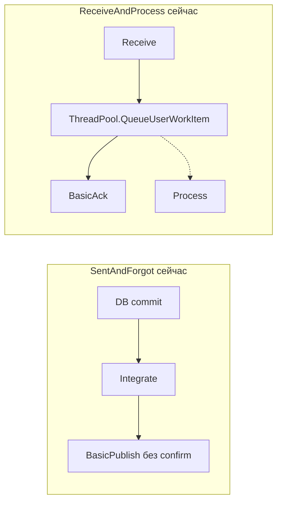
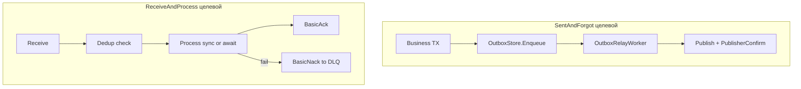
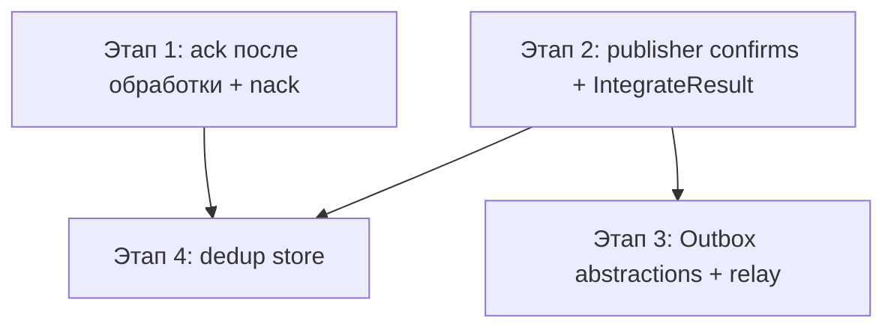

# План: гарантии доставки сообщений

**Статус:** выполнено  
**Создан:** 2026-07-03 12:13 (UTC+3)  
**Обновлён:** 2026-07-03 13:21 (UTC+3)  
**Цель:** устранить проблему «нет гарантии доставки» — обеспечить at-least-once семантику для SentAndForgot и ReceiveAndProcess через publisher confirms, корректный ack/nack, transactional outbox и идемпотентность.

---

## Контекст из предыдущего анализа

Каркас IntegrationFlow сейчас даёт **транспортную обвязку**, но не end-to-end гарантии. Ключевые разрывы:

| Направление | Текущее поведение | Риск |
|-------------|-------------------|------|
| **SentAndForgot** | `BasicPublish` без confirms, `void Transmit()`, ошибки глотаются в `catch` | Сообщение «отправлено» в логах, но не принято брокером; при сбое между commit БД и `Integrate()` — потеря |
| **ReceiveAndProcess** | При `Asynchronously=true` (дефолт в [`rabbitmq.json`](../../src/IntegrationFlow.Core/Contexts/Integrations/00Samples/ReceiveAndProcess/rabbitmq.json)) ack **до** завершения обработки | **At-most-once при ошибке** — самый критичный баг |
| **Обе стороны** | Нет transactional outbox, nack/DLQ, idempotency | Нет атомарности «БД + брокер», дубликаты при redelivery |



Документ [`2026-06-21_0952-rabbitmq-sentandforgot.md`](2026-06-21_0952-rabbitmq-sentandforgot.md) уже фиксирует риск at-least-once и перекладывает идемпотентность на consumer — но инфраструктуры для этого в коде нет.

---

## Целевая модель гарантий

**Реалистичная цель для v1:** **at-least-once** с явной семантикой и контрактом идемпотентности на стороне приложения.

- **Producer:** сообщение не считается доставленным, пока брокер не подтвердил приём (publisher confirms) **или** запись не попала в outbox в той же транзакции, что и бизнес-данные.
- **Consumer:** ack только после успешной обработки; nack/requeue/DLQ при ошибке; dedup по `MessageId`.
- **Caller:** `Integrate()` возвращает явный результат (успех/ошибка), а не «всегда завершено».



---

## Этап 1 — Критичные исправления consumer (ReceiveAndProcess)

**Приоритет: P0** — устраняет потерю сообщений при дефолтной конфигурации.

### 1.1 Исправить порядок ack при асинхронной обработке

Проблема в цепочке [`ListenerBase.ProcessMessage`](../../src/IntegrationFlow.Core/Contexts/Integrations/03Domain/ReceiveAndProcess/ListenerBase.cs) → [`RabbitMqListener.HandleReceivedAsync`](../../src/IntegrationFlow.Core/Contexts/Integrations/00InnerUsage/RabbitMq/ReceiveAndProcess/Listeners/RabbitMqListener.cs):

```173:184:src/IntegrationFlow.Core/Contexts/Integrations/03Domain/ReceiveAndProcess/ListenerBase.cs
        protected virtual void ProcessMessage(object message)
        {
            var processor = IntegrationPublisherSide.GetProcessor(Publisher, Configuration, Logger);
            if (Configuration.Asynchronously)
            {
                ThreadPool.QueueUserWorkItem(processor.Process, message);
            }
            else
            {
                processor.Process(message);
            }
        }
```

**Решение:** перенести ответственность за ack/nack из listener в контракт обработки:

- Ввести `IProcessedMessage` (или расширить `RabbitMqReceivedMessage`) с `DeliveryTag` + callback `Ack()` / `Nack(requeue)`.
- `ProcessMessage` возвращает `Task` при `Asynchronously=true`; `HandleReceivedAsync` **await**-ит завершение обработки, затем ack.
- Альтернатива с минимальным diff: при `Asynchronously=true` listener сам вызывает `processor.Process` синхронно внутри `await Task.Run(...)`, сохраняя prefetch=1 как backpressure.

**Файлы:** [`ListenerBase.cs`](../../src/IntegrationFlow.Core/Contexts/Integrations/03Domain/ReceiveAndProcess/ListenerBase.cs), [`RabbitMqListener.cs`](../../src/IntegrationFlow.Core/Contexts/Integrations/00InnerUsage/RabbitMq/ReceiveAndProcess/Listeners/RabbitMqListener.cs), тесты listener/processor.

### 1.2 Добавить nack при ошибке обработки

Сейчас при exception в `HandleReceivedAsync` сообщение не ack-ается, но и не nack-ается явно — redelivery только при закрытии канала.

**Решение:**

- `BasicNack(deliveryTag, multiple: false, requeue: configurable)`.
- Новые параметры в [`RabbitMqConfiguration`](../../src/IntegrationFlow.Core/Contexts/Integrations/00InnerUsage/RabbitMq/ReceiveAndProcess/Configurations/RabbitMqConfiguration.cs): `RequeueOnFailure` (default `false` для DLQ-маршрутизации), `MaxRetryCount` (опционально, через header `x-death`).

### 1.3 Документировать DLQ-топологию

Каркас **не создаёт** топологию (как сейчас для очередей) — добавить в README/sample `rabbitmq.json` секцию с dead-letter exchange + queue и ссылкой на настройку `x-dead-letter-exchange` на основной очереди.

---

## Этап 2 — Publisher confirms и явный результат (SentAndForgot)

**Приоритет: P1** — гарантия «брокер принял сообщение» без outbox.

### 2.1 Publisher confirms в RabbitMQ

В [`RabbitMqPublishConnection.Open()`](../../src/IntegrationFlow.Core/Contexts/Integrations/00InnerUsage/RabbitMq/SentAndForgot/Connections/RabbitMqPublishConnection.cs) при `PublisherConfirmsEnabled=true`:

```csharp
channel.ConfirmSelect();
// после BasicPublish:
channel.WaitForConfirmsOrDie(TimeSpan.FromSeconds(confirmTimeout));
```

Новые свойства в [`RabbitMqPublishConfiguration`](../../src/IntegrationFlow.Core/Contexts/Integrations/00InnerUsage/RabbitMq/SentAndForgot/Configurations/RabbitMqPublishConfiguration.cs):

- `PublisherConfirmsEnabled` (default `true` для новых профилей)
- `ConfirmTimeoutSeconds` (default `30`)

Обновить [`RabbitMqPublishTransmitter`](../../src/IntegrationFlow.Core/Contexts/Integrations/00InnerUsage/RabbitMq/SentAndForgot/Transmitters/RabbitMqPublishTransmitter.cs): при nack от брокера — `PublishNotConfirmedException`.

### 2.2 MessageId и трассировка

- Генерировать `MessageId` (GUID) в transmitter, если не задан formatter-ом.
- Пробросить `CorrelationId` из `TransmitData` (расширить [`TransmitData`](../../src/IntegrationFlow.Core/Contexts/Integrations/03Domain/SentAndForgot/TransmitData.cs) опциональными metadata-полями).

Это задел под dedup на consumer и outbox relay.

### 2.3 Явный результат `Integrate()`

Сейчас [`SentAndForgotIntegration.Integrate()`](../../src/IntegrationFlow.Core/Contexts/Integrations/03Domain/SentAndForgot/SentAndForgotIntegration.cs) глотает все исключения.

**Решение (обратно совместимо):**

- Добавить `IntegrateResult IntegrateWithResult()` с `Success`, `FailureReason`, `MessageId`.
- Сохранить `void Integrate()` как wrapper (log + rethrow или log-only через config `ThrowOnFailure`).
- Расширить [`ITransmitter`](../../src/IntegrationFlow.Core/Contexts/Integrations/03Domain/SentAndForgot/Transmitter/ITransmitter.cs) **не ломая** существующий контракт: новый `ITransmitterWithResult` или optional return через exception-only path на этапе 2.

### 2.4 Mandatory + BasicReturn (опционально)

При `Mandatory=true` — подписать channel на `BasicReturn` и логировать/бросать `UnroutableMessageException`. Default остаётся `false`.

**Тесты:** mock `IModel` — confirms, nack, MessageId в properties; integration test Testcontainers (publish → consume roundtrip).

---

## Этап 3 — Transactional Outbox (абстракции каркаса)

**Приоритет: P2** — решает разрыв «DB commit прошёл, publish не случился».

Каркас **не привязывается к EF Core** — только контракты + relay worker; реализация хранилища в приложении-потребителе.

### 3.1 Доменные интерфейсы

Новая папка `03Domain/Outbox/`:

```csharp
public interface IOutboxStore
{
    Task EnqueueAsync(OutboxMessage message, CancellationToken ct);
    Task<IReadOnlyList<OutboxMessage>> GetPendingAsync(int batchSize, CancellationToken ct);
    Task MarkPublishedAsync(Guid id, CancellationToken ct);
    Task MarkFailedAsync(Guid id, string error, CancellationToken ct);
}

public record OutboxMessage(
    Guid Id,
    string ProfileName,      // RabbitMqPublish profile
    byte[] Payload,
    string ContentType,
    DateTimeOffset CreatedAt,
    int AttemptCount);
```

### 3.2 Два режима SentAndForgot

| Режим | Когда | Поведение |
|-------|-------|-----------|
| **Direct** (текущий) | Нет outbox store | `Integrate()` → publish + confirms |
| **Outbox** | `IOutboxStore` зарегистрирован | `Integrate()` только пишет в outbox (в TX вызывающего приложения); relay worker публикует |

Новый opposite side или флаг в provider: `OutboxSentAndForgotIntegrationOppositeSideBase`.

### 3.3 Outbox relay worker

`IHostedService` / `BackgroundService`:

1. Poll `GetPendingAsync(batch)`
2. Publish через существующий `RabbitMqPublishTransmitter` + confirms
3. `MarkPublishedAsync` / `MarkFailedAsync` с exponential backoff
4. Идемпотентный publish: тот же `MessageId` = `OutboxMessage.Id`

**DI:** `services.AddIntegrationFlowOutboxRelay()` в [`ServiceCollectionExtensions`](../../src/IntegrationFlow.Core/DependencyInjection/ServiceCollectionExtensions.cs).

### 3.4 Документация и sample

- Sample: in-memory `IOutboxStore` для тестов + пример регистрации в README

---

## Этап 4 — Идемпотентность consumer

**Приоритет: P2** — дополнение к at-least-once на этапах 1–2.

### 4.1 Контракт dedup

```csharp
public interface IMessageDeduplicationStore
{
    Task<bool> TryBeginProcessingAsync(string messageId, CancellationToken ct);
    Task MarkProcessedAsync(string messageId, CancellationToken ct);
}
```

Интеграция в [`ProcessorBase.Process`](../../src/IntegrationFlow.Core/Contexts/Integrations/03Domain/ReceiveAndProcess/ProcessorBase.cs) **до** бизнес-обработки:

- Если `TryBeginProcessingAsync` = false → skip (уже обработано), ack.
- После успеха → `MarkProcessedAsync`.

`MessageId` извлекать из AMQP properties в [`RabbitMqReceivedMessage`](../../src/IntegrationFlow.Core/Contexts/Integrations/00InnerUsage/RabbitMq/ReceiveAndProcess/Messages/RabbitMqReceivedMessage.cs).

### 4.2 Sample in-memory dedup store + тесты на duplicate delivery

---

## Что сознательно не меняем

- Доменные интерфейсы ReceiveAndProcess (`IInboxMessageProcessing` и др.) — только расширяем, не ломаем
- Consumer-секция `"RabbitMq"` — формат JSON обратно совместим (новые поля optional)
- Топология брокера — по-прежнему declarative/passive, не runtime declare
- Exactly-once — **не цель**; документируем as at-least-once + idempotent handlers

---

## Порядок реализации и зависимости



| Этап | Effort | Impact |
|------|--------|--------|
| 1 — Consumer ack fix | ~2–3 дня | Устраняет **потерю** сообщений |
| 2 — Publisher confirms | ~2 дня | Гарантия приёма брокером |
| 3 — Transactional outbox | ~3–5 дней | Гарантия DB ↔ broker |
| 4 — Idempotency | ~2 дня | Безопасный at-least-once |

---

## Критерии готовности

- [x] При `Asynchronously=true` ack происходит **только после** успешного `Process`
- [x] При ошибке обработки — явный nack с настраиваемым requeue
- [x] `BasicPublish` + `WaitForConfirms` при включённых confirms
- [x] `IntegrateWithResult()` возвращает failure при ошибке publish/reconnect
- [x] `IOutboxStore` + relay worker публикуют pending-сообщения с retry
- [x] `IMessageDeduplicationStore` предотвращает повторную обработку duplicate
- [x] Unit-тесты на новые компоненты
- [x] Обновлены [`README.md`](../../README.md) и [`2026-06-20_2150-brokers-for-integration-framework.md`](../2026-06-20_2150-brokers-for-integration-framework.md)

> **Анализ рисков:** см. [`2026-07-03_1321-delivery-guarantee-risk-analysis.md`](2026-07-03_1321-delivery-guarantee-risk-analysis.md).

---

## Чеклист реализации

- [x] Этап 1: исправить ack/nack в RabbitMqListener + ListenerBase (await обработки перед ack)
- [x] Этап 1: добавить RequeueOnFailure в RabbitMqConfiguration + документация DLQ-топологии
- [x] Этап 2: PublisherConfirmsEnabled + WaitForConfirms в RabbitMqPublishTransmitter/Connection
- [x] Этап 2: IntegrateWithResult() + MessageId в publish properties
- [x] Этап 3: IOutboxStore, OutboxMessage, OutboxRelayWorker, DI-регистрация
- [x] Этап 4: IMessageDeduplicationStore + интеграция в ProcessorBase
- [x] Тесты и обновление README/docs
