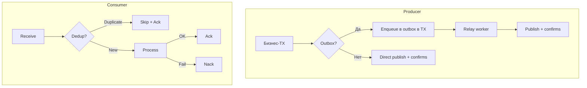

# Анализ решения: гарантии доставки RabbitMQ

**Статус:** актуально  
**Создан:** 2026-07-03 13:21 (UTC+3)  
**Обновлён:** 2026-07-03 13:21 (UTC+3)  
**Связанный план:** [`2026-07-03_1213-delivery-guarantee.md`](2026-07-03_1213-delivery-guarantee.md)

Документ фиксирует оценку реализованного решения at-least-once для RabbitMQ-интеграций: что закрыто, какие риски остаются и что нужно для production.

---

## Обзор реализации

| Компонент | Что сделано |
|-----------|-------------|
| **ReceiveAndProcess** | Ack после обработки, nack с `RequeueOnFailure` / `MaxRetryCount` |
| **SentAndForgot** | Publisher confirms, `MessageId`, `IntegrateWithResult()` |
| **Outbox** | `IOutboxStore`, relay worker, `OutboxTransmitter` |
| **Идемпотентность** | `IMessageDeduplicationStore` в `ProcessorBase` |
| **Конфигурация** | Именованные профили в `rabbitmq.json`, publish-конфиг |

План [`2026-07-03_1213-delivery-guarantee.md`](2026-07-03_1213-delivery-guarantee.md) закрыт по чеклисту. Unit-тесты (38) проходят.

---

## Что решение закрывает хорошо

### 1. Критичный баг consumer устранён

Раньше при `Asynchronously=true` ack выполнялся **до** завершения обработки — фактически at-most-once. Сейчас `ProcessMessageAsync` await-ит завершение обработки, и только затем listener делает ack:

- [`ListenerBase.ProcessMessageAsync`](../../src/IntegrationFlow.Core/Contexts/Integrations/03Domain/ReceiveAndProcess/ListenerBase.cs)
- [`RabbitMqListener.HandleReceivedAsync`](../../src/IntegrationFlow.Core/Contexts/Integrations/00InnerUsage/RabbitMq/ReceiveAndProcess/Listeners/RabbitMqListener.cs)

### 2. Publisher confirms

`ConfirmSelect()` + `WaitForConfirms()` с таймаутом в [`RabbitMqPublishTransmitter`](../../src/IntegrationFlow.Core/Contexts/Integrations/00InnerUsage/RabbitMq/SentAndForgot/Transmitters/RabbitMqPublishTransmitter.cs).

### 3. Transactional Outbox

Каркас не привязан к EF — только контракты и relay worker. `MessageId = OutboxMessage.Id` обеспечивает идемпотентный publish при повторной доставке relay.

### 4. Обратная совместимость

Legacy flat JSON, старый `Integrate()`, optional-поля в конфиге.

### 5. Осознанные ограничения задокументированы

Exactly-once не обещается; DLQ настраивается на брокере.

---

## Матрица рисков

### Высокий приоритет

| Риск | Описание | Последствие |
|------|----------|-------------|
| **Dedup при сбое обработки** | `TryBeginProcessingAsync` ставит `messageId` в `processing`, но при exception до `MarkProcessedAsync` запись остаётся. При redelivery `TryAdd` вернёт `false` → сообщение **пропускается и ack-ится** | **Потеря сообщения** при использовании dedup store |
| **Нет тестов listener/processor** | `RabbitMqListener`, ack/nack, порядок обработки — без тестов; покрыты только in-memory outbox/dedup | Регрессии в критическом пути не поймаются CI |
| **Outbox relay без claim/lock** | `GetPendingAsync` не резервирует сообщения; два worker-а могут взять одно и то же | Дубликаты publish (at-least-once усилится) |
| **Publish OK → MarkPublished fail** | Relay не использует транзакцию «publish + mark»; при сбое после confirm брокера сообщение уйдёт повторно | Дубликаты downstream без идемпотентного consumer |
| **Direct mode без outbox** | `Integrate()` не бросает исключение; gap «DB commit → Integrate()» остаётся, если приложение не обернёт outbox в свою TX | Потеря при сбое между commit и publish |

#### Dedup-баг — самый опасный

Sample-реализация [`InMemoryMessageDeduplicationStore`](../../src/IntegrationFlow.Core/Contexts/Integrations/00Samples/ReceiveAndProcess/Deduplication/InMemoryMessageDeduplicationStore.cs):

```csharp
if (processed.ContainsKey(messageId))
    return false;

return processing.TryAdd(messageId, 0); // false, если уже в processing
```

Сценарий: failed processing → nack → redelivery → `TryBeginProcessingAsync` = false → skip + ack → **silent data loss**.

**Рекомендация:** добавить `ReleaseProcessingAsync(messageId)` при exception/nack или пересмотреть контракт dedup store.

---

### Средний приоритет

| Риск | Описание |
|------|----------|
| **Кеш ProcessorBase по типу** | Ключ — только `typeof(TProcessor)`, не профиль/очередь. При реальной бизнес-логике на нескольких очередях processor может получить чужую `Configuration` (см. ограничение в README) |
| **Prefetch > 1 + параллельный consumer** | `AsyncEventingBasicConsumer` обрабатывает сообщения конкурентно; `ProcessorBase` и бизнес-handler могут быть не thread-safe |
| **Outbox retry без backoff и лимита** | `MarkFailedAsync` сразу возвращает в Pending; следующий poll через `PollingInterval` — hammering при постоянной ошибке |
| **Новое соединение на каждое outbox-сообщение** | `OutboxRelayService` создаёт `RabbitMqPublishConnection` per message — нагрузка и latency при больших batch |
| **Dedup без MessageId** | Если producer не задал `MessageId`, dedup пропускается (`ExtractMessageId` → empty) |
| **Outbox relay только net8.0** | `#if NET8_0_OR_GREATER` — netstandard2.0 consumers outbox worker не получат |
| **Mandatory + BasicReturn race** | `EnsureNotUnroutable()` до `WaitForConfirms()`; BasicReturn может прийти асинхронно позже |
| **InMemory dedup/outbox** | Нет TTL, нет персистентности — только для тестов, не для prod |

---

### Низкий приоритет / технический долг

- `Thread.Abort()` в `ListenerBase.Stop()` — deprecated, опасен на .NET Core+
- `Integrate()` вызывает `IntegrateWithResult()` и **игнорирует результат** — callers на старом API не узнают об ошибке
- Нет integration-тестов с Testcontainers (упоминались в плане)
- DLQ не создаётся runtime — только документация (осознанно)
- Sync-over-async (`.GetAwaiter().GetResult()`) в `ProcessorBase` и `OutboxTransmitter` — риск deadlock в UI/ASP.NET sync context (меньше для background listener)

---

## Семантика гарантий



| Сценарий | Гарантия | Условие |
|----------|----------|---------|
| Consumer, без dedup | **At-least-once** (или at-most-once при nack без requeue и без DLQ) | Ack после process |
| Consumer + dedup (текущая реализация) | **At-least-once с риском потери** при crash mid-processing | Нужен `ReleaseProcessing` при fail |
| Direct publish | **At-least-once до брокера** | Confirms включены |
| Outbox + relay | **At-least-once end-to-end** | Prod `IOutboxStore` + идемпотентный consumer |
| DB + сообщение атомарно | **Только с outbox в той же TX** | Direct mode не даёт |

**Exactly-once не достижим** — и это правильно задокументировано.

---

## Рекомендации по приоритету

| Приоритет | Задача |
|-----------|--------|
| **P0** | Исправить dedup contract: `ReleaseProcessingAsync(messageId)` при exception/nack |
| **P0** | Тесты `RabbitMqListener`: mock channel, verify ack после process, nack при exception, `ShouldRequeue` |
| **P1** | Outbox relay: claim pattern (`GetAndLockPending`), idempotent mark, exponential backoff + max attempts, переиспользование connection |
| **P1** | ProcessorBase cache key: включить `ConfigurationName` / side, как уже сделано для publisher |
| **P2** | Integration tests: Testcontainers roundtrip publish → consume → dedup |
| **P2** | Prod implementations: EF-based `IOutboxStore` и distributed `IMessageDeduplicationStore` (Redis/SQL) с TTL |

---

## Итоговая оценка

| Критерий | Оценка |
|----------|--------|
| Архитектура | **Хорошая** — правильные абстракции, разделение direct/outbox |
| Закрытие исходных дыр | **~85%** — главный consumer-баг закрыт, producer confirms работает |
| Готовность к production | **Условная** — нужны prod store-реализации, fix dedup-on-failure, relay hardening |
| Тестовое покрытие | **Недостаточное** для delivery-critical path |
| Документация | **Хорошая** — README + plans отражают реальность и ограничения |

**Вывод:** решение архитектурно верное и существенно снижает риски по сравнению с исходным кодом. Для production-критичных интеграций главные blockers — **dedup при сбое обработки**, **outbox relay без claim**, **отсутствие интеграционных тестов listener**. Direct mode без outbox остаётся «best effort до брокера»; там, где нужна атомарность с БД, используйте outbox + `IntegrateWithResult()`.
