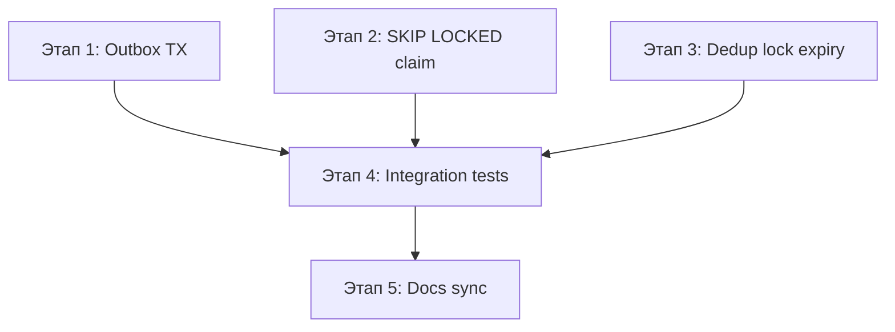
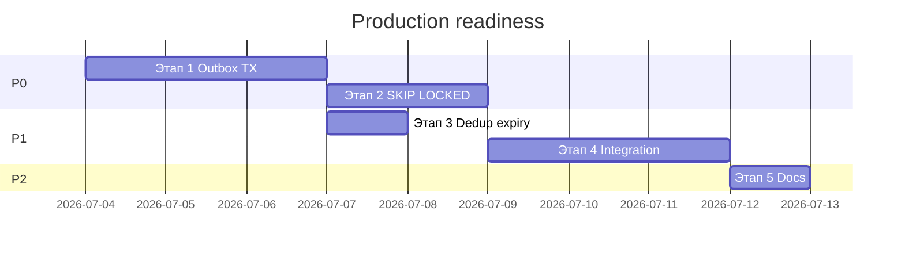

# План: production-readiness EF stores и интеграционных тестов

**Статус:** выполнено  
**Создан:** 2026-07-03 16:39 (UTC+3)  
**Обновлён:** 2026-07-03 16:47 (UTC+3)  
**Основание:** [`../2026-07-03_1511-delivery-guarantee-solution-analysis.md`](../2026-07-03_1511-delivery-guarantee-solution-analysis.md), hardening [`2026-07-03_1523-delivery-guarantee-hardening.md`](2026-07-03_1523-delivery-guarantee-hardening.md) (выполнен)  
**Цель:** закрыть оставшиеся production-риски: атомарность outbox с бизнес-TX, масштабируемый claim, recovery dedup locks, end-to-end тесты.

---

## Контекст

Hardening закрыл базовые P0 (dedup release, outbox claim, listener tests, EF stores). Остаются **архитектурные gaps**, которые блокируют безопасное использование в prod:

| # | Риск | Текущее состояние |
|---|------|-------------------|
| 1 | Outbox Enqueue не в TX приложения | `EfOutboxStore.EnqueueAsync` всегда создаёт новый `DbContext` через factory |
| 2 | Claim без SKIP LOCKED | Загрузка всех Pending + `Serializable`; не масштабируется |
| 3 | Processing lock без expiry | Crash после `TryBegin` → вечный `InProgress` |
| 4 | Integration tests | Connectivity-тест падает без Docker на Windows; нет roundtrip |
| 5 | Документация | `1511` и `1321` не отражают hardening |



| Этап | Приоритет | Effort | Impact |
|------|-----------|--------|--------|
| 1 — Outbox в TX приложения | P0 | ~2–3 дня | Атомарность «БД + сообщение» |
| 2 — SKIP LOCKED claim | P0 | ~2 дня | Корректный multi-worker relay |
| 3 — Dedup processing expiry | P1 | ~1 день | Recovery после crash |
| 4 — Integration tests | P1 | ~2–3 дня | E2E roundtrip, CI без Docker |
| 5 — Синхронизация docs | P2 | ~0.5 дня | Актуальная оценка рисков |

**MVP для production:** этапы **1 + 2 + 3**.

---

## Этап 1 — Outbox Enqueue в транзакции приложения (P0)

**Проблема:** [`EfOutboxStore.EnqueueAsync`](../../src/IntegrationFlow.EntityFrameworkCore/Outbox/EfOutboxStore.cs) вызывает `contextFactory.CreateDbContextAsync()` и `SaveChangesAsync()` — это **отдельная транзакция**, не та же, что бизнес-данные. README описывает паттерн «outbox в той же TX», но код его не поддерживает.

**Целевое поведение:**

- **Relay worker** (claim/mark) — по-прежнему отдельный `DbContext` на операцию (factory).
- **Enqueue из бизнес-кода** — запись в **текущий scoped `DbContext`**, `SaveChanges` делает приложение вместе с бизнес-сущностями.

### 1.1 Новый контракт enqueue (Core, без EF)

Файл: `src/IntegrationFlow.Core/Contexts/Integrations/03Domain/Outbox/IOutboxEnqueue.cs`

```csharp
/// <summary>
/// Запись в outbox без commit — для участия в TX вызывающего DbContext.
/// </summary>
public interface IOutboxEnqueue
{
    /// <summary>
    /// Подготовить сообщение к сохранению (без SaveChanges).
    /// </summary>
    void Stage(OutboxMessage message);
}
```

`IOutboxStore` **не менять** — relay продолжает использовать полный контракт.

### 1.2 EF: staging через DbContext

Файл: `src/IntegrationFlow.EntityFrameworkCore/Outbox/EfOutboxEnqueue.cs`

```csharp
public sealed class EfOutboxEnqueue<TContext> : IOutboxEnqueue
    where TContext : DbContext
{
    private readonly TContext context;

    public void Stage(OutboxMessage message)
        => context.Set<OutboxMessageEntity>().Add(ToEntity(message));
}
```

Файл: `src/IntegrationFlow.EntityFrameworkCore/Outbox/DbContextOutboxExtensions.cs`

```csharp
public static void EnqueueOutboxMessage(this DbContext context, OutboxMessage message)
    => context.Set<OutboxMessageEntity>().Add(EfOutboxMapper.ToEntity(message));
```

Общий mapper: вынести `ToEntity`/`ToDomain` из `EfOutboxStore` в `EfOutboxMapper.cs` (internal).

### 1.3 Разделить relay store и enqueue

[`EfOutboxStore`](../../src/IntegrationFlow.EntityFrameworkCore/Outbox/EfOutboxStore.cs):

- **Удалить** `EnqueueAsync` из relay-реализации **или** оставить с `[Obsolete]` + XML-warning «только для тестов/standalone; в prod используйте `IOutboxEnqueue` + shared DbContext».
- Relay-методы (`ClaimPendingAsync`, `MarkPublishedAsync`, …) — без изменений семантики.

**Рекомендуемая регистрация DI** — [`ServiceCollectionExtensions.cs`](../../src/IntegrationFlow.EntityFrameworkCore/DependencyInjection/ServiceCollectionExtensions.cs):

```csharp
// Relay worker — factory-based store
services.AddSingleton<IOutboxStore, EfOutboxRelayStore<TContext>>();

// HTTP request / scoped unit of work — staging без SaveChanges
services.AddScoped<IOutboxEnqueue, EfOutboxEnqueue<TContext>>();
```

Альтернатива без двух интерфейсов на store: один `EfOutboxStore` + `IEfOutboxContextProvider` (factory vs scoped). Предпочтительнее **явное разделение** — меньше путаницы в DI.

### 1.4 OutboxTransmitter — использовать IOutboxEnqueue

Файл: [`OutboxTransmitter.cs`](../../src/IntegrationFlow.Core/Contexts/Integrations/03Domain/Outbox/OutboxTransmitter.cs)

```csharp
internal sealed class OutboxTransmitter : ITransmitter, ITransmitterWithResult
{
    private readonly IOutboxEnqueue? outboxEnqueue;
    private readonly IOutboxStore? outboxStore; // fallback

    // ctor: IOutboxEnqueue preferred; if null — IOutboxStore (legacy, отдельная TX)
}
```

Файл: [`OutboxSentAndForgotIntegrationOppositeSideBase.cs`](../../src/IntegrationFlow.Core/Contexts/Integrations/03Domain/Outbox/OutboxSentAndForgotIntegrationOppositeSideBase.cs) — принимать `IOutboxEnqueue` через DI (optional + fallback).

**Важно:** `OutboxTransmitter.TransmitWithResult` при `IOutboxEnqueue` **не вызывает SaveChanges** — caller обязан сохранить DbContext в той же TX. Добавить XML-doc и пример в README.

### 1.5 Документированный паттерн для приложения

Файл: `docs/examples/2026-07-03_1639-ef-outbox-transaction.md`

```csharp
await using var tx = await db.Database.BeginTransactionAsync(ct);

await orderRepo.CreateAsync(order, ct);
outboxEnqueue.Stage(new OutboxMessage(...)); // или db.EnqueueOutboxMessage(...)
await db.SaveChangesAsync(ct);

await tx.CommitAsync(ct);
// Integrate() / OutboxTransmitter только Stage — SaveChanges выше
```

### 1.6 Тесты

Файл: `tests/IntegrationFlow.EntityFrameworkCore.Tests/EfOutboxTransactionTests.cs`

| Тест | Поведение |
|------|-----------|
| `EnqueueOutboxMessage_SameContext_RollsBackWithBusinessData` | Rollback TX → outbox row отсутствует |
| `EnqueueOutboxMessage_SameContext_CommitsWithBusinessData` | Commit TX → outbox row есть |
| `EfOutboxEnqueue_Stage_DoesNotSaveUntilSaveChanges` | После Stage без SaveChanges — 0 rows |

### Критерии готовности этапа 1

- [ ] `IOutboxEnqueue` + `EfOutboxEnqueue` + extension на `DbContext`
- [ ] `OutboxTransmitter` использует Stage без SaveChanges при наличии `IOutboxEnqueue`
- [ ] DI extensions регистрируют relay store и enqueue отдельно
- [ ] README + example doc с TX-паттерном
- [ ] ≥ 3 новых теста на shared TX

---

## Этап 2 — Claim с FOR UPDATE SKIP LOCKED (P0)

**Проблема:** [`SelectClaimCandidatesAsync`](../../src/IntegrationFlow.EntityFrameworkCore/Outbox/EfOutboxStore.cs) загружает **все** Pending в память. `Serializable` не заменяет row-level lock при параллельных workers и большом backlog.

### 2.1 Абстракция claim strategy

```
src/IntegrationFlow.EntityFrameworkCore/Outbox/Claim/
├── IOutboxClaimStrategy.cs
├── EfOutboxClaimStrategyBase.cs
├── SqliteOutboxClaimStrategy.cs      // fallback: текущее поведение
├── PostgreSqlOutboxClaimStrategy.cs  // FOR UPDATE SKIP LOCKED
└── SqlServerOutboxClaimStrategy.cs   // UPDLOCK, READPAST, ROWLOCK
```

```csharp
internal interface IOutboxClaimStrategy
{
    Task<IReadOnlyList<OutboxMessageEntity>> ClaimAsync(
        DbContext context,
        int batchSize,
        string workerId,
        DateTimeOffset lockUntil,
        DateTimeOffset now,
        CancellationToken cancellationToken);
}
```

Выбор strategy — по `context.Database.ProviderName` в `EfOutboxStore` ctor или через `OutboxStoreOptions`.

### 2.2 PostgreSQL (эталон)

```sql
UPDATE "OutboxMessages"
SET "Status" = @inFlight, "LockedBy" = @workerId, "LockedUntil" = @lockUntil
WHERE "Id" IN (
    SELECT "Id" FROM "OutboxMessages"
    WHERE "Status" = @pending
      AND ("RetryAfter" IS NULL OR "RetryAfter" <= @now)
    ORDER BY "CreatedAt"
    LIMIT @batch
    FOR UPDATE SKIP LOCKED
)
RETURNING *;
```

### 2.3 SQL Server

```sql
UPDATE TOP (@batch) m WITH (UPDLOCK, READPAST, ROWLOCK)
SET Status = @inFlight, LockedBy = @workerId, LockedUntil = @lockUntil
OUTPUT inserted.*
FROM OutboxMessages m
WHERE Status = @pending AND (RetryAfter IS NULL OR RetryAfter <= @now)
ORDER BY CreatedAt;
```

(Уточнить синтаксис под версию SQL Server в тестах.)

### 2.4 SQLite (unit tests)

Оставить текущую логику (select + update в Serializable TX) — достаточно для CI unit-тестов.

### 2.5 Concurrent claim test

Файл: `tests/IntegrationFlow.EntityFrameworkCore.Tests/EfOutboxConcurrentClaimTests.cs`

```csharp
[Fact]
public async Task ClaimPendingAsync_ParallelWorkers_ClaimDistinctMessages()
{
    // enqueue N messages
    // Task.WhenAll: 2 workers × ClaimPendingAsync(batch=N)
    // assert: union of claimed ids = all ids, no duplicates
}
```

Для PostgreSQL — отдельный тест с `[Trait("Category", "Integration")]` + Testcontainers.

### 2.6 Убрать load-all-pending

Заменить `SelectClaimCandidatesAsync` на вызов strategy. `GetPendingAsync` (диагностика) — отдельный простой query с `Take`, без claim.

### Критерии готовности этапа 2

- [ ] Strategy per provider; SQLite fallback
- [ ] Unit-тест concurrent claim (SQLite)
- [ ] Integration-тест concurrent claim (PostgreSQL, optional CI job)
- [ ] Нет загрузки всех Pending при claim

---

## Этап 3 — Expiry processing lock в dedup (P1)

**Проблема:** [`EfMessageDeduplicationStore.TryBeginProcessingAsync`](../../src/IntegrationFlow.EntityFrameworkCore/Deduplication/EfMessageDeduplicationStore.cs) при `State == Processing` всегда возвращает `InProgress`. После crash процесса lock не снимается → бесконечный nack requeue.

### 3.1 Расширить options

Файл: [`MessageDeduplicationOptions.cs`](../../src/IntegrationFlow.Core/Contexts/Integrations/03Domain/ReceiveAndProcess/Deduplication/MessageDeduplicationOptions.cs)

```csharp
/// <summary>
/// Максимальное время удержания processing lock. По истечении — повторный захват разрешён.
/// </summary>
public TimeSpan ProcessingLockDuration { get; set; } = TimeSpan.FromMinutes(15);
```

### 3.2 Логика TryBeginProcessingAsync

```csharp
if (existing?.State == Processing)
{
    var lockExpired = existing.CreatedAt + options.ProcessingLockDuration <= now;
    if (!lockExpired)
        return InProgress;

    // lock expired — удалить или перезаписать, затем Acquired
    set.Remove(existing);
    await context.SaveChangesAsync(ct);
    // fall through to insert
}
```

Аналогично обновить [`InMemoryMessageDeduplicationStore`](../../src/IntegrationFlow.Core/Contexts/Integrations/00Samples/ReceiveAndProcess/Deduplication/InMemoryMessageDeduplicationStore.cs) для консистентности тестов.

### 3.3 Опциональный cleanup

Метод `ReleaseExpiredProcessingLocksAsync` на store (или фоновый job в приложении):

```csharp
DELETE FROM ProcessedMessages
WHERE State = Processing AND CreatedAt + @lockDuration < @now
```

Не обязателен, если TryBegin сам re-acquire — но полезен для чистоты таблицы.

### 3.4 Тесты

Файл: `tests/IntegrationFlow.EntityFrameworkCore.Tests/EfDedupLockExpiryTests.cs`

| Тест | Поведение |
|------|-----------|
| `TryBegin_AfterLockExpired_ReturnsAcquired` | Processing + CreatedAt в прошлом → Acquired |
| `TryBegin_BeforeLockExpired_ReturnsInProgress` | Processing свежий → InProgress |

### Критерии готовности этапа 3

- [ ] `ProcessingLockDuration` в options (default 15 min)
- [ ] EF + InMemory stores поддерживают expiry
- [ ] ≥ 2 теста
- [ ] README: описать recovery после crash

---

## Этап 4 — Integration tests (P1)

**Проблема:** [`RabbitMqConnectivityTests`](../../tests/IntegrationFlow.Core.IntegrationTests/RabbitMqConnectivityTests.cs) считает Docker доступным на Windows (`OperatingSystem.IsWindows()`) и **падает**, если Docker Desktop не запущен. Нет roundtrip publish → consume → dedup.

### 4.1 Исправить skip без Docker

```csharp
private static async Task<bool> IsDockerAvailableAsync()
{
    try
    {
        using var process = Process.Start(new ProcessStartInfo("docker", "info")
        {
            RedirectStandardOutput = true,
            RedirectStandardError = true,
            CreateNoWindow = true
        });
        return process != null && await process.WaitForExitAsync(TimeSpan.FromSeconds(5))
               && process.ExitCode == 0;
    }
    catch { return false; }
}
```

В тестах: `if (!await IsDockerAvailableAsync()) return;` или `[Fact(Skip = "...")]` через custom attribute `DockerFact`.

### 4.2 Roundtrip tests

Файл: `tests/IntegrationFlow.Core.IntegrationTests/RabbitMqDeliveryRoundtripTests.cs`

| Сценарий | Проверка |
|----------|----------|
| Publish + consume | сообщение получено, ack, queue empty |
| Process failure + requeue | nack → redelivery (mock handler throws once) |
| Dedup duplicate | второй publish с тем же MessageId → skip + ack |
| Outbox relay | enqueue → relay → message in queue с MessageId = outbox.Id |

Зависимости: Testcontainers.RabbitMq (уже есть), optional Testcontainers.PostgreSql для claim.

### 4.3 CI

GitHub Actions (если появится):

- `unit` — always
- `integration` — `needs: docker`, `if: github.event_name != 'pull_request'` или nightly

Локально: `dotnet test --filter "Category=Integration"`.

### Критерии готовности этапа 4

- [ ] Connectivity-тест skip без Docker (не fail)
- [ ] ≥ 3 roundtrip integration tests
- [ ] README: команда запуска integration tests

---

## Этап 5 — Синхронизация документации (P2)

### 5.1 Обновить risk-analysis v1

Файл: [`2026-07-03_1321-delivery-guarantee-risk-analysis.md`](2026-07-03_1321-delivery-guarantee-risk-analysis.md)

- Пометить закрытые P0 (dedup release, outbox claim, listener tests, EF stores)
- Перенести открытые риски из этого плана

### 5.2 Обновить полный анализ

Файл: [`2026-07-03_1511-delivery-guarantee-solution-analysis.md`](../2026-07-03_1511-delivery-guarantee-solution-analysis.md)

- Статус после hardening `990d890`
- Матрица рисков — только актуальные gaps (этапы 1–4)
- Обновить счётчик тестов (63+)

### 5.3 README

- Секция EF: TX-паттерн с `IOutboxEnqueue`
- `ProcessingLockDuration`
- Integration tests filter

### 5.4 docs/README.md

Добавить строку на этот план.

### Критерии готовности этапа 5

- [ ] `1321` и `1511` синхронизированы с кодом
- [ ] README + docs/README обновлены

---

## Что сознательно не меняем

| Тема | Причина |
|------|---------|
| Exactly-once | Недостижимо; at-least-once + idempotent handlers |
| MarkProcessed fail после handler | Фундаментальный at-least-once; документируем, не «магия» |
| Publish OK → MarkPublished fail | Mitigation через MessageId = OutboxId |
| Direct publish без outbox | Legacy API; anti-pattern для DB+message |
| DLQ runtime declare | Топология — ответственность ops |

---

## Порядок реализации



**Параллельно:** этап 3 можно начать параллельно с этапом 2 (разные файлы).

---

## Чеклист реализации

- [x] Этап 1: `IOutboxEnqueue`, TX-паттерн, тесты rollback/commit
- [x] Этап 2: claim strategies, concurrent tests
- [x] Этап 3: `ProcessingLockDuration`, recovery tests
- [x] Этап 4: Docker skip fix, roundtrip tests
- [x] Этап 5: docs sync (README, example, plan status)

---

## Связанные документы

- [`2026-07-03_1523-delivery-guarantee-hardening.md`](2026-07-03_1523-delivery-guarantee-hardening.md) — выполнен
- [`../2026-07-03_1511-delivery-guarantee-solution-analysis.md`](../2026-07-03_1511-delivery-guarantee-solution-analysis.md) — требует обновления после этого плана
