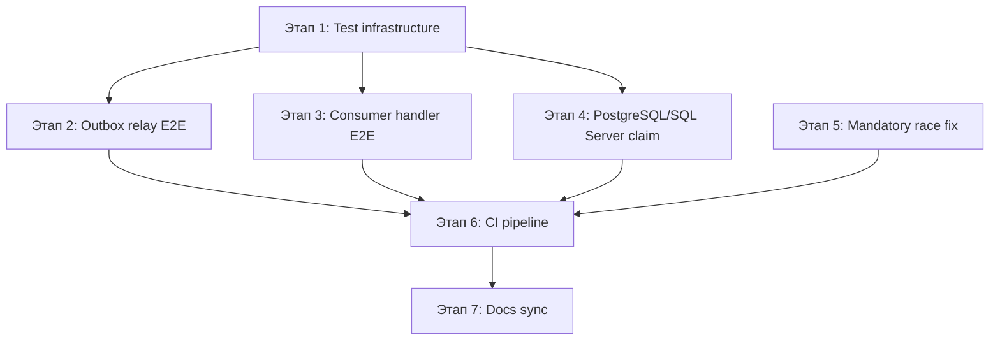
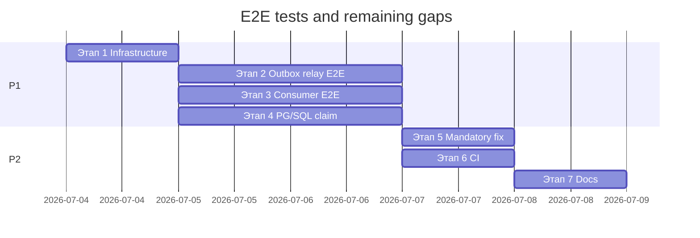

# План: E2E-тесты, claim integration tests и оставшиеся gaps

**Статус:** выполнено  
**Создан:** 2026-07-03 17:07 (UTC+3)  
**Обновлён:** 2026-07-03 19:40 (UTC+3)  
**Основание:** [`../2026-07-03_1706-delivery-guarantee-full-analysis.md`](../2026-07-03_1706-delivery-guarantee-full-analysis.md)  
**Цель:** закрыть оставшиеся gaps тестового покрытия и мелкие code-fixes; довести решение до production-ready с точки зрения CI и E2E-валидации.

---

## Прогресс (checkpoint)

**Этап 0 выполнен** (2026-07-03 18:56): промежуточное состояние зафиксировано в git, сборка и 74 теста зелёные.

**Этап 1 выполнен** (2026-07-03 19:35): shared `IntegrationFlow.Testing`, дубликаты удалены, `RabbitMqContainerFixture`, Core.IntegrationTests → Testing + EF.

**Этап 2 выполнен** (2026-07-03 19:37): `OutboxRelayEndToEndTests` — relay через `OutboxRelayService` + `EfOutboxStore`.

**Этапы 3–7 выполнены** (2026-07-03 19:40): consumer E2E, PG/SQL claim, mandatory tests, CI, docs sync.

| Что уже есть | Этап плана | Статус |
|--------------|------------|--------|
| Test infrastructure + `IntegrationFlow.Testing` | 1 | ✅ |
| Outbox relay E2E (2 теста) | 2 | ✅ |
| Consumer handler E2E (3 теста) | 3 | ✅ |
| PostgreSQL + SQL Server claim integration tests | 4 | ✅ |
| Mandatory unit tests (3 теста) | 5 | ✅ |
| GitHub Actions CI | 6 | ✅ |
| Docs superseded + README | 7 | ✅ |

**Итог:** 84 теста, E2E через каркас, CI workflow добавлен.

---

## Контекст

Production-readiness (`820689f`) закрыл P0: outbox TX, SKIP LOCKED claim, dedup lock expiry, EF stores. Остаются **4 открытых пункта** из анализа v2:

| # | Gap | Текущее состояние |
|---|-----|-------------------|
| 1 | E2E через каркас | Integration tests используют raw `RabbitMQ.Client`, не `OutboxRelayService` / `RabbitMqReceivedMessageHandler` |
| 2 | Claim strategies PostgreSQL/SQL Server | Concurrent claim тестируется только на SQLite |
| 3 | Mandatory + BasicReturn race | `EnsureNotUnroutable()` после `WaitForConfirms()` — BasicReturn может прийти позже |
| 4 | CI для integration tests | Нет GitHub Actions; локально — skip без Docker |



| Этап | Приоритет | Effort | Impact |
|------|-----------|--------|--------|
| 1 — Test infrastructure | P1 | ~1 день | Общие fixtures, InternalsVisibleTo, temp config |
| 2 — Outbox relay E2E | P1 | ~2 дня | Валидация producer path через каркас |
| 3 — Consumer handler E2E | P1 | ~1–2 дня | Валидация ack/dedup через каркас |
| 4 — PostgreSQL/SQL Server claim | P1 | ~2 дня | Валидация SKIP LOCKED / UPDLOCK в CI |
| 5 — Mandatory race fix | P2 | ~0.5 дня | Корректная обработка unroutable |
| 6 — CI pipeline | P2 | ~1 день | Автоматический прогон unit + integration |
| 7 — Docs sync | P2 | ~0.5 дня | Superseded-метки, README |

**MVP для закрытия gaps:** этапы **1 + 2 + 4 + 6**.

---

## Этап 1 — Test infrastructure (P1)

**Проблема:** E2E-тесты не могут вызывать internal types (`RabbitMqReceivedMessageHandler`, `OutboxTransmitter`). Нет общих fixtures для RabbitMQ + temp config.

### 1.1 InternalsVisibleTo для integration projects

Файл: [`IntegrationFlow.Core.csproj`](../../src/IntegrationFlow.Core/IntegrationFlow.Core.csproj)

```xml
<InternalsVisibleTo Include="IntegrationFlow.Core.IntegrationTests" />
```

Аналогично для `IntegrationFlow.EntityFrameworkCore.csproj` → `IntegrationFlow.EntityFrameworkCore.IntegrationTests` (новый проект, этап 4).

### 1.2 Общая инфраструктура fixtures

Новая папка: `tests/IntegrationFlow.Core.IntegrationTests/Infrastructure/`

| Файл | Назначение |
|------|------------|
| `DockerAvailability.cs` | Уже есть — без изменений |
| `RabbitMqContainerFixture.cs` | Shared `IAsyncLifetime` для RabbitMQ Testcontainer |
| `TempRabbitMqConfigWriter.cs` | Запись `rabbitmq.json` в `AppContext.BaseDirectory` с портом контейнера |

```csharp
internal static class TempRabbitMqConfigWriter
{
    public static string WritePublishProfile(
        string profileName,
        string queueName,
        RabbitMqContainer container)
    {
        var path = Path.Combine(AppContext.BaseDirectory, RabbitMqPublishConfigurationLoader.DefaultFileName);
        var json = $$"""
        {
          "RabbitMqPublish": {
            "{{profileName}}": {
              "HostName": "{{container.Hostname}}",
              "Port": {{container.GetMappedPublicPort(5672)}},
              "UserName": "guest",
              "Password": "guest",
              "QueueName": "{{queueName}}",
              "PublishTarget": "Queue",
              "PublisherConfirmsEnabled": true,
              "ValidateTopology": false
            }
          }
        }
        """;
        File.WriteAllText(path, json);
        return path;
    }
}
```

> `ValidateTopology: false` — очередь создаётся тестом до relay, не через passive declare.

### 1.3 Зависимости integration test project

Файл: [`IntegrationFlow.Core.IntegrationTests.csproj`](../../tests/IntegrationFlow.Core.IntegrationTests/IntegrationFlow.Core.IntegrationTests.csproj)

```xml
<ProjectReference Include="..\..\src\IntegrationFlow.EntityFrameworkCore\IntegrationFlow.EntityFrameworkCore.csproj" />
<PackageReference Include="Microsoft.EntityFrameworkCore.Sqlite" Version="8.0.*" />
```

SQLite — для outbox relay E2E без второго контейнера БД (relay path не требует PostgreSQL).

### Критерии готовности этапа 1

- [x] `InternalsVisibleTo` для integration test projects
- [x] `TempRabbitMqConfigWriter` + `RabbitMqContainerFixture`
- [x] Core.IntegrationTests ссылается на EntityFrameworkCore и Testing
- [x] `IntegrationFlow.Testing` в sln, дубликаты DbContext удалены из EF.Tests
- [x] 74 теста green

---

## Этап 2 — Outbox relay E2E (P1)

**Проблема:** [`RabbitMqDeliveryRoundtripTests`](../../tests/IntegrationFlow.Core.IntegrationTests/RabbitMqDeliveryRoundtripTests.cs) не проверяет `OutboxRelayService` → RabbitMQ.

**Целевой сценарий:**

```
EnqueueAsync (EfOutboxStore) → ClaimPendingAsync → OutboxRelayService.RelayBatchAsync
  → сообщение в очереди с MessageId = OutboxMessage.Id.ToString("N")
```

### 2.1 Новый тестовый файл

Файл: `tests/IntegrationFlow.Core.IntegrationTests/OutboxRelayEndToEndTests.cs`

```csharp
[Trait("Category", "Integration")]
public sealed class OutboxRelayEndToEndTests : IAsyncLifetime
{
    [Fact]
    public async Task RelayBatchAsync_PublishesClaimedOutboxMessageToRabbitMq()
    {
        // skip if !dockerAvailable
        // 1. Start RabbitMQ container
        // 2. TempRabbitMqConfigWriter.WritePublishProfile("OrdersOut", queue, container)
        // 3. Declare queue on broker
        // 4. EfOutboxStore (SQLite in-memory) — EnqueueAsync
        // 5. OutboxRelayService.RelayBatchAsync()
        // 6. BasicGet → assert MessageId == outboxId, body == payload
    }

    [Fact]
    public async Task RelayBatchAsync_MarkPublished_PreventsRedeliveryOnSecondRelay()
    {
        // enqueue 1 message → relay → relay again → queue has exactly 1 message
    }

    [Fact]
    public async Task RelayBatchAsync_FailedPublish_RetriesAfterBackoff()
    {
        // invalid profile / stopped broker → MarkFailed, RetryAfter set
        // (optional: mock transmitter via internal test hook — только если без mock слишком flaky)
    }
}
```

### 2.2 Test DbContext для integration

Переиспользовать [`TestIntegrationDbContext`](../../tests/IntegrationFlow.EntityFrameworkCore.Tests/TestIntegrationDbContext.cs) — вынести в shared project **или** скопировать минимально в integration tests (предпочтительнее: `tests/IntegrationFlow.Testing/` shared library).

**Рекомендация:** новый проект `tests/IntegrationFlow.Testing/IntegrationFlow.Testing.csproj` с:

- `TestIntegrationDbContext`
- `TestDbContextFactory`
- `DockerAvailability`

Unit- и integration-тесты ссылаются на него — без дублирования.

### Критерии готовности этапа 2

- [x] ≥ 2 E2E-теста outbox relay через `OutboxRelayService` + `EfOutboxStore`
- [x] Assert `MessageId = OutboxId`
- [x] Shared test helpers в `IntegrationFlow.Testing`

---

## Этап 3 — Consumer handler E2E (P1)

**Проблема:** ack/dedup path покрыт unit-тестами с mock acknowledgement, но не проверен с реальным RabbitMQ + `ProcessorBase`.

### 3.1 Подход без полного listener thread

Не поднимать `RabbitMqListener` в фоновом потоке (flaky, сложный lifecycle). Вместо этого:

1. Publish в очередь через Testcontainer
2. `BasicGet` → построить `RabbitMqReceivedMessage`
3. Вызвать `RabbitMqReceivedMessageHandler.HandleAsync` с test `ProcessorBase` / fake dedup store
4. Assert: queue empty после ack; при duplicate MessageId — skip + ack

### 3.2 Новый тестовый файл

Файл: `tests/IntegrationFlow.Core.IntegrationTests/ConsumerHandlerEndToEndTests.cs`

| Тест | Поведение |
|------|-----------|
| `HandleAsync_WithRealQueue_AcksAndEmptiesQueue` | process OK → ack → BasicGet returns null |
| `HandleAsync_DuplicateMessageId_SkipsSecondDelivery` | InMemory/Ef dedup → второй publish с тем же Id → skip |
| `HandleAsync_ProcessFailure_NacksWithRequeue` | handler throws → nack requeue → message redelivered |

### 3.3 Test processor side

Файл: `tests/IntegrationFlow.Core.IntegrationTests/Infrastructure/TestInboxMessageProcessing.cs`

```csharp
internal sealed class TestInboxMessageProcessing : IInboxMessageProcessing
{
    public int ProcessCount { get; private set; }
    public void ProcessInboxMessage(InboxMessage message) => ProcessCount++;
}
```

Регистрация через test subclass `IntegrationProcessorSideBase` (pattern из [`ProcessorBaseDeduplicationTests`](../../tests/IntegrationFlow.Core.Tests/ReceiveAndProcess/ProcessorBaseDeduplicationTests.cs)).

### Критерии готовности этапа 3

- [x] ≥ 3 E2E-теста consumer path через `RabbitMqReceivedMessageHandler` + `ProcessorBase`
- [x] Dedup duplicate scenario с реальным RabbitMQ

---

## Этап 4 — PostgreSQL / SQL Server concurrent claim (P1)

**Проблема:** [`EfOutboxConcurrentClaimTests`](../../tests/IntegrationFlow.EntityFrameworkCore.Tests/EfOutboxConcurrentClaimTests.cs) работает на SQLite — не валидирует raw SQL в [`PostgreSqlOutboxClaimStrategy`](../../src/IntegrationFlow.EntityFrameworkCore/Outbox/Claim/PostgreSqlOutboxClaimStrategy.cs) и [`SqlServerOutboxClaimStrategy`](../../src/IntegrationFlow.EntityFrameworkCore/Outbox/Claim/SqlServerOutboxClaimStrategy.cs).

### 4.1 Новый test project

Файл: `tests/IntegrationFlow.EntityFrameworkCore.IntegrationTests/IntegrationFlow.EntityFrameworkCore.IntegrationTests.csproj`

```xml
<PackageReference Include="Testcontainers.PostgreSql" Version="4.1.0" />
<PackageReference Include="Testcontainers.MsSql" Version="4.1.0" />
<PackageReference Include="Npgsql.EntityFrameworkCore.PostgreSQL" Version="8.0.*" />
<PackageReference Include="Microsoft.EntityFrameworkCore.SqlServer" Version="8.0.*" />
```

### 4.2 Тесты

Файл: `tests/IntegrationFlow.EntityFrameworkCore.IntegrationTests/EfOutboxPostgreSqlClaimTests.cs`

```csharp
[Trait("Category", "Integration")]
public sealed class EfOutboxPostgreSqlClaimTests : IAsyncLifetime
{
    [Fact]
    public async Task ClaimPendingAsync_ParallelWorkers_ClaimDistinctMessages_PostgreSql()
    {
        // Testcontainers PostgreSQL
        // Enqueue 10 → Task.WhenAll 2× ClaimPendingAsync → no duplicate ids
    }
}
```

Файл: `EfOutboxSqlServerClaimTests.cs` — аналогично для SQL Server.

> SQL Server Testcontainer требует больше RAM; допустимо пометить `[Trait("Category", "Integration")]` + `[Trait("Provider", "SqlServer")]` и запускать nightly.

### 4.3 Provider-specific DbContext factory

```csharp
internal static async Task<IDbContextFactory<TContext>> CreatePostgreSqlFactoryAsync(
    PostgreSqlContainer container)
{
    var options = new DbContextOptionsBuilder<TestIntegrationDbContext>()
        .UseNpgsql(container.GetConnectionString())
        .Options;
    // EnsureCreated + ConfigureIntegrationFlow
}
```

### 4.4 Добавить в solution

- Project в [`IntegrationFlow.sln`](../../IntegrationFlow.sln) под папку `tests`
- `InternalsVisibleTo` в EntityFrameworkCore.csproj

### Критерии готовности этапа 4

- [x] PostgreSQL concurrent claim integration test
- [x] SQL Server concurrent claim integration test (или nightly-only)
- [x] Skip без Docker — не fail

---

## Этап 5 — Mandatory + BasicReturn race fix (P2)

**Проблема:** в [`RabbitMqPublishTransmitter.TransmitWithResult`](../../src/IntegrationFlow.Core/Contexts/Integrations/00InnerUsage/RabbitMq/SentAndForgot/Transmitters/RabbitMqPublishTransmitter.cs):

```csharp
if (configuration.PublisherConfirmsEnabled)
{
    channel.WaitForConfirms(timeout);
}
connection.EnsureNotUnroutable(); // BasicReturn может прийти после confirms
```

### 5.1 Исправление

После `WaitForConfirms` добавить короткую синхронизацию для mandatory publish:

```csharp
if (configuration.Mandatory)
{
    // BasicReturn приходит на connection thread; даём event loop обработать callback
    Thread.Sleep(50); // или SpinWait с timeout — предпочтительнее без hardcoded sleep
    connection.EnsureNotUnroutable();
}
else
{
    connection.EnsureNotUnroutable();
}
```

**Лучший вариант:** `ManualResetEventSlim` в `RabbitMqPublishConnection`, сигнализируемый из `OnBasicReturn`, с timeout 100ms — без `Thread.Sleep`.

### 5.2 Unit-тест

Файл: `tests/IntegrationFlow.Core.Tests/RabbitMq/SentAndForgot/RabbitMqPublishTransmitterMandatoryTests.cs`

| Тест | Поведение |
|------|-----------|
| `TransmitWithResult_MandatoryUnroutable_ThrowsBeforeReturningSuccess` | mock/simulate BasicReturn → `UnroutableMessageException` |
| `TransmitWithResult_MandatoryRoutable_Succeeds` | normal publish → success |

### Критерии готовности этапа 5

- [x] `ManualResetEventSlim` или эквивалент в `RabbitMqPublishConnection`
- [x] ≥ 2 unit-теста mandatory path
- [x] Нет regression в existing `RabbitMqPublishTransmitterTests`

---

## Этап 6 — CI pipeline (P2)

**Проблема:** integration tests запускаются только локально; нет автоматической проверки.

### 6.1 GitHub Actions workflow

Файл: `.github/workflows/ci.yml`

```yaml
name: CI

on:
  push:
    branches: [master, main]
  pull_request:

jobs:
  unit:
    runs-on: ubuntu-latest
    steps:
      - uses: actions/checkout@v4
      - uses: actions/setup-dotnet@v4
        with:
          dotnet-version: '8.0.x'
      - run: dotnet restore IntegrationFlow.sln
      - run: dotnet build IntegrationFlow.sln --no-restore
      - run: dotnet test IntegrationFlow.sln --no-build --filter "Category!=Integration"

  integration:
    runs-on: ubuntu-latest
    needs: unit
    steps:
      - uses: actions/checkout@v4
      - uses: actions/setup-dotnet@v4
        with:
          dotnet-version: '8.0.x'
      - run: dotnet test IntegrationFlow.sln --filter "Category=Integration"
```

> GitHub-hosted runners имеют Docker — Testcontainers работает.

### 6.2 README: команды запуска

```bash
dotnet test --filter "Category!=Integration"   # unit only
dotnet test --filter "Category=Integration"  # requires Docker
```

### Критерии готовности этапа 6

- [x] `.github/workflows/ci.yml` с unit + integration jobs
- [x] README обновлён
- [x] Integration job green на push

---

## Этап 7 — Docs sync (P2)

Не code, но завершает цикл:

| Файл | Действие |
|------|----------|
| [`plans/2026-07-03_1321-delivery-guarantee-risk-analysis.md`](2026-07-03_1321-delivery-guarantee-risk-analysis.md) | Статус **superseded** → ссылка на `1706` |
| [`2026-07-03_1511-delivery-guarantee-solution-analysis.md`](../2026-07-03_1511-delivery-guarantee-solution-analysis.md) | Статус **superseded** → ссылка на `1706` |
| [`README.md`](../../README.md) | Убрать устаревшее ограничение processor cache (исправлено в `RabbitMqIntegrationPublisherSideBase`) |

---

## Что сознательно не меняем

| Тема | Причина |
|------|---------|
| Exactly-once | Недостижимо; at-least-once + idempotent handlers |
| Publish OK → MarkPublished fail | Фундаментальный at-least-once; mitigation через MessageId = OutboxId |
| MarkProcessed fail после handler | То же; документируем |
| Direct publish без outbox | Legacy API; anti-pattern для DB+message |
| DLQ runtime declare | Топология — ответственность ops |
| Outbox relay worker net8.0 only | `#if NET8_0_OR_GREATER` — документируем; netstandard consumers регистрируют relay вручную |
| SentAndWait | Out of scope этого плана |

---

## Порядок реализации



**Параллельно:** этапы 2, 3, 4 можно вести параллельно после этапа 1.

---

## Чеклист реализации

- [x] **Этап 0:** checkpoint — commit, build/test green, статус плана
- [x] **Этап 1:** InternalsVisibleTo, fixtures, shared Testing project, без дубликатов
- [x] **Этап 2:** Outbox relay E2E (2 теста)
- [x] **Этап 3:** Consumer handler E2E (3 теста)
- [x] **Этап 4:** PostgreSQL + SQL Server claim integration tests
- [x] **Этап 5:** Mandatory BasicReturn race fix + unit tests
- [x] **Этап 6:** GitHub Actions CI
- [x] **Этап 7:** Docs superseded + README

**Ожидаемый итог:** ≥ 85 тестов (76 + ~9 новых), E2E покрытие framework path, CI green.

---

## Связанные документы

- [`../2026-07-03_1706-delivery-guarantee-full-analysis.md`](../2026-07-03_1706-delivery-guarantee-full-analysis.md) — актуальная оценка рисков
- [`2026-07-03_1639-production-readiness.md`](2026-07-03_1639-production-readiness.md) — выполнен
- [`2026-07-03_1523-delivery-guarantee-hardening.md`](2026-07-03_1523-delivery-guarantee-hardening.md) — выполнен
