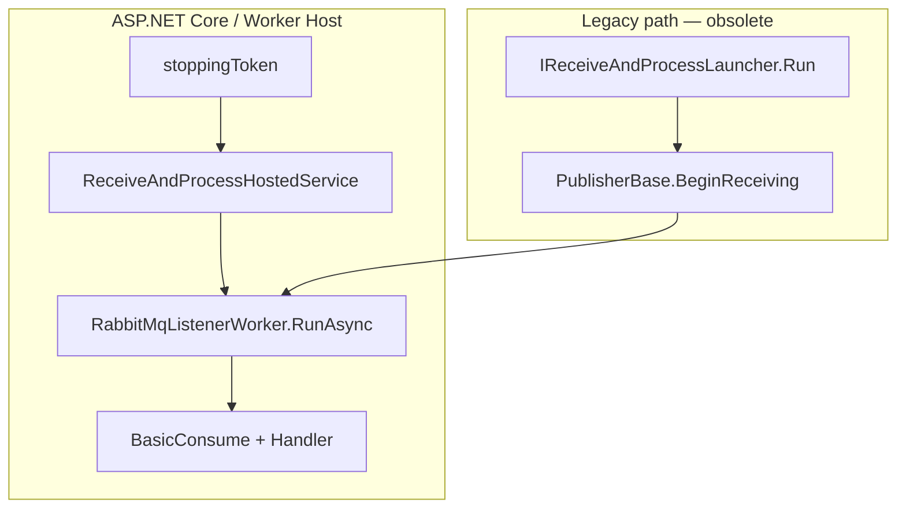
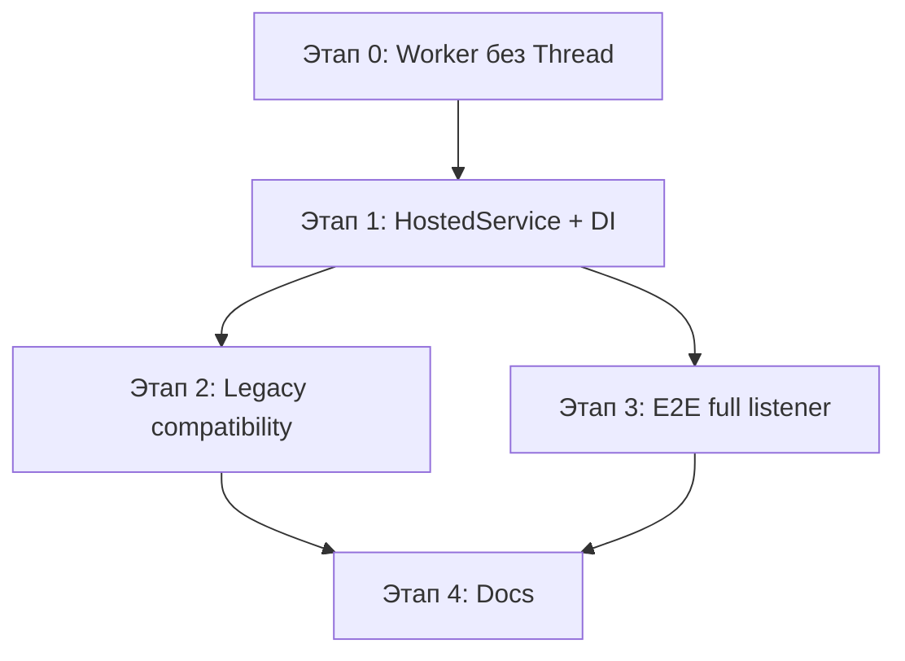

# План: миграция listener с Thread на IHostedService (техдолг #17)

**Статус:** выполнено  
**Создан:** 2026-07-03 20:46 (UTC+3)  
**Обновлён:** 2026-07-03 21:00 (UTC+3)  
**Основание:** [`../2026-07-03_2010-delivery-guarantee-full-analysis.md`](../2026-07-03_2010-delivery-guarantee-full-analysis.md) — техдолг #17  
**Цель:** заменить legacy lifecycle (`Task.Run` + `Thread`) на `IHostedService` / `BackgroundService` с graceful shutdown и сохранить backward compatibility для `IReceiveAndProcessLauncher`.

---

## Контекст проблемы

Сейчас цепочка запуска:

```
IReceiveAndProcessLauncher.Run()
  → PublisherBase.BeginReceiving()
    → ListenerBase.Start()
      → Task.Run → new Thread(Listen) → thread.Join()
        → RabbitMqListener.Listen() → ListenAsync().GetAwaiter().GetResult()
```

| Проблема | Где |
|----------|-----|
| Двойное threading (`Task.Run` + `Thread`) | [`ListenerBase.Start()`](../../src/IntegrationFlow.Core/Contexts/Integrations/03Domain/ReceiveAndProcess/ListenerBase.cs) |
| Sync-over-async на dedicated thread | [`RabbitMqListener.Listen()`](../../src/IntegrationFlow.Core/Contexts/Integrations/00InnerUsage/RabbitMq/ReceiveAndProcess/Listeners/RabbitMqListener.cs) |
| `GetStatus()` завязан на `thread.ThreadState` — хрупко, race на поле `thread` | [`ListenerBase.GetStatus()`](../../src/IntegrationFlow.Core/Contexts/Integrations/03Domain/ReceiveAndProcess/ListenerBase.cs) |
| `postStartAction` вызывается **после** `thread.Join()` — после **остановки** listener, не после старта | [`ListenerBase.Start()`](../../src/IntegrationFlow.Core/Contexts/Integrations/03Domain/ReceiveAndProcess/ListenerBase.cs) |
| Shutdown через `Dispose` + `Join(30s)` — не интегрирован с `IHostApplicationLifetime` | [`ListenerBase.Stop()`](../../src/IntegrationFlow.Core/Contexts/Integrations/03Domain/ReceiveAndProcess/ListenerBase.cs) |
| E2E-тесты обходят listener (риск #11) | [`ConsumerHandlerEndToEndTests`](../../tests/IntegrationFlow.Core.IntegrationTests/ConsumerHandlerEndToEndTests.cs) |

**Целевое состояние:** listener как `BackgroundService` на net8.0+ с `CancellationToken` от host; legacy `BeginReceiving()` сохраняется как compatibility path через тот же worker.

**Референс:** [`OutboxRelayBackgroundService`](../../src/IntegrationFlow.Core/Contexts/Integrations/03Domain/Outbox/OutboxRelayBackgroundService.cs) + [`AddIntegrationFlowOutboxRelay`](../../src/IntegrationFlow.Core/DependencyInjection/ServiceCollectionOutboxExtensions.cs).

---

## Целевая архитектура



**Принципы:**

- Один worker (`RunAsync`) — единственная реализация listen loop; hosted service и legacy path вызывают его.
- `Thread` удаляется полностью.
- `#if NET8_0_OR_GREATER` — как у outbox relay.
- netstandard2.0 — только worker + ручной вызов `RunAsync(ct)` (без hosted service).

---

## Этапы

| Этап | Приоритет | Effort | Impact |
|------|-----------|--------|--------|
| 0 — Рефакторинг worker | P0 | ~1 день | Убрать Thread, единый async entry point |
| 1 — HostedService + DI | P0 | ~2 дня | Production-ready lifecycle |
| 2 — Legacy compatibility | P1 | ~0.5 дня | Без breaking change для samples |
| 3 — E2E full listener | P1 | ~1–2 дня | Закрыть риск #11 |
| 4 — Docs + deprecation | P2 | ~0.5 дня | Migration guide |

**MVP:** этапы **0 + 1**.



---

## Этап 0 — Выделить async worker, убрать Thread (P0)

### 0.1 Новый internal worker

Файл: `src/IntegrationFlow.Core/Contexts/Integrations/00InnerUsage/RabbitMq/ReceiveAndProcess/Workers/RabbitMqListenerWorker.cs`

```csharp
internal sealed class RabbitMqListenerWorker
{
    public async Task RunAsync(
        RabbitMqConfiguration configuration,
        Func<object, Task> processMessageAsync,
        IIntegrationLogger logger,
        CancellationToken cancellationToken)
    {
        // Логика из RabbitMqListener.ListenAsync:
        // connection, channel, BasicQos, BasicConsume, handler
        // ожидание shutdown через cancellationToken
    }
}
```

### 0.2 Упростить `RabbitMqListener`

- Удалить `Listen(object configuration)`.
- `RabbitMqListener` делегирует в `RabbitMqListenerWorker`, передавая `ProcessMessageAsync`.
- `DisposeInternal` — закрытие channel/connection (как сейчас).

### 0.3 Переписать `ListenerBase`

**Удалить:** поле `Thread`, `Task.Run` + `new Thread`, `thread.Join`.

**Добавить:**

```csharp
private CancellationTokenSource runCts;
private Task runTask;

internal void Start(Action postStartAction = null)
{
    runCts = new CancellationTokenSource();
    runTask = RunAsync(runCts.Token);
    postStartAction?.Invoke(); // fix: после старта, не после Join
}

internal async Task StopAsync()
{
    runCts?.Cancel();
    if (runTask != null)
        await runTask.WaitAsync(TimeSpan.FromSeconds(30));
    Dispose();
}

protected abstract Task RunAsync(CancellationToken cancellationToken);
```

**Заменить** `Listen(object)` на `RunAsync(CancellationToken)`.

### 0.4 Исправить `GetStatus()`

Статус по флагу `listening` + `connection.IsOpen` (уже есть в `RabbitMqListener.GetStatusInternal`), **не** по `ThreadState`.

### 0.5 Убрать polling loop

В `ListenAsync` заменить `while + Task.Delay(500)` на ожидание закрытия connection / `cancellationToken` (например `TaskCompletionSource` + `ConnectionShutdown`).

### Критерии готовности этапа 0

- [ ] `Thread` нигде не используется в ReceiveAndProcess
- [ ] `postStartAction` вызывается после запуска consumer
- [ ] `GetStatus()` не использует `ThreadState`
- [ ] Существующие unit-тесты handler/dedup зелёные
- [ ] Samples `BeginReceiving()` работают как раньше

---

## Этап 1 — HostedService + DI (P0, net8.0)

### 1.1 Hosted service

Файл: `src/IntegrationFlow.Core/Contexts/Integrations/03Domain/ReceiveAndProcess/ReceiveAndProcessHostedService.cs`

```csharp
#if NET8_0_OR_GREATER
internal sealed class ReceiveAndProcessHostedService : BackgroundService
{
    private readonly ReceiveAndProcessHostedServiceOptions options;
    private readonly IIntegrationLogger logger;
    private readonly RabbitMqListenerWorker worker;

    protected override Task ExecuteAsync(CancellationToken stoppingToken)
        => worker.RunAsync(options.Configuration, options.ProcessMessageAsync, logger, stoppingToken);
}
#endif
```

### 1.2 Options + registration

Файл: `src/IntegrationFlow.Core/DependencyInjection/ServiceCollectionReceiveAndProcessExtensions.cs`

```csharp
public static IServiceCollection AddIntegrationFlowRabbitMqListener<TSide>(
    this IServiceCollection services,
    string? profileName = null)
    where TSide : RabbitMqIntegrationPublisherSideBase, new()
{
#if NET8_0_OR_GREATER
    services.AddHostedService<ReceiveAndProcessHostedService>(sp => ...);
#endif
    return services;
}

// Multi-profile:
public static IServiceCollection AddIntegrationFlowRabbitMqListeners(
    this IServiceCollection services,
    Action<RabbitMqListenerRegistrationBuilder> configure);
```

Пример использования:

```csharp
services.AddIntegrationFlow();
services.AddIntegrationFlowRabbitMqListener<InboxRabbitMqPublisherSide>("Inbox");
```

### 1.3 Processor/Publisher из DI

Сейчас `PublisherBase.Create` + `TypeCollection` — singleton cache через `Activator`. Для hosted service:

- `IReceiveAndProcessSessionFactory` — создаёт `(PublisherBase, ProcessorBase)` для профиля;
- или factory внутри hosted service, переиспользующий `PublisherBase.Create` + `GetProcessor`.

### 1.4 Graceful shutdown

- `stoppingToken` от host → cancel consumer → `BasicCancel` + close channel.
- Таймаут остановки: 30s (как в текущем `Stop()`).

### Критерии готовности этапа 1

- [ ] Worker Service / ASP.NET Core host стартует listener через DI
- [ ] `IHost.StopAsync()` корректно останавливает consumer за < 30s
- [ ] Несколько профилей = несколько `IHostedService` instances

---

## Этап 2 — Legacy compatibility (P1)

### 2.1 `BeginReceiving()` → worker

`PublisherBase.BeginReceiving()` продолжает вызывать `Listener.Start()`, который внутри использует тот же `RunAsync` без `Thread`.

### 2.2 Obsolete (net8.0 only)

```csharp
#if NET8_0_OR_GREATER
[Obsolete("Use AddIntegrationFlowRabbitMqListener() and IHost instead.")]
#endif
public virtual void BeginReceiving(...)
```

### 2.3 Обновить samples

- Новый sample: hosted Worker / minimal API host.
- Старые launchers: `#pragma warning disable 618` + комментарий «legacy».

Файлы:

- [`SampleRabbitMqReceiveAndProcessLauncher.cs`](../../src/IntegrationFlow.Core/Contexts/Integrations/00Samples/ReceiveAndProcess/SampleRabbitMqReceiveAndProcessLauncher.cs)

### Критерии готовности этапа 2

- [ ] Legacy path работает без breaking change
- [ ] Obsolete warning на net8.0 при `BeginReceiving()`
- [ ] Sample hosted listener в README

---

## Этап 3 — E2E full listener lifecycle (P1)

Файл: `tests/IntegrationFlow.Core.IntegrationTests/RabbitMqListenerHostedEndToEndTests.cs`

| Тест | Поведение |
|------|-----------|
| `HostedService_StartsConsumerAndProcessesMessage` | `Host` + `AddIntegrationFlowRabbitMqListener` → publish → handler invoked |
| `HostedService_StopAsync_GracefullyWaitsInFlightMessage` | slow handler + stop → ack или nack, no hang |
| `HostedService_MultiProfile_TwoQueuesIndependent` | 2 hosted services, разные очереди |

Закрывает **риск #11** из [`2026-07-03_2010-delivery-guarantee-full-analysis.md`](../2026-07-03_2010-delivery-guarantee-full-analysis.md).

### Критерии готовности этапа 3

- [ ] ≥ 3 integration-теста full listener через host
- [ ] Trait `Category=Integration`, skip без Docker

---

## Этап 4 — Документация (P2)

| Файл | Действие |
|------|----------|
| [`README.md`](../../README.md) | Секция «Hosted listener (рекомендуется)» vs «Legacy launcher» |
| [`2026-07-03_2010-delivery-guarantee-full-analysis.md`](../2026-07-03_2010-delivery-guarantee-full-analysis.md) | Пометить #17 как «в работе» → «закрыт» после реализации |
| Этот план | Статус **выполнено** после merge |

---

## Что сознательно не меняем

| Тема | Причина |
|------|---------|
| `PrefetchCount` default | Остаётся 1; параллельность — отдельный риск #5 |
| `AsyncEventingBasicConsumer` | Достаточен; переход на sync consumer не нужен |
| netstandard2.0 hosted worker | Нет `Microsoft.Extensions.Hosting` в TFM; только manual `RunAsync` |
| [`IntegrationScheduler`](../../src/IntegrationFlow.Core/Contexts/Integrations/Scheduler/IntegrationScheduler.cs) | Закомментирован; вне scope |

---

## Риски миграции

| Риск | Mitigation |
|------|------------|
| Breaking change для `IReceiveAndProcessLauncher` | Obsolete, не удалять; legacy path через тот же worker |
| Multi-instance hosted service + `TypeCollection` cache | Явный cache key per profile; тест multi-profile |
| Deadlock при stop + in-flight message | `WaitAsync(30s)` + cancel consumer; E2E test |
| netstandard2.0 consumers | Документировать manual `RunAsync` loop |

---

## Чеклист реализации

- [x] **Этап 0:** worker, убрать Thread, fix postStartAction, fix GetStatus
- [x] **Этап 1:** `ReceiveAndProcessHostedService`, DI extensions, graceful shutdown
- [x] **Этап 2:** obsolete BeginReceiving, обновить samples
- [x] **Этап 3:** E2E hosted listener tests
- [x] **Этап 4:** README + update risk analysis #17

**Ожидаемый итог:** listener интегрирован с .NET host lifecycle, техдолг #17 закрыт, риск #11 частично закрыт E2E-тестами.

---

## Связанные документы

- [`../2026-07-03_2010-delivery-guarantee-full-analysis.md`](../2026-07-03_2010-delivery-guarantee-full-analysis.md) — техдолг #17, риск #11
- [`2026-07-03_1707-e2e-tests-and-remaining-gaps.md`](2026-07-03_1707-e2e-tests-and-remaining-gaps.md) — E2E gaps (handler без listener)
- [`2026-07-03_1523-delivery-guarantee-hardening.md`](2026-07-03_1523-delivery-guarantee-hardening.md) — предыдущий fix `Thread.Abort`
