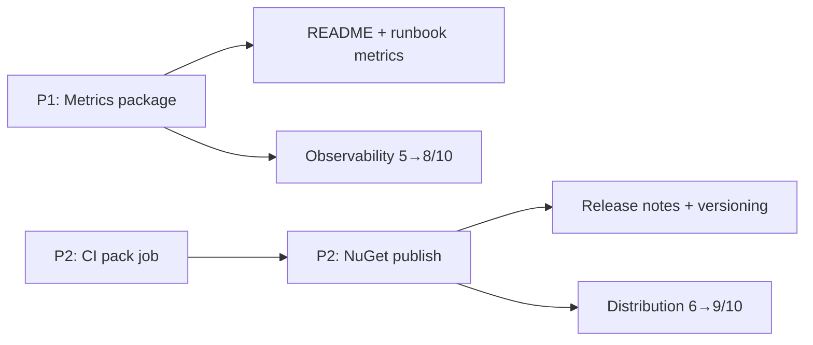

# План: закрытие P1 (metrics) и P2 (NuGet publish)

**Статус:** выполнено  
**Создан:** 2026-07-04 08:36 (UTC+3)  
**Обновлён:** 2026-07-04 08:45 (UTC+3)  
**Основание:** [`../2026-07-03_2201-integrationflow-full-analysis.md`](../2026-07-03_2201-integrationflow-full-analysis.md), раздел 7  
**Цель:** закрыть observability gap (reference metrics) и distribution gap (автопубликация NuGet)  
**Оценка суммарно:** ~3–4 рабочих дня

---

## Текущее состояние

| Задача | Приоритет | Статус |
|--------|-----------|--------|
| Reference implementation `IIntegrationFlowMetrics` | **P1** | Открыт — hooks есть, реализация только `NullIntegrationFlowMetrics` |
| CI `dotnet pack` + publish to NuGet.org | **P2** | Открыт — packaging работает локально, CI только build+test |
| Runbook abandoned outbox replay | P2 | **Закрыт** — [`../runbooks/2026-07-03_2216-abandoned-outbox-replay.md`](../runbooks/2026-07-03_2216-abandoned-outbox-replay.md) |



**Рекомендуемый порядок:** P1 → P2 (метрики нужны до первого prod-release; publish логичен после стабилизации API).

---

## P1 — Reference implementation `IIntegrationFlowMetrics`

### Проблема

`IIntegrationFlowMetrics` уже wired в DI (`AddIntegrationFlow` → `NullIntegrationFlowMetrics`), consumer и outbox relay вызывают hooks — но **нет готовой реализации** для Prometheus/Grafana/OTel. Каждый потребитель пишет свою.

Текущий контракт: [`IIntegrationFlowMetrics`](../../src/IntegrationFlow.Core/Contexts/Integrations/03Domain/Metrics/IIntegrationFlowMetrics.cs).

### Решение: отдельный optional-пакет

**Не** добавлять Prometheus/OTel в `IntegrationFlow.Core` — сохранить минимальные зависимости.

| Решение | Плюсы | Минусы |
|---------|-------|--------|
| **`IntegrationFlow.Metrics.OpenTelemetry`** на `System.Diagnostics.Metrics` | Нет лишних deps; работает с OTel SDK, Prometheus exporter, `dotnet-counters`, ASP.NET metrics | Нужен exporter в приложении |
| `prometheus-net` в Core | Прямой `/metrics` endpoint | Тянет HTTP stack, opinionated |
| Два пакета (OTel + Prometheus) | Максимальная гибкость | Over-engineering для v1 |

**Рекомендация:** один пакет `IntegrationFlow.Metrics.OpenTelemetry` (net8.0), реализация через **`System.Diagnostics.Metrics.Meter`** — стандарт .NET 8, совместим с OpenTelemetry и Prometheus через exporter приложения.

### Этап 1.1 — Новый проект (~0.5 дня)

```
src/IntegrationFlow.Metrics.OpenTelemetry/
├── IntegrationFlow.Metrics.OpenTelemetry.csproj
├── OpenTelemetryIntegrationFlowMetrics.cs      # IIntegrationFlowMetrics
├── IntegrationFlowMeter.cs                       # Meter + instrument definitions
└── DependencyInjection/
    └── ServiceCollectionMetricsExtensions.cs     # AddIntegrationFlowOpenTelemetryMetrics()
```

**csproj:**

- `TargetFramework`: net8.0
- `PackageId`: `IntegrationFlow.Metrics.OpenTelemetry`
- `ProjectReference` → `IntegrationFlow.Core`
- Без зависимостей на `OpenTelemetry.*` — только BCL `System.Diagnostics.Metrics`

**Добавить в solution** + тестовый проект `IntegrationFlow.Metrics.OpenTelemetry.Tests`.

### Этап 1.2 — Каталог метрик (~0.5 дня)

Meter name: `IntegrationFlow` (константа, overridable через options).

| Метод интерфейса | Instrument | Имя | Тип | Tags |
|------------------|------------|-----|-----|------|
| `RecordMessageProcessed` | duration | `integrationflow.message.processing.duration` | Histogram | `profile`, `success` |
| `RecordMessageProcessed` | count | `integrationflow.message.processed` | Counter | `profile`, `success` |
| `RecordOutboxRelayPublished` | — | `integrationflow.outbox.relay.published` | Counter | — |
| `RecordOutboxRelayFailed` | — | `integrationflow.outbox.relay.failed` | Counter | — |
| `RecordOutboxRelayAbandoned` | — | `integrationflow.outbox.relay.abandoned` | Counter | — |
| `RecordOutboxPending` | — | `integrationflow.outbox.pending` | ObservableGauge | — |

**Конвенции:**

- Единицы duration — секунды (`duration.TotalSeconds`)
- `profile` — значение из `profileName` (sanitize: lowercase, replace `.` → `_`)
- `success` — `"true"` / `"false"`

### Этап 1.3 — DI extension (~0.25 дня)

```csharp
public static IServiceCollection AddIntegrationFlowOpenTelemetryMetrics(
    this IServiceCollection services,
    Action<IntegrationFlowMetricsOptions>? configure = null)
{
    // options: MeterName, optional prefix
    services.RemoveAll<IIntegrationFlowMetrics>();
    services.AddSingleton<IIntegrationFlowMetrics, OpenTelemetryIntegrationFlowMetrics>();
    return services;
}
```

**Wire-up в приложении:**

```csharp
services.AddIntegrationFlow();
services.AddIntegrationFlowOpenTelemetryMetrics();

// + в host app (не в библиотеке):
// builder.Services.AddOpenTelemetry()
//     .WithMetrics(m => m.AddMeter("IntegrationFlow")
//         .AddPrometheusExporter());
```

### Этап 1.4 — Тесты (~0.5 дня)

Файл: `tests/IntegrationFlow.Metrics.OpenTelemetry.Tests/OpenTelemetryIntegrationFlowMetricsTests.cs`

| Тест | Проверка |
|------|----------|
| `RecordMessageProcessed_IncrementsCounter` | `MeterListener` / `MetricCollector` — counter + histogram |
| `RecordOutboxRelay_*` | batch counters increment by `count` |
| `RecordOutboxPending_SetsGauge` | observable gauge callback returns last value |
| `AddIntegrationFlowOpenTelemetryMetrics_ReplacesNull` | DI resolves `OpenTelemetryIntegrationFlowMetrics` |

Использовать `System.Diagnostics.Metrics.Metrics` + `MeterListener` (без реального OTel SDK).

### Этап 1.5 — Документация (~0.25 дня)

- README: секция «Observability» с примером wiring + Prometheus/Grafana
- [`../runbooks/`](../runbooks/) — **`2026-07-04_*-metrics-and-alerting.md`**: рекомендуемые алерты:
  - `integrationflow.outbox.pending > N` — backlog
  - `rate(integrationflow.outbox.relay.abandoned[5m]) > 0` — abandoned messages
  - `rate(integrationflow.message.processed{success="false"}[5m])` — handler failures
- Обновить [`../2026-07-03_2201-integrationflow-full-analysis.md`](../2026-07-03_2201-integrationflow-full-analysis.md) — риск #20 → закрыт

### Критерии приёмки P1

- [x] Пакет `IntegrationFlow.Metrics.OpenTelemetry` собирается и packable
- [x] `AddIntegrationFlowOpenTelemetryMetrics()` заменяет `NullIntegrationFlowMetrics`
- [x] Unit-тесты через `MeterListener` зелёные
- [x] README + runbook с примером Grafana/Prometheus
- [x] Core **не** получает новых зависимостей

---

## P2 — CI `dotnet pack` + publish to NuGet.org

### Проблема

[`Directory.Build.props`](../../Directory.Build.props) задаёт `Version 1.0.0`, `IsPackable=true`, локально `dotnet pack` работает — но **CI не проверяет pack** и **не публикует** на NuGet.org.

Текущий CI: [`.github/workflows/ci.yml`](../../.github/workflows/ci.yml) — только build + test.

### Этап 2.1 — Версионирование (~0.5 дня)

**Стратегия:** SemVer, источник версии — git tag.

| Триггер | Версия | Пример |
|---------|--------|--------|
| Push в `master` (без tag) | `1.0.0-ci.{run_number}` | Pre-release, **не публикуется** |
| Git tag `v1.0.0` | `1.0.0` | Stable release |
| Git tag `v1.0.1` | `1.0.1` | Patch |

**Изменения:**

1. `Directory.Build.props` — убрать hardcoded `Version`, добавить:

   ```xml
   <Version Condition="'$(Version)' == ''">1.0.0</Version>
   ```

2. CI передаёт `-p:Version=${{ ... }}` при pack
3. Добавить `CHANGELOG.md` (Keep a Changelog) — минимум для v1.0.0

**Symbol packages:**

```xml
<IncludeSymbols>true</IncludeSymbols>
<SymbolPackageFormat>snupkg</SymbolPackageFormat>
```

**README в пакете:**

```xml
<PackageReadmeFile>README.md</PackageReadmeFile>
<None Include="../../README.md" Pack="true" PackagePath="\" />
```

(или краткий `PACKAGE.md` в каждом src-проекте)

### Этап 2.2 — CI job `pack` (~0.5 дня)

Файл: [`.github/workflows/ci.yml`](../../.github/workflows/ci.yml)

```yaml
pack:
  runs-on: ubuntu-latest
  needs: [unit, integration]
  steps:
    - uses: actions/checkout@v4
    - uses: actions/setup-dotnet@v4
      with:
        dotnet-version: '8.0.x'
    - run: dotnet restore IntegrationFlow.sln
    - run: dotnet pack IntegrationFlow.sln -c Release --no-restore -o ./artifacts
    - uses: actions/upload-artifact@v4
      with:
        name: nuget-packages
        path: artifacts/*.nupkg
```

**Packable projects** (3 после P1):

| PackageId | Проект |
|-----------|--------|
| `IntegrationFlow.Core` | src/IntegrationFlow.Core |
| `IntegrationFlow.EntityFrameworkCore` | src/IntegrationFlow.EntityFrameworkCore |
| `IntegrationFlow.Metrics.OpenTelemetry` | src/IntegrationFlow.Metrics.OpenTelemetry |

Тест-проекты: `IsPackable=false` (уже по умолчанию).

**Smoke-check в CI:**

```bash
dotnet pack ...
# verify .nupkg contains lib/net8.0 and lib/netstandard2.0 for Core
```

### Этап 2.3 — CI workflow `release` (~1 день)

Новый файл: `.github/workflows/release.yml`

```yaml
name: Release

on:
  push:
    tags:
      - 'v*.*.*'
  workflow_dispatch:
    inputs:
      version:
        description: 'SemVer version (e.g. 1.0.0)'
        required: true

jobs:
  publish:
    runs-on: ubuntu-latest
    steps:
      - checkout + setup dotnet
      - dotnet pack -c Release -p:Version=${VERSION} -o ./artifacts
      - dotnet nuget push artifacts/*.nupkg
          --api-key ${{ secrets.NUGET_API_KEY }}
          --source https://api.nuget.org/v3/index.json
          --skip-duplicate
      - dotnet nuget push artifacts/*.snupkg ...  # symbols
```

**Secrets (GitHub repo settings):**

| Secret | Назначение |
|--------|------------|
| `NUGET_API_KEY` | API key с scope `Push` для `IntegrationFlow.*` |

**NuGet.org подготовка (ручная, до первого release):**

1. Создать аккаунт / org на nuget.org
2. Зарезервировать ID: `IntegrationFlow.Core`, `IntegrationFlow.EntityFrameworkCore`, `IntegrationFlow.Metrics.OpenTelemetry`
3. Сгенерировать API key, добавить в GitHub Secrets

### Этап 2.4 — Release process (~0.25 дня)

Документ: `docs/runbooks/2026-07-04_*-nuget-release.md`

**Checklist релиза:**

1. Все тесты зелёные на `master`
2. Обновить `CHANGELOG.md`
3. `git tag v1.0.0 && git push origin v1.0.0`
4. CI `release.yml` публикует пакеты
5. Проверить на nuget.org: версия, README, dependencies
6. Обновить [`../2026-07-03_2201-integrationflow-full-analysis.md`](../2026-07-03_2201-integrationflow-full-analysis.md) — риск #21 → закрыт

**Первый релиз:** `v1.0.0` — текущий stable API после P0–P2 gaps.

### Критерии приёмки P2

- [x] CI job `pack` на каждый PR/push — artifact `.nupkg` без ошибок
- [x] Tag `v*.*.*` триггерит publish на NuGet.org (workflow готов)
- [x] Symbol packages (`.snupkg`) публикуются
- [x] README виден на странице пакета
- [x] Runbook release process задокументирован
- [ ] `NUGET_API_KEY` настроен (ручная ops-задача)

---

## Риски и митигация

| Риск | Вероятность | Mitigation |
|------|-------------|------------|
| Конфликт имён метрик с приложением | Низкая | Префикс `integrationflow.*`, настраиваемый `MeterName` |
| Breaking change в OTel API | Низкая | Зависим только от BCL `System.Diagnostics.Metrics` |
| NuGet ID уже занят | Средняя | Проверить nuget.org **до** первого push; fallback: `OrlovAlexander.IntegrationFlow.Core` |
| Случайный publish pre-release | Средняя | Publish **только** на tag `v*.*.*`; CI versions — artifact only |
| Три пакета — рассинхрон версий | Низкая | Один `Version` из `Directory.Build.props`, pack всей solution |
| Core netstandard2.0 — metrics только net8 | Ожидаемо | Документировать: metrics package — net8.0 only (как EF) |

---

## Сводная оценка effort

| Этап | Effort | Зависимости |
|------|--------|-------------|
| P1.1–P1.3 Metrics package + DI | 1.25 дня | — |
| P1.4–P1.5 Tests + docs | 0.75 дня | P1.1 |
| P2.1 Versioning + package metadata | 0.5 дня | — |
| P2.2 CI pack job | 0.5 дня | P2.1 |
| P2.3–P2.4 Release workflow + runbook | 1.25 дня | P2.2, P1 (для 3-го пакета) |
| **Итого** | **~4 дня** | P1 → P2 |

---

## Definition of Done (оба P1 + P2)

1. Observability: `IntegrationFlow.Metrics.OpenTelemetry` на NuGet, README с примером Prometheus
2. Distribution: tag `v1.0.0` → три пакета на NuGet.org
3. CI: pack на каждый push, publish на tag
4. Docs: runbooks (metrics alerting + nuget release), analysis doc обновлён
5. Оценки в analysis: Observability **5→8/10**, Distribution **6→9/10**
