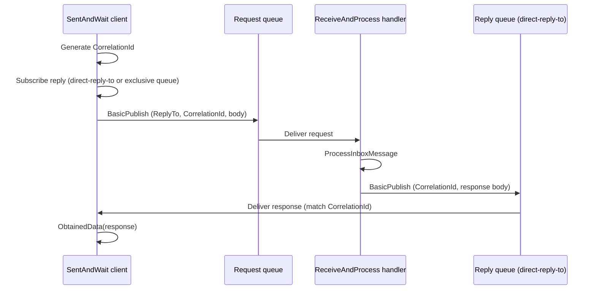

# План: RabbitMQ для SentAndWait (request-reply)

**Статус:** выполнено  
**Создан:** 2026-07-04 09:04 (UTC+3)  
**Обновлён:** 2026-07-04 09:15 (UTC+3)  
**Основание:** [`../2026-07-04_0901-integrationflow-full-analysis.md`](../2026-07-04_0901-integrationflow-full-analysis.md), раздел 7 (P3)  
**Цель:** реализовать синхронный request-reply через RabbitMQ для паттерна SentAndWait — клиент (запрос + ожидание ответа) и сервер (обработка + reply)  
**Оценка суммарно:** ~6–8 рабочих дней (MVP + E2E + docs)

---

## Контекст

Паттерн **SentAndWait** уже реализован как доменный оркестратор, но **без RabbitMQ-транспорта**:

[`SentAndWaitIntegration.Integrate()`](../../src/IntegrationFlow.Core/Contexts/Integrations/03Domain/SentAndWait/SentAndWaitIntegration.cs) выполняет цепочку: formatter → logging → `GetTransmitterConfiguration` → `GetConnection` → `GetTransmitter().Transmit()` → validator → result handler.

Единственный транспорт — REST sample [`RESTSimpleTransmitter`](../../src/IntegrationFlow.Core/Contexts/Integrations/00Samples/Transmitters/RESTSimpleTransmitter.cs): синхронный HTTP без гарантий доставки, без DI-расширений уровня RabbitMQ.

RabbitMQ в проекте уже покрывает:

| Сценарий | Статус | Ключевые компоненты |
|----------|--------|---------------------|
| **ReceiveAndProcess** | Production-ready | `RabbitMqListenerWorker`, dedup, hosted service |
| **SentAndForgot** | Production-ready | `RabbitMqPublishTransmitter`, outbox relay |
| **SentAndWait** | REST only | — |

В [`2026-06-20_2150-brokers-for-integration-framework.md`](../2026-06-20_2150-brokers-for-integration-framework.md) RabbitMQ для SentAndWait описан как **request-reply через `reply-to` + correlation id** — стандартный AMQP-паттерн, но в коде не реализован.

---

## Текущее состояние (gap analysis)

### Домен SentAndWait

| Компонент | Состояние | Gap |
|-----------|-----------|-----|
| `SentAndWaitIntegration` | Sync orchestrator | Исключения глотаются в `catch` (строка 221–224) — нет явного fail path |
| `TransmitData` | Только `object Data` | Нет `MessageId` / `CorrelationId` (в SentAndForgot уже есть) |
| `ITransmitter.Transmit()` | Sync, возвращает `ObtainedData` | Нет `TransmitWithResult()` / typed errors |
| `ISentAndWaitIntegrationOppositeSideProvider` | DI hook есть | Нет RabbitMQ provider/sample |
| `IConnection` | `NeedReconnect` / `Reconnect` | Минимальный контракт — достаточен |

### RabbitMQ инфраструктура (переиспользуем)

- [`RabbitMqConnectionFactory`](../../src/IntegrationFlow.Core/Contexts/Integrations/00InnerUsage/RabbitMq/RabbitMqConnectionFactory.cs) — создание `ConnectionFactory`
- [`RabbitMqPublishConfiguration`](../../src/IntegrationFlow.Core/Contexts/Integrations/00InnerUsage/RabbitMq/SentAndForgot/Configurations/RabbitMqPublishConfiguration.cs) — connection settings, target queue/exchange
- [`RabbitMqPublishConfigurationLoader`](../../src/IntegrationFlow.Core/Contexts/Integrations/00InnerUsage/RabbitMq/SentAndForgot/Configurations/RabbitMqPublishConfigurationLoader.cs) — multi-profile JSON
- [`RabbitMqPublishTransmitter.SerializeBody`](../../src/IntegrationFlow.Core/Contexts/Integrations/00InnerUsage/RabbitMq/SentAndForgot/Transmitters/RabbitMqPublishTransmitter.cs) — сериализация payload

### ReceiveAndProcess (серверная сторона)

- [`RabbitMqReceivedMessage`](../../src/IntegrationFlow.Core/Contexts/Integrations/00InnerUsage/RabbitMq/ReceiveAndProcess/Messages/RabbitMqReceivedMessage.cs) — есть `MessageId`, `CorrelationId`
- **`ReplyTo` не захватывается** — `RabbitMqListenerWorker` не пробрасывает AMQP `ReplyTo`
- Нет helper для publish reply из handler

---

## Целевая архитектура



### Два участника протокола

| Роль | Паттерн каркаса | Что реализуем |
|------|-----------------|---------------|
| **Client** (caller) | SentAndWait | `RabbitMqRequestReplyTransmitter` — publish + wait |
| **Server** (responder) | ReceiveAndProcess | Reply helper + sample handler с `ReplyTo` |

Полный roundtrip требует **обе стороны**. MVP без server reply бесполезен для E2E.

---

## Выбор паттерна reply (AMQP)

| Режим | Описание | Плюсы | Минусы |
|-------|----------|-------|--------|
| **`DirectReplyTo`** (рекомендуется для v1) | `ReplyTo = "amq.rabbitmq.reply-to"` | Нет declare очереди; стандарт RabbitMQ RPC | Требует RabbitMQ ≥ 3.4; pseudo-queue |
| **`ExclusiveQueue`** | `QueueDeclare` exclusive + auto-delete | Работает везде | Доп. roundtrip declare; утечки при crash без dispose |
| **`FixedReplyQueue`** | Именованная очередь + CorrelationId filter | Подходит для long-lived clients | Нужна изоляция correlation; риск cross-talk |

**Рекомендация v1:** `ReplyMode = DirectReplyTo` по умолчанию; `ExclusiveQueue` — fallback через конфиг.

### Протокол сообщений

**Request (client → server):**

| AMQP property | Значение |
|---------------|----------|
| `CorrelationId` | `Guid.NewGuid("N")` (генерируется transmitter) |
| `ReplyTo` | `amq.rabbitmq.reply-to` или имя exclusive queue |
| `MessageId` | Опционально; для dedup на server — рекомендуется |
| `ContentType` | Из конфига (`application/json`) |
| `DeliveryMode` | `2` если `Persistent=true` |

**Response (server → client):**

| AMQP property | Значение |
|---------------|----------|
| `CorrelationId` | Копия из request |
| `ContentType` | Из конфига или `application/json` |

---

## Структура файлов (новые)

```
src/IntegrationFlow.Core/Contexts/Integrations/
├── 00InnerUsage/RabbitMq/SentAndWait/
│   ├── Configurations/
│   │   ├── RabbitMqRequestReplyConfiguration.cs
│   │   ├── RabbitMqRequestReplyTarget.cs          // enum: Queue | Exchange (как PublishTarget)
│   │   ├── RabbitMqReplyMode.cs                   // enum: DirectReplyTo | ExclusiveQueue
│   │   └── RabbitMqRequestReplyConfigurationLoader.cs
│   ├── Connections/
│   │   └── RabbitMqRequestReplyConnection.cs
│   ├── Transmitters/
│   │   └── RabbitMqRequestReplyTransmitter.cs
│   ├── Reply/
│   │   └── RabbitMqReplyPublisher.cs              // server-side helper
│   ├── Exceptions/
│   │   ├── RequestReplyTimeoutException.cs
│   │   └── ReplyNotReceivedException.cs
│   └── RabbitMqSentAndWaitIntegrationOppositeSideBase.cs
├── 00InnerUsage/RabbitMq/ReceiveAndProcess/Messages/
│   └── RabbitMqReceivedMessage.cs                 // + ReplyTo property
├── 00Samples/SentAndWait/
│   ├── SampleRabbitMqSentAndWaitProvider.cs
│   ├── SampleRabbitMqRequestReplyOppositeSide.cs
│   └── SampleRabbitMqReplyHandler.cs              // hosted listener + reply
tests/IntegrationFlow.Core.Tests/RabbitMq/SentAndWait/
    ├── RabbitMqRequestReplyConfigurationLoaderTests.cs
    ├── RabbitMqRequestReplyTransmitterTests.cs    // mock IModel + ManualResetEventSlim
    └── RabbitMqReplyPublisherTests.cs
tests/IntegrationFlow.Core.IntegrationTests/
    └── RabbitMqRequestReplyEndToEndTests.cs       // Testcontainers roundtrip
```

Доменные интерфейсы SentAndWait (`IConfiguration`, `IConnection`, `ITransmitter`) **не меняем** в v1 — расширения только internal/optional.

---

## 1. Модель конфигурации

### Секция JSON: `RabbitMqRequestReply`

Расширить [`rabbitmq.json`](../../src/IntegrationFlow.Core/Contexts/Integrations/00Samples/ReceiveAndProcess/rabbitmq.json):

```json
{
  "RabbitMqRequestReply": {
    "OrdersRpc": {
      "HostName": "localhost",
      "Port": 5672,
      "UserName": "guest",
      "Password": "guest",
      "VirtualHost": "/",
      "RequestTarget": "Queue",
      "QueueName": "orders.rpc.requests",
      "ContentType": "application/json",
      "Persistent": true,
      "ReplyMode": "DirectReplyTo",
      "ResponseTimeoutSeconds": 30,
      "ValidateTopology": true,
      "ClientProvidedName": "IntegrationFlow.OrdersRpcClient"
    }
  }
}
```

### `RabbitMqRequestReplyConfiguration`

| Свойство | Тип | По умолчанию | Назначение |
|----------|-----|--------------|------------|
| `Name` | `string` | — | Имя профиля |
| Connection | как `RabbitMqPublishConfiguration` | — | Host, port, credentials |
| `RequestTarget` | `Queue` \| `Exchange` | `Queue` | Куда отправлять request |
| `QueueName` / `Exchange` / `RoutingKey` | `string` | — | Target request |
| `ReplyMode` | `DirectReplyTo` \| `ExclusiveQueue` | `DirectReplyTo` | Куда ждать reply |
| `ResponseTimeoutSeconds` | `int` | `30` | Таймаут ожидания ответа |
| `ContentType` | `string` | `application/json` | MIME request/response |
| `Persistent` | `bool` | `true` | DeliveryMode request |
| `ValidateTopology` | `bool` | `true` | Passive declare request queue/exchange |
| `Mandatory` | `bool` | `false` | BasicPublish request |
| `ClientProvidedName` | `string` | `IntegrationFlow.RabbitMqRpcClient` | Идентификация на брокере |

### Loader API (по образцу publish)

| Метод | Назначение |
|-------|------------|
| `LoadProfile("OrdersRpc")` | Профиль по имени |
| `LoadAll()` | Все профили |
| `Load()` / `LoadSingle(path)` | Единственный профиль |

---

## 2. Клиентская сторона (SentAndWait)

### 2.1 `RabbitMqRequestReplyConnection`

- Одно AMQP-соединение, **два канала** (рекомендуется):
  - **Publish channel** — `BasicPublish` request + publisher confirms (опционально)
  - **Consume channel** — подписка на reply (`BasicConsume` на direct-reply-to или exclusive queue)
- `NeedReconnect()` / `Reconnect()` — как в `RabbitMqPublishConnection`
- `IDisposable` — закрытие channels + connection; удаление exclusive queue при dispose

### 2.2 `RabbitMqRequestReplyTransmitter`

Реализует `ITransmitter` (SentAndWait):

```
Transmit(TransmitData data):
  1. correlationId = Guid.NewGuid("N")
  2. replyTo = ResolveReplyTo(connection, config.ReplyMode)
  3. Register pending TaskCompletionSource keyed by correlationId
  4. BasicPublish(request) with ReplyTo + CorrelationId
  5. await/wait response with ResponseTimeoutSeconds
  6. On match: return ObtainedData(body)
  7. On timeout: throw RequestReplyTimeoutException → caught by Integrate → ObtainedData failed
```

**Сериализация:** переиспользовать `RabbitMqPublishTransmitter.SerializeBody`.

**Concurrent requests:** один transmitter instance = один in-flight request (lock). Для параллельных RPC — отдельные connection instances или correlation map + thread-safe dictionary (этап 2).

### 2.3 `RabbitMqSentAndWaitIntegrationOppositeSideBase`

По образцу [`RabbitMqSentAndForgotIntegrationOppositeSideBase`](../../src/IntegrationFlow.Core/Contexts/Integrations/00InnerUsage/RabbitMq/SentAndForgot/RabbitMqSentAndForgotIntegrationOppositeSideBase.cs):

```csharp
internal abstract class RabbitMqSentAndWaitIntegrationOppositeSideBase : SentAndWaitIntegrationOppositeSide
{
    protected abstract string ConfigurationName { get; }

    public override IConfiguration GetTransmitterConfiguration(IIntegrationLogger logger)
        => RabbitMqRequestReplyConfigurationLoader.LoadProfile(ConfigurationName);

    public override IConnection GetConnection(...)
        => new RabbitMqRequestReplyConnection(config);

    public override ITransmitter GetTransmitter(...)
        => new RabbitMqRequestReplyTransmitter(config, connection);

    // Validator, Formatter, Logging — null (как в SentAndForgot)
}
```

### 2.4 Sample provider

```csharp
services.AddIntegrationFlow();
services.AddSentAndWaitProvider<SampleRabbitMqSentAndWaitProvider>();

var integration = orgIntegration.CreateSentAndWaitIntegration<SampleRabbitMqSentAndWaitProvider>(
    oppositeSideCode: "OrdersRpc",
    srcData: request);

integration.Integrate(resultHandler);
```

---

## 3. Серверная сторона (ReceiveAndProcess + reply)

### 3.1 Расширить `RabbitMqReceivedMessage`

Добавить:

```csharp
public string ReplyTo { get; }  // из BasicProperties.ReplyTo
public bool IsRequestReply => !string.IsNullOrWhiteSpace(ReplyTo);
```

Обновить [`RabbitMqListenerWorker`](../../src/IntegrationFlow.Core/Contexts/Integrations/00InnerUsage/RabbitMq/ReceiveAndProcess/Workers/RabbitMqListenerWorker.cs) — проброс `ReplyTo` из `eventArgs.BasicProperties`.

### 3.2 `RabbitMqReplyPublisher`

Internal helper для handler:

```csharp
internal sealed class RabbitMqReplyPublisher
{
    void PublishReply(
        RabbitMqReceivedMessage request,
        object responseBody,
        RabbitMqReplyPublishOptions options);
}
```

- Publish на `request.ReplyTo` (default exchange, routing key = queue name)
- `CorrelationId = request.CorrelationId`
- Passive validate не нужен для direct-reply-to
- **Не ack'ать request до успешного reply publish** — ответственность handler/worker (см. риски)

### 3.3 Sample reply handler

Hosted listener + handler, который:

1. Десериализует request body
2. Формирует response
3. Вызывает `RabbitMqReplyPublisher.PublishReply`
4. Возвращает управление → стандартный ack после `ProcessAsync`

Опционально: интерфейс `IRabbitMqRequestReplyHandler` для DI — этап 2.

### 3.4 Топология брокера (ops)

Для E2E/prod:

```
orders.rpc.requests  (queue)  ← client publishes here
                                 server consumes (ReceiveAndProcess profile)
amq.rabbitmq.reply-to          ← ephemeral, client consumes
```

Server **не объявляет** reply queue при DirectReplyTo.

---

## 4. Минимальные изменения домена (v1)

| Изменение | Обязательность | Обоснование |
|-----------|----------------|-------------|
| `RabbitMqReceivedMessage.ReplyTo` | **Да** | Server reply |
| Fix exception swallowing в `SentAndWaitIntegration` | **Рекомендуется** | Ошибки RPC должны доходить до caller |
| `TransmitData` + MessageId/CorrelationId | **Нет (v1)** | Генерация internal в transmitter |
| `IntegrateWithResult()` для SentAndWait | **Этап 2** | По образцу SentAndForgot |
| `IIntegrationFlowMetrics` для RPC | **Этап 2** | `RecordRequestReply(duration, success)` |

### Рекомендуемый fix `SentAndWaitIntegration`

Сейчас `catch (Exception ex)` только логирует. Для RabbitMQ:

- Пробрасывать `RequestReplyTimeoutException` / `ReplyNotReceivedException`
- Или добавить `SentAndWaitIntegrationOptions.ThrowOnFailure` (как `SentAndForgotIntegrationOptions`)

---

## 5. Тесты

### Unit

| Тест | Проверка |
|------|----------|
| `RabbitMqRequestReplyConfigurationLoaderTests` | Multi-profile, validation, legacy flat |
| `RabbitMqRequestReplyTransmitterTests` | Mock channel: publish props (ReplyTo, CorrelationId), timeout |
| `RabbitMqReplyPublisherTests` | Reply routing key = ReplyTo, CorrelationId preserved |
| `RabbitMqReceivedMessageTests` | ReplyTo probрос |

### Integration (Testcontainers)

| Тест | Сценарий |
|------|----------|
| `RabbitMqRequestReplyEndToEndTests` | Client SentAndWait → server hosted handler → reply → ObtainedData |
| `RabbitMqRequestReply_Timeout_Throws` | Server не отвечает → timeout |
| `RabbitMqRequestReply_WrongCorrelation_Ignored` | Post-filter по CorrelationId |

Переиспользовать [`RabbitMqContainerFixture`](../../tests/IntegrationFlow.Testing/) из IntegrationFlow.Testing.

---

## 6. Этапы реализации

### Этап 0 — Prerequisites (~0.5 дня)

1. `ReplyTo` в `RabbitMqReceivedMessage` + worker
2. Unit-тест probроса
3. (Опционально) `SentAndWaitIntegrationOptions.ThrowOnFailure`

### Этап 1 — Client MVP (~2 дня)

1. `RabbitMqRequestReplyConfiguration` + enums + `Validate()`
2. `RabbitMqRequestReplyConfigurationLoader` (секция `RabbitMqRequestReply`)
3. `RabbitMqRequestReplyConnection` (DirectReplyTo consume setup)
4. `RabbitMqRequestReplyTransmitter` (publish + wait + timeout)
5. Exceptions: `RequestReplyTimeoutException`
6. `RabbitMqSentAndWaitIntegrationOppositeSideBase` + `Named`-вариант
7. Unit-тесты loader + transmitter (mock)

### Этап 2 — Server reply (~1.5 дня)

1. `RabbitMqReplyPublisher`
2. Sample `SampleRabbitMqReplyHandler` + hosted listener registration
3. Unit-тесты reply publisher
4. Обновить `rabbitmq.json` sample (request queue profile + consumer profile)

### Этап 3 — E2E (~1.5 дня)

1. `RabbitMqRequestReplyEndToEndTests` (Testcontainers)
2. CI: тесты в существующем integration job (Category=Integration)
3. README: секция SentAndWait + RabbitMQ

### Этап 4 — Hardening (опционально, ~1–2 дня)

> Перенесено в [`2026-07-04_0930-post-analysis-roadmap.md`](2026-07-04_0930-post-analysis-roadmap.md), волны 2–3.

1. `ReplyMode = ExclusiveQueue`
2. Concurrent RPC (correlation map, multiple in-flight)
3. `IntegrateWithResult()` / typed result для SentAndWait
4. Metrics: `RecordRequestReply` в `IIntegrationFlowMetrics`
5. `Exchange` request target

---

## 7. Гарантии доставки и риски

### Семантика v1

| Аспект | Гарантия | Комментарий |
|--------|----------|-------------|
| Request delivery | **At-most-once** (sync) | Нет outbox; timeout = unknown state |
| Response delivery | **At-most-once** | Fire-and-forget reply publish |
| Duplicates | Возможны при retry | Server handler должен быть идемпотентным |
| Ordering | Не гарантируется | CorrelationId для match |

**SentAndWait через RabbitMQ — синхронный RPC, не transactional outbox.** Outbox паттерн из SentAndForgot **не применяется** к request-reply в v1.

### Матрица рисков

| # | Риск | Вероятность | Mitigation |
|---|------|-------------|------------|
| R1 | Timeout после publish, но server обработал | Средняя | Идемпотентный server; client retry с новым CorrelationId |
| R2 | Reply publish fail после успешной обработки | Средняя | Client timeout + retry; server dedup по MessageId |
| R3 | Cross-talk CorrelationId при shared reply queue | Низкая (DirectReplyTo) | DirectReplyTo по умолчанию; filter по CorrelationId |
| R4 | `Integrate()` глотает exception | Высокая (сейчас) | `ThrowOnFailure` или rethrow в v1 |
| R5 | Exclusive queue leak при crash | Средняя | DirectReplyTo default; auto-delete queues |
| R6 | Server ack до reply | Средняя | Документировать: handler должен publish reply **до** return из Process |
| R7 | Large response / slow handler | Средняя | `ResponseTimeoutSeconds` в конфиге; алерт на timeout rate |
| R8 | netstandard2.0 consumers | Низкая | SentAndWait sync API работает; hosted reply server — net8.0 |

---

## 8. Что сознательно не входит в v1

- Transactional outbox для RPC
- Async `IntegrateAsync()` (можно этап 2)
- Automatic server reply из `ProcessorBase` pipeline (только explicit helper)
- Kafka / Azure SB request-reply
- TLS/AMQPS samples (как и для остальных RabbitMQ профилей)
- DLQ для expired RPC requests (ops: TTL на request queue)
- `SentAndWait` через fire-and-forget + polling (anti-pattern)

---

## 9. Документация

| Документ | Содержание |
|----------|------------|
| `README.md` | Секция SentAndWait + RabbitMQ, пример JSON, client + server wiring |
| `docs/examples/2026-07-04_*-rabbitmq-request-reply.md` | Полный пример roundtrip |
| [`2026-07-04_0901-integrationflow-full-analysis.md`](../2026-07-04_0901-integrationflow-full-analysis.md) | Обновить SentAndWait 2/10 → после реализации |
| `CHANGELOG.md` | Unreleased: RabbitMQ SentAndWait |

---

## 10. Definition of Done

- [x] `RabbitMqRequestReplyConfiguration` + loader (секция `RabbitMqRequestReply`)
- [x] `RabbitMqRequestReplyTransmitter` с DirectReplyTo и timeout
- [x] `RabbitMqSentAndWaitIntegrationOppositeSideBase` + sample provider
- [x] `RabbitMqReceivedMessage.ReplyTo` + `RabbitMqReplyPublisher`
- [x] Sample server handler (hosted listener)
- [x] Unit-тесты loader, transmitter, reply publisher
- [x] E2E roundtrip (Testcontainers) в CI
- [x] README + example doc
- [x] Анализ рисков обновлён — [`2026-07-04_0929-integrationflow-full-analysis.md`](../2026-07-04_0929-integrationflow-full-analysis.md)

---

## 11. Сводная оценка effort

| Этап | Effort | Зависимости |
|------|--------|-------------|
| 0 Prerequisites | 0.5 дня | — |
| 1 Client MVP | 2 дня | 0 |
| 2 Server reply | 1.5 дня | 0 |
| 3 E2E + docs | 1.5 дня | 1, 2 |
| 4 Hardening | 1–2 дня | 3 |
| **MVP (0–3)** | **~5.5 дней** | — |
| **Полный (0–4)** | **~6.5–7.5 дней** | — |

**Рекомендуемый порядок:** 0 → 1 → 2 → 3 (E2E validates both sides) → 4 по необходимости.

---

## 12. Связь с существующими планами

| План | Связь |
|------|-------|
| [`2026-06-21_0952-rabbitmq-sentandforgot.md`](2026-06-21_0952-rabbitmq-sentandforgot.md) | Этап 2 упоминал CorrelationId «задел под SentAndWait» — реализуется здесь |
| [`2026-07-03_1213-delivery-guarantee.md`](2026-07-03_1213-delivery-guarantee.md) | Outbox/dedup — для server handler рекомендуется reuse `IMessageDeduplicationStore` |
| [`2026-07-03_2046-listener-hosted-service.md`](2026-07-03_2046-listener-hosted-service.md) | Server reply через `AddIntegrationFlowRabbitMqListener` |
