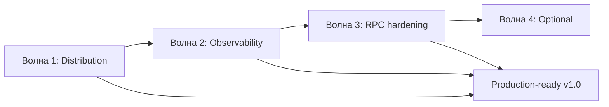

# План: post-analysis roadmap (P3 — production hardening)

**Статус:** открыт (детализация → [`2026-07-04_2130-remaining-risks-mitigation.md`](2026-07-04_2130-remaining-risks-mitigation.md))  
**Создан:** 2026-07-04 09:30 (UTC+3)  
**Обновлён:** 2026-07-04 21:30 (UTC+3)  
**Основание:** [`../2026-07-04_2128-integrationflow-full-analysis.md`](../2026-07-04_2128-integrationflow-full-analysis.md), разделы 4–7  
**Цель:** закрыть оставшиеся gaps после v8 (RPC hardening, ops, observability, distribution)  
**Оценка суммарно:** ~8–12 рабочих дней (3 волны)

---

## Контекст

После коммита `f7f8e08` все три RabbitMQ-сценария **функционально реализованы**:

| Сценарий | Зрелость | Blocker |
|----------|----------|---------|
| ReceiveAndProcess | Высокая | Adoption, не код |
| SentAndForgot + outbox | Высокая | Adoption, не код |
| SentAndWait RPC | MVP (6/10) | Hardening + ops |

**121 тест** зелёный, CI pack работает. Главные **оставшиеся риски — не корректность каркаса**, а operations, RPC observability и distribution.



**Рекомендуемый порядок:** Волна 1 → 2 → 3. Волна 4 — по необходимости.

---

## Матрица задач (из анализа v8)

| ID | Задача | Риск | Приоритет | Волна |
|----|--------|------|-----------|-------|
| D1 | NuGet publish (`NUGET_API_KEY` + tag `v1.0.0`) | #21 | **P3-high** | 1 |
| D2 | Integration tests в `release.yml` | #15 | **P3-high** | 1 |
| D3 | Runbook / checklist first release | Adoption | P3 | 1 |
| O1 | RPC metrics `RecordRequestReply` | R7 | **P3-high** | 2 |
| O2 | Алерты RPC в metrics runbook | R7 | P3 | 2 |
| O3 | Distributed tracing (OTel Activity) | #20 | P4 | 4 |
| R1 | `IntegrateWithResult()` для SentAndWait | R8, R3 | **Закрыт** | 3 |
| R2 | Concurrent RPC (correlation map) | R5 | **Закрыт** | 3 |
| R3 | ReplyPublisher — reuse connection / channel pool | R6 | P3 | 3 |
| R4 | Sample hosted RPC server handler | R4 | P3 | 3 |
| R5 | Runbook: SentAndWait RPC adoption | R3, R4 | P3 | 3 |
| A1 | Production runbook (ThrowOnFailure, MessageId, outbox) | Adoption | P3 | 3 |
| A2 | TLS / AMQPS sample в README | S2 | P4 | 4 |
| A3 | Secrets via env vars sample | S1 | P4 | 4 |
| A4 | REST SentAndWait — явно out-of-scope | #18 | P4 | 4 |

---

## Волна 1 — Distribution и CI (~1–2 дня)

**Цель:** опубликовать v1.0.0 и не выпускать broken packages.

### D1. NuGet publish

**Статус:** workflow готов ([`release.yml`](../../.github/workflows/release.yml)), не выполнен.

| Шаг | Действие |
|-----|----------|
| 1 | Зарезервировать ID на nuget.org: `IntegrationFlow.Core`, `IntegrationFlow.EntityFrameworkCore`, `IntegrationFlow.Metrics.OpenTelemetry` |
| 2 | Добавить `NUGET_API_KEY` в GitHub Secrets |
| 3 | Обновить [`CHANGELOG.md`](../../CHANGELOG.md) для v1.0.0 |
| 4 | `git tag v1.0.0 && git push origin v1.0.0` |
| 5 | Проверить пакеты на nuget.org (README, dependencies, symbols) |

Runbook: [`runbooks/2026-07-04_0845-nuget-release.md`](../runbooks/2026-07-04_0845-nuget-release.md).

### D2. Integration tests в release workflow

**Проблема:** [`release.yml`](../../.github/workflows/release.yml) гоняет только unit-тесты — риск #15.

```yaml
# Добавить перед pack:
- run: dotnet test IntegrationFlow.sln -c Release --no-build --filter "Category=Integration"
  # Требует Docker на runner (ubuntu-latest — OK)
```

**Критерий:** tag release не публикуется, если integration-тесты красные.

### D3. First release checklist

Дополнить runbook NuGet:

- [ ] 121 тест зелёный на `master`
- [ ] `dotnet pack` локально без ошибок
- [ ] CHANGELOG актуален
- [ ] Analysis v8 актуален

**Definition of Done волны 1:** три пакета на NuGet.org `1.0.0`, release workflow с integration gate.

---

## Волна 2 — Observability RPC (~2–3 дня)

**Цель:** закрыть R7 — мониторинг SentAndWait так же, как consumer/outbox.

### O1. Metrics для request-reply

Расширить [`IIntegrationFlowMetrics`](../../src/IntegrationFlow.Core/Contexts/Integrations/03Domain/Metrics/IIntegrationFlowMetrics.cs):

| Метод | Instrument | Tags |
|-------|------------|------|
| `RecordRequestReply(profile, duration, success)` | Counter + Histogram | `profile`, `success`, опционально `timeout` |

Wire-up:

- [`RabbitMqRequestReplyTransmitter`](../../src/IntegrationFlow.Core/Contexts/Integrations/00InnerUsage/RabbitMq/SentAndWait/Transmitters/RabbitMqRequestReplyTransmitter.cs) — после `CompleteWaitingForResponse`
- [`OpenTelemetryIntegrationFlowMetrics`](../../src/IntegrationFlow.Metrics.OpenTelemetry/OpenTelemetryIntegrationFlowMetrics.cs)

Имена (конвенция):

| Instrument | Имя |
|------------|-----|
| Counter | `integrationflow.requestreply.completed` |
| Histogram | `integrationflow.requestreply.duration` |

### O2. Runbook алертов RPC

Дополнить [`runbooks/2026-07-04_0845-metrics-and-alerting.md`](../runbooks/2026-07-04_0845-metrics-and-alerting.md):

| Алерт | Условие |
|-------|---------|
| RPC failures | `rate(integrationflow.requestreply.completed{success="false"}[5m]) > 0` |
| RPC timeouts | `rate(integrationflow.requestreply.completed{timeout="true"}[5m]) > N` |
| RPC latency | `histogram_quantile(0.99, integrationflow.requestreply.duration) > SLO` |

### O3. Distributed tracing (опционально, волна 4)

`ActivitySource` в Core + span на publish/wait/reply. Зависимость только в host app (OTel SDK). **Не блокирует v1.0.**

**Definition of Done волны 2:** metrics package обновлён, unit-тесты через `MeterListener`, runbook RPC алертов.

---

## Волна 3 — RPC hardening и adoption (~3–4 дня)

**Цель:** поднять SentAndWait с 6/10 до ~8/10 для production sync RPC.

### R1. `IntegrateWithResult()` для SentAndWait

По образцу [`SentAndForgotIntegration.IntegrateWithResult()`](../../src/IntegrationFlow.Core/Contexts/Integrations/03Domain/SentAndForgot/SentAndForgotIntegration.cs):

```csharp
public sealed class SentAndWaitIntegrationResult
{
    public bool Success { get; }
    public ObtainedData Data { get; }
    public Exception? Error { get; }  // timeout, transport
}
```

- Не глотать exception при `ThrowOnFailure = false` — возвращать в result
- `RequestReplyTimeoutException` → `Success = false`, typed error

Закрывает риски **R3**, **R8**.

### R2. Concurrent RPC

**Проблема:** [`RabbitMqRequestReplyTransmitter`](../../src/IntegrationFlow.Core/Contexts/Integrations/00InnerUsage/RabbitMq/SentAndWait/Transmitters/RabbitMqRequestReplyTransmitter.cs) — `lock(transmitSync)`, один in-flight (R5).

**Решение:**

- `ConcurrentDictionary<string, TaskCompletionSource<byte[]>>` в connection
- Убрать global lock; filter по CorrelationId в consumer
- Лимит concurrent: `MaxConcurrentRequests` в config (default 1 для backward compat)

### R3. ReplyPublisher connection reuse

**Проблема:** новое TCP-соединение на каждый reply (R6).

**Решение:**

- Optional `IRabbitMqReplyChannelProvider` / scoped channel из DI
- Или internal pool per `RabbitMqRequestReplyConfiguration` profile
- Fallback: текущее поведение для простых случаев

### R4. Sample hosted RPC server

Дополнить [`00Samples/SentAndWait/`](../../src/IntegrationFlow.Core/Contexts/Integrations/00Samples/SentAndWait/):

```csharp
services.AddIntegrationFlowRabbitMqListener("OrdersRpc", message =>
{
    if (message.Raw is RabbitMqReceivedMessage rpc && rpc.IsRequestReply)
    {
        var publisher = new RabbitMqReplyPublisher(config);
        publisher.PublishTextReply(rpc, BuildResponse(rpc));
    }
    // ...
});
```

Демонстрирует **reply до return** (риск R4).

### R5 + A1. Runbooks adoption

Новый runbook: `docs/runbooks/2026-07-04_*-sentandwait-rpc-adoption.md`:

| Тема | Содержание |
|------|------------|
| When to use RPC vs outbox | Decision tree |
| `ThrowOnFailure = true` | Prod default |
| Idempotent server | MessageId + dedup |
| Timeout tuning | `ResponseTimeoutSeconds` |
| Anti-patterns | RPC для critical TX, ack до reply |

Обновить [`plans/2026-07-03_1639-production-readiness.md`](2026-07-03_1639-production-readiness.md) — секция SentAndWait.

**Definition of Done волны 3:** `IntegrateWithResult`, concurrent RPC opt-in, sample server, runbook.

---

## Волна 4 — Optional / backlog (~2–3 дня)

| ID | Задача | Effort | Комментарий |
|----|--------|--------|-------------|
| O3 | Distributed tracing | 2 дня | `ActivitySource`, не блокер |
| A2 | TLS / AMQPS sample | 0.5 дня | `RabbitMqConnectionSettings` + README |
| A3 | Secrets via env | 0.5 дня | `IConfiguration` overlay в loader |
| A4 | REST out-of-scope | 0.25 дня | README + analysis note |
| — | `IntegrateAsync()` SentAndWait | 1 день | См. [`plans/2026-07-04_2104-sentandwait-async-execution.md`](2026-07-04_2104-sentandwait-async-execution.md) (~4–6 дней полный scope) |
| — | Prefetch > 1 guidance | 0.5 дня | Docs only |

---

## Риски плана

| Риск | Вероятность | Mitigation |
|------|-------------|------------|
| NuGet ID занят | Средняя | Проверить до tag; fallback prefix |
| Integration tests flaky в release CI | Средняя | Retry policy; Docker health wait |
| Concurrent RPC — regression | Средняя | Default `MaxConcurrentRequests=1`; E2E parallel test |
| Metrics breaking change | Низкая | Additive API на `IIntegrationFlowMetrics` |
| Scope creep (tracing) | Средняя | Волна 4 явно optional |

---

## Сводная оценка effort

| Волна | Effort | Зависимости | Эффект |
|-------|--------|-------------|--------|
| **1** Distribution | 1–2 дня | — | Distribution 8→9/10 |
| **2** Observability RPC | 2–3 дня | — | Observability 8→9/10 |
| **3** RPC hardening | 3–4 дня | Волна 2 (metrics для validate) | SentAndWait 6→8/10 |
| **4** Optional | 2–3 дня | — | Security, tracing |
| **Итого (1–3)** | **~6–9 дней** | 1 → 2 → 3 | **Production-ready v1.0** |

---

## Definition of Done (весь roadmap)

- [ ] NuGet `1.0.0` опубликован, release с integration gate
- [ ] RPC metrics + алерты в runbook
- [x] `IntegrateWithResult()` для SentAndWait
- [x] Concurrent RPC (opt-in) + connection reuse
- [ ] Sample hosted RPC server + adoption runbook
- [ ] Analysis v10 — SentAndWait 7/10, Observability/Distribution 9/10 (после волн 1–2)

---

## Связь с документами

| Документ | Связь |
|----------|-------|
| [`2026-07-04_2128-integrationflow-full-analysis.md`](../2026-07-04_2128-integrationflow-full-analysis.md) | Источник рисков и P3 |
| [`plans/2026-07-04_2130-remaining-risks-mitigation.md`](2026-07-04_2130-remaining-risks-mitigation.md) | **Актуальный план** закрытия главных рисков v1.0 |
| [`plans/2026-07-04_2104-sentandwait-async-execution.md`](2026-07-04_2104-sentandwait-async-execution.md) | Async API + concurrent RPC — детальный план |
| [`plans/2026-07-04_0836-p1-p2-metrics-and-nuget.md`](2026-07-04_0836-p1-p2-metrics-and-nuget.md) | P1–P2 выполнены; publish → волна 1 |
| [`runbooks/2026-07-04_0845-nuget-release.md`](../runbooks/2026-07-04_0845-nuget-release.md) | D1 |
| [`runbooks/2026-07-04_0845-metrics-and-alerting.md`](../runbooks/2026-07-04_0845-metrics-and-alerting.md) | O2 |
