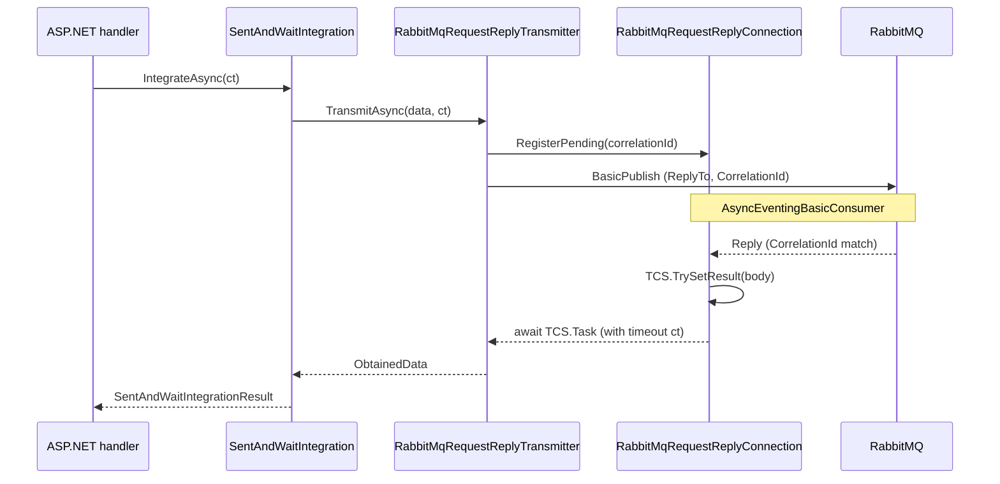

# План: асинхронное выполнение SentAndWait

**Статус:** выполнено  
**Создан:** 2026-07-04 21:04 (UTC+3)  
**Обновлён:** 2026-07-04 21:10 (UTC+3)  
**Основание:** [`../2026-07-04_2102-integrationflow-full-analysis.md`](../2026-07-04_2102-integrationflow-full-analysis.md) (риски R5, R8; SentAndWait 6/10), [`2026-07-04_0930-post-analysis-roadmap.md`](2026-07-04_0930-post-analysis-roadmap.md) (волна 3 — concurrent RPC)  
**Цель:** неблокирующий async API для SentAndWait (домен + RabbitMQ transport) с поддержкой `CancellationToken`, параллельных in-flight запросов и обратной совместимости sync `Integrate()`  
**Оценка суммарно:** ~4–6 рабочих дней (MVP async + concurrent opt-in + tests + docs)

---

## Контекст

Сейчас SentAndWait **полностью синхронный**:

| Слой | Текущее поведение | Проблема |
|------|-------------------|----------|
| [`SentAndWaitIntegration.Integrate()`](../../src/IntegrationFlow.Core/Contexts/Integrations/03Domain/SentAndWait/SentAndWaitIntegration.cs) | Sync orchestrator, callback handler | Блокирует поток на всё время RPC |
| [`ITransmitter.Transmit()`](../../src/IntegrationFlow.Core/Contexts/Integrations/03Domain/SentAndWait/Transmitter/ITransmitter.cs) | Sync, `ObtainedData` | Нет async-контракта |
| [`RabbitMqRequestReplyTransmitter`](../../src/IntegrationFlow.Core/Contexts/Integrations/00InnerUsage/RabbitMq/SentAndWait/Transmitters/RabbitMqRequestReplyTransmitter.cs) | `lock(transmitSync)` + sync wait | Один in-flight (R5) |
| [`RabbitMqRequestReplyConnection`](../../src/IntegrationFlow.Core/Contexts/Integrations/00InnerUsage/RabbitMq/SentAndWait/Connections/RabbitMqRequestReplyConnection.cs) | `ManualResetEventSlim.Wait(timeout)` | Sync-over-async; thread starvation под нагрузкой |
| Connection lifecycle | `using (connection)` на каждый вызов | Новое TCP-соединение на каждую интеграцию |

Для ASP.NET Core / `IHost` приложений sync RPC в request pipeline — антипаттерн: блокируется thread pool на `ResponseTimeoutSeconds` (default 30s).

**SentAndForgot** уже имеет `IntegrateWithResult()` — для SentAndWait аналог запланирован в roadmap (R1, R8), но без async.

---

## Цели и non-goals

### In scope

1. **`IntegrateAsync()` / `IntegrateWithResultAsync()`** — доменный async API с `CancellationToken`
2. **`ITransmitterAsync`** — опциональный async-transport (RabbitMQ — первая реализация)
3. **Неблокирующее ожидание ответа** — `TaskCompletionSource` вместо `ManualResetEventSlim`
4. **Concurrent RPC (opt-in)** — correlation map, `MaxConcurrentRequests` в конфиге (default `1`)
5. **Scoped connection** — переиспользование connection/channel между вызовами (DI или internal pool)
6. **Обратная совместимость** — sync `Integrate()` остаётся; реализован через async path или параллельный sync wrapper
7. **Metrics hook** — точка для `RecordRequestReply` (совместимо с roadmap волна 2)

### Out of scope (отдельные задачи)

| Задача | Где |
|--------|-----|
| Transactional outbox для RPC | By design — async RPC не меняет at-most-once семантику |
| `IntegrateWithResult()` sync-only без async | Закрывается вместе с этим планом (единый result type) |
| ReplyPublisher connection pool (server) | Roadmap R3 — отдельно |
| REST sample async | Legacy; не трогаем |
| Distributed tracing | Roadmap волна 4 |

---

## Gap analysis

### Домен SentAndWait

| Компонент | Состояние | Gap |
|-----------|-----------|-----|
| `SentAndWaitIntegration` | Sync only | Нет `IntegrateAsync`, `IntegrateWithResult` |
| `SentAndWaitIntegrationResultHandler` | Sync callbacks | Нет async handler |
| `ITransmitter` | `Transmit()` sync | Нет `ITransmitterAsync` |
| `IConnection` | Sync reconnect | Нет async reconnect (optional v2) |
| `SentAndWaitIntegrationOptions` | `ThrowOnFailure` | Нужен `UseAsyncByDefault`? — **нет**, sync wrapper явный |

### RabbitMQ request-reply

| Комponent | Состояние | Gap |
|-----------|-----------|-----|
| Consumer | `EventingBasicConsumer` + sync handler | Нужен `AsyncEventingBasicConsumer` |
| Connection settings | `DispatchConsumersAsync = false` | Переключить на `true` для async path |
| Pending reply | Single `pendingCorrelationId` + MRES | Нужен `ConcurrentDictionary<correlationId, TCS>` |
| Transmitter lock | Global `lock(transmitSync)` | Убрать при concurrent; semaphore при лимите |
| Connection dispose | Per-call | Scoped lifetime для reuse |

---

## Целевая архитектура



### Два режима connection lifecycle

| Режим | Когда | Поведение |
|-------|-------|-----------|
| **Per-call** (default, backward compat) | Sync `Integrate()`, legacy | Connection open → transmit → dispose (как сейчас) |
| **Scoped** (recommended for async) | `IntegrateAsync()`, DI | Singleton/scoped `IRabbitMqRequestReplyConnectionFactory` per profile |

Scoped mode нужен для:
- переиспользования TCP + reply consumer;
- concurrent in-flight на одном connection;
- снижения latency (нет handshake на каждый вызов).

---

## API design

### 1. Result type

```csharp
namespace IntegrationFlow.Contexts.Integrations._03Domain.SentAndWait;

public sealed class SentAndWaitIntegrationResult
{
    public bool Success { get; }
    public ObtainedData? Data { get; }
    public string? FailureReason { get; }
    public bool TimedOut { get; }
    public Exception? Exception { get; }

    public static SentAndWaitIntegrationResult Succeeded(ObtainedData data);
    public static SentAndWaitIntegrationResult Failed(string reason, Exception? ex = null);
    public static SentAndWaitIntegrationResult Timeout(TimeSpan timeout);
}
```

### 2. Async integration methods

```csharp
public sealed class SentAndWaitIntegration
{
    // Существующий sync API — сохраняется
    public void Integrate(SentAndWaitIntegrationResultHandler handler);

    // Новый: typed result (sync wrapper над async или shared core)
    public SentAndWaitIntegrationResult IntegrateWithResult();

    // Новый: primary async entry point
    public Task<SentAndWaitIntegrationResult> IntegrateWithResultAsync(
        CancellationToken cancellationToken = default);

    // Удобный wrapper с handler
    public Task IntegrateAsync(
        SentAndWaitIntegrationResultHandler handler,
        CancellationToken cancellationToken = default);

    // Опционально: async handler
    public Task IntegrateAsync(
        IAsyncSentAndWaitIntegrationResultHandler handler,
        CancellationToken cancellationToken = default);
}
```

**Sync `Integrate()`** после рефакторинга:

```csharp
public void Integrate(SentAndWaitIntegrationResultHandler handler)
{
    IntegrateAsync(handler, CancellationToken.None).GetAwaiter().GetResult();
}
```

> Допустимо для backward compat. В README — рекомендация использовать `IntegrateAsync` в ASP.NET Core.

### 3. Async transmitter

```csharp
namespace IntegrationFlow.Contexts.Integrations._03Domain.SentAndWait.Transmitter;

public interface ITransmitterAsync
{
    Task<ObtainedData> TransmitAsync(TransmitData transmitData, CancellationToken cancellationToken);
}
```

Orchestrator (по образцу SentAndForgot):

```csharp
private static async Task<ObtainedData> TransmitAsync(
    ITransmitter transmitter,
    TransmitData data,
    CancellationToken ct)
{
    if (transmitter is ITransmitterAsync asyncTransmitter)
        return await asyncTransmitter.TransmitAsync(data, ct).ConfigureAwait(false);

    return await Task.Run(() => transmitter.Transmit(data), ct).ConfigureAwait(false);
}
```

Fallback `Task.Run` — для REST sample; RabbitMQ реализует native async.

### 4. Async result handler (optional)

```csharp
public abstract class AsyncSentAndWaitIntegrationResultHandler
{
    public abstract Task ProcessResultAsync(ObtainedData obtainedData, CancellationToken cancellationToken);
    public abstract Task ProcessFailedResultAsync(ObtainedData obtainedData, CancellationToken cancellationToken);
}
```

---

## RabbitMQ: изменения транспорта

### 1. Pending reply registry

Заменить single-pending в [`RabbitMqRequestReplyConnection`](../../src/IntegrationFlow.Core/Contexts/Integrations/00InnerUsage/RabbitMq/SentAndWait/Connections/RabbitMqRequestReplyConnection.cs):

```csharp
private readonly ConcurrentDictionary<string, TaskCompletionSource<byte[]>> pendingReplies = new();

internal Task<byte[]> WaitForResponseAsync(string correlationId, TimeSpan timeout, CancellationToken cancellationToken)
{
    var tcs = new TaskCompletionSource<byte[]>(TaskCreationOptions.RunContinuationsAsynchronously);
    if (!pendingReplies.TryAdd(correlationId, tcs))
        throw new InvalidOperationException("Duplicate correlation id.");

    using var timeoutCts = CancellationTokenSource.CreateLinkedTokenSource(cancellationToken);
    timeoutCts.CancelAfter(timeout);

    return WaitCoreAsync(tcs, correlationId, timeoutCts.Token);
}
```

`OnReplyReceived` → lookup по `CorrelationId` → `TryRemove` → `TrySetResult`.

### 2. Async consumer

```csharp
// RabbitMqRequestReplyConfiguration.ToConnectionSettings()
DispatchConsumersAsync = true;

// Open()
var consumer = new AsyncEventingBasicConsumer(consumeChannel);
consumer.Received += async (_, eventArgs) => { OnReplyReceived(eventArgs); };
```

`OnReplyReceived` остаётся sync (только `TrySetResult`) — без await в handler.

### 3. Transmitter без global lock

```csharp
internal sealed class RabbitMqRequestReplyTransmitter : ITransmitter, ITransmitterAsync
{
    private readonly SemaphoreSlim? concurrencyGate; // null if MaxConcurrentRequests <= 0 (unlimited)

    public async Task<ObtainedData> TransmitAsync(TransmitData data, CancellationToken ct)
    {
        if (concurrencyGate != null)
            await concurrencyGate.WaitAsync(ct).ConfigureAwait(false);
        try
        {
            // publish + await connection.WaitForResponseAsync(correlationId, timeout, ct)
        }
        finally
        {
            concurrencyGate?.Release();
        }
    }
}
```

Sync `Transmit()` → `TransmitAsync(..., CancellationToken.None).GetAwaiter().GetResult()`.

### 4. Конфигурация

Добавить в [`RabbitMqRequestReplyConfiguration`](../../src/IntegrationFlow.Core/Contexts/Integrations/00InnerUsage/RabbitMq/SentAndWait/Configurations/RabbitMqRequestReplyConfiguration.cs):

| Параметр | Default | Описание |
|----------|---------|----------|
| `MaxConcurrentRequests` | `1` | `0` = unlimited; `1` = текущее поведение |
| `ReuseConnection` | `false` | `true` — не dispose connection в orchestrator (scoped factory) |

JSON:

```json
{
  "RabbitMqRequestReply": {
    "OrdersRpc": {
      "QueueName": "orders.rpc",
      "ResponseTimeoutSeconds": 30,
      "MaxConcurrentRequests": 8,
      "ReuseConnection": true
    }
  }
}
```

### 5. Scoped connection factory (DI)

```csharp
// IntegrationFlow.DependencyInjection
public interface IRabbitMqRequestReplyConnectionLease : IAsyncDisposable
{
    RabbitMqRequestReplyConnection Connection { get; }
}

services.AddIntegrationFlowRabbitMqRequestReply("OrdersRpc"); // registers scoped lease per profile
```

`SentAndWaitIntegration` при `ReuseConnection=true` получает connection из lease, не создаёт per-call.

**MVP без DI:** internal static `ConnectionPool` per profile name (простой ConcurrentDictionary + ref count). DI — follow-up если нужен явный lifecycle control.

---

## План реализации (фазы)

### Фаза 0 — Подготовка (~0.5 дня)

| # | Задача | Файлы |
|---|--------|-------|
| 0.1 | Добавить `SentAndWaitIntegrationResult` | `03Domain/SentAndWait/SentAndWaitIntegrationResult.cs` |
| 0.2 | Добавить `ITransmitterAsync` | `03Domain/SentAndWait/Transmitter/ITransmitterAsync.cs` |
| 0.3 | Extract shared orchestration | private `IntegrateCoreAsync` в `SentAndWaitIntegration` |

**DoD:** compile; sync `Integrate()` поведение не изменилось (regression unit tests green).

### Фаза 1 — Async domain API (~1 день)

| # | Задача | Детали |
|---|--------|--------|
| 1.1 | `IntegrateWithResultAsync` | Shared core: format → transmit → validate → result |
| 1.2 | `IntegrateWithResult` sync | Wrapper над async core или duplicate minimal |
| 1.3 | `IntegrateAsync` + handler | Await core → invoke handler |
| 1.4 | `ThrowOnFailure` | На async path: throw из `IntegrateAsync` при failure |
| 1.5 | `RequestReplyTimeoutException` | Map → `SentAndWaitIntegrationResult.Timeout` |
| 1.6 | `AsyncSentAndWaitIntegrationResultHandler` | Optional abstract class |

**DoD:** unit tests для orchestrator с mock `ITransmitterAsync`; timeout/cancel paths.

### Фаза 2 — RabbitMQ async transport (~1.5–2 дня)

| # | Задача | Детали |
|---|--------|--------|
| 2.1 | Pending registry | `ConcurrentDictionary` + `WaitForResponseAsync` |
| 2.2 | Async consumer | `AsyncEventingBasicConsumer`, `DispatchConsumersAsync=true` |
| 2.3 | `RabbitMqRequestReplyTransmitter` | Implement `ITransmitterAsync` |
| 2.4 | Remove global lock | SemaphoreSlim по `MaxConcurrentRequests` |
| 2.5 | Config | `MaxConcurrentRequests`, loader tests |
| 2.6 | Cancel | Linked CTS: user ct + timeout → cancel wait, cleanup pending |

**DoD:** existing E2E roundtrip green; new async E2E test.

### Фаза 3 — Connection reuse (~1 день)

| # | Задача | Детали |
|---|--------|--------|
| 3.1 | Internal connection pool | Per profile; ref-count or singleton per profile |
| 3.2 | `ReuseConnection` config flag | Orchestrator skips dispose when true |
| 3.3 | Reconnect on failure | Pool invalidates stale connection |
| 3.4 | DI extension (optional) | `AddIntegrationFlowRabbitMqRequestReply` |

**DoD:** E2E — 10 sequential `IntegrateAsync` reuse same connection (assert via test hook or connection id).

### Фаза 4 — Concurrent RPC (~1 день)

| # | Задача | Детали |
|---|--------|--------|
| 4.1 | `MaxConcurrentRequests > 1` | Parallel `IntegrateAsync` calls |
| 4.2 | E2E parallel test | N concurrent requests, unique responses |
| 4.3 | Regression | Default `MaxConcurrentRequests=1` = serial behavior |

**DoD:** parallel E2E green; no cross-talk correlation ids.

### Фаза 5 — Docs, metrics, README (~0.5 дня)

| # | Задача |
|---|--------|
| 5.1 | README — секция SentAndWait async |
| 5.2 | Sample — `await integration.IntegrateWithResultAsync(ct)` в ASP.NET |
| 5.3 | Wire-up point для `IIntegrationFlowMetrics.RecordRequestReply` (если волна 2 не выполнена — stub) |
| 5.4 | Обновить analysis v9 → v10 (SentAndWait 6→7/10) |

---

## Структура файлов

### Новые

```
src/IntegrationFlow.Core/Contexts/Integrations/
├── 03Domain/SentAndWait/
│   ├── SentAndWaitIntegrationResult.cs          NEW
│   ├── AsyncSentAndWaitIntegrationResultHandler.cs  NEW (optional)
│   └── Transmitter/
│       └── ITransmitterAsync.cs                 NEW
└── 00InnerUsage/RabbitMq/SentAndWait/
    ├── Connections/
    │   ├── PendingReplyRegistry.cs              NEW (internal)
    │   └── RabbitMqRequestReplyConnectionPool.cs NEW (internal)
    └── DependencyInjection/
        └── RabbitMqRequestReplyServiceCollectionExtensions.cs  NEW (optional)
```

### Изменяемые

| Файл | Изменение |
|------|-----------|
| `SentAndWaitIntegration.cs` | `IntegrateCoreAsync`, public async API |
| `RabbitMqRequestReplyConnection.cs` | Registry, async wait, async consumer |
| `RabbitMqRequestReplyTransmitter.cs` | `ITransmitterAsync`, semaphore |
| `RabbitMqRequestReplyConfiguration.cs` | `MaxConcurrentRequests`, `ReuseConnection` |
| `RabbitMqRequestReplyConfigurationLoader.cs` | Parse new props |
| `README.md` | Async usage |

---

## Тесты

| Тип | Сценарий | Проект |
|-----|----------|--------|
| Unit | `IntegrateWithResultAsync` success/fail/timeout/cancel | Core.Tests |
| Unit | Mock `ITransmitterAsync` — orchestrator не блокирует | Core.Tests |
| Unit | Pending registry — add/remove/timeout leak | Core.Tests |
| Unit | Config loader — `MaxConcurrentRequests` | Core.Tests |
| Integration | Async roundtrip (existing + `IntegrateWithResultAsync`) | Core.IntegrationTests |
| Integration | Parallel N requests (`MaxConcurrentRequests=8`) | Core.IntegrationTests |
| Integration | Cancel during wait → cleanup pending | Core.IntegrationTests |
| Regression | Sync `Integrate()` unchanged | Core.IntegrationTests |

---

## Риски и mitigation

| # | Риск | Severity | Mitigation |
|---|------|----------|------------|
| A1 | **Pending leak** при timeout/cancel | Высокий | `finally` → `TryRemove` correlationId; unit test leak detection |
| A2 | **Cross-talk** correlation ids | Высокий | Guid `"N"`; strict match; parallel E2E |
| A3 | **Sync-over-async** в `Integrate()` wrapper | Средний | Document; recommend `IntegrateAsync` in ASP.NET |
| A4 | **Breaking change** public API | Низкий | Additive only; sync API preserved |
| A5 | **Connection pool stale** after broker restart | Средний | `NeedReconnect()` before transmit; pool invalidate |
| A6 | **Thread affinity** RabbitMQ client | Средний | `RunContinuationsAsynchronously` on TCS; no sync wait in async path |
| A7 | **MaxConcurrentRequests=0** unlimited | Средний | Document; broker/client limits; default 1 |
| A8 | **Regression** sync E2E | Средний | Keep default config; CI both paths |

### Семантика доставки (не меняется)

Async API **не добавляет** transactional guarantees. RPC остаётся **at-most-once** при timeout. Adoption requirements из analysis v9 сохраняются.

---

## Обратная совместимость

| API | После реализации |
|-----|------------------|
| `Integrate(handler)` | Работает; internally may call async |
| `ITransmitter.Transmit()` | Работает; RabbitMQ delegates to async |
| `RabbitMqRequestReplyConfiguration` JSON без новых полей | `MaxConcurrentRequests=1`, `ReuseConnection=false` |
| REST `RESTSimpleTransmitter` | Fallback `Task.Run` в orchestrator |

---

## Definition of Done

- [ ] `IntegrateWithResultAsync(CancellationToken)` + `IntegrateAsync`
- [ ] `IntegrateWithResult()` sync (typed result, closes R3/R8)
- [ ] `ITransmitterAsync` + RabbitMQ implementation
- [ ] Нет `ManualResetEventSlim.Wait` на async path
- [ ] `MaxConcurrentRequests` configurable; default `1`
- [ ] Connection reuse opt-in (`ReuseConnection`)
- [ ] Unit + integration tests (async roundtrip, parallel, cancel, sync regression)
- [ ] README + sample updated
- [ ] Analysis v9 updated (SentAndWait observability-ready for async)

---

## Связь с roadmap P3

| ID roadmap | Этот план |
|------------|-----------|
| R1 `IntegrateWithResult()` | Фаза 1 — включено |
| R2 Concurrent RPC | Фаза 4 — включено |
| R7 RPC metrics | Фаза 5 — hook; полная реализация — волна 2 roadmap |
| R3 ReplyPublisher reuse | Out of scope |
| Wave 4 `IntegrateAsync()` | **Elevated** — этот план |

**Рекомендуемый порядок:** выполнить **этот план** после (или параллельно с) волной 2 metrics. Distribution (волна 1) не блокирует.

---

## Оценка effort

| Фаза | Effort | Зависимости |
|------|--------|-------------|
| 0 Подготовка | 0.5 дня | — |
| 1 Domain async API | 1 день | 0 |
| 2 RabbitMQ async transport | 1.5–2 дня | 1 |
| 3 Connection reuse | 1 день | 2 |
| 4 Concurrent RPC | 1 день | 2, 3 |
| 5 Docs + metrics hook | 0.5 дня | 1–4 |
| **Итого** | **~4–6 дней** | 0 → 1 → 2 → 3 → 4 → 5 |

---

## Связь с документами

| Документ | Связь |
|----------|-------|
| [`2026-07-04_2102-integrationflow-full-analysis.md`](../2026-07-04_2102-integrationflow-full-analysis.md) | Риски R5, R8; baseline |
| [`2026-07-04_0930-post-analysis-roadmap.md`](2026-07-04_0930-post-analysis-roadmap.md) | R1, R2, wave 4 IntegrateAsync |
| [`2026-07-04_0904-rabbitmq-sentandwait.md`](2026-07-04_0904-rabbitmq-sentandwait.md) | Sync MVP выполнен; async — extension |
