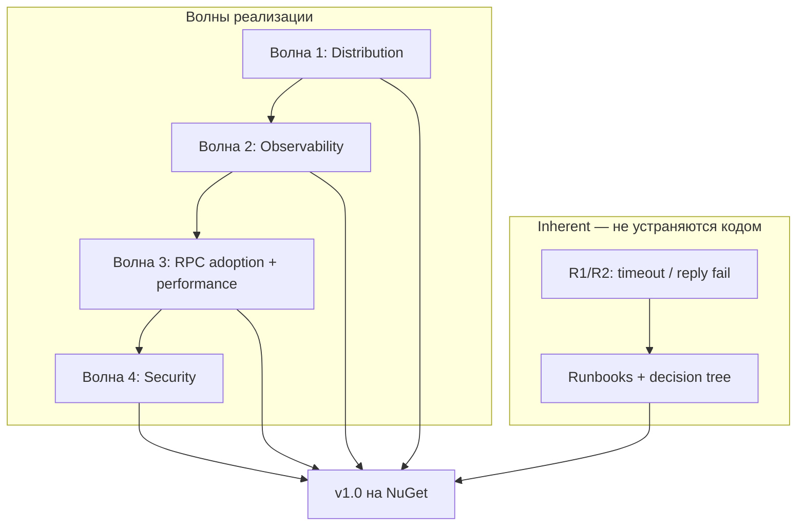
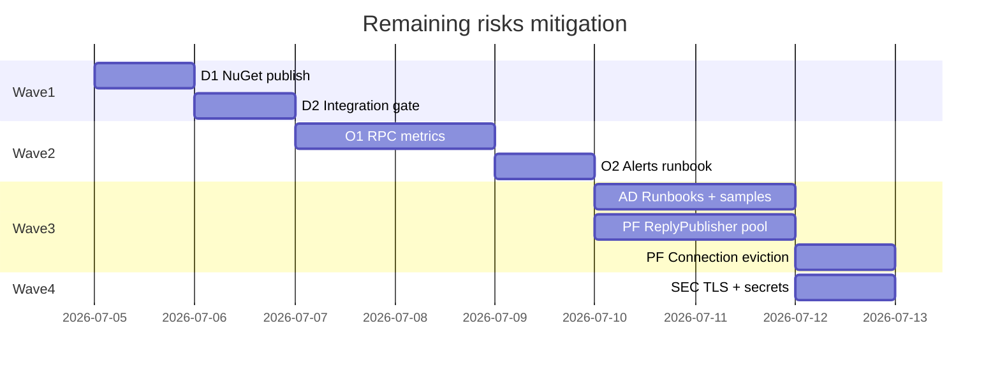

# План: закрытие главных оставшихся рисков (v1.0 production)

**Статус:** в работе (код и docs выполнены; NuGet publish — ops)  
**Создан:** 2026-07-04 21:30 (UTC+3)  
**Обновлён:** 2026-07-04 22:23 (UTC+3)  
**Основание:** [`../2026-07-04_2234-integrationflow-full-analysis.md`](../2026-07-04_2234-integrationflow-full-analysis.md), раздел 8 (главные оставшиеся риски)  
**Связанные планы:** [`2026-07-04_0930-post-analysis-roadmap.md`](2026-07-04_0930-post-analysis-roadmap.md) (детализация волн 1–4), [`2026-07-04_2104-sentandwait-async-execution.md`](2026-07-04_2104-sentandwait-async-execution.md) (выполнено)  
**Цель:** довести IntegrationFlow до **production-ready v1.0** — закрыть ops/adoption gaps и снизить технические риски RPC/performance/security  
**Оценка суммарно:** ~7–10 рабочих дней (4 волны)

---

## Контекст

После `eee98f8` (async SentAndWait) все три RabbitMQ-сценария **функционально готовы**. **128 тестов** зелёные. Оставшиеся риски — не корректность каркаса, а **adoption, operations, observability и performance на server-side RPC**.

### Главные оставшиеся риски (из analysis v10)

| Категория | Главный риск | Severity | Тип |
|-----------|--------------|----------|-----|
| **SentAndWait RPC** | At-most-once при timeout; нет outbox | Высокий (critical flows) | Inherent + adoption |
| **Adoption** | `ThrowOnFailure=false` по умолчанию; server ack до reply | Высокий | Adoption |
| **Operations** | NuGet не опубликован; release без integration gate; нет RPC metrics | Средний | Ops + code |
| **Performance (RPC server)** | Новое TCP на каждый reply (`RabbitMqReplyPublisher`) | Средний | Code |
| **Async adoption** | Sync `Integrate()` в ASP.NET → thread starvation | Средний | Adoption + docs |
| **Security** | Plain credentials, нет TLS samples | Средний | Docs + sample |

### Что уже закрыто (не входит в план)

| ID | Задача | Статус |
|----|--------|--------|
| R5 | Concurrent RPC | Закрыт (`MaxConcurrentRequests`) |
| R8 | `IntegrateWithResult()` | Закрыт |
| — | Async `IntegrateAsync()` | Закрыт |
| A, A′ | NoOp handler | Закрыт |
| 10 | Abandoned outbox | Закрыт (ops) |

### Стратегия



**Принцип:** inherent-риски (R1, R2, at-most-once) → **runbooks и adoption**, не outbox для RPC. Critical TX → SentAndForgot + outbox (документировать явно).

---

## Матрица: риск → задача

| Риск | ID задачи | Волна | Тип | Effort |
|------|-----------|-------|-----|--------|
| #21 NuGet не опубликован | D1 | 1 | Ops | 0.5 дн |
| #15 Release без integration tests | D2 | 1 | CI | 0.25 дн |
| Adoption checklist first release | D3 | 1 | Docs | 0.25 дн |
| R7 Нет RPC metrics | O1, O2 | 2 | Code + docs | 2 дн |
| R3 `ThrowOnFailure=false` | AD1 | 3 | Docs + sample | 0.5 дн |
| R4 Server ack до reply | AD2, AD3 | 3 | Sample + runbook | 1 дн |
| R1/R2 Timeout / reply fail | AD4 | 3 | Runbook | 0.5 дн |
| A3 Sync `Integrate()` в ASP.NET | AD5 | 3 | Docs + optional Obsolete | 0.25 дн |
| R6 ReplyPublisher TCP per reply | PF1 | 3 | Code | 1–1.5 дн |
| A5 Connection pool без eviction | PF2 | 3 | Code | 0.5–1 дн |
| S1 Plain credentials | SEC1 | 4 | Docs + loader | 0.5 дн |
| S2 Нет TLS sample | SEC2 | 4 | Docs | 0.25 дн |
| #20 Distributed tracing | O3 | 4 (optional) | Code | 2 дн |

---

## Волна 1 — Distribution и CI (~1 день)

**Цель:** опубликовать v1.0.0; release не проходит без integration gate.  
**Закрывает:** Operations (#21, #15).

### D1. NuGet publish v1.0.0

| Шаг | Действие |
|-----|----------|
| 1 | Проверить доступность ID на nuget.org |
| 2 | `NUGET_API_KEY` в GitHub Secrets |
| 3 | [`CHANGELOG.md`](../../CHANGELOG.md) — секция 1.0.0 |
| 4 | `git tag v1.0.0 && git push origin v1.0.0` |
| 5 | Проверить пакеты на nuget.org |

Runbook: [`runbooks/2026-07-04_0845-nuget-release.md`](../runbooks/2026-07-04_0845-nuget-release.md).

### D2. Integration gate в `release.yml`

Добавить перед `dotnet pack`:

```yaml
- run: dotnet test IntegrationFlow.sln -c Release --no-build --filter "Category=Integration"
```

Файл: [`.github/workflows/release.yml`](../../.github/workflows/release.yml).

### D3. First release checklist

- [ ] 128 тестов зелёные на `master`
- [ ] `dotnet pack -c Release` без ошибок
- [x] [`2026-07-04_2234-integrationflow-full-analysis.md`](../2026-07-04_2234-integrationflow-full-analysis.md) актуален
- [ ] Runbooks adoption готовы (волна 3) или явно помечены pre-release

**DoD волны 1:** три пакета `1.0.0` на NuGet.org; release workflow с integration gate.

---

## Волна 2 — Observability RPC (~2 дня)

**Цель:** мониторинг SentAndWait на уровне consumer/outbox.  
**Закрывает:** Operations (R7), частично SentAndWait RPC (visibility timeout/failures).

### O1. `RecordRequestReply` в metrics

Расширить [`IIntegrationFlowMetrics`](../../src/IntegrationFlow.Core/Contexts/Integrations/03Domain/Metrics/IIntegrationFlowMetrics.cs):

```csharp
void RecordRequestReply(string profileName, TimeSpan duration, bool success, bool timedOut = false);
```

Wire-up в [`RabbitMqRequestReplyTransmitter`](../../src/IntegrationFlow.Core/Contexts/Integrations/00InnerUsage/RabbitMq/SentAndWait/Transmitters/RabbitMqRequestReplyTransmitter.cs) — в `finally` после transmit (success / timeout / fail).

Инструменты в [`OpenTelemetryIntegrationFlowMetrics`](../../src/IntegrationFlow.Metrics.OpenTelemetry/OpenTelemetryIntegrationFlowMetrics.cs):

| Instrument | Имя | Tags |
|------------|-----|------|
| Counter | `integrationflow.requestreply.completed` | `profile`, `success`, `timeout` |
| Histogram | `integrationflow.requestreply.duration` | `profile` |

Тесты: `MeterListener` в `IntegrationFlow.Metrics.OpenTelemetry.Tests`.

### O2. Runbook алертов RPC

Дополнить [`runbooks/2026-07-04_0845-metrics-and-alerting.md`](../runbooks/2026-07-04_0845-metrics-and-alerting.md):

| Алерт | Условие |
|-------|---------|
| RPC failures | `rate(integrationflow.requestreply.completed{success="false"}[5m]) > 0` |
| RPC timeouts | `rate(integrationflow.requestreply.completed{timeout="true"}[5m]) > N` |
| RPC p99 latency | `histogram_quantile(0.99, ...) > SLO` |

Обновить README — таблица метрик.

**DoD волны 2:** metrics в transmitter; unit-тесты; runbook; README.

---

## Волна 3 — RPC adoption, performance, async guidance (~3–4 дня)

**Цель:** снизить adoption-риски и server-side overhead.  
**Закрывает:** Adoption (R3, R4, A3), Performance (R6, A5), частично SentAndWait inherent (R1, R2) через runbooks.

### AD1. Production defaults для `ThrowOnFailure`

| # | Задача | Файлы |
|---|--------|-------|
| 3.1 | Секция «Production defaults» в README | `README.md` |
| 3.2 | Startup sample: `SentAndWaitIntegrationOptions.ThrowOnFailure = true` | `00Samples/SentAndWait/` |
| 3.3 | Аналогично для `SentAndForgotIntegrationOptions` | README + sample |

**Не менять default в коде** (breaking change для netstandard2.0 consumers) — только docs + samples + runbook.

### AD2. Sample hosted RPC server

Новый или расширенный sample в [`00Samples/SentAndWait/`](../../src/IntegrationFlow.Core/Contexts/Integrations/00Samples/SentAndWait/):

```csharp
services.AddIntegrationFlowRabbitMqListener("OrdersRpc", async message =>
{
    if (message.Raw is RabbitMqReceivedMessage rpc && rpc.IsRequestReply)
    {
        var reply = BuildResponse(rpc);
        var publisher = new RabbitMqReplyPublisher(config);
        publisher.PublishTextReply(rpc, reply);  // reply ДО return
    }
});
```

Демонстрирует **R4**: reply до ack.

### AD3. Runbook: SentAndWait RPC adoption

Новый файл: `docs/runbooks/2026-07-04_2130-sentandwait-rpc-adoption.md`

| Раздел | Содержание |
|--------|------------|
| Decision tree | RPC vs outbox vs fire-and-forget |
| Client | `IntegrateAsync`, `IntegrateWithResult`, timeout tuning |
| Server | Reply до return; идемпотентность по `MessageId` |
| Timeout (R1) | Retry с новым `CorrelationId`; server dedup |
| Reply fail (R2) | Client retry; server idempotent handler |
| Anti-patterns | RPC для critical TX; sync `Integrate()` в ASP.NET |
| Config | `ReuseConnection`, `MaxConcurrentRequests` |

### AD4. Runbook: production adoption (ReceiveAndProcess + SentAndForgot)

Расширить [`plans/2026-07-03_1639-production-readiness.md`](2026-07-03_1639-production-readiness.md) или новый `docs/runbooks/2026-07-04_2130-production-adoption.md`:

- Outbox в той же TX
- EF stores, не InMemory
- `MessageId` обязателен
- DLQ на брокере
- `ThrowOnFailure = true` в prod

Закрывает inherent **#1–#4** через adoption checklist.

### AD5. Async guidance (риск A3)

| # | Задача |
|---|--------|
| 5.1 | README: «В ASP.NET Core используйте `IntegrateAsync`» |
| 5.2 | Optional (net8.0): `[Obsolete("Use IntegrateAsync in ASP.NET Core.", error: false)]` на sync `Integrate()` — **обсудить**; default — только docs |

### PF1. ReplyPublisher connection/channel reuse (R6)

**Проблема:** [`RabbitMqReplyPublisher`](../../src/IntegrationFlow.Core/Contexts/Integrations/00InnerUsage/RabbitMq/SentAndWait/Reply/RabbitMqReplyPublisher.cs) — `using var connection` на каждый reply.

**Решение:**

```csharp
// Internal pool per profile (аналогично RabbitMqRequestReplyConnectionPool)
internal static class RabbitMqReplyPublisherPool
{
    public static RabbitMqReplyChannelLease GetOrAdd(RabbitMqRequestReplyConfiguration config);
}
```

- Singleton channel per profile (или connection + channel)
- `Reconnect()` при `NeedReconnect()`
- Public API `RabbitMqReplyPublisher` — без breaking change; pool внутри
- Config flag `ReuseReplyConnection` (default `true` для новых профилей, `false` для backward compat) — опционально

Тесты: unit (mock channel); integration — N replies без N TCP handshakes (hook или counter).

### PF2. Connection pool eviction (A5)

**Проблема:** [`RabbitMqRequestReplyConnectionPool`](../../src/IntegrationFlow.Core/Contexts/Integrations/00InnerUsage/RabbitMq/SentAndWait/Connections/RabbitMqRequestReplyConnectionPool.cs) — static `ConcurrentDictionary`, нет invalidate.

**Решение:**

| # | Задача |
|---|--------|
| 2.1 | `Invalidate(profileKey)` при `Reconnect()` failure или broker disconnect event |
| 2.2 | Health check перед `GetOrAdd`: `NeedReconnect()` → remove + recreate |
| 2.3 | Optional: `IHostApplicationLifetime` shutdown hook — dispose all pooled connections |

Тесты: unit — invalidate removes stale entry; integration — broker restart simulation (stop/start container).

**DoD волны 3:** runbooks AD3+AD4; sample AD2; ReplyPublisher reuse; pool eviction; README production defaults.

---

## Волна 4 — Security и optional (~1–2 дня)

**Цель:** снизить security-риски adoption; tracing — по необходимости.  
**Закрывает:** Security (S1–S3).

### SEC1. Secrets via environment / IConfiguration

| # | Задача |
|---|--------|
| 1.1 | Sample: `RabbitMq__Inbox__Password` из env vars |
| 1.2 | Документировать overlay в `RabbitMqConfigurationLoader` (если уже поддерживается — пример; иначе — extension method `LoadProfileWithConfiguration(IConfiguration)`) |
| 1.3 | README: «не коммитить rabbitmq.json с prod credentials» |

### SEC2. TLS / AMQPS sample

| # | Задача |
|---|--------|
| 2.1 | Пример `rabbitmq.json` с `SslEnabled: true`, `ServerName` |
| 2.2 | README секция AMQPS |
| 2.3 | Проверить `RabbitMqConnectionSettings` — все нужные поля есть |

### O3. Distributed tracing (optional, не блокер v1.0)

- `ActivitySource` в Core
- Span: publish → wait → reply
- Зависимость только в host app (OTel SDK)

**DoD волны 4:** SEC1+SEC2 в README/samples; O3 — optional backlog.

---

## Порядок выполнения



**Рекомендуемый порядок:** 1 → 2 → 3 (AD параллельно PF) → 4.  
**Минимум для v1.0 tag:** волны 1 + 2 + 3 (AD runbooks). PF и SEC можно в 1.0.1.

---

## Риски плана

| Риск | Вероятность | Mitigation |
|------|-------------|------------|
| NuGet ID занят | Средняя | Проверить до tag; fallback prefix |
| Integration tests flaky в release CI | Средняя | Retry; Testcontainers health wait |
| ReplyPublisher pool — regression | Средняя | Default `ReuseReplyConnection=false`; opt-in |
| `Obsolete` на `Integrate()` — шум | Средняя | Только docs в v1.0; Obsolete в 1.1 |
| Scope creep (tracing) | Высокая | Волна 4 явно optional |
| Inherent R1/R2 «не закрыты кодом» | — | Runbook + decision tree; детальный план — [`2026-07-04_2242-sentandwait-rpc-critical-flows.md`](2026-07-04_2242-sentandwait-rpc-critical-flows.md) |

---

## Definition of Done (весь план)

- [x] `release.yml` с integration gate (код готов; NuGet publish — ops)
- [x] RPC metrics + алерты в runbook
- [x] Runbook SentAndWait RPC adoption (R1, R2, R3, R4, A3)
- [x] Runbook/checklist production adoption (#1–#4, outbox, MessageId)
- [x] Sample hosted RPC server
- [x] ReplyPublisher connection reuse (R6)
- [x] Connection pool eviction (A5)
- [x] TLS + secrets samples (S1, S2) — README
- [x] Analysis v11 обновлён — Observability 9/10; Distribution 8/10 (NuGet publish — ops)

---

## Сводная оценка effort

| Волна | Effort | Эффект |
|-------|--------|--------|
| **1** Distribution | 1 день | #21, #15 → Distribution 9/10 |
| **2** Observability | 2 дня | R7 → Observability 9/10 |
| **3** Adoption + Performance | 3–4 дня | R3, R4, R6, A3, A5; SentAndWait 7→8/10 |
| **4** Security (+ optional tracing) | 1–2 дня | S1, S2; O3 optional |
| **Итого (1–3)** | **~6–7 дней** | **Production-ready v1.0** |
| **Итого (1–4)** | **~7–10 дней** | **Full hardening** |

---

## Связь с документами

| Документ | Связь |
|----------|-------|
| [`2026-07-04_2234-integrationflow-full-analysis.md`](../2026-07-04_2234-integrationflow-full-analysis.md) | Источник рисков |
| [`2026-07-04_2242-sentandwait-rpc-critical-flows.md`](2026-07-04_2242-sentandwait-rpc-critical-flows.md) | P4: стратегия async request-response + idempotent RPC |
| [`2026-07-04_2244-sentandwait-rpc-implementation.md`](2026-07-04_2244-sentandwait-rpc-implementation.md) | P4: фазы реализации, PR-ы |
| [`2026-07-04_0930-post-analysis-roadmap.md`](2026-07-04_0930-post-analysis-roadmap.md) | Детализация задач D/O/R/A по волнам |
| [`2026-07-04_2104-sentandwait-async-execution.md`](2026-07-04_2104-sentandwait-async-execution.md) | R5, R8 закрыты |
| [`2026-07-06_1445-rabbitmq-g1-g5-mitigation.md`](2026-07-06_1445-rabbitmq-g1-g5-mitigation.md) | P1 transport gaps G1–G5 (следующий этап после v1.0) |
| [`runbooks/2026-07-04_0845-nuget-release.md`](../runbooks/2026-07-04_0845-nuget-release.md) | D1 |
| [`runbooks/2026-07-04_0845-metrics-and-alerting.md`](../runbooks/2026-07-04_0845-metrics-and-alerting.md) | O2 |
