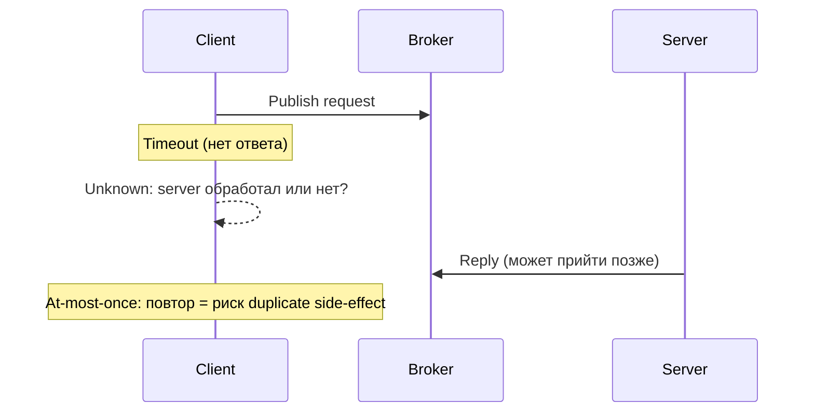
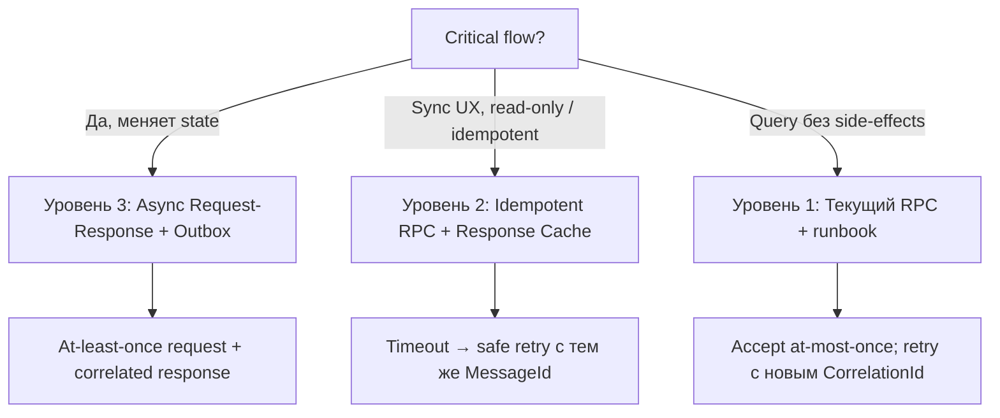
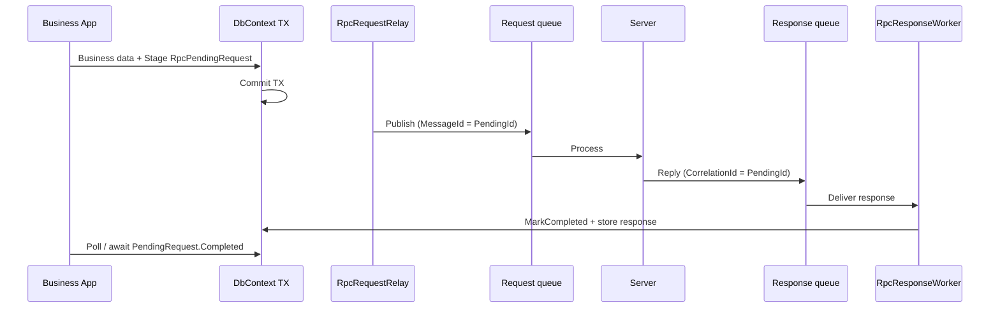
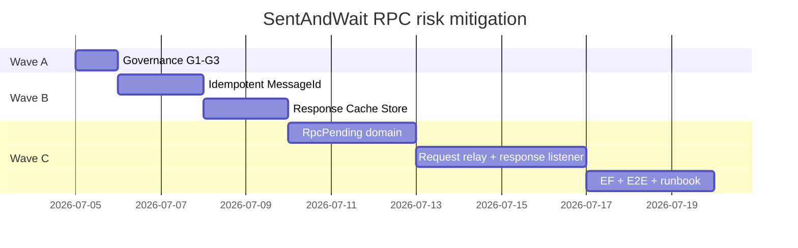

# План: SentAndWait RPC — at-most-once, timeout и отсутствие outbox

**Статус:** открыт  
**Создан:** 2026-07-04 22:42 (UTC+3)  
**Обновлён:** 2026-07-04 22:42 (UTC+3)  
**Основание:** [`../2026-07-04_2234-integrationflow-full-analysis.md`](../2026-07-04_2234-integrationflow-full-analysis.md) (риски R1, R2), [`../runbooks/2026-07-04_2130-sentandwait-rpc-adoption.md`](../runbooks/2026-07-04_2130-sentandwait-rpc-adoption.md)  
**Цель:** снизить риск R1/R2 для flows, где нужен ответ от удалённой системы, без ложного ощущения exactly-once  
**Оценка суммарно:** ~12–17 рабочих дней (волны A–C; saga optional +3–5 дн)

---

## 1. Диагноз: что именно «ломается»

Sync RPC **не может** дать атомарность «commit БД + получен ответ» в одной транзакции: пока client ждёт reply, TX уже закрыта или ещё не открыта — это разные моменты времени.



| Проблема | Корневая причина | Можно закрыть кодом? |
|----------|------------------|----------------------|
| Timeout → unknown state | Сеть + blocking wait | **Частично** — reconciliation, не устранение |
| Нет outbox для RPC | Outbox = async relay; RPC = sync wait | **Да** — отдельный async request-response паттерн |
| Critical TX через RPC | Anti-pattern by design | **Нет** — нужен другой паттерн |

**Вывод:** для **critical transactional flows** sync RPC не «чинится» — нужен **async request-response + outbox**. Для **read/query и некритичных command** — можно довести RPC до **retry-safe** через idempotency + response cache.

Текущая генерация `MessageId` на каждый вызов (случайный Guid) не позволяет безопасный retry после timeout:

```105:113:../../src/IntegrationFlow.Core/Contexts/Integrations/00InnerUsage/RabbitMq/SentAndWait/Transmitters/RabbitMqRequestReplyTransmitter.cs
            var messageId = Guid.NewGuid().ToString("N");
            var body = RabbitMqPublishTransmitter.SerializeBody(transmitData.Data);

            var properties = channel.CreateBasicProperties();
            properties.ContentType = configuration.ContentType;
            properties.DeliveryMode = configuration.Persistent ? (byte)2 : (byte)1;
            properties.CorrelationId = correlationId;
            properties.ReplyTo = connection.ReplyAddress;
            properties.MessageId = messageId;
```

---

## 2. Стратегия: три уровня решения



| Уровень | Семантика | Для critical flows? | Effort |
|---------|-----------|---------------------|--------|
| **1. Governance** (сейчас) | At-most-once | **Нет** | 0 — docs/runbook |
| **2. Idempotent RPC** | Retry-safe after timeout | **Условно** (только idempotent ops) | ~3–4 дн |
| **3. Request Outbox + Response Inbox** | At-least-once request + async response | **Да** | ~8–12 дн |

---

## 3. Уровень 1 — Governance (уже есть, усилить)

**Не менять sync RPC для critical TX.** Зафиксировать decision tree в adoption.

| ID | Задача | Действие |
|----|--------|----------|
| G1 | Чеклист «RPC vs Outbox» | Code review / ADR |
| G2 | Sample critical flow | `SentAndForgot + outbox`, не RPC |
| G3 | Analyzer (optional) | Warn при `CreateSentAndWaitIntegration` в payment/order namespaces |

**DoD:** zero critical flows на sync RPC по adoption checklist.

Runbook: [`../runbooks/2026-07-04_2130-sentandwait-rpc-adoption.md`](../runbooks/2026-07-04_2130-sentandwait-rpc-adoption.md).

---

## 4. Уровень 2 — Idempotent RPC (снижение R1 для sync-сценариев)

**Идея:** при timeout client **повторяет с тем же `MessageId`** (business key); server возвращает **кешированный ответ**, если уже обработал.

### 4.1. Client: стабильный MessageId

| # | Задача | Файлы / API |
|---|--------|-------------|
| 2.1 | `TransmitData.WithMessageId(string)` — опциональный idempotency key | `TransmitData`, `SentAndWaitIntegration` |
| 2.2 | Transmitter: `MessageId = transmitData.MessageId ?? Guid.NewGuid()` | [`RabbitMqRequestReplyTransmitter`](../../src/IntegrationFlow.Core/Contexts/Integrations/00InnerUsage/RabbitMq/SentAndWait/Transmitters/RabbitMqRequestReplyTransmitter.cs) |
| 2.3 | `SentAndWaitIntegrationOptions`: `RetryOnTimeout` + `MaxRetries` + backoff | Options + transmitter |
| 2.4 | При retry после timeout — **тот же MessageId**, новый CorrelationId | Transmitter |

### 4.2. Server: Response Cache Store

Новый контракт (не путать с dedup skip):

```csharp
public interface IRequestReplyResponseStore
{
    Task<RequestReplyCacheResult> TryBeginAsync(string messageId, CancellationToken ct);
    Task StoreResponseAsync(string messageId, byte[] responseBody, CancellationToken ct);
    Task<byte[]?> GetCachedResponseAsync(string messageId, CancellationToken ct);
}
```

| Состояние | Поведение server handler |
|-----------|--------------------------|
| New | Обработать → reply → `StoreResponseAsync` |
| AlreadyProcessed | `GetCachedResponseAsync` → reply без повторной логики |
| InProgress | nack requeue или короткий wait |

| # | Задача |
|---|--------|
| 2.5 | `EfRequestReplyResponseStore<TContext>` — таблица `RpcResponseCache` (MessageId, Body, ExpiresAt) |
| 2.6 | Helper `RabbitMqRpcServerPipeline` — dedup + cache + reply до ack |
| 2.7 | Расширить [`SampleRabbitMqSentAndWaitRpcServer`](../../src/IntegrationFlow.Core/Contexts/Integrations/00Samples/SentAndWait/SampleRabbitMqSentAndWaitRpcServer.cs) |
| 2.8 | Unit + integration: timeout → retry same MessageId → same response |

### 4.3. Ограничения уровня 2

- Работает только для **идемпотентных** server operations
- Не даёт «БД client + RPC» в одной TX
- Response cache нужен TTL и size limit

**DoD волны B:** timeout + retry с тем же MessageId → детерминированный ответ; метрика `requestreply.retry_after_timeout`.

**Effort:** ~3–4 рабочих дня.

---

## 5. Уровень 3 — Async Request-Response + Outbox (решение для critical flows)

**Идея:** разделить «отправку запроса» и «ожидание ответа». Запрос — через outbox (at-least-once). Ответ — через dedicated response queue + correlation.



### 5.1. Доменная модель

Новая сущность (отдельно от fire-and-forget outbox):

```csharp
public sealed class RpcPendingRequest
{
    public Guid Id { get; }                    // = MessageId в AMQP
    public string ProfileName { get; }
    public byte[] RequestPayload { get; }
    public RpcPendingStatus Status { get; }    // Pending, InFlight, Completed, Failed, TimedOut
    public byte[]? ResponsePayload { get; }
    public DateTimeOffset CreatedAt { get; }
    public DateTimeOffset? CompletedAt { get; }
    public string? LastError { get; }
}
```

| # | Задача |
|---|--------|
| 3.1 | `IRpcPendingStore` — Stage / Claim / Complete / Fail / GetById |
| 3.2 | `EfRpcPendingStore<TContext>` + migration |
| 3.3 | `IRpcPendingEnqueue.Stage()` в той же TX (аналог [`IOutboxEnqueue`](../../src/IntegrationFlow.Core/Contexts/Integrations/03Domain/Outbox/IOutboxEnqueue.cs)) |

### 5.2. Transport

| Компонент | Роль |
|-----------|------|
| `RpcRequestRelayService` | Claim pending → publish на request queue (как [`OutboxRelayService`](../../src/IntegrationFlow.Core/Contexts/Integrations/03Domain/Outbox/OutboxRelayService.cs)) |
| `RabbitMqRpcResponseListener` | Слушает `{Profile}.responses` queue |
| `RpcResponseCorrelationWorker` | Match CorrelationId → `IRpcPendingStore.CompleteAsync` |

Конфиг `RabbitMqRequestReply`:

| Параметр | Описание |
|----------|----------|
| `ResponseQueueName` | `{service}.rpc.responses` |
| `RequestMode` | `Sync` (текущий) / `AsyncOutbox` (новый) |
| `PendingTimeout` | SLA ожидания ответа |

### 5.3. Application API

```csharp
// В той же TX, что business-данные:
var pendingId = await rpcPendingEnqueue.StageAsync(profile, payload, ct);
await db.SaveChangesAsync(ct);

// Вариант A: poll / wait
var result = await rpcPendingStore.WaitForCompletionAsync(pendingId, timeout, ct);

// Вариант B: fire-and-forget + event при Complete
```

| # | Задача |
|---|--------|
| 3.4 | `CreateSentAndWaitOutboxIntegration` — не блокирует thread pool |
| 3.5 | `IntegrateWithResultAsync` поверх pending store |
| 3.6 | Metrics: `rpc.pending.count`, `rpc.pending.duration`, `rpc.pending.timeout` |
| 3.7 | Runbook: reconciliation abandoned pending (аналог [`ReplayAbandonedAsync`](../../src/IntegrationFlow.Core/Contexts/Integrations/03Domain/Outbox/IOutboxStore.cs)) |
| 3.8 | E2E: TX + stage → relay → server → response → complete |

### 5.4. Server-side для async mode

- Reply на `ResponseQueueName` (не DirectReplyTo), `CorrelationId = pendingId`
- Идемпотентность через существующий [`IMessageDeduplicationStore`](../../src/IntegrationFlow.Core/Contexts/Integrations/03Domain/ReceiveAndProcess/Deduplication/IMessageDeduplicationStore.cs)
- [`RabbitMqReplyPublisher`](../../src/IntegrationFlow.Core/Contexts/Integrations/00InnerUsage/RabbitMq/SentAndWait/Reply/RabbitMqReplyPublisher.cs) — routing на named response queue

### 5.5. Семантика уровня 3

| Аспект | Гарантия |
|--------|----------|
| Request delivery | **At-least-once** (outbox + relay) |
| Response delivery | **At-least-once** (dedup на client worker) |
| Sync UX в HTTP | Poll/wait с timeout; **не blocking AMQP в request thread** |
| Critical TX | Request **гарантированно staged** в той же TX, что business data |

**DoD волны C:** E2E critical flow: commit БД + pending request атомарно; ответ коррелируется; timeout → pending в `TimedOut`, ops replay.

**Effort:** ~8–12 рабочих дней (MVP без saga compensation).

---

## 6. Уровень 3+ (optional) — Saga / compensation

Для flows «запрос прошёл, ответ negative / timeout после max retries»:

| # | Задача |
|---|--------|
| 4.1 | `IRpcCompensationHandler` — hook при `Failed` / `TimedOut` |
| 4.2 | Outbox compensation event (SentAndForgot) |
| 4.3 | Runbook manual reconciliation |

**Effort:** +3–5 дней. Не блокер для закрытия R1 на critical path.

---

## 7. Матрица: какой уровень когда

| Use case | Рекомендация | Уровень |
|----------|--------------|---------|
| GetOrderStatus, CalculatePrice | Sync RPC + runbook | 1 |
| ReserveInventory (idempotent by orderId) | Idempotent RPC + cache | 2 |
| CreatePayment + need remote auth in same business TX | Async Request-Response + Outbox | 3 |
| OrderCreated → notify + wait ack | SentAndForgot + outbox (не RPC) | — |

---

## 8. Порядок реализации



**Рекомендуемый порядок:**

1. **Wave A** — governance (0 cost, сразу)
2. **Wave B** — если нужен sync RPC с retry-safe timeout
3. **Wave C** — если есть реальный critical flow, который нельзя перевести на fire-and-forget

**Минимум для закрытия риска «Высокий для critical flows»:** Wave A + Wave C. Wave B — для промежуточных sync-сценариев.

---

## 9. Риски плана

| Риск | Mitigation |
|------|------------|
| Scope creep — «сделать RPC exactly-once» | Явно документировать: exactly-once недостижим; цель — at-least-once + idempotency |
| Response cache unbounded growth | TTL + cleanup job |
| Два режима RPC (Sync/AsyncOutbox) | `RequestMode` в конфиге; один provider, два transmitter |
| Breaking API | Новые типы/API; sync RPC без изменений default behavior |

---

## 10. Definition of Done

- [ ] Decision tree: critical flow **не** на sync RPC (governance)
- [ ] Уровень 2: retry с тем же `MessageId` + server response cache + тесты
- [ ] Уровень 3: `RpcPendingRequest` в TX + relay + response correlation + EF + E2E
- [ ] Runbook: timeout reconciliation, abandoned pending replay
- [ ] Analysis v12: R1 для critical flows → **Закрыт (async mode)**; sync RPC → **By design at-most-once**

---

## 11. Итог

Sync RPC **не заменяет outbox** для critical flows. Решение — **новый async request-response паттерн (уровень 3)** поверх существующего outbox relay. Sync RPC остаётся для read/query; для timeout-safe retry — **уровень 2** с idempotency key и response cache.

---

## Связанные документы

| Документ | Связь |
|----------|-------|
| [`2026-07-04_2234-integrationflow-full-analysis.md`](../2026-07-04_2234-integrationflow-full-analysis.md) | Источник рисков R1, R2 |
| [`2026-07-04_2130-remaining-risks-mitigation.md`](2026-07-04_2130-remaining-risks-mitigation.md) | P3 v1.0 (inherent R1 — runbook only) |
| [`2026-07-04_2130-sentandwait-rpc-adoption.md`](../runbooks/2026-07-04_2130-sentandwait-rpc-adoption.md) | Wave A governance |
| [`2026-07-04_2244-sentandwait-rpc-implementation.md`](2026-07-04_2244-sentandwait-rpc-implementation.md) | Фазы 0–3, PR-ы, DoD |
| [`../2026-07-04_2301-sentandwait-rpc-implementation-status.md`](../2026-07-04_2301-sentandwait-rpc-implementation-status.md) | Статус реализации фаз 1–2 |
| [`2026-07-04_0904-rabbitmq-sentandwait.md`](2026-07-04_0904-rabbitmq-sentandwait.md) | Baseline sync RPC MVP |
