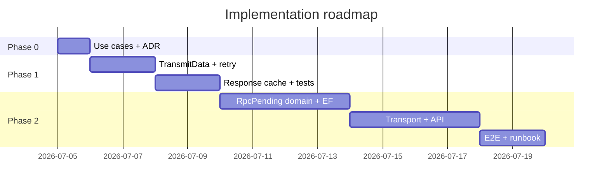

# План реализации: SentAndWait RPC для critical flows

**Статус:** в работе (фаза 1 выполнена; фаза 2 — MVP каркас)  
**Создан:** 2026-07-04 22:44 (UTC+3)  
**Обновлён:** 2026-07-04 22:55 (UTC+3)  
**Основание:** [`2026-07-04_2242-sentandwait-rpc-critical-flows.md`](2026-07-04_2242-sentandwait-rpc-critical-flows.md) (стратегия уровней 1–3)  
**Цель:** конкретный порядок работ, задачи по файлам, PR-ы и критерии готовности  
**Оценка суммарно:** ~12–14 рабочих дней до production-critical (фазы 0–2); +3–5 дн hardening (фаза 3)

---

## Цель и границы

| Что решаем | Чем |
|------------|-----|
| Critical flow: «commit БД + гарантированная отправка запроса» | **Async Request-Response + RpcPending** (уровень 3) |
| Sync RPC: timeout → unknown state для idempotent ops | **MessageId + response cache + retry** (уровень 2) |
| Misuse RPC в critical TX | **Governance** (уровень 1, без кода) |

**Не делаем:** exactly-once через sync RPC — это архитектурно недостижимо.

---

## Фаза 0 — Подготовка (~0.5 дн)

| ID | Задача |
|----|--------|
| 0.1 | Зафиксировать 1–2 реальных use case из домена (например: авторизация платежа vs статус заказа) |
| 0.2 | Для каждого — выбрать уровень (1 / 2 / 3) по матрице из [`2026-07-04_2242-sentandwait-rpc-critical-flows.md`](2026-07-04_2242-sentandwait-rpc-critical-flows.md) |
| 0.3 | ADR: «Critical flows не используют sync SentAndWait RPC» |

**DoD:** таблица use case → паттерн; команда согласовала, что critical идёт в фазу 2, не в фазу 1.

---

## Фаза 1 — Idempotent Sync RPC (3–4 дн)

*Быстрая ценность для read/query и idempotent command. Не закрывает critical TX.*

### 1.1. Расширить `TransmitData` (SentAndWait)

Сейчас SentAndWait использует отдельный минимальный struct **без** `MessageId` (в SentAndForgot он уже есть):

```6:14:../../src/IntegrationFlow.Core/Contexts/Integrations/03Domain/SentAndWait/TransmitData.cs
    public struct TransmitData
    {
        public object Data { get; private set; }

        public TransmitData(object data)
        {
            Data = data;
        }
    }
```

| # | Задача | Файлы |
|---|--------|-------|
| 1.1 | Добавить `MessageId`, `WithMessageId()` по аналогии с SentAndForgot | [`SentAndWait/TransmitData.cs`](../../src/IntegrationFlow.Core/Contexts/Integrations/03Domain/SentAndWait/TransmitData.cs) |
| 1.2 | `SentAndWaitIntegration.WithMessageId(string)` | [`SentAndWaitIntegration.cs`](../../src/IntegrationFlow.Core/Contexts/Integrations/03Domain/SentAndWait/SentAndWaitIntegration.cs) |
| 1.3 | Transmitter: `MessageId = transmitData.MessageId ?? Guid.NewGuid()` | [`RabbitMqRequestReplyTransmitter.cs`](../../src/IntegrationFlow.Core/Contexts/Integrations/00InnerUsage/RabbitMq/SentAndWait/Transmitters/RabbitMqRequestReplyTransmitter.cs) |

### 1.2. Retry после timeout

| # | Задача |
|---|--------|
| 1.4 | `SentAndWaitIntegrationOptions`: `RetryOnTimeout`, `MaxRetries`, `RetryDelay` |
| 1.5 | В transmitter: при `SentAndWaitTimeoutException` — retry с **тем же MessageId**, новым CorrelationId |
| 1.6 | Metric: `integrationflow.requestreply.retry_after_timeout` |

### 1.3. Server Response Cache

| # | Задача | Файлы |
|---|--------|-------|
| 1.7 | `IRequestReplyResponseStore` + `RequestReplyCacheResult` | `03Domain/SentAndWait/ResponseCache/` |
| 1.8 | `InMemoryRequestReplyResponseStore` (sample/tests) | `00Samples/` |
| 1.9 | `EfRequestReplyResponseStore<TContext>` + entity `RpcResponseCacheEntity` | `EntityFrameworkCore/` |
| 1.10 | `RabbitMqRpcServerPipeline` — TryBegin → handler / cached reply → StoreResponse | `SentAndWait/Reply/` |
| 1.11 | Обновить [`SampleRabbitMqSentAndWaitRpcServer`](../../src/IntegrationFlow.Core/Contexts/Integrations/00Samples/SentAndWait/SampleRabbitMqSentAndWaitRpcServer.cs) |

### 1.4. Тесты

| # | Тест |
|---|------|
| T1 | Unit: transmitter использует переданный MessageId |
| T2 | Integration: timeout → retry same MessageId → server отвечает из cache |
| T3 | Integration: parallel retry — один side-effect на server |

**DoD фазы 1:** sync RPC с явным `MessageId` переживает timeout без duplicate side-effect (при idempotent server). **Выполнено.**

---

## Фаза 2 — Async Request-Response + Outbox (8–10 дн)

*Основное решение для critical flows. **MVP каркас реализован** — E2E AsyncOutbox и runbook в backlog.*

### 2.1. Домен (Core)

| # | Задача | Файлы |
|---|--------|-------|
| 2.1 | `RpcPendingRequest`, `RpcPendingStatus` | `03Domain/RpcPending/` |
| 2.2 | `IRpcPendingStore` — Enqueue/Claim/Complete/Fail/Get/Wait | |
| 2.3 | `IRpcPendingEnqueue.Stage()` — без SaveChanges (как [`IOutboxEnqueue`](../../src/IntegrationFlow.Core/Contexts/Integrations/03Domain/Outbox/IOutboxEnqueue.cs)) | |
| 2.4 | `RpcPendingRelayService` — claim + publish (паттерн [`OutboxRelayService`](../../src/IntegrationFlow.Core/Contexts/Integrations/03Domain/Outbox/OutboxRelayService.cs)) | |
| 2.5 | `RpcPendingRelayBackgroundService` + DI extension | `DependencyInjection/` |

### 2.2. EF

| # | Задача |
|---|--------|
| 2.6 | `RpcPendingRequestEntity` + `ConfigureIntegrationFlowRpcPending()` |
| 2.7 | `EfRpcPendingStore<TContext>` — SKIP LOCKED claim (переиспользовать паттерн outbox) |
| 2.8 | `DbContextRpcPendingExtensions.EnqueueRpcRequest()` |

### 2.3. Transport

| # | Задача |
|---|--------|
| 2.9 | `RabbitMqRequestReplyConfiguration.RequestMode`: `Sync` \| `AsyncOutbox` |
| 2.10 | `RabbitMqAsyncRpcRequestTransmitter` — stage в pending, не blocking wait |
| 2.11 | `RabbitMqRpcResponseListener` — consume `{Profile}.responses` |
| 2.12 | `RpcResponseCorrelationWorker` — CorrelationId = PendingId → Complete |
| 2.13 | Server: reply на `ResponseQueueName` при `AsyncOutbox` mode |

### 2.4. Application API

```csharp
// В той же TX:
rpcPendingEnqueue.Stage(new RpcPendingRequest(...));
await db.SaveChangesAsync(ct);

// Ожидание (ASP.NET):
var result = await rpcPendingStore.WaitForCompletionAsync(pendingId, timeout, ct);
```

| # | Задача |
|---|--------|
| 2.14 | `CreateSentAndWaitAsyncOutboxIntegration<TProvider>()` |
| 2.15 | `IntegrateWithResultAsync` → poll pending store |
| 2.16 | Metrics: `rpc.pending.count`, `rpc.pending.duration`, `rpc.pending.timeout` |

### 2.5. Ops

| # | Задача |
|---|--------|
| 2.17 | `ReplayAbandonedRpcPendingAsync` + runbook |
| 2.18 | Sample: critical payment flow (stage TX + wait) |
| 2.19 | E2E: TX commit → relay → server → response queue → Complete |

**DoD фазы 2:** business TX + RPC request атомарны; ответ коррелируется; timeout переводит pending в `TimedOut` с ops replay.

---

## Фаза 3 — Hardening (optional, 3–5 дн)

| # | Задача |
|---|--------|
| 3.1 | `IRpcCompensationHandler` при `Failed` / `TimedOut` |
| 3.2 | Compensation через SentAndForgot outbox |
| 3.3 | Cleanup job для response cache + expired pending |
| 3.4 | Analysis v12 + обновление runbooks |

---

## Рекомендуемый порядок и сроки



| Фаза | Срок | Результат |
|------|------|-----------|
| **0** | 0.5 дн | Ясность, что идёт в какой паттерн |
| **1** | 3–4 дн | Sync RPC retry-safe (idempotent) |
| **2** | 8–10 дн | Critical flows на async outbox RPC |
| **3** | 3–5 дн | Saga, cleanup, docs |

**Итого до production-critical:** ~12–14 дн (фазы 0–2).

---

## MVP vs Full

| Scope | Включает | Закрывает R1 для critical? |
|-------|----------|----------------------------|
| **MVP-min** | Фаза 0 + governance only | Нет — только запрет misuse |
| **MVP-sync** | + Фаза 1 | Нет — только idempotent sync |
| **MVP-prod** | + Фаза 2 (без compensation) | **Да** |
| **Full** | + Фаза 3 | Да + rollback path |

**Рекомендация:** начать с **Фазы 1** (2–3 дня, низкий риск), параллельно проектировать **Фазу 2** под critical use case.

---

## Риски реализации

| Риск | Mitigation |
|------|------------|
| Дублирование outbox/pending логики | Обобщить claim strategy; переиспользовать `OutboxClaimStrategyResolver` |
| Два `TransmitData` (SentAndForgot vs SentAndWait) | Сначала расширить SentAndWait; унификация — отдельный рефакторинг |
| Breaking changes | `RequestMode=Sync` по умолчанию; новый API opt-in |
| Scope creep | Фаза 2 только для 1 профиля; второй профиль — после E2E |

---

## Первые 3 PR

| PR | Содержание | ~размер |
|----|------------|---------|
| **PR-1** | `SentAndWait.TransmitData` + MessageId в transmitter + unit tests | S |
| **PR-2** | RetryOnTimeout + integration test timeout/retry | M |
| **PR-3** | `IRequestReplyResponseStore` + EF + sample server pipeline | M |

После PR-3 — **PR-4**: каркас `RpcPending` + EF entity (без transport).

---

## Definition of Done (весь план)

- [ ] Фаза 0: use cases + ADR
- [x] Фаза 1: MessageId + retry + response cache + тесты
- [ ] Фаза 2: RpcPending + relay + response listener + EF + E2E + runbook (MVP: domain/EF/relay/correlation — done; E2E — open)
- [ ] Фаза 3 (optional): compensation + cleanup + analysis v12

---

## Связанные документы

| Документ | Связь |
|----------|-------|
| [`2026-07-04_2242-sentandwait-rpc-critical-flows.md`](2026-07-04_2242-sentandwait-rpc-critical-flows.md) | Стратегия уровней 1–3 |
| [`2026-07-04_2234-integrationflow-full-analysis.md`](../2026-07-04_2234-integrationflow-full-analysis.md) | Риски R1, R2 |
| [`2026-07-04_2130-sentandwait-rpc-adoption.md`](../runbooks/2026-07-04_2130-sentandwait-rpc-adoption.md) | Governance (фаза 0) |
| [`2026-07-04_0904-rabbitmq-sentandwait.md`](2026-07-04_0904-rabbitmq-sentandwait.md) | Baseline sync RPC |
| [`2026-07-04_2301-sentandwait-rpc-implementation-status.md`](../2026-07-04_2301-sentandwait-rpc-implementation-status.md) | Статус реализации фаз 1–2 |
