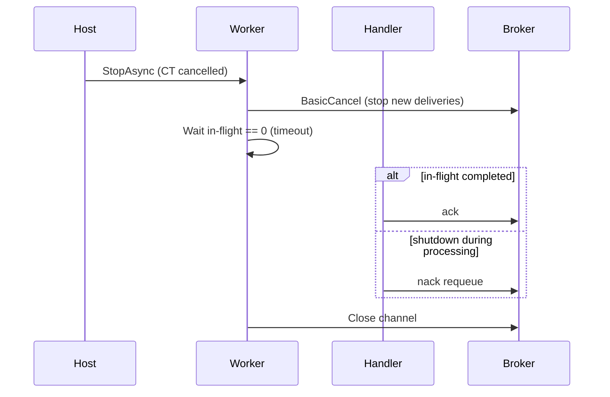
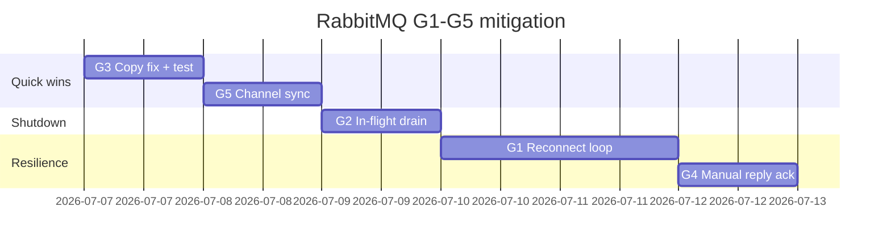

# План: закрытие RabbitMQ transport gaps G1–G5 (P1)

**Статус:** выполнено  
**Создан:** 2026-07-06 14:45 (UTC+3)  
**Обновлён:** 2026-07-06 14:56 (UTC+3)  
**Основание:** [`../2026-07-04_2352-rabbitmq-full-analysis.md`](../2026-07-04_2352-rabbitmq-full-analysis.md) §3.1, [`../2026-07-05_1455-integrationflow-full-analysis.md`](../2026-07-05_1455-integrationflow-full-analysis.md) §4  
**Связанные планы:** [`2026-07-04_2130-remaining-risks-mitigation.md`](2026-07-04_2130-remaining-risks-mitigation.md) (adoption/ops закрыты), [`2026-07-04_0930-post-analysis-roadmap.md`](2026-07-04_0930-post-analysis-roadmap.md) (P2+ backlog)  
**Цель:** закрыть единственный открытый **P1**-блок — operational hardening транспортного слоя RabbitMQ  
**Оценка:** ~4–5 рабочих дней (код + тесты)

---

## Контекст

После закрытия adoption/AsyncOutbox (P3, P4) остаётся **P1: RabbitMQ transport gaps G1–G5**. Это не архитектурные дыры, а проблемы **reconnect, shutdown, конфигурации и thread-safety канала** — влияют на стабильность long-running consumer и AsyncOutbox correlation worker в production.

**Рекомендуемый порядок:** G3 → G5 → G2 → G1 → G4 (от быстрых изолированных фиксов к более сложным изменениям lifecycle).

---

## Сводная матрица

| ID | Проблема | Severity | Impact в prod | Effort |
|----|----------|----------|---------------|--------|
| **G1** | Listener завершается при `ConnectionShutdown` | Высокий | Consumer «умирает» при кратком разрыве сети / broker restart | 1–1.5 дн |
| **G2** | Graceful shutdown без ack/nack in-flight | Средний–высокий | Deploy → unacked → redelivery storm | 1 дн |
| **G3** | `Copy()` теряет `RequeueOnFailure` / `MaxRetryCount` | Средний | Silent misconfiguration retry/DLQ | 0.5 ч |
| **G4** | Sync RPC reply consumer `autoAck: true` | Низкий–средний | Потеря reply при crash между receive и `TrySetResult` | 0.5–1 дн |
| **G5** | Correlation service ack без lock channel | Средний | Race на `IModel` под нагрузкой AsyncOutbox | 0.5 дн |

---

## G3 — `PopulateProfile` не копирует retry-настройки

### Анализ

`LoadProfile()` работает через `Bind` и подхватывает все поля. `PopulateProfile()` / `PopulateFromFile()` используют `Copy()`, где **нет** `RequeueOnFailure` и `MaxRetryCount`.

Файл: [`RabbitMqConfigurationLoader.cs`](../../src/IntegrationFlow.Core/Contexts/Integrations/00InnerUsage/RabbitMq/ReceiveAndProcess/Configurations/RabbitMqConfigurationLoader.cs), метод `Copy()`.

Side-классы с `PopulateProfile(this, "Inbox")` получают дефолты (`RequeueOnFailure=false`, `MaxRetryCount=0`) вместо значений из JSON.

### План

| # | Задача | Файлы |
|---|--------|-------|
| 3.1 | Добавить `RequeueOnFailure`, `MaxRetryCount` в `Copy()` | `RabbitMqConfigurationLoader.cs` |
| 3.2 | Unit-тест: `PopulateProfile` сохраняет retry-поля | `RabbitMqConfigurationLoaderTests.cs` |
| 3.3 | Проверить аналогичный `Copy()` в publish/request-reply loaders | — |

**DoD:** тест падает до фикса, проходит после; regression нет.

---

## G5 — AsyncOutbox correlation ack без синхронизации channel

### Анализ

`RabbitMqRpcResponseCorrelationHostedService` вызывает `BasicAck`/`BasicNack` напрямую из async handler без lock.

Файл: [`RabbitMqRpcResponseCorrelationHostedService.cs`](../../src/IntegrationFlow.Core/Contexts/Integrations/00InnerUsage/RabbitMq/SentAndWait/Response/RabbitMqRpcResponseCorrelationHostedService.cs).

Listener уже использует паттерн [`RabbitMqChannelAcknowledgement`](../../src/IntegrationFlow.Core/Contexts/Integrations/00InnerUsage/RabbitMq/ReceiveAndProcess/Listeners/RabbitMqChannelAcknowledgement.cs) + `lock (channelSync)`. `IModel` не thread-safe — параллельные `Received` callbacks могут вызвать исключение или некорректное состояние канала.

### План

| # | Задача | Детали |
|---|--------|--------|
| 5.1 | Переиспользовать `RabbitMqChannelAcknowledgement` или общий helper | `object channelSync` + accessor `() => channel` |
| 5.2 | Все ack/nack в correlation service — через helper под lock | `RunProfileConsumerAsync` |
| 5.3 | Unit-тест: mock channel + parallel ack calls не бросают | опционально stress-тест |

**DoD:** единый паттерн ack/nack во всех consumer'ах RabbitMQ-слоя.

---

## G2 — Graceful shutdown без ack/nack in-flight

### Анализ

При `cancellationToken.IsCancellationRequested` handler **выходит без ack/nack**.

Файл: [`RabbitMqReceivedMessageHandler.cs`](../../src/IntegrationFlow.Core/Contexts/Integrations/00InnerUsage/RabbitMq/ReceiveAndProcess/Listeners/RabbitMqReceivedMessageHandler.cs).

При `host.StopAsync()`:

1. Сообщения in-flight остаются unacked
2. Channel закрывается в `finally` worker'а
3. Broker делает redelivery → возможный duplicate processing (mitigated dedup, но лишняя нагрузка)

### План

| # | Задача | Детали |
|---|--------|--------|
| 2.1 | **In-flight tracker** — `Interlocked` counter в handler/worker | Инкремент при старте, декремент в `finally` |
| 2.2 | При shutdown: **не принимать новые** сообщения | `BasicCancel` перед drain |
| 2.3 | **Drain phase** в `RunAsync`: дождаться `inFlight == 0` с timeout (default 30s) | Логировать timeout |
| 2.4 | Если shutdown во время process — **nack requeue** | Безопасно с dedup |
| 2.5 | Метрика `integrationflow.message.shutdown_requeue` (optional) | Observability |
| 2.6 | Integration test: publish → `StopAsync` mid-processing → no hang + requeue | `RabbitMqListenerHostedEndToEndTests` |

**Рекомендуемая семантика:**



**DoD:** `HostedService_StopAsync_CompletesWithoutHang` расширен; новый тест на mid-processing shutdown.

---

## G1 — Listener завершается при `ConnectionShutdown`

### Анализ

`WaitForShutdownAsync` завершается и при `ConnectionShutdown`, и при `CancellationToken`. В `finally` connection/channel **всегда закрываются**.

Файл: [`RabbitMqListenerWorker.cs`](../../src/IntegrationFlow.Core/Contexts/Integrations/00InnerUsage/RabbitMq/ReceiveAndProcess/Workers/RabbitMqListenerWorker.cs).

Флаг `AutomaticRecoveryEnabled` в `ConnectionFactory` бесполезен — worker уже завершился. Главный риск для long-running consumer в Kubernetes/Docker (rolling restart broker, network blip).

### План

| # | Задача | Детали |
|---|--------|--------|
| 1.1 | **Reconnect loop** в `RunAsync`: `while (!cancellationToken.IsCancellationRequested)` | Внутренний try/catch |
| 1.2 | Разделить сигналы: **CT → exit**, **ConnectionShutdown → reconnect** | Убрать shutdown из completion source |
| 1.3 | **Exponential backoff** (1s → 2s → 4s → max 30s) | Config: `ReconnectMaxDelaySeconds` (optional) |
| 1.4 | Лог + метрика `integrationflow.listener.reconnect` | Tags: profile, reason |
| 1.5 | Перед reconnect: dispose channel/connection под `lock (channelSync)` | |
| 1.6 | Integration test: stop/start RabbitMQ container → consumer восстанавливается | Testcontainers |
| 1.7 | Документировать: reconnect loop — framework responsibility | README |

**Структура loop:**

```csharp
while (!cancellationToken.IsCancellationRequested)
{
    try
    {
        await RunConsumerSessionAsync(...);
    }
    catch (OperationCanceledException) when (cancellationToken.IsCancellationRequested) { break; }
    catch (Exception ex)
    {
        logger.LogException("Reconnect after error", ex);
        await DelayWithBackoff(...);
    }
}
// graceful shutdown (G2 drain) здесь
```

**DoD:** consumer переживает broker restart в integration test; при app shutdown — корректный exit через CT (с G2 drain).

---

## G4 — Sync RPC reply consumer `autoAck: true`

### Анализ

`BasicConsume(autoAck: true)` — reply ack'ится брокером **до** `TrySetResult`. Crash между receive и correlate → reply потерян, client получит timeout (at-most-once).

Файл: [`RabbitMqRequestReplyConnection.cs`](../../src/IntegrationFlow.Core/Contexts/Integrations/00InnerUsage/RabbitMq/SentAndWait/Connections/RabbitMqRequestReplyConnection.cs).

Edge case для sync RPC; критичнее при unstable process.

### План

| # | Задача | Детали |
|---|--------|--------|
| 4.1 | `BasicConsume(autoAck: false)` | |
| 4.2 | `BasicAck` **после** успешного `TrySetResult` | Под lock на consume channel |
| 4.3 | Unknown `correlationId` → `BasicNack(requeue: false)` или ack + drop | Не requeue orphan replies |
| 4.4 | Config flag `ManualReplyAck` (default `false` в 1.0.x, `true` в 1.1) | Backward compat |
| 4.5 | Unit test: reply received → ack called | |
| 4.6 | Integration test: pending removed before reply → no duplicate | |

**DoD:** opt-in через config; documented в runbook SentAndWait.

---

## Порядок выполнения и PR-стратегия



| PR | Scope | Зависимости |
|----|-------|-------------|
| **PR-1** | G3 + G5 | Независимы, можно одним PR |
| **PR-2** | G2 | Refactor shutdown в worker |
| **PR-3** | G1 | Строится на G2 drain |
| **PR-4** | G4 | Независим от G1–G2, можно параллельно PR-3 |

---

## Тестовая матрица

| Gap | Unit | Integration |
|-----|------|-------------|
| G3 | `PopulateProfile` copies retry fields | — |
| G5 | Parallel ack under lock | — |
| G2 | In-flight counter, shutdown nack | Stop mid-processing |
| G1 | Backoff logic | Broker restart recovery |
| G4 | Ack after correlate | Reply after client timeout |

Chaos-сценарии из [`2026-07-04_2352-rabbitmq-full-analysis.md`](../2026-07-04_2352-rabbitmq-full-analysis.md) §3.7 закрываются G1 + G2.

---

## Definition of Done (вся волна G1–G5)

- [x] G3: `Copy()` полный; unit-тест
- [x] G5: ack/nack через единый synchronized helper в correlation service
- [x] G2: drain in-flight при shutdown; unit + integration тесты
- [x] G1: reconnect loop с backoff; broker restart integration test
- [x] G4: manual reply ack (config `ManualReplyAck`, default `false`)
- [x] Метрики reconnect / shutdown
- [x] README: reconnect behavior, shutdown semantics, `ManualReplyAck`
- [x] Analysis: G1–G5 → **Закрыт** — [`2026-07-06_1456-rabbitmq-g1-g5-implementation-status.md`](../2026-07-06_1456-rabbitmq-g1-g5-implementation-status.md)

---

## Связь с остальным roadmap

| После G1–G5 | Следующий шаг |
|-------------|---------------|
| **P2** | [`plans/2026-07-06_1519-rabbitmq-p2-resilience-hardening.md`](2026-07-06_1519-rabbitmq-p2-resilience-hardening.md) — ✅ core |
| **P2 status** | [`2026-07-06_1617-rabbitmq-p2-implementation-status.md`](../2026-07-06_1617-rabbitmq-p2-implementation-status.md) |
| Ops | NuGet publish (единственный ops-blocker v1.0) |
| P2 | SentAndForgot connection pool, TLS для listener/publish |
| P3 | Health checks, distributed tracing |
| Adoption | Уже закрыт runbooks'ами — G1–G5 не меняют семантику delivery при правильном adoption |

---

## Сводная оценка effort

| Этап | Effort | Эффект |
|------|--------|--------|
| G3 + G5 (PR-1) | 0.5–1 дн | Config bug + AsyncOutbox race |
| G2 (PR-2) | 1 дн | Clean deploys |
| G1 (PR-3) | 1–1.5 дн | Consumer survives broker restart |
| G4 (PR-4) | 0.5–1 дн | Sync RPC reply durability |
| **Итого** | **~4–5 дн** | **P1 transport gaps закрыты** |
