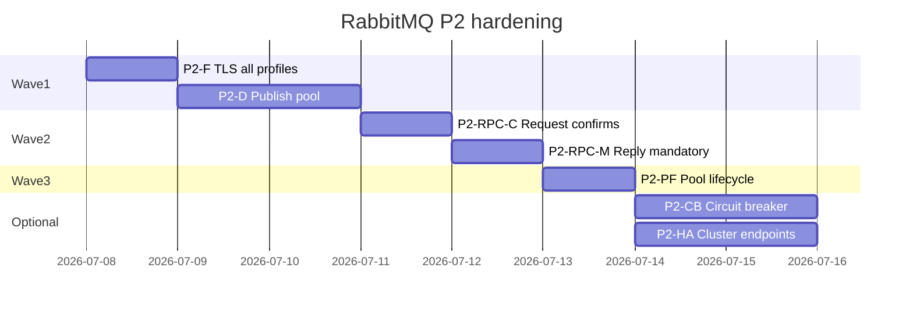

# План: RabbitMQ P2 — resilience и production-hardening

**Статус:** выполнено (core)  
**Создан:** 2026-07-06 15:19 (UTC+3)  
**Обновлён:** 2026-07-06 16:17 (UTC+3)  
**Основание:** [`../2026-07-04_2352-rabbitmq-full-analysis.md`](../2026-07-04_2352-rabbitmq-full-analysis.md) §3.2, [`../2026-07-05_1455-integrationflow-full-analysis.md`](../2026-07-05_1455-integrationflow-full-analysis.md) §7  
**Предшественник:** [`2026-07-06_1445-rabbitmq-g1-g5-mitigation.md`](2026-07-06_1445-rabbitmq-g1-g5-mitigation.md) (P1 ✅)  
**Связанные планы:** [`2026-07-04_2130-remaining-risks-mitigation.md`](2026-07-04_2130-remaining-risks-mitigation.md) (PF1/PF2 частично), [`2026-07-04_0930-post-analysis-roadmap.md`](2026-07-04_0930-post-analysis-roadmap.md)  
**Цель:** повысить **throughput, security и надёжность publish/RPC** без изменения delivery-семантики adoption-путей  
**Оценка:** ~5–7 рабочих дней (волны 1–3); +2–3 дн optional (волна 4)

---

## Контекст

После закрытия **P1 (G1–G5)** transport-слой consumer и AsyncOutbox correlation стабилен. **P2** — следующий приоритетный блок: оптимизация **SentAndForgot direct publish**, **TLS для всех профилей**, **publisher confirms / mandatory на RPC**, **pool lifecycle**.

**Не входит в P2** (см. P3/P4 или закрыто):

| ID | Задача | Статус |
|----|--------|--------|
| G2 Graceful shutdown drain | P1 | ✅ Закрыт |
| PF1 ReplyPublisher pool | v1.0 plan | ✅ `ReuseReplyConnection` |
| PF2 RPC pool invalidate | v1.0 plan | ✅ базовый `Invalidate` |
| Health checks | P3 | Отложено |
| Distributed tracing | P3 optional | Отложено |
| Shared connection profiles | P4 | Отложено |

**Production default:** outbox relay для SentAndForgot — без изменений. P2 улучшает **direct publish** и RPC transport, не меняя рекомендацию «critical TX → outbox».

---

## Сводная матрица P2

| ID | Область | Текущее состояние | Улучшение | Effort | Impact |
|----|---------|-------------------|-----------|--------|--------|
| **P2-D** | SentAndForgot direct publish | Новое TCP на каждый `Integrate()` | Connection pool по профилю | 1–1.5 дн | Latency / throughput |
| **P2-F** | TLS | `SslEnabled` только в `RabbitMqRequestReply` | AMQPS для listener + publish | 0.5–1 дн | Security / prod adoption |
| **P2-RPC-C** | RPC request publish | Без publisher confirms | Confirms + timeout (как SentAndForgot) | 0.5–1 дн | Durability request |
| **P2-RPC-M** | RPC server reply | `Mandatory=false` | Opt-in `Mandatory` + `BasicReturn` | 0.5 дн | Unroutable reply detection |
| **P2-PF** | Static pools | Invalidate on reconnect; нет TTL/metrics | Idle eviction, shutdown hook, gauge | 1 дн | Ops / leak prevention |
| **P2-CB** | Circuit breaker | Нет | Пауза при серии ошибок + метрика | 1–1.5 дн | Optional |
| **P2-HA** | Cluster | Один `HostName` | `AmqpTcpEndpoint[]` / список hosts | 1–2 дн | Optional |

**Рекомендуемый порядок:** P2-F → P2-D → P2-RPC-C → P2-RPC-M → P2-PF → (optional) P2-CB, P2-HA.

---

## P2-F — TLS (AMQPS) для listener и publish

### Анализ

`RabbitMqConnectionSettings` и `RabbitMqConnectionFactory` уже поддерживают `SslEnabled` / `SslServerName`. Поля есть в `RabbitMqRequestReplyConfiguration`, **нет** в `RabbitMqConfiguration` и `RabbitMqPublishConfiguration`.

Файлы:
- [`RabbitMqConfiguration.cs`](../../src/IntegrationFlow.Core/Contexts/Integrations/00InnerUsage/RabbitMq/ReceiveAndProcess/Configurations/RabbitMqConfiguration.cs)
- [`RabbitMqPublishConfiguration.cs`](../../src/IntegrationFlow.Core/Contexts/Integrations/00InnerUsage/RabbitMq/SentAndForgot/Configurations/RabbitMqPublishConfiguration.cs)
- [`RabbitMqConnectionFactory.cs`](../../src/IntegrationFlow.Core/Contexts/Integrations/00InnerUsage/RabbitMq/RabbitMqConnectionFactory.cs)

### План

| # | Задача | Детали |
|---|--------|--------|
| F.1 | Добавить `SslEnabled`, `SslServerName` в listener + publish config | Default `false` |
| F.2 | Прокинуть в `ToConnectionSettings()` / `RabbitMqPublishConfiguration.ToConnectionSettings()` | |
| F.3 | Обновить `Copy()` в loaders | |
| F.4 | Unit-тесты loaders | Bind + PopulateProfile |
| F.5 | README: AMQPS samples для **трёх** секций `RabbitMq`, `RabbitMqPublish`, `RabbitMqRequestReply` | Port 5671 |
| F.6 | Sample `rabbitmq.json` в `00Samples/` | dev-only self-signed note |

**DoD:** integration test с Testcontainers **не обязател** (TLS в CI сложен); достаточно unit + docs.

---

## P2-D — Connection pool для SentAndForgot

### Анализ

Каждый `Integrate()` создаёт новый [`RabbitMqPublishConnection`](../../src/IntegrationFlow.Core/Contexts/Integrations/00InnerUsage/RabbitMq/SentAndForgot/Connections/RabbitMqPublishConnection.cs) через [`RabbitMqSentAndForgotIntegrationOppositeSideBase`](../../src/IntegrationFlow.Core/Contexts/Integrations/00InnerUsage/RabbitMq/SentAndForgot/RabbitMqSentAndForgotIntegrationOppositeSideBase.cs).

Для RPC уже есть [`RabbitMqRequestReplyConnectionPool`](../../src/IntegrationFlow.Core/Contexts/Integrations/00InnerUsage/RabbitMq/SentAndWait/Connections/RabbitMqRequestReplyConnectionPool.cs) + флаг `ReuseConnection`.

Outbox relay использует отдельный worker lifecycle — pool **не** обязателен для relay path в v1.0.1; scope — **direct publish**.

### План

| # | Задача | Детали |
|---|--------|--------|
| D.1 | `ReuseConnection` на `RabbitMqPublishConfiguration` | Default `false` (backward compat) |
| D.2 | `RabbitMqPublishConnectionPool` | Аналог RPC: `GetOrAdd`, `Invalidate`, `ILeaveOpenOnDispose` |
| D.3 | `RabbitMqPublishConnection` — `leaveOpenOnDispose`, `ForceDispose()` | Как RPC connection |
| D.4 | Wire-up в `RabbitMqSentAndForgotIntegrationOppositeSideBase.CreateConnection` | if `ReuseConnection` → pool |
| D.5 | Unit-тесты pool: reconnect, invalidate, dispose semantics | |
| D.6 | Integration test: N× `Integrate()` без N TCP (hook: connection count или timing) | Optional |
| D.7 | README: когда включать `ReuseConnection` (high-frequency direct publish) | |

**Семантика:** при `ReuseConnection=true` caller **не** dispose pool entry; pool переживает `Integrate()` scope.

**DoD:** default поведение без изменений; opt-in pool работает под нагрузкой.

---

## P2-RPC-C — Publisher confirms на RPC request

### Анализ

SentAndForgot: `PublisherConfirmsEnabled` + `WaitForConfirmsOrDie` в [`RabbitMqPublishTransmitter`](../../src/IntegrationFlow.Core/Contexts/Integrations/00InnerUsage/RabbitMq/SentAndForgot/Transmitters/RabbitMqPublishTransmitter.cs).

RPC request publish в [`RabbitMqRequestReplyTransmitter`](../../src/IntegrationFlow.Core/Contexts/Integrations/00InnerUsage/RabbitMq/SentAndWait/Transmitters/RabbitMqRequestReplyTransmitter.cs) — **без confirms**.

### План

| # | Задача | Детали |
|---|--------|--------|
| C.1 | `PublisherConfirmsEnabled`, `ConfirmTimeoutSeconds` на `RabbitMqRequestReplyConfiguration` | Default `true` / `30` (как publish) |
| C.2 | Enable confirms на `publishChannel` в `RabbitMqRequestReplyConnection.Open()` | `ConfirmSelect()` |
| C.3 | После `BasicPublish` request — `WaitForConfirmsOrDie` с timeout | Shared helper с publish |
| C.4 | Unit test + integration E2E RPC | Regression green |
| C.5 | README / runbook: confirms на request path | |

**Trade-off:** +latency на confirm; выигрыш — broker ack request до ожидания reply.

---

## P2-RPC-M — Mandatory на RPC reply (server-side)

### Анализ

[`RabbitMqReplyPublisher`](../../src/IntegrationFlow.Core/Contexts/Integrations/00InnerUsage/RabbitMq/SentAndWait/Reply/RabbitMqReplyPublisher.cs) публикует reply без `Mandatory` и без `BasicReturn`.

SentAndForgot уже детектирует unroutable через mandatory + return handler.

### План

| # | Задача | Детали |
|---|--------|--------|
| M.1 | `ReplyMandatory` (или reuse `Mandatory`) на `RabbitMqRequestReplyConfiguration` | Default `false` |
| M.2 | `BasicReturn` handler на reply channel (pool или ephemeral) | → `UnroutableMessageException` |
| M.3 | Sample RPC server: включить mandatory в prod profile | |
| M.4 | Unit test: mandatory + return → exception | |

---

## P2-PF — Pool lifecycle hardening (RPC + publish)

### Анализ

[`RabbitMqRequestReplyConnectionPool`](../../src/IntegrationFlow.Core/Contexts/Integrations/00InnerUsage/RabbitMq/SentAndWait/Connections/RabbitMqRequestReplyConnectionPool.cs): invalidate при failed reconnect ✅; **нет** TTL, idle eviction, метрик размера pool, shutdown dispose all.

### План

| # | Задача | Детали |
|---|--------|--------|
| PF.1 | `IHostApplicationLifetime.ApplicationStopping` — dispose all pooled connections | Extension в DI (net8.0) |
| PF.2 | Optional config: `ConnectionMaxIdleSeconds`, `ConnectionMaxLifetimeSeconds` | Default off |
| PF.3 | Background sweep или check-on-`GetOrAdd` | Remove stale entries |
| PF.4 | Metric gauge `integrationflow.connection.pool.size` | Tags: profile, kind=rpc|publish |
| PF.5 | Unit tests: invalidate, shutdown hook, idle eviction | |
| PF.6 | Единая абстракция `IRabbitMqConnectionPool<T>` | Optional refactor; не блокер |

**DoD:** нет leak при rolling deploy; pool size observable.

---

## P2-CB — Circuit breaker (optional, волна 4)

| # | Задача | Детали |
|---|--------|--------|
| CB.1 | Счётчик consecutive publish/consume failures per profile | In-memory |
| CB.2 | Open state: short-circuit N seconds | Config: threshold, break duration |
| CB.3 | Metric `integrationflow.circuit.open` | |
| CB.4 | Integration with `IntegrateWithResult` / relay workers | Fail fast + log |

**Не блокер v1.0.1** — включать только при ops-запросе.

---

## P2-HA — Cluster / multiple endpoints (optional, волна 4)

| # | Задача | Детали |
|---|--------|--------|
| HA.1 | `HostNames[]` или `Endpoints[]` в connection settings | Fallback порядок |
| HA.2 | `ConnectionFactory` — `CreateConnection(IList<AmqpTcpEndpoint>)` | |
| HA.3 | Docs: RabbitMQ cluster + load balancer vs client-side list | |

**Scope:** конфиг + factory; не заменяет infra LB.

---

## Порядок выполнения и PR-стратегия

| PR | Scope | Зависимости |
|----|-------|-------------|
| **PR-1** | P2-F TLS | Независим |
| **PR-2** | P2-D Publish pool | После PR-1 (shared connection settings) |
| **PR-3** | P2-RPC-C + P2-RPC-M | Можно одним PR |
| **PR-4** | P2-PF Pool lifecycle | После PR-2 (publish pool exists) |
| **PR-5** | P2-CB / P2-HA | Optional, отдельно |

**Минимум для v1.0.1 tag:** PR-1 + PR-2 + PR-3.  
**Полный P2:** + PR-4. Optional: PR-5.

---

## Тестовая матрица

| ID | Unit | Integration |
|----|------|-------------|
| P2-F | Loader bind/copy SSL fields | — |
| P2-D | Pool get/invalidate/dispose | N× publish same profile |
| P2-RPC-C | Confirm wait timeout | Existing RPC E2E |
| P2-RPC-M | BasicReturn → exception | RPC server sample |
| P2-PF | Shutdown hook, idle eviction | Broker restart + pool |

---

## Definition of Done (P2 core)

- [x] TLS на `RabbitMq` + `RabbitMqPublish` (config, loader, README samples)
- [x] `ReuseConnection` + pool для SentAndForgot direct publish
- [x] Publisher confirms на RPC request publish
- [x] Optional mandatory на RPC reply
- [x] Pool shutdown hook + метрика pool size
- [x] README и runbook обновлены
- [x] Analysis / status doc: P2 → **Закрыт (core)** — [`../2026-07-06_1617-rabbitmq-p2-implementation-status.md`](../2026-07-06_1617-rabbitmq-p2-implementation-status.md)

---

## Связь с release

| Release | Содержание |
|---------|------------|
| **v1.0.0** | P1 ✅ + adoption; **NuGet publish — ops** |
| **v1.0.1** | P2 core (TLS + publish pool + RPC confirms) |
| **v1.1** | P2-PF full + optional CB/HA; P3 health checks |

---

## Сводная оценка effort

| Волна | Effort | Эффект |
|-------|--------|--------|
| 1 (F + D) | 1.5–2.5 дн | Security + publish performance |
| 2 (RPC-C + M) | 1–1.5 дн | RPC transport durability |
| 3 (PF) | 1 дн | Pool ops readiness |
| 4 optional (CB + HA) | 2–3.5 дн | Advanced resilience |
| **Итого (1–3)** | **~5–7 дн** | **P2 core закрыт** |
