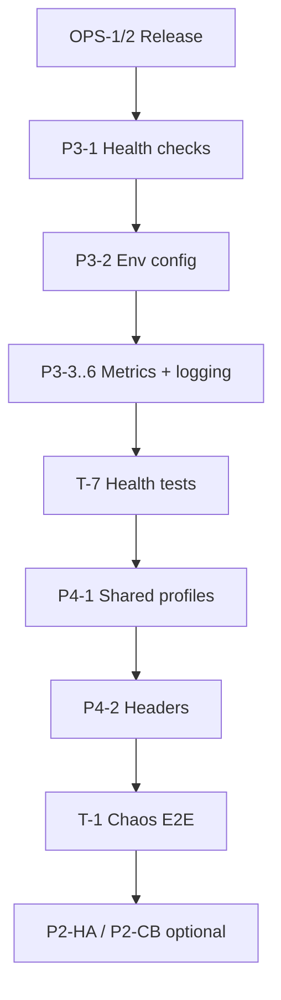

# План: RabbitMQ — backlog задач для последующей реализации

**Статус:** P3/P4 ✅; ops backlog открыт  
**Создан:** 2026-07-06 16:45 (UTC+3)  
**Обновлён:** 2026-07-07 21:57 (UTC+3)  
**Основание:** [`../2026-07-04_2352-rabbitmq-full-analysis.md`](../2026-07-04_2352-rabbitmq-full-analysis.md), [`../2026-07-06_1519-remaining-backlog-summary.md`](../2026-07-06_1519-remaining-backlog-summary.md)  
**Предшественники:** P1 G1–G5 ✅, P2 core ✅ — [`../2026-07-06_1456-rabbitmq-g1-g5-implementation-status.md`](../2026-07-06_1456-rabbitmq-g1-g5-implementation-status.md), [`../2026-07-06_1617-rabbitmq-p2-implementation-status.md`](../2026-07-06_1617-rabbitmq-p2-implementation-status.md)  
**P3 status (P3-1…P3-7):** [`../2026-07-06_1753-rabbitmq-p3-ops-implementation-status.md`](../2026-07-06_1753-rabbitmq-p3-ops-implementation-status.md)  
**P4 status (epic P4-1 … P4-7):** [`../2026-07-07_2103-rabbitmq-p4-implementation-status.md`](../2026-07-07_2103-rabbitmq-p4-implementation-status.md)  
**Связанные планы:** [`2026-07-04_0930-post-analysis-roadmap.md`](2026-07-04_0930-post-analysis-roadmap.md), [`2026-07-06_1519-rabbitmq-p2-resilience-hardening.md`](2026-07-06_1519-rabbitmq-p2-resilience-hardening.md)

Детализированный перечень задач после закрытия P1–P4. **Epic P4 закрыт.** Приоритеты: **ops (NuGet)** → **v1.1** → **тесты/CI** → **tech debt**.

---

## Контекст

| Критерий | Оценка | Комментарий |
|----------|--------|-------------|
| Функциональность | ★★★★★ | Три паттерна, outbox, RPC sync+async, dedup |
| Корректность | ★★★★☆ | P1 закрыт; семантика RPC — adoption-риск |
| Resilience | ★★★★☆ | Reconnect, pool, TLS; нет HA/CB/eviction |
| Observability | ★★★★★ | Health, metrics, logging, tracing — P3 ✅ |
| DX / Config | ★★★★★ | P4-1…P4-7 ✅; env overlay, topology helpers, SAC |
| Тесты | ★★★★☆ | Unit + E2E; chaos/DLQ/load — gaps |

**Вывод:** реализация готова к production при правильном adoption (outbox, dedup, DLQ topology, AsyncOutbox для критичных RPC). Блокер публичного release — NuGet publish, не код.

---

## P3 — Ops readiness (следующий спринт)

| ID | Задача | Описание | DoD | Effort | Статус |
|----|--------|----------|-----|--------|--------|
| **P3-1** | Health checks | `IHealthCheck` для listener, outbox relay, RPC correlation worker | `AddHealthChecks()` + extension methods; unhealthy при отсутствии соединения / N последовательных reconnect | 1 дн | ✅ |
| **P3-2** | Env / IConfiguration overlay | Поддержка env vars и `IConfiguration` в loaders (не только `rabbitmq.json`) | `RabbitMq__Inbox__HostName`; `AddIntegrationFlowRabbitMq(IConfiguration)` | 1 дн | ✅ |
| **P3-3** | Broker connectivity gauge | Gauge `integrationflow.broker.connected` (profile, kind) | Обновление при connect/disconnect/reconnect; README + runbook | 0.5 дн | ✅ |
| **P3-4** | Distributed tracing | Propagate `traceparent` / `tracestate` через AMQP headers | `Activity` на publish/consume/RPC; sample в README | 2 дн | ✅ |
| **P3-5** | Structured logging | Поля `MessageId`, `CorrelationId`, `DeliveryTag`, `profile` в логах | Единый enricher или scope; без breaking changes | 0.5 дн | ✅ |
| **P3-6** | Consumer-level метрики | Counters: `nack`, `requeue`, `dedup_skip`, `in_progress_requeue` | Теги `profile`, `reason`; алерты в runbook | 0.5 дн | ✅ |
| **P3-7** | Документация P3 | README + runbook metrics/alerting | Примеры конфигурации, пороги алертов | 0.5 дн | ✅ |

**Epic P3:** «Production observability & config» — ✅ закрыт.

---

## P4 — Developer experience

| ID | Задача | Описание | DoD | Effort | Статус |
|----|--------|----------|-----|--------|--------|
| **P4-1** | Shared connection profiles | Секция `RabbitMqConnections` + ссылка `"Connection": "Prod"` | Обратная совместимость flat/именованных профилей; unit-тесты loader | 1–2 дн | ✅ |
| **P4-2** | Headers API | Expose AMQP headers в `RabbitMqReceivedMessage` | `IReadOnlyDictionary<string, object> Headers`; sample custom retry/tracing | 1 дн | ✅ |
| **P4-3** | Sample hosted RPC server | Полный end-to-end: listener + `RabbitMqRpcServerPipeline` + client | Пример в `00Samples`, README walkthrough | 0.5 дн | ✅ |
| **P4-4** | Hosted listener netstandard2.0 | `AddIntegrationFlowRabbitMqListener` на netstandard2.0 | `IHostedService` на всех TFM; netstandard2.0 unit-тесты | 1 дн | ✅ |
| **P4-5** | AMQP priority / expiration | Поддержка в publish/RPC конфиге | Поля в JSON + mapping в `BasicProperties` | 0.5 дн | ✅ |
| **P4-6** | Topology helpers (dev) | Opt-in `QueueDeclare` для dev (сейчас только passive) | Флаг `DeclareTopologyOnStartup`; warning в prod docs | 1 дн | ✅ |
| **P4-7** | Consumer tag / exclusive | Конфиг `ConsumerTag`, `Exclusive` | Документация single-active-consumer | 0.5 дн | ✅ |

**Epic P4:** «DX & config ergonomics» — ✅ закрыт (P4-1…P4-7).

---

## v1.1 — Resilience (optional)

| ID | Задача | Описание | DoD | Effort |
|----|--------|----------|-----|--------|
| **P2-CB** | Circuit breaker | CB на publish/consume при недоступности брокера | Polly или свой; метрики open/half-open; конфиг thresholds | 2 дн |
| **P2-HA** | Cluster endpoints | Несколько `HostName` / endpoints в factory | Failover при connect; документация RabbitMQ cluster | 1–2 дн |
| **P2-PF+** | Pool idle eviction | `ConnectionMaxIdleSeconds`, max lifetime для publish/RPC pools | Фоновая очистка; метрика evictions | 1 дн |
| **P2-RE** | Publish pool reconnect hardening | Авто-invalidate при повторных `NeedReconnect()` | Unit + integration тест; без бесконечного spin | 0.5 дн |

**Epic v1.1:** «Advanced resilience» — ~4–5 дн.  
Детали optional-волны: [`2026-07-06_1519-rabbitmq-p2-resilience-hardening.md`](2026-07-06_1519-rabbitmq-p2-resilience-hardening.md).

---

## Тестирование и CI

| ID | Задача | Описание | DoD | Effort |
|----|--------|----------|-----|--------|
| **T-1** | Chaos: broker restart | E2E restart broker mid-processing (listener) | Testcontainers; assert reconnect + no message loss (requeue) | 1 дн | ✅ |
| **T-2** | Chaos: confirm drop | Connection drop during publisher confirm | Assert retry/outbox behavior | 1 дн | backlog |
| **T-3** | E2E DLQ topology | Реальная DLQ + `MaxRetryCount` + `x-death` | Сообщение уходит в DLQ после N попыток | 1 дн | ✅ |
| **T-4** | Load test RPC | `MaxConcurrentRequests > 1`, latency under load | Benchmark или integration с N parallel requests | 1 дн | ✅ |
| **T-5** | TLS integration test | AMQPS в Testcontainers (optional job) | Отдельный CI job или `[Trait("Category", "Tls")]` | 1–2 дн |
| **T-6** | Integration gate в release | `Category=Integration` обязателен перед tag | CI workflow / branch protection | 0.5 дн |
| **T-7** | P3 health check tests | Unit-тесты unhealthy при mock disconnect | Coverage для P3-1 | 0.5 дн | ✅ |

**Epic Testing:** ~5–7 дн.

---

## Adoption & документация (не код)

| ID | Задача | Описание | Effort | Статус |
|----|--------|----------|--------|--------|
| **A-1** | Runbook: DLQ topology | Шаблоны `x-dead-letter-exchange`, binding, monitoring | 0.5 дн | ✅ [`runbooks/2026-07-07_2137-rabbitmq-dlq-topology.md`](../runbooks/2026-07-07_2137-rabbitmq-dlq-topology.md) |
| **A-2** | Runbook: RPC semantics | Sync timeout, AsyncOutbox, server ack order | 0.5 дн | ✅ [`runbooks/2026-07-04_2130-sentandwait-rpc-adoption.md`](../runbooks/2026-07-04_2130-sentandwait-rpc-adoption.md) |
| **A-3** | Runbook: `ThrowOnFailure` | Когда `true`, когда `IntegrateWithResult()` | 0.25 дн | ✅ [`runbooks/2026-07-07_2137-throwonfailure-adoption.md`](../runbooks/2026-07-07_2137-throwonfailure-adoption.md) |
| **A-4** | Checklist production adoption | One-pager перед go-live | 0.25 дн | ✅ [`runbooks/2026-07-04_2130-production-adoption.md`](../runbooks/2026-07-04_2130-production-adoption.md) |

Существующие runbooks: [`../runbooks/2026-07-04_2130-production-adoption.md`](../runbooks/2026-07-04_2130-production-adoption.md), [`../runbooks/2026-07-04_2130-sentandwait-rpc-adoption.md`](../runbooks/2026-07-04_2130-sentandwait-rpc-adoption.md), [`../runbooks/2026-07-07_2137-rabbitmq-dlq-topology.md`](../runbooks/2026-07-07_2137-rabbitmq-dlq-topology.md), [`../runbooks/2026-07-07_2137-rabbitmq-topology-adoption.md`](../runbooks/2026-07-07_2137-rabbitmq-topology-adoption.md).

---

## Tech debt

| ID | Задача | Описание | Effort |
|----|--------|----------|--------|
| **TD-1** | RabbitMQ.Client v7 | Spike + план миграции на async API | 2–3 дн (spike) |
| **TD-2** | Delayed retry | Plugin `rabbitmq_delayed_message_exchange` или retry queues | 2 дн |
| **TD-3** | Quorum queues / streams | Документ совместимости и ограничений | 0.5 дн |
| **TD-4** | Унификация connection settings | Один DTO для трёх профилей (после P4-1) | 1 дн |

---

## Ops / Release

| ID | Задача | Описание | Effort |
|----|--------|----------|--------|
| **OPS-1** | NuGet publish v1.0.0 | Tag `v1.0.0`, push packages | 0.5 дн |
| **OPS-2** | Release v1.0.1 | Tag после P2 core (уже в коде) | 0.25 дн |
| **OPS-3** | CHANGELOG v1.0.1 | P1 G1–G5, P2 core | 0.25 дн |

Runbook: [`../runbooks/2026-07-04_0845-nuget-release.md`](../runbooks/2026-07-04_0845-nuget-release.md).

---

## Рекомендуемый порядок реализации



### Спринт 1 (~1 неделя)

- OPS-1, OPS-2, OPS-3
- P3-1, P3-2, P3-3
- T-7

### Спринт 2 (~1 неделя)

- P3-4, P3-5, P3-6, P3-7
- A-1 … A-4

### Спринт 3 (~1 неделя) — ✅

- P4-1, P4-2, P4-3, P4-4, P4-5, P4-6, P4-7
- T-1, T-3

### Backlog v1.1+
- P2-CB, P2-HA, P2-PF+, P2-RE
- T-2, T-4, T-5, T-6
- TD-1 … TD-4

---

## Шаблон задачи для трекера

```
Title: [P3-1] RabbitMQ health checks for listener and relay workers

Description:
Implement IHealthCheck for RabbitMQ listener, outbox relay, and RPC correlation hosted services.

Acceptance criteria:
- [ ] AddIntegrationFlowRabbitMqHealthChecks() extension
- [ ] Unhealthy when connection closed or reconnect loop exceeds threshold
- [ ] Unit tests with mocked connection
- [ ] README section + runbook alert example

Labels: rabbitmq, p3, observability
Estimate: 1d
Depends on: —
Blocks: T-7
```

---

## Матрица зависимостей (ключевые)

| ID | Depends on | Blocks |
|----|------------|--------|
| P3-1 | — | T-7 |
| P3-2 | — | P4-1 |
| P3-4 | P3-5 (optional) | — |
| P4-1 | P3-2 (recommended) | TD-4 |
| P4-2 | — | P3-4 (tracing headers) |
| T-1 | P1 G1–G5 ✅ | — |
| T-3 | A-1 (runbook) | — |
| T-6 | — | OPS-1 |
| P2-HA | — | TD-1 (v7 may change factory) |

---

## Итог

| Приоритет | Следующий шаг |
|-----------|---------------|
| **Сейчас** | OPS-1/2 — NuGet publish |
| **Optional** | T-2/T-5 — chaos/TLS/CI gate |
| **Backlog v1.1+** | P2-CB, P2-HA, T-2/T-4/T-5 |

Краткий указатель: [`../2026-07-06_1519-remaining-backlog-summary.md`](../2026-07-06_1519-remaining-backlog-summary.md).
