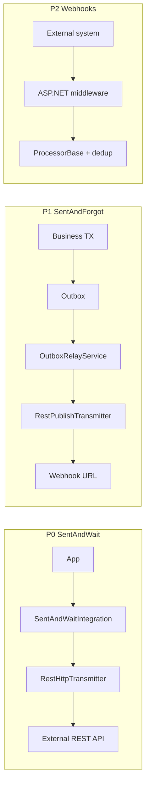

# План: REST-транспорт для IntegrationFlow

**Статус:** фазы 1–3 выполнены; фазы 4–5 — backlog  
**Создан:** 2026-07-10 08:53 (UTC+3)  
**Обновлён:** 2026-07-10 15:07 (UTC+3)  
**Статус реализации:** [`2026-07-10_1507-rest-implementation-status.md`](../2026-07-10_1507-rest-implementation-status.md)  
**Runbook:** [`runbooks/2026-07-10_1330-rest-sentandwait-adoption.md`](../runbooks/2026-07-10_1330-rest-sentandwait-adoption.md)  
**Связанные документы:** [`2026-07-04_2338-integration-types-full-report.md`](../2026-07-04_2338-integration-types-full-report.md), [`2026-07-05_1455-integrationflow-full-analysis.md`](../2026-07-05_1455-integrationflow-full-analysis.md), [`2026-06-20_2150-brokers-for-integration-framework.md`](../2026-06-20_2150-brokers-for-integration-framework.md), [`plans/2026-06-21_0952-rabbitmq-sentandforgot.md`](2026-06-21_0952-rabbitmq-sentandforgot.md), [`plans/2026-07-04_0904-rabbitmq-sentandwait.md`](2026-07-04_0904-rabbitmq-sentandwait.md), [`2026-07-06_1519-remaining-backlog-summary.md`](../2026-07-06_1519-remaining-backlog-summary.md)

**Цель:** реализовать production-ready REST-транспорт для паттернов SentAndWait, SentAndForgot и (опционально) ReceiveAndProcess webhooks; заменить legacy [`RESTSimpleTransmitter`](../../src/IntegrationFlow.Core/Contexts/Integrations/00Samples/Transmitters/RESTSimpleTransmitter.cs).

---

## Контекст

Legacy sample (до фазы 1):

- [`RESTSimpleTransmitter`](../../src/IntegrationFlow.Core/Contexts/Integrations/00Samples/Transmitters/RESTSimpleTransmitter.cs) — `HttpWebRequest`, sync-only → **`[Obsolete]`**
- [`RESTSimpleConfiguration`](../../src/IntegrationFlow.Core/Contexts/Integrations/00Samples/TransmitterConfigurations/RESTSimpleConfiguration.cs) — без loader/env overlay

**Текущее состояние (фазы 1–3 ✅):** production REST outbound — SentAndWait, SentAndForgot, transport-agnostic outbox relay. Детали: [`2026-07-10_1507-rest-implementation-status.md`](../2026-07-10_1507-rest-implementation-status.md).

RabbitMQ покрывает все три паттерна с production-hardening. REST inbound (webhooks) — **фаза 4** (backlog).

---

## 1. Scope

REST в каркасе — **не брокер**, а синхронный/полусинхронный транспорт.

| Приоритет | Паттерн | Сценарий | Статус |
|-----------|---------|----------|--------|
| **P0** | **SentAndWait** | HTTP request → response (внешний API) | ✅ фазы 1–2 |
| **P1** | **SentAndForgot** | HTTP POST webhook / callback + outbox | ✅ фаза 3 |
| **P2** | **ReceiveAndProcess** | Inbound webhooks (push) | ⏸ фаза 4 |
| P3 | AsyncOutbox HTTP | Critical TX + HTTP call | ⏸ фаза 5 |

**Out of scope v1:**

- gRPC, SOAP
- OAuth2 token refresh (фаза 2+)
- Saga / process manager
- ReceiveAndProcess через HTTP long-poll (антипаттерн)



---

## 2. Целевая архитектура

Структура по образцу RabbitMQ:

```
src/IntegrationFlow.Core/Contexts/Integrations/
├── 00InnerUsage/Rest/
│   ├── Configurations/
│   │   ├── RestConnectionProfile.cs
│   │   ├── RestConnectionProfileResolver.cs
│   │   ├── RestRequestReplyConfiguration.cs
│   │   ├── RestRequestReplyConfigurationLoader.cs
│   │   ├── RestPublishConfiguration.cs
│   │   └── RestPublishConfigurationLoader.cs
│   ├── Connections/
│   │   ├── RestHttpClientFactory.cs
│   │   └── RestHttpConnection.cs
│   ├── SentAndWait/
│   │   ├── Transmitters/RestHttpTransmitter.cs
│   │   └── RestSentAndWaitIntegrationOppositeSideBase.cs
│   ├── SentAndForgot/
│   │   ├── Transmitters/RestPublishTransmitter.cs
│   │   └── RestSentAndForgotIntegrationOppositeSideBase.cs
│   ├── Tracing/RestTracePropagation.cs
│   ├── Logging/RestStructuredLogging.cs
│   └── Exceptions/RestHttpException.cs
├── 00Samples/Rest/
│   ├── rest.json
│   ├── SampleRestSentAndWaitProvider.cs
│   └── SampleRestSentAndForgotProvider.cs
└── DependencyInjection/
    └── ServiceCollectionRestExtensions.cs
```

**Доменные контракты не меняются:** `ITransmitter`, `ITransmitterAsync`, `ITransmitterWithResult`, `SentAndWaitIntegration`, `SentAndForgotIntegration`.

---

## 3. Конфигурация

Файл `rest.json` (или секции в `appsettings.json`) — зеркало RabbitMQ:

```json
{
  "RestConnections": {
    "PartnerApi": {
      "BaseAddress": "https://api.partner.com/",
      "TimeoutSeconds": 30,
      "DefaultHeaders": {
        "Accept": "application/json"
      },
      "BearerToken": "from-secrets",
      "TlsServerName": "api.partner.com"
    }
  },
  "RestRequestReply": {
    "OrdersLookup": {
      "Connection": "PartnerApi",
      "Path": "/v1/orders/lookup",
      "Method": "POST",
      "ContentType": "application/json",
      "ResponseTimeoutSeconds": 15,
      "MaxConcurrentRequests": 4,
      "IdempotencyHeaderName": "Idempotency-Key"
    }
  },
  "RestPublish": {
    "NotifyWebhook": {
      "Connection": "PartnerApi",
      "Path": "/v1/events",
      "Method": "POST",
      "ExpectedStatusCodes": [200, 202, 204]
    }
  }
}
```

**Приоритет источников** (как у RabbitMQ): `rest.json` → environment variables → `IConfiguration`.

```bash
export RestConnections__PartnerApi__BearerToken=secret
export RestRequestReply__OrdersLookup__Path=/v1/orders/lookup
```

---

## 4. Фазы реализации

### Фаза 0 — Подготовка (0.5–1 дн)

| # | Задача | Результат |
|---|--------|-----------|
| 0.1 | Зафиксировать scope | Этот план |
| 0.2 | Пометить `RESTSimpleTransmitter` `[Obsolete]` | Migration path |
| 0.3 | Определить NuGet-зависимости | `Microsoft.Extensions.Http` (уже в Core net8.0); Polly — optional v1.1 |
| 0.4 | Спроектировать `RestHttpException` + typed result | Вместо silent empty JSON |

**Критерий готовности:** согласованная схема конфига + список breaking changes (только sample).

---

### Фаза 1 — SentAndWait HTTP Client MVP (3–4 дн) — **P0** ✅

Замена legacy sample production-ready transmitter.

#### 1.1 Конфигурация

- `RestRequestReplyConfiguration` : `IConfiguration`
- `RestRequestReplyConfigurationLoader` — named profiles, overlay env/IConfiguration
- `RestConnectionProfileResolver` — shared `"Connection": "PartnerApi"`
- Валидация: `BaseAddress`, `Path`, `Method`, timeout > 0

#### 1.2 Transmitter

`RestHttpTransmitter` реализует:

- `ITransmitter` (sync → `TransmitAsync().GetAwaiter().GetResult()`)
- `ITransmitterAsync` — **native async**, без `Task.Run`
- `IMetricsAwareTransmitter` — `RecordRequestReply(profile, duration, success, timedOut)`

| Аспект | Реализация |
|--------|------------|
| HTTP client | `IHttpClientFactory` named client per profile |
| Body | `TransmitData.Data` → JSON string (или raw string) |
| Idempotency | `TransmitData.MessageId` → header `Idempotency-Key` (configurable name) |
| Timeout | `CancellationTokenSource` + `ResponseTimeoutSeconds` |
| Errors | 4xx → `Failed` (no retry); 5xx/timeout → `Failed`/`Timeout` |
| Tracing | `RestTracePropagation.Inject` → `traceparent` header |
| Logging | `profile`, `message_id`, `status_code`, `outcome` |

**Не глотать исключения** — возвращать `SentAndWaitIntegrationResult.Failed/Timeout`; при `ThrowOnFailure=true` — throw.

#### 1.3 Opposite side + sample

```csharp
internal sealed class OrdersLookupRestOppositeSide : RestSentAndWaitIntegrationOppositeSideBase
{
    protected override string ConfigurationName => "OrdersLookup";
}
```

#### 1.4 DI

```csharp
services.AddIntegrationFlow();
services.AddIntegrationFlowRest(configuration);
```

#### 1.5 Тесты

| Тип | Что покрыть |
|-----|-------------|
| Unit | Config loader, overlay, idempotency header mapping, error mapping |
| Integration | WireMock.Net или Testcontainers httpbin: 200/404/500/timeout |
| E2E | `IntegrateWithResultAsync` roundtrip через sample provider |

**Критерий готовности:** sample REST SentAndWait работает; legacy помечен Obsolete; ≥15 новых тестов.

---

### Фаза 2 — Production hardening SentAndWait (2–3 дн) ✅

| # | Задача | Статус |
|---|--------|--------|
| 2.1 | Retry policy | ✅ transient 5xx/429 + timeout via `RetryOnTimeout` + `MessageId` |
| 2.2 | Client-side response cache | ✅ `IRestClientResponseCache` + InMemory default |
| 2.3 | Auth providers | ✅ Bearer, Basic, ApiKey |
| 2.4 | mTLS | ✅ `ClientCertificatePath` + handler factory |
| 2.5 | Health check | ✅ `RestHealthCheck` + DI (net8.0) |
| 2.6 | Metrics | ✅ `transport=rest` tag |
| 2.7 | Runbook | ✅ [`2026-07-10_1330-rest-sentandwait-adoption.md`](../runbooks/2026-07-10_1330-rest-sentandwait-adoption.md) |

**Семантика:** at-most-once (как sync RPC). Для critical flows — фаза 5 (AsyncOutbox HTTP) или RabbitMQ AsyncOutbox.

---

### Фаза 3 — SentAndForgot HTTP + transport-agnostic outbox (3–4 дн) — **P1** ✅

| # | Задача | Статус |
|---|--------|--------|
| 3.1 | `IOutboxTransportResolver` + refactor `OutboxRelayService` | ✅ |
| 3.2 | `RestPublishTransmitter` : `ITransmitterWithResult` | ✅ |
| 3.3 | `RestPublish` config + loader | ✅ |
| 3.4 | Outbox + HTTP в одной TX (reuse EF enqueue) | ✅ |
| 3.5 | Unit + WireMock integration + relay tests | ✅ |
| 3.6 | `IntegrationPayloadSerializer` (shared body serialization) | ✅ |

**Критерий готовности:** outbox relay работает и для RabbitMQ, и для REST без дублирования claim/retry/abandoned.

---

### Фаза 4 — ReceiveAndProcess Webhooks (3–5 дн) — **P2, optional**

HTTP inbound **не подходит** под `ListenerBase` (long-poll loop). Модель — **push через ASP.NET endpoint**.

```
Rest/ReceiveAndProcess/
  RestWebhookReceivedMessage.cs
  RestWebhookEndpointExtensions.cs
  RestWebhookMessageHandler.cs
```

```csharp
app.MapIntegrationFlowWebhook("Inbox", "/integrations/webhooks/orders", async (RestWebhookReceivedMessage msg, ct) =>
{
    await ProcessAsync(msg, ct);
});
```

**Гарантии:**

- At-least-once — partner retry при non-2xx
- Dedup по `X-Webhook-Id` / `MessageId` header
- Ответ 200 **после** обработки (аналог manual ack)

**Ограничения v1:**

- Нет встроенной HMAC signature verification (hook point для app)
- Нет rate limiting (middleware app-level)

---

### Фаза 5 — AsyncOutbox HTTP (optional, v1.1)

Reuse паттерна `RpcPendingRelayService`:

| Компонент | Аналог RabbitMQ |
|-----------|-----------------|
| `EnqueueHttpRequest` в TX | `EnqueueRpcRequest` |
| `HttpPendingRelayService` | `RpcPendingRelayService` |
| Polling/callback response | Webhook callback URL или polling endpoint |

Effort: 5–7 дн. Только при реальном use case «payment TX + external HTTP command».

---

## 5. Интеграция с существующими возможностями

| Возможность каркаса | REST SentAndWait | REST SentAndForgot | Webhooks |
|---------------------|------------------|--------------------|---------|
| `IntegrateAsync()` | ✅ фаза 1 | N/A | ✅ фаза 4 |
| `ThrowOnFailure` | ✅ | ✅ | ✅ |
| `WithMessageId()` + retry | ✅ фаза 2 | ✅ (outbox id) | ✅ dedup |
| OpenTelemetry metrics | ✅ фаза 2 | ✅ фаза 3 | ✅ фаза 4 |
| Distributed tracing | ✅ фаза 1 | ✅ фаза 3 | ✅ фаза 4 |
| Transactional outbox | N/A | ✅ фаза 3 | N/A |
| EF stores | N/A | outbox/dedup reuse | dedup reuse |
| Health checks | ✅ фаза 2 | relay health reuse | endpoint health |

---

## 6. Риски REST-реализации

| # | Риск | Severity | Mitigation |
|---|------|----------|------------|
| H1 | HTTP timeout = unknown state (как R1 sync RPC) | Высокий | `Idempotency-Key` + partner API idempotency; не для critical без AsyncOutbox |
| H2 | Outbox relay hardcoded RabbitMQ | Блокер P1 | Фаза 3 — `IOutboxTransportResolver` |
| H3 | `HttpClient` DNS/socket exhaustion | Средний | `IHttpClientFactory`, named clients, `MaxConcurrentRequests` |
| H4 | 4xx retry loop | Средний | Retry только transient (5xx, timeout, 429 с Retry-After) |
| H5 | Secrets в `rest.json` | Средний | Env overlay + runbook (как RabbitMQ) |
| H6 | Webhook security (spoofing) | Высокий (P2) | HMAC verification hook; не в каркасе v1 |
| H7 | Нет DLQ для HTTP | By design | Outbox abandoned + replay runbook; webhook → 5xx + partner retry |
| H8 | Legacy sample copy-paste | Средний | Obsolete + migration guide |

---

## 7. Оценка трудозатрат

| Фаза | Effort | Зависимости |
|------|--------|-------------|
| 0 Подготовка | 0.5–1 дн | — |
| 1 SentAndWait MVP | 3–4 дн | — |
| 2 Hardening | 2–3 дн | Фаза 1 |
| 3 SentAndForgot + outbox refactor | 3–4 дн | Фаза 1 |
| 4 Webhooks | 3–5 дн | Фаза 1 |
| 5 AsyncOutbox HTTP | 5–7 дн | Фаза 3 |

**MVP (P0):** фазы 0 + 1 ≈ **4–5 дней**  
**Production REST outbound:** фазы 0–3 ≈ **9–12 дней**  
**Полный REST (inbound + outbound):** + фаза 4 ≈ **12–17 дней**

---

## 8. Критерии приёмки v1 REST

### SentAndWait (обязательно)

- [x] `RestHttpTransmitter` : `ITransmitterAsync`
- [x] `rest.json` + env overlay + `IConfiguration`
- [x] `Idempotency-Key` из `MessageId`
- [x] Typed errors, `IntegrateWithResultAsync`
- [x] Tracing + structured logging (traceparent inject)
- [x] Unit + WireMock integration tests
- [x] Runbook adoption (фаза 2)
- [x] `RESTSimpleTransmitter` → `[Obsolete]`

### SentAndForgot (желательно v1)

- [x] `RestPublishTransmitter` : `ITransmitterWithResult`
- [x] Outbox relay transport-agnostic
- [x] E2E outbox → HTTP webhook (WireMock)

### Webhooks (optional v1.1)

- [ ] `MapIntegrationFlowWebhook` + dedup
- [ ] 200 после обработки

---

## 9. Рекомендуемый порядок старта

1. **Фаза 1** — максимальная ценность, минимальный scope, замена legacy sample
2. **Фаза 3** — если нужен «БД + HTTP callback»
3. **Фаза 2** — параллельно с 3 или сразу после 1
4. **Фаза 4** — только при явном требовании inbound webhooks

---

## 10. Пример целевого API (фаза 1)

```csharp
// Startup
services.AddIntegrationFlow();
services.AddIntegrationFlowRest(builder.Configuration);
SentAndWaitIntegrationOptions.ThrowOnFailure = true;

// Usage
var integration = orgIntegration.CreateSentAndWaitIntegration<PartnerApiProvider>(
    oppositeSideCode: "OrdersLookup",
    srcData: lookupRequest)
    .WithMessageId($"order-{orderId}");

var result = await integration.IntegrateWithResultAsync(ct);
if (result.TimedOut)
{
    // retry-safe: тот же MessageId
}
```

---

## 11. Структура тестов (новые)

```
tests/IntegrationFlow.Core.Tests/Rest/
    RestRequestReplyConfigurationLoaderTests.cs
    RestHttpTransmitterTests.cs
    RestPublishTransmitterTests.cs
    RestConnectionProfileResolverTests.cs
tests/IntegrationFlow.Core.IntegrationTests/
    RestHttpEndToEndTests.cs
    RestOutboxRelayEndToEndTests.cs
```

---

## 12. Итог

REST outbound **реализован** (фазы 1–3): SentAndWait с hardening, SentAndForgot publish, transport-agnostic outbox relay. Следующий шаг — **фаза 4** (inbound webhooks) или **фаза 5** (AsyncOutbox HTTP) по business need.

Актуальный статус, тесты, API: [`2026-07-10_1507-rest-implementation-status.md`](../2026-07-10_1507-rest-implementation-status.md).
