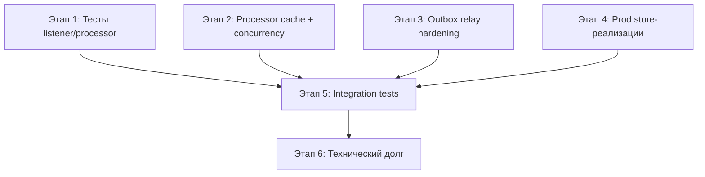
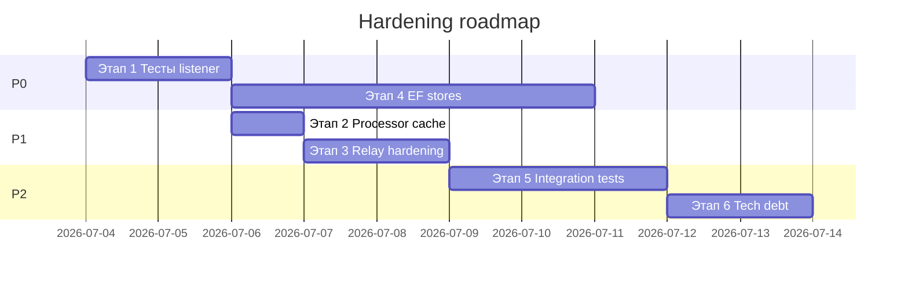

# План: доработка гарантий доставки (hardening)

**Статус:** выполнено (2026-07-03)  
**Основание:** [`../delivery-guarantee-solution-analysis.md`](../delivery-guarantee-solution-analysis.md)  
**Предыдущий план:** [`delivery-guarantee.md`](delivery-guarantee.md) (выполнен)

**Цель:** закрыть оставшиеся риски at-least-once для production: тесты критического пути, prod store-реализации, hardening relay/consumer, технический долг.

---

## Контекст

План [`delivery-guarantee.md`](delivery-guarantee.md) закрыл базовую семантику at-least-once. Коммит `7e17f12` устранил три P0-риска: dedup release, outbox claim, тесты `RabbitMqDeliveryPolicy`.

Остаётся **~10%** работы до production-ready состояния. Ниже — поэтапный план изменений кода с конкретными файлами, контрактами и критериями готовности.



| Этап | Приоритет | Effort | Impact |
|------|-----------|--------|--------|
| 1 — Тесты listener | P0 | ~2 дня | Защита ack/nack от регрессий |
| 2 — Processor cache | P1 | ~0.5 дня | Корректная multi-queue обработка |
| 3 — Relay hardening | P1 | ~1–2 дня | Производительность и надёжность publish |
| 4 — Prod stores | P0 | ~3–5 дней | Персистентность outbox/dedup |
| 5 — Integration tests | P2 | ~2–3 дня | End-to-end roundtrip |
| 6 — Технический долг | P2 | ~1–2 дня | Стабильность runtime |

---

## Этап 1 — Тесты RabbitMqListener и ProcessorBase (P0)

**Проблема:** CI не покрывает критический путь «receive → process → ack/nack». Регрессия async ack может вернуться незамеченной.

### 1.1 Выделить testable seam для ack/nack

`RabbitMqListener` сейчас напрямую вызывает `IModel.BasicAck` / `BasicNack`. Для unit-тестов без брокера:

**Вариант A (рекомендуется, минимальный diff):** internal interface + fake в тестах.

```csharp
// 00InnerUsage/RabbitMq/ReceiveAndProcess/Listeners/IRabbitMqMessageAcknowledgement.cs
internal interface IRabbitMqMessageAcknowledgement
{
    void Acknowledge(ulong deliveryTag);
    void NegativeAcknowledge(ulong deliveryTag, bool requeue);
}
```

`RabbitMqListener` принимает `IRabbitMqMessageAcknowledgement` через internal ctor/factory (по умолчанию — обёртка над `IModel`).

**Файлы:**
- новый `IRabbitMqMessageAcknowledgement.cs`
- [`RabbitMqListener.cs`](../../src/IntegrationFlow.Core/Contexts/Integrations/00InnerUsage/RabbitMq/ReceiveAndProcess/Listeners/RabbitMqListener.cs) — инъекция acknowledgement
- [`IntegrationFlow.Core.Tests.csproj`](../../tests/IntegrationFlow.Core.Tests/IntegrationFlow.Core.Tests.csproj) — без новых зависимостей

### 1.2 Тесты HandleReceivedAsync

Новый файл: `tests/IntegrationFlow.Core.Tests/RabbitMq/ReceiveAndProcess/RabbitMqListenerTests.cs`

| Тест | Поведение |
|------|-----------|
| `HandleReceivedAsync_AcksAfterSuccessfulProcess` | Process завершён → `Acknowledge` вызван ровно 1 раз |
| `HandleReceivedAsync_NacksWithRequeueOnProcessException` | Exception в process + `RequeueOnFailure=true` → nack requeue |
| `HandleReceivedAsync_NacksWithoutRequeueWhenMaxRetryReached` | `MaxRetryCount` достигнут → nack без requeue |
| `HandleReceivedAsync_NacksRequeueOnInProgressDedup` | `MessageProcessingInProgressException` → nack requeue |
| `HandleReceivedAsync_AcksOnAlreadyProcessedDedup` | early return processor → ack |

Для изоляции от RabbitMQ.Client: stub `ProcessMessageAsync` через test subclass `ListenerBase` или internal test hook.

### 1.3 Тесты ProcessorBase dedup flow

Новый файл: `tests/IntegrationFlow.Core.Tests/ReceiveAndProcess/ProcessorBaseDeduplicationTests.cs`

| Тест | Поведение |
|------|-----------|
| `Process_ReleasesLockOnException` | fail → `ReleaseProcessingAsync` вызван |
| `Process_MarksProcessedOnSuccess` | success → `MarkProcessedAsync`, lock снят |
| `Process_SkipsAlreadyProcessed` | `AlreadyProcessed` → handler не вызван |
| `Process_ThrowsInProgressForParallelDelivery` | второй `TryBegin` → `MessageProcessingInProgressException` |

Stub `IntegrationProcessorSideBase` + fake `IMessageDeduplicationStore` в тестах.

### Критерии готовности этапа 1

- [ ] ≥ 8 новых тестов на listener/processor path
- [ ] CI ловит инверсию ack/process order
- [ ] Общее число тестов ≥ 56, все зелёные

---

## Этап 2 — ProcessorBase cache и concurrency (P1)

**Проблема:** `ProcessorBase.Create` кеширует только по `typeof(TProcessor)`, без profile/side. При одном processor type на нескольких очередях — stale `Configuration`.

[`PublisherBase`](../../src/IntegrationFlow.Core/Contexts/Integrations/03Domain/ReceiveAndProcess/PublisherBase.cs) уже решает это через `GetPublisherCacheKey()`.

### 2.1 Единый cache key для processor

```csharp
// IntegrationProcessorSideBase.cs
internal virtual string GetProcessorCacheKey()
    => GetType().AssemblyQualifiedName ?? GetType().FullName ?? GetType().Name;
```

```csharp
// ProcessorBase.Create — cacheKey:
var cacheKey = $"{typeof(TProcessor).AssemblyQualifiedName}|{side.GetProcessorCacheKey()}|{configuration?.GetType().FullName}|{GetConfigurationIdentity(configuration)}";
```

`GetConfigurationIdentity` — для RabbitMQ: `((RabbitMqConfiguration)configuration).QueueName` или `ConfigurationName` из side.

**Альтернатива (проще):** передавать `IntegrationPublisherSide.GetPublisherCacheKey()` из `GetProcessor` в `ProcessorBase.Create` как параметр.

**Файлы:**
- [`IntegrationProcessorSideBase.cs`](../../src/IntegrationFlow.Core/Contexts/Integrations/03Domain/ReceiveAndProcess/IntegrationProcessorSideBase.cs)
- [`ProcessorBase.cs`](../../src/IntegrationFlow.Core/Contexts/Integrations/03Domain/ReceiveAndProcess/ProcessorBase.cs)
- [`RabbitMqIntegrationPublisherSideBase.cs`](../../src/IntegrationFlow.Core/Contexts/Integrations/00InnerUsage/RabbitMq/ReceiveAndProcess/RabbitMqIntegrationPublisherSideBase.cs) — override `GetProcessorCacheKey()` → `ConfigurationName`

### 2.2 Prefetch и thread-safety (документация + guard)

Не менять поведение по умолчанию (`PrefetchCount=1`), но:

1. Добавить XML-doc / README: при `PrefetchCount > 1` handler **обязан** быть thread-safe.
2. Опционально: `RabbitMqConfiguration.EnforceSequentialProcessing` — semaphore(1) в `HandleReceivedAsync` (default `false`).

**Файлы:**
- [`RabbitMqConfiguration.cs`](../../src/IntegrationFlow.Core/Contexts/Integrations/00InnerUsage/RabbitMq/ReceiveAndProcess/Configurations/RabbitMqConfiguration.cs) — новое свойство (optional, P2 внутри этапа)
- [`README.md`](../../README.md) — предупреждение

### Критерии готовности этапа 2

- [ ] Два publisher side с разными `ConfigurationName` получают разные processor instances
- [ ] Unit-тест: `ProcessorBase_Create_UsesDistinctCacheKeyPerProfile`
- [ ] README обновлён

---

## Этап 3 — Outbox relay hardening (P1)

**Проблемы:** новое соединение per message; linear backoff; race Mandatory/BasicReturn; publish OK → mark fail.

### 3.1 Connection pool per profile в batch

```csharp
// OutboxRelayService.RelayBatchAsync — группировка:
var byProfile = claimed.GroupBy(m => m.ProfileName);
foreach (var group in byProfile)
{
    using var connection = new RabbitMqPublishConnection(config);
    var transmitter = new RabbitMqPublishTransmitter(config, connection);
    foreach (var message in group) { ... }
}
```

**Файлы:**
- [`OutboxRelayService.cs`](../../src/IntegrationFlow.Core/Contexts/Integrations/03Domain/Outbox/OutboxRelayService.cs)

### 3.2 Exponential backoff

```csharp
// OutboxRelayOptions
public bool UseExponentialBackoff { get; set; } = true;
public double BackoffMultiplier { get; set; } = 2.0;
public TimeSpan MaxRetryDelay { get; set; } = TimeSpan.FromMinutes(15);

private TimeSpan CalculateRetryDelay(int attemptCount)
{
    if (!options.UseExponentialBackoff)
        return TimeSpan.FromTicks(options.RetryBackoffBase.Ticks * Math.Max(1, attemptCount + 1));

    var delay = TimeSpan.FromTicks(
        options.RetryBackoffBase.Ticks * Math.Pow(options.BackoffMultiplier, attemptCount));
    return delay > options.MaxRetryDelay ? options.MaxRetryDelay : delay;
}
```

### 3.3 Idempotent mark после publish

При `MarkPublishedAsync` после успешного confirm:

- Если store вернул «already published» (conflict / row version) — **не** считать ошибкой, логировать warn.
- Добавить в `IOutboxStore` optional `Task<bool> TryMarkPublishedAsync(...)` или документировать, что `MarkPublishedAsync` idempotent для `Published` status.

**InMemory + будущий EF:** `CanMark` уже допускает `Published` → extend для повторного вызова без exception.

### 3.4 Mandatory + BasicReturn — порядок проверок

В [`RabbitMqPublishTransmitter.cs`](../../src/IntegrationFlow.Core/Contexts/Integrations/00InnerUsage/RabbitMq/SentAndForgot/Transmitters/RabbitMqPublishTransmitter.cs):

```csharp
// После WaitForConfirms:
connection.EnsureNotUnroutable(); // перенести сюда
```

При `Mandatory=true` — optional `Task.Delay(50)` + повторная проверка flag (document as best-effort) или подписка с `ManualResetEventSlim`.

### Критерии готовности этапа 3

- [ ] Batch 20 сообщений одного profile → 1 connection
- [ ] Тест `CalculateRetryDelay` exponential cap
- [ ] Тест/idempotency: двойной `MarkPublishedAsync` безопасен
- [ ] `EnsureNotUnroutable` после confirms

---

## Этап 4 — Prod store-реализации (P0)

**Проблема:** `InMemoryOutboxStore` и `InMemoryMessageDeduplicationStore` — только для тестов.

Каркас **не должен** тянуть EF Core в `IntegrationFlow.Core`. Референсные реализации — отдельный пакет или `docs/examples`.

### 4.1 Новый проект (рекомендуется)

```
src/IntegrationFlow.EntityFrameworkCore/
├── Outbox/
│   ├── OutboxMessageEntity.cs
│   ├── EfOutboxStore.cs
│   └── OutboxDbContextExtensions.cs
├── Deduplication/
│   ├── ProcessedMessageEntity.cs
│   └── EfMessageDeduplicationStore.cs
└── IntegrationFlow.EntityFrameworkCore.csproj  (net8.0, refs EF Core 8)
```

**`EfOutboxStore.ClaimPendingAsync`** — raw SQL или EF:

```sql
UPDATE OutboxMessages
SET Status = 'InFlight', LockedBy = @workerId, LockedUntil = @lockUntil
WHERE Id IN (
  SELECT Id FROM OutboxMessages
  WHERE Status = 'Pending' AND (RetryAfter IS NULL OR RetryAfter <= @now)
  ORDER BY CreatedAt
  LIMIT @batch
  FOR UPDATE SKIP LOCKED  -- PostgreSQL / SQL Server 2022+
)
RETURNING *;
```

Для SQL Server без `SKIP LOCKED` — `UPDLOCK, READPAST, ROWLOCK` hint.

**`EnqueueAsync`** — вызывается в той же `DbContext` transaction, что и бизнес-данные (documented pattern).

### 4.2 SQL dedup store (альтернатива Redis)

Таблица `ProcessedMessages(MessageId PK, ProcessedAt, ExpiresAt)`:

- `TryBeginProcessingAsync` — `INSERT ... ON CONFLICT DO NOTHING` / merge
- `MarkProcessedAsync` — update status
- `ReleaseProcessingAsync` — delete from in-progress table
- Background job: purge `ExpiresAt < now`

TTL через `IMessageDeduplicationStoreOptions.ProcessedRetention` (новый options class в Core, без EF).

### 4.3 DI extensions

```csharp
services.AddIntegrationFlowEfOutbox<TDbContext>(options => { ... });
services.AddIntegrationFlowEfDeduplication<TDbContext>(options => { ... });
```

### 4.4 Документация для приложения-потребителя

Файл: `docs/examples/ef-outbox-deduplication.md` — миграция, регистрация, sample TX:

```csharp
await using var tx = await db.Database.BeginTransactionAsync(ct);
await businessRepo.SaveAsync(...);
await outboxStore.EnqueueAsync(message, ct); // same DbContext
await tx.CommitAsync(ct);
```

### Критерии готовности этапа 4

- [ ] `IntegrationFlow.EntityFrameworkCore` собирается и тестируется (Testcontainers PostgreSQL или SQLite in-memory с ограничениями)
- [ ] Claim concurrent: 2 workers не берут одну запись
- [ ] Dedup переживает restart
- [ ] README ссылка на EF package / examples

---

## Этап 5 — Integration tests (P2)

**Цель:** roundtrip publish → consume → dedup без mock.

### 5.1 Test project или категория

```
tests/IntegrationFlow.Core.IntegrationTests/
  RabbitMqRoundtripTests.cs  // [Trait("Category", "Integration")]
```

Зависимости: `Testcontainers.RabbitMq`, `xunit`, conditional skip если Docker недоступен.

### 5.2 Сценарии

| Сценарий | Проверка |
|----------|----------|
| Publish + consume | сообщение получено, ack, queue empty |
| Process failure + requeue | nack → redelivery |
| Dedup duplicate delivery | второй раз skip + ack |
| Outbox enqueue + relay | сообщение в брокере с `MessageId = outbox.Id` |
| Outbox relay crash recovery | expired claim → republish |

### 5.3 CI

- GitHub Actions job `integration-tests` с Docker
- PR: unit always; integration optional / nightly

### Критерии готовности этапа 5

- [ ] ≥ 4 integration test, зелёные локально с Docker
- [ ] Документирован запуск: `dotnet test --filter Category=Integration`

---

## Этап 6 — Технический долг (P2)

### 6.1 Убрать Thread.Abort

[`ListenerBase.Stop()`](../../src/IntegrationFlow.Core/Contexts/Integrations/03Domain/ReceiveAndProcess/ListenerBase.cs):

- `Stop()` → `cancellationTokenSource.Cancel()` + `thread.Join(timeout)`
- Удалить `thread.Abort()`
- `ListenAsync` уже использует `CancellationToken` в RabbitMQ listener

### 6.2 ProcessorBase async

Постепенный переход (breaking change — только internal path):

1. `ProcessAsync(object message, CancellationToken ct)` — новый internal метод
2. `Process` → wrapper `ProcessAsync(...).GetAwaiter().GetResult()` (deprecated path)
3. `ListenerBase.ProcessMessageAsync` вызывает `ProcessAsync` напрямую

### 6.3 MessageId fallback для dedup

Если `MessageId` пуст — генерировать hash от `(body + deliveryTag)` **не** подходит (deliveryTag не stable).

Рекомендация в коде:

- `Logger.LogWarn` при dedup store configured но `MessageId` empty
- README: producer **обязан** задавать `MessageId` при включённом dedup

Опционально: `RabbitMqReceivedMessage` — fallback `MessageId = SHA256(body)` с documented collision risk (opt-in config).

### 6.4 Синхронизация документации

- Обновить [`delivery-guarantee-risk-analysis.md`](delivery-guarantee-risk-analysis.md) — закрытые P0
- Добавить ссылку на этот план в [`delivery-guarantee-solution-analysis.md`](../delivery-guarantee-solution-analysis.md)
- Добавить файл в `IntegrationFlow.sln` → Solution Items / docs

### Критерии готовности этапа 6

- [ ] Нет `Thread.Abort` в codebase
- [ ] `ProcessAsync` используется listener path
- [ ] Документы синхронизированы

---

## Что сознательно не меняем

| Тема | Причина |
|------|---------|
| Exactly-once | Недостижимо; at-least-once + idempotent handlers |
| Runtime declare DLQ | Топология на брокере — ответственность ops |
| Direct publish без outbox | Остаётся для fire-and-forget без TX; документируем anti-pattern для DB+message |
| EF в Core | Сохраняем netstandard2.0 и минимальные зависимости |
| `Integrate()` default без throw | Обратная совместимость; `ThrowOnFailure` / `IntegrateWithResult()` |

---

## Семантика, которую код не закроет полностью

Эти риски **документируются**, а не «чинятся магией»:

1. **MarkProcessed fail после успешного handler** → handler должен быть идемпотентным
2. **Publish OK → MarkPublished fail** → `MessageId = OutboxId` + idempotent consumer
3. **DB commit → Integrate() gap** → только outbox в той же TX

---

## Порядок реализации (рекомендуемый)



**Минимальный MVP для production:** этапы **1 + 4 + 2** (тесты + prod stores + processor cache).

---

## Чеклист реализации

- [x] Этап 1: `IRabbitMqMessageAcknowledgement` + listener/processor tests
- [x] Этап 2: processor cache key + README prefetch warning (cache key)
- [x] Этап 3: connection reuse, exponential backoff, mark idempotency, BasicReturn order
- [x] Этап 4: `IntegrationFlow.EntityFrameworkCore` + tests
- [x] Этап 5: Testcontainers connectivity test (Category=Integration)
- [x] Этап 6: remove Thread.Abort, ProcessAsync, docs sync (partial — risk-analysis doc)

---

## Связанные документы

- [`../delivery-guarantee-solution-analysis.md`](../delivery-guarantee-solution-analysis.md) — актуальный анализ рисков
- [`delivery-guarantee.md`](delivery-guarantee.md) — выполненный базовый план
- [`delivery-guarantee-risk-analysis.md`](delivery-guarantee-risk-analysis.md) — требует синхронизации после этапа 6
