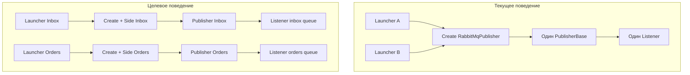

# План: несколько конфигураций RabbitMQ для ReceiveAndProcess

**Статус:** черновик  
**Дата:** 2026-06-20  
**Цель:** поддержать несколько именованных профилей подключения к RabbitMQ в `rabbitmq.json` и параллельный запуск нескольких listener-ов.

---

## Проблема

Сейчас [`RabbitMqConfigurationLoader`](../../src/IntegrationFlow.Core/Contexts/Integrations/00InnerUsage/RabbitMq/ReceiveAndProcess/Configurations/RabbitMqConfigurationLoader.cs) читает одну секцию `"RabbitMq"` как плоский объект, а [`SampleRabbitMqConfiguration`](../../src/IntegrationFlow.Core/Contexts/Integrations/00Samples/ReceiveAndProcess/SampleRabbitMqReceiveAndProcessLauncher.cs) загружает единственный профиль.

Дополнительное ограничение: [`TypeCollection<T>`](../../src/IntegrationFlow.Core/Contexts/Integrations/03Domain/ReceiveAndProcess/TypeCollection.cs) кеширует publisher **только по типу publisher-а**, поэтому два launcher-а с одним `RabbitMqPublisher`, но разными конфигурациями, получат **один и тот же экземпляр** — параллельное прослушивание нескольких очередей сейчас невозможно.



---

## Целевой формат конфигурации

Расширить [`rabbitmq.json`](../../src/IntegrationFlow.Core/Contexts/Integrations/00Samples/ReceiveAndProcess/rabbitmq.json) до именованного словаря, сохранив обратную совместимость с текущим плоским форматом:

```json
{
  "RabbitMq": {
    "Inbox": {
      "HostName": "localhost",
      "QueueName": "integration.inbox",
      "ClientProvidedName": "IntegrationFlow.InboxListener"
    },
    "Orders": {
      "HostName": "localhost",
      "QueueName": "orders.inbox",
      "ClientProvidedName": "IntegrationFlow.OrdersListener"
    }
  }
}
```

- **Новый формат**: ключи `Inbox`, `Orders` — имена профилей подключения.
- **Старый формат** (плоский объект с `HostName`, `QueueName` на уровне `RabbitMq`) продолжит работать; профиль получит имя `"Default"`.

---

## Изменения в коде

### 1. Модель конфигурации

В [`RabbitMqConfiguration`](../../src/IntegrationFlow.Core/Contexts/Integrations/00InnerUsage/RabbitMq/ReceiveAndProcess/Configurations/RabbitMqConfiguration.cs) добавить свойство:

```csharp
public string Name { get; set; } = string.Empty;
```

### 2. Загрузчик конфигураций

Расширить [`RabbitMqConfigurationLoader`](../../src/IntegrationFlow.Core/Contexts/Integrations/00InnerUsage/RabbitMq/ReceiveAndProcess/Configurations/RabbitMqConfigurationLoader.cs):

| Метод | Назначение |
|-------|------------|
| `LoadAll()` | Загрузить все именованные профили |
| `Load(string name)` | Загрузить профиль по имени |
| `Load()` | Сохранить текущее поведение: один профиль (`Default` или единственный именованный) |
| `Populate(target, name)` | Заполнить экземпляр по имени профиля |

Логика определения формата:

- если у секции `RabbitMq` есть прямые свойства подключения (`HostName`, `QueueName`, …) — это **legacy single config**;
- иначе дочерние секции (`Inbox`, `Orders`, …) трактуются как **именованные профили**.

Ошибки:

- `Load("Unknown")` → `InvalidOperationException` с понятным сообщением;
- пустой файл / нет профилей → исключение при загрузке.

### 3. Исправление singleton publisher-а

В [`TypeCollection.cs`](../../src/IntegrationFlow.Core/Contexts/Integrations/03Domain/ReceiveAndProcess/TypeCollection.cs) изменить ключ кеша с `typeof(T).AssemblyQualifiedName` на составной ключ:

```
{PublisherType}|{IntegrationPublisherSideType}
```

В [`PublisherBase.Create`](../../src/IntegrationFlow.Core/Contexts/Integrations/03Domain/ReceiveAndProcess/PublisherBase.cs) передавать тип side в `GetOrAdd`.

Добавить перегрузку для явной передачи side-экземпляра (нужна для динамических имён профилей):

```csharp
public static PublisherBase Create<TPublisherBase>(
    IIntegrationLogger logger,
    IntegrationPublisherSideBase integrationPublisherSide)
    where TPublisherBase : PublisherBase, new()
```

Это позволит запускать несколько listener-ов без создания отдельного класса side на каждую очередь.

### 4. Базовая сторона RabbitMQ

В [`RabbitMqIntegrationPublisherSideBase`](../../src/IntegrationFlow.Core/Contexts/Integrations/00InnerUsage/RabbitMq/ReceiveAndProcess/RabbitMqIntegrationPublisherSideBase.cs):

- добавить `protected abstract string ConfigurationName { get; }`;
- `GetConfiguration(...)` → `RabbitMqConfigurationLoader.Load(ConfigurationName)`.

Добавить внутренний класс:

```csharp
internal sealed class NamedRabbitMqIntegrationPublisherSide : RabbitMqIntegrationPublisherSideBase
{
    public NamedRabbitMqIntegrationPublisherSide(string configurationName) { ... }
    protected override string ConfigurationName => configurationName;
}
```

### 5. Примеры использования

Обновить [`SampleRabbitMqReceiveAndProcessLauncher.cs`](../../src/IntegrationFlow.Core/Contexts/Integrations/00Samples/ReceiveAndProcess/SampleRabbitMqReceiveAndProcessLauncher.cs):

**Вариант A — один профиль по имени** (организация выбирает нужный):

```csharp
internal sealed class InboxRabbitMqPublisherSide : RabbitMqIntegrationPublisherSideBase
{
    protected override string ConfigurationName => "Inbox";
}
```

**Вариант B — запуск всех профилей** (composite launcher):

```csharp
foreach (var config in RabbitMqConfigurationLoader.LoadAll())
{
    var side = new NamedRabbitMqIntegrationPublisherSide(config.Name);
    var publisher = PublisherBase.Create<RabbitMqPublisher>(Logger.Create(), side);
    publisher.BeginReceiving();
}
```

Обновить [`rabbitmq.json`](../../src/IntegrationFlow.Core/Contexts/Integrations/00Samples/ReceiveAndProcess/rabbitmq.json) с двумя профилями (`Inbox`, `Orders`).

### 6. Тесты

Расширить [`RabbitMqConfigurationLoaderTests`](../../tests/IntegrationFlow.Core.Tests/RabbitMq/RabbitMqConfigurationLoaderTests.cs):

- загрузка нескольких именованных профилей через `LoadAll()`;
- загрузка по имени через `Load("Orders")`;
- обратная совместимость плоского формата (`Name == "Default"`);
- ошибка при неизвестном имени профиля.

Добавить тест на `TypeCollection`: два разных side → два разных publisher-экземпляра.

### 7. Документация

Обновить раздел RabbitMQ в [`README.md`](../../README.md):

- новый JSON-формат с несколькими профилями;
- примеры `Load(name)`, `LoadAll()`;
- пояснение, что для параллельного прослушивания нужен отдельный publisher на каждый профиль.

---

## Что сознательно не меняем

- Доменный контракт `IConfiguration` / `IntegrationPublisherSideBase` — без изменений.
- `RabbitMqListener` — без изменений; он уже работает с любым `RabbitMqConfiguration`.
- Отдельные JSON-файлы на профиль — не добавляем в первой итерации (все профили в одном `rabbitmq.json`).

---

## Риски и mitigations

| Риск | Mitigation |
|------|------------|
| Ломается `Load()` для multi-config файла | `Load()` возвращает профиль `Default` или первый, если он один; при нескольких — требует явного имени |
| ProcessorBase тоже singleton по типу | Для RabbitMQ processor side одинаковый — допустимо; при необходимости отдельной обработки per queue — отдельная задача |
| Параллельный запуск увеличивает число потоков | Документировать; каждый listener уже работает в своём потоке через `ListenerBase.Start` |

---

## Чеклист реализации

- [ ] Добавить `Name` в `RabbitMqConfiguration` и расширить `RabbitMqConfigurationLoader` (`LoadAll`, `Load(name)`, backward compat)
- [ ] Исправить `TypeCollection` и добавить `PublisherBase.Create(logger, sideInstance)`
- [ ] Добавить `ConfigurationName` в `RabbitMqIntegrationPublisherSideBase` и `NamedRabbitMqIntegrationPublisherSide`
- [ ] Обновить `rabbitmq.json`, sample launcher-ы и README
- [ ] Добавить тесты для multi-config loader и отдельных publisher-экземпляров
