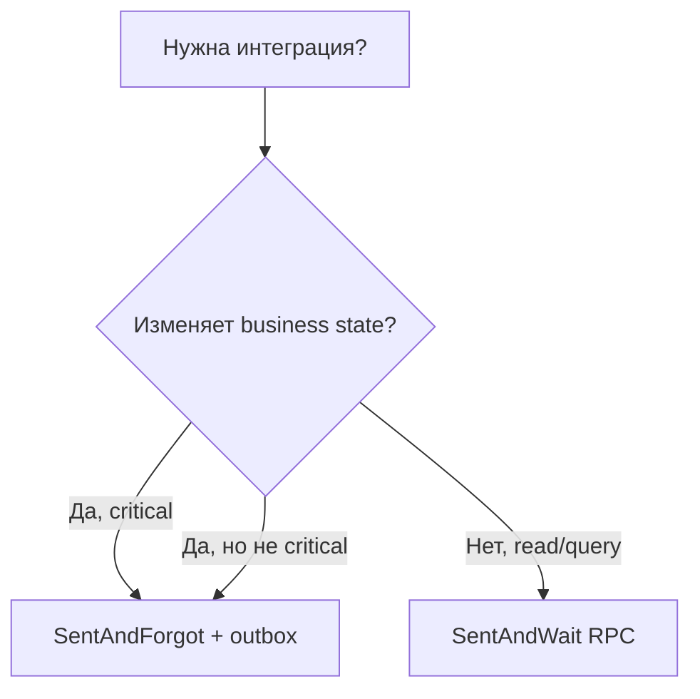

# Runbook: SentAndWait RPC adoption

**Статус:** актуально  
**Создан:** 2026-07-04 21:30 (UTC+3)

Руководство по безопасному использованию RabbitMQ request-reply (SentAndWait) в production.

---

## Когда использовать RPC vs outbox

| Сценарий | Рекомендация |
|----------|--------------|
| Critical transactional flow (заказ, платёж, баланс) | **SentAndForgot + outbox + EF** |
| Синхронный query/read-only command | **SentAndWait RPC** |
| Fire-and-forget уведомление | **SentAndForgot + outbox** |
| Нужна гарантия «БД + сообщение» атомарно | **Outbox** — RPC не поддерживает |



---

## Client (вызывающая сторона)

### Production defaults

```csharp
SentAndWaitIntegrationOptions.ThrowOnFailure = true;
```

Или явно обрабатывайте `IntegrateWithResult()` / `IntegrateWithResultAsync()` — проверяйте `TimedOut`.

### ASP.NET Core

Используйте **async API**, не sync `Integrate()`:

```csharp
var result = await integration.IntegrateWithResultAsync(cancellationToken);
if (!result.Success && result.TimedOut)
{
    // retry с новым CorrelationId (новый вызов IntegrateAsync)
}
```

### Конфигурация

| Параметр | Рекомендация |
|----------|--------------|
| `ResponseTimeoutSeconds` | p99 latency сервера + запас (×2) |
| `ReuseConnection` | `true` при нагрузке |
| `MaxConcurrentRequests` | `4–16` для ASP.NET; default `1` для backward compat |

### Timeout (риск R1)

При timeout состояние **неизвестно** (at-most-once). Retry:

1. Новый вызов `IntegrateAsync` (новый `CorrelationId`)
2. Server handler **идемпотентен** по `MessageId` / business key

---

## Server (обрабатывающая сторона)

### Reply до ack (риск R4)

Публикуйте ответ **до return** из handler — иначе consumer ack без reply:

```csharp
services.AddIntegrationFlowRabbitMqListener("OrdersRpc",
    SampleRabbitMqSentAndWaitRpcServer.CreateHandler("OrdersRpc"));
```

Или вручную:

```csharp
services.AddIntegrationFlowRabbitMqListener("OrdersRpc", message =>
{
    if (message.Raw is RabbitMqReceivedMessage rpc && rpc.IsRequestReply)
    {
        var publisher = new RabbitMqReplyPublisher(config);
        publisher.PublishTextReply(rpc, BuildResponse(rpc)); // до return
    }
});
```

### Идемпотентность (риск R1, R2)

- Реализуйте `IMessageDeduplicationStore` на server
- Всегда задавайте `MessageId` на request
- При retry клиента — тот же business key → тот же ответ

### Performance

- `ReuseReplyConnection: true` (default) — pool channel для ответов
- Не создавайте `RabbitMqReplyPublisher` на каждое сообщение в hot path — reuse instance

---

## Anti-patterns

| Anti-pattern | Почему опасно |
|--------------|---------------|
| RPC для critical TX | Нет outbox; timeout = unknown state |
| Sync `Integrate()` в ASP.NET | Thread pool starvation |
| `ThrowOnFailure = false` без обработки result | Silent failures |
| Server ack до reply | Client timeout без ответа |
| RPC + outbox для одной operation | Смешение семантик |

---

## Мониторинг

См. [`2026-07-04_0845-metrics-and-alerting.md`](2026-07-04_0845-metrics-and-alerting.md) — секция RPC.

Ключевые метрики:

- `integrationflow.requestreply.completed{timeout="true"}`
- `integrationflow.requestreply.duration` p99

---

## Связанные документы

- [`2026-07-04_2130-production-adoption.md`](2026-07-04_2130-production-adoption.md) — ReceiveAndProcess + SentAndForgot
- [`plans/2026-07-04_2130-remaining-risks-mitigation.md`](../plans/2026-07-04_2130-remaining-risks-mitigation.md)
