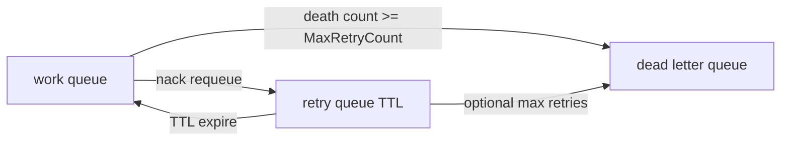

# Runbook: RabbitMQ DLQ topology

**Статус:** актуально  
**Создан:** 2026-07-07 21:37 (UTC+3)  
**Задача backlog:** A-1  
**Связанные документы:** [`2026-07-04_2130-production-adoption.md`](2026-07-04_2130-production-adoption.md), [`2026-07-04_0845-metrics-and-alerting.md`](2026-07-04_0845-metrics-and-alerting.md)

IntegrationFlow **не создаёт DLQ** в runtime. Очереди, DLX, bindings и TTL задаются на брокере (IaC / definitions). Consumer использует `MaxRetryCount` + `x-death` для остановки requeue и отправки poison messages в DLQ.

---

## Рекомендуемая схема (work → retry → DLQ)



| Очередь | Назначение |
|---------|------------|
| `orders.inbox` | Основная consumer-очередь (`QueueName` в `RabbitMq`) |
| `orders.inbox.retry` | Промежуточная с `x-message-ttl` (backoff) |
| `orders.inbox.dlq` | Финальная для ручного разбора / replay |

E2E-референс топологии: [`tests/IntegrationFlow.Core.IntegrationTests/Infrastructure/RabbitMqDeadLetterTopology.cs`](../../tests/IntegrationFlow.Core.IntegrationTests/Infrastructure/RabbitMqDeadLetterTopology.cs).

---

## Пример объявления (RabbitMQ management / IaC)

```json
{
  "exchanges": [
    { "name": "integration.dlx", "type": "direct", "durable": true }
  ],
  "queues": [
    {
      "name": "orders.inbox.dlq",
      "durable": true,
      "arguments": {}
    },
    {
      "name": "orders.inbox.retry",
      "durable": true,
      "arguments": {
        "x-dead-letter-exchange": "integration.dlx",
        "x-dead-letter-routing-key": "orders.inbox",
        "x-message-ttl": 30000
      }
    },
    {
      "name": "orders.inbox",
      "durable": true,
      "arguments": {
        "x-dead-letter-exchange": "integration.dlx",
        "x-dead-letter-routing-key": "orders.inbox.retry"
      }
    }
  ],
  "bindings": [
    { "source": "integration.dlx", "destination": "orders.inbox.dlq", "routing_key": "orders.inbox.dlq" },
    { "source": "integration.dlx", "destination": "orders.inbox.retry", "routing_key": "orders.inbox.retry" },
    { "source": "integration.dlx", "destination": "orders.inbox", "routing_key": "orders.inbox" }
  ]
}
```

> TTL на retry-очереди задаёт задержку перед повторной доставкой. Альтернатива — несколько retry-очередей с разным TTL (1m / 5m / 30m).

---

## Конфигурация IntegrationFlow consumer

```json
{
  "RabbitMq": {
    "OrdersInbox": {
      "HostName": "rabbitmq.prod",
      "QueueName": "orders.inbox",
      "RequeueOnFailure": true,
      "MaxRetryCount": 5,
      "ValidateTopology": true,
      "DeclareTopologyOnStartup": false
    }
  }
}
```

| Параметр | Рекомендация production |
|----------|-------------------------|
| `RequeueOnFailure` | `true` — nack с requeue до лимита |
| `MaxRetryCount` | `> 0` — после N «смертей» (`x-death`) requeue отключается → сообщение уходит в DLQ через broker DLX |
| `DeclareTopologyOnStartup` | `false` — topology только через IaC |

Логика: [`RabbitMqDeliveryPolicy`](../../src/IntegrationFlow.Core/Contexts/Integrations/00InnerUsage/RabbitMq/ReceiveAndProcess/Listeners/RabbitMqDeliveryPolicy.cs) читает `x-death` через [`RabbitMqMessageHeaders.GetDeathCount`](../../src/IntegrationFlow.Core/Contexts/Integrations/00InnerUsage/RabbitMq/ReceiveAndProcess/Messages/RabbitMqMessageHeaders.cs).

---

## Anti-patterns

| Anti-pattern | Риск |
|--------------|------|
| `RequeueOnFailure = true` без DLQ | Бесконечный цикл poison message |
| `MaxRetryCount = 0` без DLQ | Сообщение теряется после nack без requeue |
| `DeclareTopologyOnStartup = true` в prod | Нет DLQ/TTL/bindings; drift между средами |
| Нет идемпотентного handler | Повторная доставка ломает данные |

---

## Мониторинг и алерты

| Сигнал | Действие |
|--------|----------|
| `integrationflow.consumer.nack` растёт | Проверить handler, входные данные, DLQ routing |
| DLQ depth > 0 | Разобрать poison messages; fix handler; replay при необходимости |
| Retry queue depth растёт | Backoff/TTL слишком короткий или handler постоянно падает |

PromQL и пороги: [`2026-07-04_0845-metrics-and-alerting.md`](2026-07-04_0845-metrics-and-alerting.md).

Полезные RabbitMQ metrics (broker-side):

- `rabbitmq_queue_messages{queue="orders.inbox.dlq"}`
- `rabbitmq_queue_messages{queue="orders.inbox.retry"}`

---

## Операции при сообщениях в DLQ

1. Сохранить `MessageId`, payload, `x-death` из headers.
2. Исправить root cause (handler bug, schema, external dependency).
3. Replay в work queue вручную или через tooling — **только после идемпотентности**.
4. Удалить или архивировать обработанные DLQ-сообщения.

---

## Связанные документы

- [`2026-07-07_2137-rabbitmq-topology-adoption.md`](2026-07-07_2137-rabbitmq-topology-adoption.md) — passive/active declare
- [`2026-07-04_2130-production-adoption.md`](2026-07-04_2130-production-adoption.md) — общий production checklist
