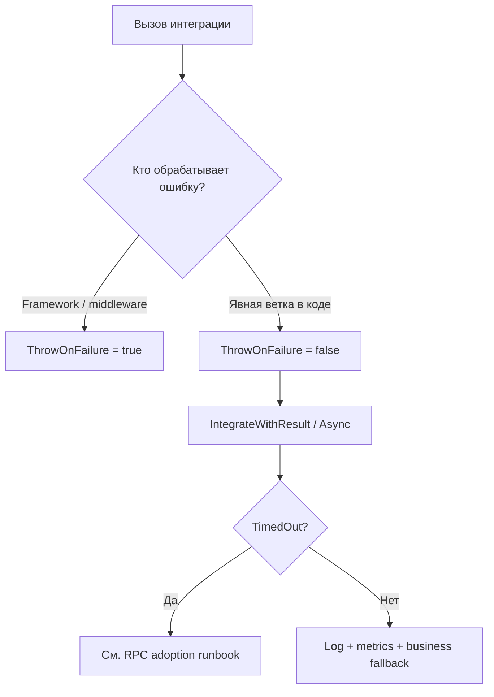

# Runbook: `ThrowOnFailure` adoption

**Статус:** актуально  
**Создан:** 2026-07-07 21:37 (UTC+3)  
**Задача backlog:** A-3  
**Связанные документы:** [`2026-07-04_2130-production-adoption.md`](2026-07-04_2130-production-adoption.md), [`2026-07-04_2130-sentandwait-rpc-adoption.md`](2026-07-04_2130-sentandwait-rpc-adoption.md)

По умолчанию `ThrowOnFailure = false` для обратной совместимости (в т.ч. netstandard2.0). В production ошибки интеграции **не должны теряться молча**.

---

## Где применяется

| API | Опция | Default |
|-----|-------|---------|
| SentAndForgot | `SentAndForgotIntegrationOptions.ThrowOnFailure` | `false` |
| SentAndWait (sync + AsyncOutbox) | `SentAndWaitIntegrationOptions.ThrowOnFailure` | `false` |

Файлы: [`SentAndForgotIntegrationOptions`](../../src/IntegrationFlow.Core/Contexts/Integrations/03Domain/SentAndForgot/SentAndForgotIntegrationOptions.cs), [`SentAndWaitIntegrationOptions`](../../src/IntegrationFlow.Core/Contexts/Integrations/03Domain/SentAndWait/SentAndWaitIntegrationOptions.cs).

---

## Production default (рекомендуется)

```csharp
// Program.cs / Startup — один раз при старте приложения
SentAndForgotIntegrationOptions.ThrowOnFailure = true;
SentAndWaitIntegrationOptions.ThrowOnFailure = true;
```

Sample: [`SampleHostedRabbitMqSentAndWaitRpcApplication`](../../src/IntegrationFlow.Core/Contexts/Integrations/00Samples/SentAndWait/SampleHostedRabbitMqSentAndWaitRpcApplication.cs).

> **Не меняйте default в библиотеке** — это breaking change. Задавайте явно в host app.

---

## Когда `ThrowOnFailure = true`

| Сценарий | Почему |
|----------|--------|
| ASP.NET request pipeline | Ошибка publish/RPC должна вернуть 5xx, не «успех» |
| Background worker без ручной обработки | Fail fast → retry политика хоста / dead letter |
| CI/smoke tests | Явный fail при misconfiguration |

Поведение:
- **SentAndForgot:** exception при неуспешном `Integrate()` / `IntegrateAsync()`.
- **SentAndWait:** exception при failure/timeout на sync path; на async path — при failure relay/correlation.

---

## Когда `ThrowOnFailure = false` + `IntegrateWithResult()`

Используйте, когда приложение **само решает**, что делать с ошибкой:

```csharp
var result = await integration.IntegrateWithResultAsync(cancellationToken);

if (!result.Success)
{
    if (result.TimedOut)
    {
        // SentAndWait: retry с новым вызовом, idempotent server
        return;
    }

    // log, metrics, fallback, compensating action
}
```

| Паттерн | API |
|---------|-----|
| Fire-and-forget с контролем | `IntegrateWithResult()` / `IntegrateWithResultAsync()` |
| RPC timeout handling | `result.TimedOut` + runbook RPC |
| Outbox enqueue в TX | Ошибка enqueue → rollback TX (exception или проверка result) |

---

## Decision tree



---

## Anti-patterns

| Anti-pattern | Риск |
|--------------|------|
| `ThrowOnFailure = false` без проверки result | Silent data loss / «успешный» HTTP 200 |
| Sync `Integrate()` в ASP.NET | Thread pool starvation (см. RPC runbook) |
| `ThrowOnFailure = true` + swallow в outer catch без rethrow | Смысл опции теряется |

---

## Checklist перед go-live

- [ ] `ThrowOnFailure = true` **или** все вызовы через `IntegrateWithResult*()` с обработкой
- [ ] Логирование `MessageId` / `CorrelationId` при failure
- [ ] Алерты на `integrationflow.publish.failed` / `integrationflow.requestreply.completed{success="false"}`
- [ ] Для SentAndWait timeout — документированный retry policy (не blind retry)

---

## Связанные документы

- [`2026-07-04_2130-production-adoption.md`](2026-07-04_2130-production-adoption.md)
- [`2026-07-04_2130-sentandwait-rpc-adoption.md`](2026-07-04_2130-sentandwait-rpc-adoption.md)
- [`2026-07-04_0845-metrics-and-alerting.md`](2026-07-04_0845-metrics-and-alerting.md)
