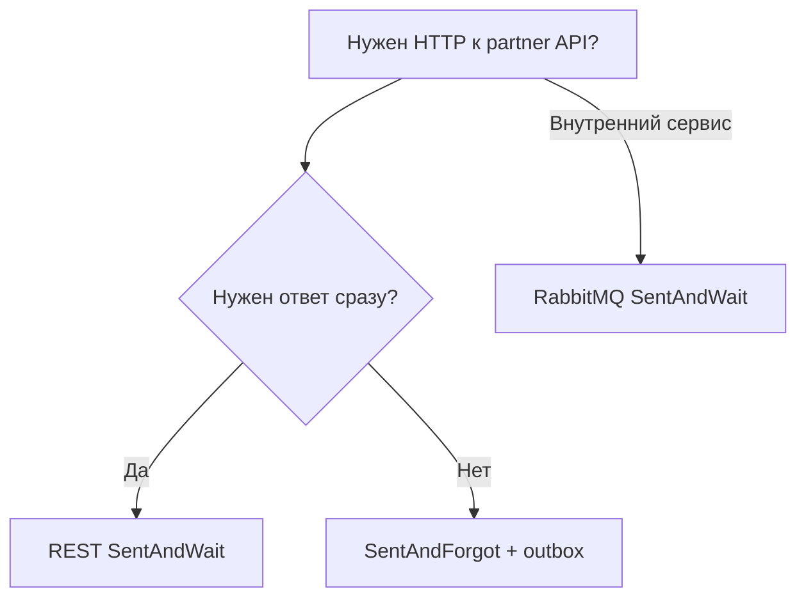

# Runbook: REST adoption (SentAndWait + outbox)

**Статус:** актуально  
**Создан:** 2026-07-10 13:30 (UTC+3)  
**Обновлён:** 2026-07-10 15:07 (UTC+3)

Руководство по безопасному использованию HTTP REST-транспорта в production: sync request–reply (SentAndWait) и webhook delivery через outbox (SentAndForgot).

---

## Когда использовать REST vs RabbitMQ vs outbox

| Сценарий | Рекомендация |
|----------|--------------|
| Critical transactional flow (заказ, платёж, баланс) | **SentAndForgot + outbox + EF** |
| Синхронный вызов внешнего HTTP API | **REST SentAndWait** |
| Внутренний RPC между сервисами | **RabbitMQ SentAndWait** |
| Fire-and-forget webhook / уведомление | **SentAndForgot + outbox** |



**Семантика REST SentAndWait:** at-most-once (как sync RPC). При timeout состояние **неизвестно** — см. раздел Timeout ниже.

---

## Регистрация в ASP.NET Core (net8.0)

```csharp
builder.Services.AddIntegrationFlow();
builder.Services.AddIntegrationFlowRest(builder.Configuration);
builder.Services.AddIntegrationFlowRestHealthChecks();

SentAndWaitIntegrationOptions.ThrowOnFailure = true;
```

Health check endpoint (optional):

```csharp
app.MapHealthChecks("/health/ready", new HealthCheckOptions
{
    Predicate = check => check.Tags.Contains("ready"),
});
```

---

## Конфигурация `rest.json`

### Shared connection (`RestConnections`)

| Параметр | Назначение |
|----------|------------|
| `BaseAddress` | Базовый URL partner API |
| `BearerToken` | OAuth/static bearer (приоритет над Basic/ApiKey) |
| `BasicAuthUser` / `BasicAuthPassword` | HTTP Basic auth |
| `ApiKeyHeaderName` / `ApiKeyHeaderValue` | API key header |
| `ClientCertificatePath` / `ClientCertificatePassword` | mTLS client cert (net5+) |
| `TlsServerName` | SNI / target host override |
| `HealthCheckPath` | Optional GET path для readiness |

### Request-reply profile (`RestRequestReply`)

| Параметр | Рекомендация |
|----------|--------------|
| `ResponseTimeoutSeconds` | p99 latency partner + запас (×2) |
| `MaxConcurrentRequests` | `4–16` для ASP.NET |
| `IdempotencyHeaderName` | `Idempotency-Key` (default) |
| `RetryOnTransientErrors` | `true` (5xx, 429, connection errors) |
| `MaxTransientRetries` | `1–2` |
| `HealthCheckPath` | `/health` или partner-specific |

### Secrets через env overlay

Не храните токены в git. Используйте `IConfiguration` overlay:

```json
{
  "RestConnections": {
    "PartnerApi": {
      "BearerToken": ""
    }
  }
}
```

```bash
RestConnections__PartnerApi__BearerToken=prod-token
RestConnections__PartnerApi__ApiKeyHeaderValue=prod-key
```

---

## Production defaults

```csharp
SentAndWaitIntegrationOptions.ThrowOnFailure = true;
```

Используйте **async API**:

```csharp
var integration = orgIntegration
    .CreateSentAndWaitIntegration<SampleRestSentAndWaitProvider>(
        oppositeSideCode: "OrdersLookup",
        srcData: lookupRequest)
    .WithMessageId($"order-{orderId}");

var result = await integration.IntegrateWithResultAsync(cancellationToken);
if (!result.Success && result.TimedOut)
{
    // см. Timeout
}
```

---

## Retry и идемпотентность

### Transient HTTP errors (5xx, 429)

Включены профилем: `RetryOnTransientErrors` + `MaxTransientRetries`. **4xx не retry.**

### Timeout retry

Глобально через `SentAndWaitIntegrationOptions`:

```csharp
SentAndWaitIntegrationOptions.RetryOnTimeout = true;
SentAndWaitIntegrationOptions.MaxRetries = 1;
```

Работает **только** при `WithMessageId()` — partner API должен быть идемпотентен по `Idempotency-Key`.

### Client-side response cache

При регистрации `AddIntegrationFlowRest` включён `InMemoryRestClientResponseCache`. Повторный вызов с тем же `MessageId` возвращает кэшированный ответ **без** повторного HTTP.

Для critical flows замените на persistent store, реализовав `IRestClientResponseCache`.

---

## Timeout (риск H1)

При timeout неизвестно, выполнил ли partner запрос.

1. Используйте `WithMessageId()` + partner idempotency
2. Retry через `RetryOnTimeout` или новый business-level retry
3. Для payment/order flows — **outbox**, не sync REST

---

## Outbox + HTTP webhook (SentAndForgot)

Для гарантии «БД + доставка webhook» используйте transactional outbox:

```csharp
builder.Services.AddIntegrationFlowRest(builder.Configuration);
builder.Services.AddIntegrationFlowOutboxRelay();
```

```csharp
db.EnqueueOutboxMessage("NotifyWebhook", payload);
await db.SaveChangesAsync(cancellationToken);
```

Relay выбирает транспорт по `ProfileName`:

| Конфиг | Транспорт |
|--------|-----------|
| `RestPublish:{ProfileName}` | HTTP POST webhook |
| `RabbitMqPublish:{ProfileName}` | RabbitMQ (default fallback) |

`OutboxId` → HTTP header `Idempotency-Key`. Success = status ∈ `ExpectedStatusCodes` (default 200/201/202/204). HTTP 4xx → abandoned (non-retryable).

---

## Metrics и alerting

REST reuse метрик `integrationflow.requestreply.*` с tag `transport=rest`.

| Метрика | Alert |
|---------|-------|
| `integrationflow.requestreply.completed{transport=rest,success=false}` | Error rate > 5% за 5m |
| `integrationflow.requestreply.completed{transport=rest,timeout=true}` | Timeout spike |
| `integrationflow.requestreply.retry_after_timeout` | Retry storm |

Подробнее: [metrics and alerting](2026-07-04_0845-metrics-and-alerting.md).

---

## Health checks

`AddIntegrationFlowRestHealthChecks()` пингует `HealthCheckPath` для профилей, где path задан.

| Результат | Значение |
|-----------|----------|
| Healthy | Все endpoints OK |
| Degraded | Часть endpoints недоступна (< `MaxConsecutiveFailures`) |
| Unhealthy | `MaxConsecutiveFailures` достигнут (default 3) |

---

## mTLS

1. Положите client cert в secure volume (не в git)
2. Укажите `ClientCertificatePath` + password в connection profile
3. При необходимости — `TlsServerName` для SNI

---

## Checklist перед production

- [ ] `ThrowOnFailure = true`
- [ ] Secrets через env / Key Vault, не в `rest.json` в repo
- [ ] `ResponseTimeoutSeconds` откалиброван по p99 partner
- [ ] `WithMessageId()` для retry-safe вызовов
- [ ] `AddIntegrationFlowRestHealthChecks()` + readiness probe
- [ ] Dashboard/alerts на `transport=rest` metrics
- [ ] Critical flows **не** на sync REST — outbox или RabbitMQ

---

## Связанные документы

- [REST implementation plan](../plans/2026-07-10_0853-rest-implementation.md)
- [REST implementation status (фазы 1–3)](../2026-07-10_1507-rest-implementation-status.md)
- [SentAndWait RPC adoption (RabbitMQ)](2026-07-04_2130-sentandwait-rpc-adoption.md)
- [Production adoption checklist](2026-07-04_2130-production-adoption.md)
- [Abandoned outbox replay](2026-07-03_2216-abandoned-outbox-replay.md)
