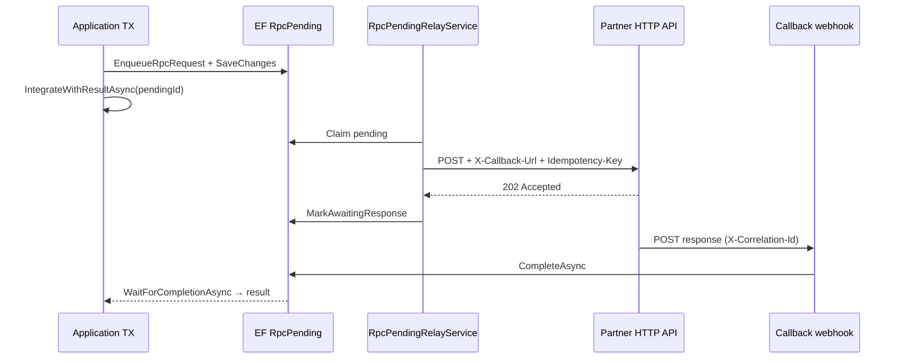

# Runbook: REST AsyncOutbox HTTP (critical TX + external API)

**Статус:** актуально  
**Создан:** 2026-07-10 21:30 (UTC+3)  
**План:** [`plans/2026-07-10_0853-rest-implementation.md`](../plans/2026-07-10_0853-rest-implementation.md) § фаза 5  
**Статус REST:** [`2026-07-10_1507-rest-implementation-status.md`](../2026-07-10_1507-rest-implementation-status.md)  
**Связанные runbooks:** [`2026-07-04_2130-sentandwait-rpc-adoption.md`](2026-07-04_2130-sentandwait-rpc-adoption.md) (RabbitMQ AsyncOutbox), [`2026-07-10_1330-rest-sentandwait-adoption.md`](2026-07-10_1330-rest-sentandwait-adoption.md) (sync REST)

---

## Когда использовать

| Сценарий | Паттерн |
|----------|---------|
| Business TX + HTTP-запрос к партнёру должны быть **атомарны** | REST AsyncOutbox |
| Партнёр принимает async HTTP (202) и шлёт результат на **callback URL** | `MapIntegrationFlowRpcResponseWebhook` |
| Sync REST SentAndWait достаточно (read/query, idempotent) | [`2026-07-10_1330-rest-sentandwait-adoption.md`](2026-07-10_1330-rest-sentandwait-adoption.md) |
| Партнёр на RabbitMQ | RabbitMQ AsyncOutbox — [`2026-07-04_2130-sentandwait-rpc-adoption.md`](2026-07-04_2130-sentandwait-rpc-adoption.md) |

**Не использовать** sync REST SentAndWait для critical TX (payment authorize, order commit) — timeout = unknown state.

---

## Архитектура



---

## Быстрый старт

### 1. Конфигурация `rest.json`

```json
{
  "RestConnections": {
    "PartnerApi": {
      "BaseAddress": "https://api.partner.example/",
      "BearerToken": "from-secrets"
    }
  },
  "RestRequestReply": {
    "PaymentAuth": {
      "Connection": "PartnerApi",
      "RequestPath": "/v1/payments/authorize",
      "Method": "POST",
      "RequestMode": "AsyncOutbox",
      "ResponseWebhookProfileName": "PaymentRpcResponses",
      "ResponseCallbackBaseUrl": "https://app.example.com",
      "CallbackUrlHeaderName": "X-Callback-Url",
      "CorrelationIdHeaderName": "X-Correlation-Id",
      "AcceptedStatusCodes": [200, 202, 204],
      "PendingTimeoutSeconds": 300,
      "ResponseTimeoutSeconds": 15
    }
  },
  "RestWebhooks": {
    "PaymentRpcResponses": {
      "Path": "/integrations/rpc-responses/payments",
      "CorrelationIdHeaderName": "X-Correlation-Id",
      "AllowedMethods": ["POST"],
      "RequireMessageId": false
    }
  }
}
```

| Параметр | Описание |
|----------|----------|
| `ResponseCallbackBaseUrl` | Публичный URL вашего приложения (без path) |
| `ResponseWebhookProfileName` | Профиль callback endpoint в `RestWebhooks` |
| `AcceptedStatusCodes` | HTTP-коды «запрос принят в обработку» при relay (обычно 202) |
| `PendingTimeoutSeconds` | SLA ожидания callback |

Callback URL формируется как `{ResponseCallbackBaseUrl}{RestWebhooks.Path}`.

### 2. DI + workers (net8.0)

```csharp
builder.Services.AddIntegrationFlow();
builder.Services.AddIntegrationFlowRest(builder.Configuration);
builder.Services.AddIntegrationFlowEfRpcPending<MyDbContext>();
builder.Services.AddIntegrationFlowRpcPendingRelay(options =>
{
    options.BatchSize = 20;
    options.PollingInterval = TimeSpan.FromSeconds(5);
});

SentAndWaitIntegrationOptions.ThrowOnFailure = true;
```

`RpcPendingRelayService` автоматически выбирает REST или RabbitMQ через `IRpcPendingTransportResolver`.

### 3. Callback endpoint

```csharp
app.MapIntegrationFlowRpcResponseWebhook("PaymentAuth");
```

Endpoint регистрируется по `ResponseWebhookProfileName` из профиля `PaymentAuth`.

### 4. Application TX

```csharp
var integration = orgIntegration.CreateSentAndWaitAsyncOutboxIntegration<PaymentAuthProvider>(payload);

using var tx = await db.Database.BeginTransactionAsync(cancellationToken);
var pending = db.EnqueueRpcRequest("PaymentAuth", payload);
await db.SaveChangesAsync(cancellationToken);
await tx.CommitAsync(cancellationToken);

var result = await integration.IntegrateWithResultAsync(
    pending.Id,
    TimeSpan.FromSeconds(60),
    cancellationToken);

if (result.TimedOut)
{
    // Ops: replay или compensation — см. rpc-pending-replay runbook
}
```

---

## Контракт с партнёром

### Outbound (relay → partner)

| Header | Значение |
|--------|----------|
| `Idempotency-Key` | Pending id (`Guid` формат `N`) |
| `X-Correlation-Id` | То же (настраивается) |
| `X-Callback-Url` | URL для async response |
| `traceparent` | W3C trace (optional) |

Partner должен:

1. Принять запрос и вернуть **202** (или 200/204 из `AcceptedStatusCodes`)
2. Обработать async
3. POST результат на `X-Callback-Url` с `X-Correlation-Id` = pending id

### Inbound (callback)

| HTTP | Когда |
|------|-------|
| **200** | Pending completed или duplicate callback |
| **400** | Невалидный correlation id |
| **404** | Pending не найден |
| **409** | Pending не в статусе AwaitingResponse |
| **500** | Internal error — partner retry |

Idempotency: повторный callback с тем же correlation id → **200** (duplicate skip).

---

## Семантика доставки

| Этап | Гарантия |
|------|----------|
| Stage в TX | At-least-once staging (EF) |
| Relay HTTP | At-least-once publish (retry + abandoned) |
| Callback | At-least-once (partner retry при 5xx) |
| End-to-end | **At-least-once** — partner + handler должны быть idempotent |

---

## Метрики и алерты

Reuse метрик RabbitMQ AsyncOutbox:

| Метрика | Алерт |
|---------|-------|
| `integrationflow_rpc_pending_awaiting` | > N длительное время |
| `integrationflow_rpc_pending_relay_failed` | Spike |
| `integrationflow_rpc_pending_relay_abandoned` | > 0 |
| `integrationflow_rpc_pending_completed` | `success=false` rate |

Runbook abandoned replay: [`2026-07-04_2315-rpc-pending-replay.md`](2026-07-04_2315-rpc-pending-replay.md).

---

## Troubleshooting

| Симптом | Причина | Действие |
|---------|---------|----------|
| Pending stuck в `AwaitingResponse` | Partner не вызвал callback | Проверить `X-Callback-Url`, firewall, partner logs |
| Relay abandoned | Max attempts / 4xx от partner | Fix payload/auth; replay pending |
| 404 на callback | Неверный correlation id | Partner должен echo pending id |
| Timeout в app | `PendingTimeoutSeconds` / wait too short | Увеличить SLA или async UX |

---

## Ограничения v1

- **Polling response** — не реализован (только callback webhook); v1.1 backlog
- **OAuth2 token refresh** — app-level
- **HMAC на callback** — через `IRestWebhookAuthenticator` (optional)
- Partner **обязан** поддерживать async HTTP + callback

---

## Связанные документы

- [REST implementation status (фазы 1–5)](../2026-07-10_1507-rest-implementation-status.md)
- [REST sync adoption](../2026-07-10_1330-rest-sentandwait-adoption.md)
- [RPC pending replay](../2026-07-04_2315-rpc-pending-replay.md)
- [Metrics and alerting](../2026-07-04_0845-metrics-and-alerting.md)
